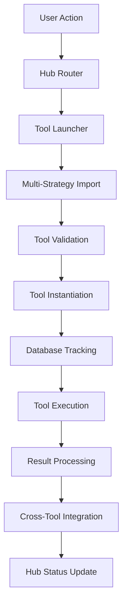
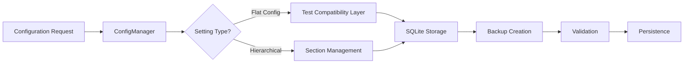
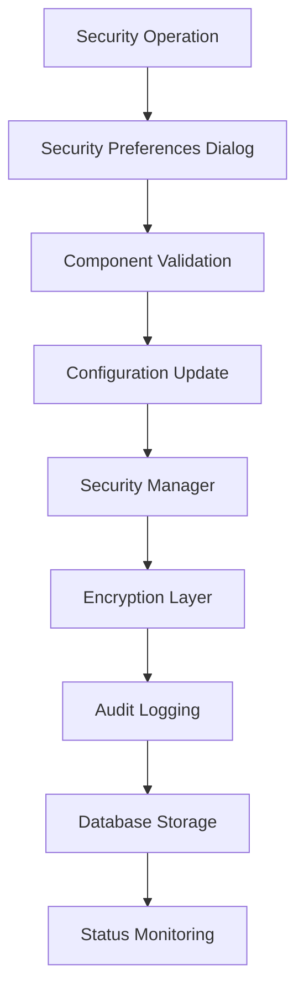
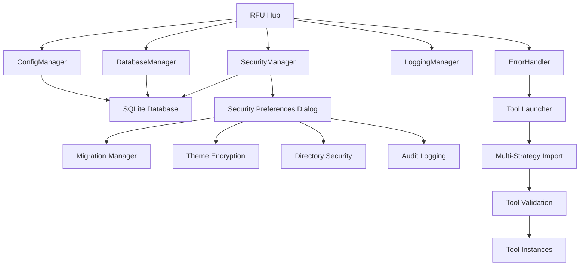

# Richard's File Utilities - Technical Architecture

**Last Updated:** September 26, 2025
**Architecture Version:** 3.1.0
**Status:** Post-Cleanup Architecture with Dual Interface System

---

## System Architecture Overview

### High-Level Architecture Pattern

**Design Philosophy:** Dual Interface, Hub-and-Spoke, Post-Cleanup Architecture

```
┌─────────────────────────────────────────────────────────────┐
│                    RFU Dual Interface Application          │
├─────────────────────────────────────────────────────────────┤
│ Presentation Layer (PyQt5 GUI)                             │
│ ├── Startup Dialog (Interface Selection)                   │
│ ├── Dialog Hub Interface (Tabbed - main.py 2,217 lines)    │
│ ├── Multi-Pane Explorer (rfu_explorer.py 135 lines)        │
│ ├── Hub Controller (src/hub.py 1,633 lines)                │
│ └── Common UI Components (src/gui/)                         │
├─────────────────────────────────────────────────────────────┤
│ Business Logic Layer                                        │
│ ├── Network Tools (Complete implementation in src/tools/)   │
│ ├── PDF Tools (Comprehensive suite with extraction)        │
│ ├── System Tools (Diagnostics and maintenance)             │
│ ├── Metadata Tools (Image and office metadata editing)     │
│ ├── Security Tools (Theme security framework)              │
│ ├── File Validator (Centralized file type validation)      │
│ ├── File Operations (Template-based, need implementation)  │
│ └── Analysis Tools (Basic implementations)                 │
├─────────────────────────────────────────────────────────────┤
│ Core Infrastructure Layer                                   │
│ ├── Configuration Management (src/config_manager.py)       │
│ ├── Database Manager (src/database/)                       │
│ ├── Security Manager (src/core/theme_security/)            │
│ ├── Logging Manager (src/log_manager.py)                   │
│ ├── Error Handler (src/core/error_handler.py)              │
│ └── Archive System (271+ files archived with metadata)     │
├─────────────────────────────────────────────────────────────┤
│ Data Storage Layer                                          │
│ ├── SQLite Database (Tool usage, configuration tracking)   │
│ ├── Configuration Files (config/ directory with JSON)      │
│ ├── Archive System (archive/ with metadata indexing)       │
│ └── Tool Discovery System (Multi-strategy imports)         │
└─────────────────────────────────────────────────────────────┘
```

---

## Component Architecture

### 1. Core Application Framework

#### Main Application Entry Point

**File:** [`main.py`](main.py) - 2,217 lines of dual interface integration code

**Responsibilities:**

- Dual interface system with startup dialog for mode selection
- Database system initialization with fallback handling
- Multi-strategy tool import system with comprehensive error handling
- Interface switching with session persistence
- Workflow detection and intelligent recommendations

**Key Features:**

```python
# Dual Interface Architecture
class InterfaceMode(Enum):
    DIALOG_HUB = "dialog_hub"
    MULTI_PANE = "multi_pane"
    AUTO_DETECT = "auto_detect"

# Tool Import Strategies
strategies = [
    "direct_module_import",      # Strategy 1: Direct import
    "absolute_path_import",      # Strategy 2: Absolute path resolution
    "dynamic_importlib",         # Strategy 3: Dynamic importlib
    "legacy_compatibility"       # Strategy 4: Legacy path support
]

# Interface Selection with Persistence
def _determine_interface_mode(self):
    saved_settings = self._get_saved_interface_settings()
    if self._should_use_saved_settings(saved_settings):
        self._apply_saved_interface_mode(saved_settings['saved_mode'])
    else:
        self._show_interface_selection_dialog()
```

#### Hub Architecture

**File:** [`src/hub.py`](src/hub.py) - 1,633 lines of hub coordination

**Design Pattern:** Central coordinator with tab-based organization

- Professional tabbed interface with organized tool categories
- Comprehensive menu system with keyboard shortcuts
- Tool registration and status management
- Hub integration with signals and resource management
- Professional styling and responsive layout

#### Explorer Architecture

**File:** [`rfu_explorer.py`](rfu_explorer.py) - 135 lines multi-pane entry point

**Design Pattern:** Multi-pane file explorer with tool integration

- Cross-platform file browser with multiple panes
- Integration with RFU tool ecosystem
- Advanced file operations with progress tracking
- Customizable layouts and bookmark management

### 2. Configuration Management Architecture

#### Hierarchical Configuration System

**File:** [`src/config_manager.py`](src/config_manager.py) - Configuration management with JSON persistence

**Design Pattern:** Singleton with lazy loading and atomic operations

```python
# Configuration Hierarchy (from config/rfu_config.json.migrated)
{
    "general": {              # Core application settings
        "logging_level": "INFO",
        "enable_debug_logging": false,
        "auto_save_config": true,
        "theme": "light",
        "language": "en",
        "check_for_updates": true
    },
    "gui": {                  # Interface settings
        "window_width": 900,
        "window_height": 700,
        "remember_window_position": true,
        "show_status_bar": true,
        "show_toolbar": true,
        "font_size": 12,
        "font_family": "Segoe UI"
    },
    "tools": {               # Tool-specific settings
        "default_directory": "C:\\Users\\HP1",
        "remember_last_directory": true,
        "show_hidden_files": false,
        "confirm_destructive_operations": true,
        "auto_refresh_file_lists": true
    },
    "security_test": {       # Security testing
        "test_enabled": true
    }
}
```

**Key Features:**

- JSON-based persistence with migration support
- Hierarchical settings organization
- Interface mode configuration support
- Tool-specific configuration sections
- Migration state tracking

### 3. Database Architecture

#### SQLite Integration Strategy

**Tables:** Tool usage tracking, file history, directory history

**Design Principles:**

- **ACID Compliance**: All operations use transactions
- **Race Condition Prevention**: UPSERT patterns for concurrent access
- **Schema Migration**: Versioned schema with rollback capability
- **Performance Optimization**: Indexed queries and prepared statements

```sql
-- Core Schema Design
CREATE TABLE tool_usage (
    tool_name TEXT,
    operation_type TEXT,
    usage_count INTEGER DEFAULT 1,
    success_count INTEGER DEFAULT 0,
    first_used TIMESTAMP DEFAULT CURRENT_TIMESTAMP,
    last_used TIMESTAMP DEFAULT CURRENT_TIMESTAMP,
    PRIMARY KEY (tool_name, operation_type)
);

CREATE TABLE file_history (
    file_path TEXT PRIMARY KEY,
    file_name TEXT,
    file_size INTEGER,
    file_type TEXT,
    directory_path TEXT,
    tool_name TEXT,
    operation_type TEXT,
    access_count INTEGER DEFAULT 1,
    first_accessed TIMESTAMP DEFAULT CURRENT_TIMESTAMP,
    last_accessed TIMESTAMP DEFAULT CURRENT_TIMESTAMP
);
```

### 4. Security Architecture

#### Enterprise Security Framework

**File:** [`src/rfu/gui/security_preferences_dialog.py`](src/rfu/gui/security_preferences_dialog.py) - 1,292 lines

**Security Layers:**

1. **Database Migration Security**: Schema versioning with rollback
2. **Theme Data Encryption**: AES-256-GCM for UI customization
3. **Directory Access Control**: Fine-grained permission management
4. **Comprehensive Audit Logging**: Enterprise-grade security monitoring
5. **Emergency Response**: Lockdown and recovery procedures

**Key Security Components:**

```python
# Security Status Monitoring
{
    "migration_status_indicator": "Database migration health",
    "theme_encryption_indicator": "Theme encryption status",
    "directory_security_indicator": "Directory protection status",
    "audit_logging_indicator": "Audit logging operational status"
}

# Emergency Protocols
{
    "security_lockdown": "Disable all security-sensitive operations",
    "emergency_disable": "Complete security feature shutdown",
    "force_backup": "Immediate backup creation and validation"
}
```

---

## Tool Architecture Patterns

### 1. Current Tool Organization (Post-Cleanup Structure)

#### Tool Categories in [`src/tools/`](src/tools/)

**Network Tools** - [`src/tools/network/`](src/tools/network/) - Complete Implementation:

- **Network Connectivity**: Advanced network diagnostics and monitoring
- **Network Scanner**: Device discovery and port scanning
- **Network Transfer**: File transfer over network protocols
- **Complex Network Tools**: Comprehensive suite with bandwidth monitoring, WiFi analysis

**PDF Tools** - [`src/tools/pdf_tools/`](src/tools/pdf_tools/) - Comprehensive Suite:

- **Content Extraction**: Text, images, links, metadata, tables
- **Conversion Tools**: HTML to PDF, PDF to DOCX, PDF to images
- **Enhancement Tools**: Highlighting, OCR, watermarking
- **Security Tools**: PDF encryption and protection
- **View & Analysis**: PDF mining and analysis tools

**System Tools** - [`src/tools/system/`](src/tools/system/) - Diagnostic Framework:

- **Diagnostics & Monitoring**: System health analysis with filesystem monitoring
- **Enhanced Clipboard**: Advanced clipboard management
- **Permissions Editor**: File and system permissions management
- **Software Maintenance**: System maintenance and optimization tools

**Metadata Tools** - [`src/tools/metadata/`](src/tools/metadata/) - Specialized Editors:

- **Image Metadata**: EXIF and image property editing
- **Office Metadata**: Document property management
- **Metadata Logic**: Core metadata processing engines

**File Validator** - [`src/file_validator/`](src/file_validator/) - Centralized File Type Validation:

- **File Type Detection**: Content-based file type identification
- **Format Validation**: Verification against declared file extensions
- **Security Assessment**: High-risk file type identification and protection
- **Policy Enforcement**: Configurable validation policies (reject, warn, auto)
- **Audit & Telemetry**: Comprehensive detection and mismatch logging

#### Standardized Tool Pattern

**Current Implementation Pattern:**

```python
# Tool Discovery Pattern (from main.py)
def launch_tool(self, tool_name, module_name=None, class_name=None):
    import_strategies = [
        lambda: self._import_direct(module_name, class_name),
        lambda: self._import_absolute(module_name, class_name),
        lambda: self._import_dynamic(module_name, class_name),
        lambda: self._import_legacy(module_name, class_name)
    ]
```

**Tool Integration Pattern:**

```python
# Hub-based tool launching (from src/hub.py)
def launch_tool(self, tool_name: str, *args, **kwargs):
    # Unified interface for launching any tool in the RFU suite
    # Maps tool names to their corresponding open_ methods
    method_name = f"open_{tool_name.lower().replace(' ', '_')}"
    if hasattr(self, method_name):
        method = getattr(self, method_name)
        method(*args, **kwargs)
```

### 2. Security Tools Architecture (Advanced Framework)

#### Security Framework Implementation

**File:** [`src/core/theme_security/`](src/core/theme_security/) - Comprehensive security implementation

**Components:**

- **Theme Access Control**: [`theme_access_control.py`](src/core/theme_security/theme_access_control.py)
- **Theme Backup**: [`theme_backup.py`](src/core/theme_security/theme_backup.py)
- **Theme Encryption**: [`theme_encryption.py`](src/core/theme_security/theme_encryption.py)
- **Theme Recovery**: [`theme_recovery.py`](src/core/theme_security/theme_recovery.py)
- **Security GUI**: [`theme_security_gui.py`](src/core/theme_security/theme_security_gui.py)
- **Security Manager**: [`theme_security_manager.py`](src/core/theme_security/theme_security_manager.py)
- **Theme Validator**: [`theme_validator.py`](src/core/theme_security/theme_validator.py)

**Architecture Features:**

- **AES-256-GCM Encryption**: For theme and configuration data
- **Access Control System**: Theme access management and permissions
- **Backup and Recovery**: Automated backup with restoration capabilities
- **Validation Framework**: Comprehensive theme and security validation
- **GUI Integration**: Security preferences and management interface

### 3. Testing Architecture (Sophisticated E2E Framework)

#### E2E Testing Framework Structure

**Pattern:** Mock-based architecture with realistic behavior simulation

```python
# E2E Test Architecture
FileManagementTestUtilities/
├── MockFileManagementTool         # Base mock with signal tracking
├── FileManagementTestDataFactory  # Scalable dataset generation
├── FileManagementPerformanceMonitor  # Benchmark validation
├── FileManagementSignalTracker    # Workflow validation
└── Specialized Test Fixtures      # Per-tool test support
```

**Testing Infrastructure Files:**

- [`tests/e2e/file_management_test_utilities.py`](tests/e2e/file_management_test_utilities.py) - Unified testing framework
- [`tests/e2e/test_file_finder_e2e.py`](tests/e2e/test_file_finder_e2e.py) - Complete workflow testing
- [`tests/e2e/test_catalog_files_e2e.py`](tests/e2e/test_catalog_files_e2e.py) - HTML generation testing
- [`tests/e2e/test_file_rename_e2e.py`](tests/e2e/test_file_rename_e2e.py) - Batch operation testing
- [`tests/e2e/test_file_organization_e2e.py`](tests/e2e/test_file_organization_e2e.py) - Rule-based testing

### 4. Tool Correction Architecture (Automated Maintenance)

#### Automated Tool Correction System

**File:** [`scripts/maintenance/automated_tool_corrector.py`](scripts/maintenance/automated_tool_corrector.py) - 940 lines

**Design Pattern:** Priority-based processing with comprehensive validation

```python
# Tool Processing Pipeline
{
    "tool_registry": {
        "critical_priority": ["CMSD", "File Splitter", "Sync", "Duplicate Finder", "Encrypt/Decrypt"],
        "high_priority": ["Compression", "Size Analyzer", "Secure Delete"],
        "medium_priority": ["Empty Folders", "File Touch"]
    },
    "processing_pipeline": [
        "backup_creation",
        "tool_generation_or_fixing",
        "import_validation",
        "integration_validation",
        "status_tracking"
    ]
}
```

**Validation Framework:**

- Import validation with module loading tests
- Integration validation with main.py integration checks
- Template-based tool generation for missing tools
- Comprehensive rollback capabilities with backup restoration

---

## Data Flow Architecture

### 1. Tool Integration Data Flow



### 2. Configuration Data Flow



### 3. Security Data Flow



---

## Testing Architecture

### 1. Multi-Phase Testing Strategy

#### Phase Coverage Distribution

**Current Status**: 75% E2E coverage achieved, targeting 95%

```python
# Testing Phase Architecture
{
    "phase_1": {
        "scope": "Foundation testing with unit tests",
        "coverage_target": "80%+ code coverage",
        "duration": "Weeks 1-4",
        "status": "Complete"
    },
    "phase_2": {
        "scope": "Cross-component integration testing",
        "coverage_target": "75%+ workflow coverage",
        "duration": "Weeks 5-8",
        "status": "Complete"
    },
    "phase_3": {
        "scope": "End-to-end workflow validation",
        "coverage_target": "95%+ business scenarios",
        "duration": "Weeks 9-12",
        "status": "75% Complete"
    }
}
```

#### E2E Testing Framework Architecture

**Mock-Based Strategy**: Eliminate external dependencies while maintaining realistic behavior

```python
# Sophisticated Mock Architecture
{
    "file_management_mocks": {
        "base_class": "MockFileManagementTool",
        "signal_tracking": "pyqtSignal integration",
        "resource_simulation": "Memory and CPU usage patterns",
        "error_injection": "Comprehensive failure scenario testing"
    },
    "test_data_factory": {
        "scalable_datasets": "50 files → 200,000 files",
        "specialized_data": "Search, catalog, rename, organization optimized",
        "cross_tool_compatibility": "Shared datasets across test suites"
    },
    "performance_monitoring": {
        "benchmark_validation": "Automated target compliance checking",
        "regression_detection": "Historical performance comparison",
        "resource_tracking": "Memory, CPU, I/O monitoring"
    }
}
```

### 2. Test Infrastructure Components

#### Test Execution Framework

**Configuration:** [`pytest.ini`](pytest.ini) - Comprehensive test configuration

```ini
# Advanced Test Configuration
[pytest]
testpaths = tests
markers = gui, integration, slow, unit, functional, error, performance
addopts = --verbose --tb=short --color=yes --durations=10
qt_api = pyqt5
cov-fail-under = 80
maxfail = 3
```

**Key Testing Tools:**

- **pytest-qt**: PyQt5 application testing framework
- **pytest-cov**: Code coverage analysis with branch coverage
- **pytest-timeout**: Long-running test protection
- **pytest-randomly**: Test order randomization for independence

---

## Performance Architecture

### 1. Performance Optimization Strategies

#### Memory Management

```python
# Memory Optimization Patterns
{
    "streaming_algorithms": {
        "large_file_processing": "Chunked read/write operations",
        "directory_traversal": "Iterative scanning with yield patterns",
        "result_processing": "Generator-based lazy evaluation"
    },
    "resource_cleanup": {
        "context_managers": "Automatic resource disposal",
        "garbage_collection": "Explicit gc.collect() in long operations",
        "memory_monitoring": "Real-time usage tracking with alerts"
    }
}
```

#### Concurrent Processing

```python
# Multi-threading Architecture
{
    "thread_pool_executor": {
        "i_o_operations": "Separate thread pools for file I/O",
        "cpu_operations": "Process pools for CPU-intensive tasks",
        "gui_threading": "QThread for UI responsiveness"
    },
    "resource_coordination": {
        "thread_safety": "Locks and semaphores for shared resources",
        "progress_coordination": "Signal-based progress aggregation",
        "error_propagation": "Exception handling across thread boundaries"
    }
}
```

### 2. Performance Targets and Benchmarking

#### File Management Performance Matrix

| Tool              | Operation         | Target | Memory Limit | Validation    |
| ----------------- | ----------------- | ------ | ------------ | ------------- |
| **File Finder**   | Text Search       | < 15s  | < 100MB      | ✅ E2E Tested |
|                   | Recursive Scan    | < 30s  | < 200MB      | ✅ E2E Tested |
| **Catalog Files** | HTML Generation   | < 30s  | < 150MB      | ✅ E2E Tested |
|                   | Recursive Catalog | < 60s  | < 300MB      | ✅ E2E Tested |
| **File Rename**   | Batch Operations  | < 20s  | < 50MB       | ✅ E2E Tested |
| **Organization**  | Rule Processing   | < 35s  | < 100MB      | ✅ E2E Tested |

---

## Critical Implementation Paths

### 1. Tool Implementation Priority Matrix

#### Completed Tools (Production Ready)

```python
# Network Tools - Complete Implementation
{
    "network_connectivity_complex": {
        "implementation_path": "src/tools/network/network_connectivity_complex/",
        "components": ["bandwidth_monitor", "wifi_analyzer", "port_scanner", "lan_file_transfer"],
        "documentation": "Complete with guides and examples",
        "status": "Production ready"
    },
    "network_scanner": {
        "implementation_file": "src/tools/network/network_scanner.py",
        "gui_integration": "Complete",
        "status": "Production ready"
    }
}

# PDF Tools - Comprehensive Implementation
{
    "pdf_content_extraction": {
        "implementation_path": "src/tools/pdf_tools/pdf_content_extraction/",
        "tools": ["extract_text", "extract_links", "extract_metadata", "extract_tables"],
        "status": "Complete with UI files"
    },
    "pdf_conversion": {
        "implementation_path": "src/tools/pdf_tools/pdf_conversion/",
        "tools": ["convert_html_to_pdf", "convert_to_docx", "convert_to_image"],
        "status": "Complete implementation"
    },
    "pdf_enhancements": {
        "implementation_path": "src/tools/pdf_tools/pdf_enhancements/",
        "tools": ["highlight", "ocr", "watermark"],
        "status": "Complete with UI integration"
    }
}

# System Tools - Diagnostic Framework
{
    "system_diagnostics": {
        "implementation_path": "src/tools/system/diagnostics_monitoring/",
        "framework": "Complete with filesystem monitoring",
        "status": "Production ready"
    },
    "enhanced_clipboard": {
        "implementation_file": "src/tools/system/enhanced_clipboard/enhanced_clipboard_gui.py",
        "status": "Complete implementation"
    }
}
```

#### Critical Missing Implementation

```python
# High Priority Tools Requiring Implementation
{
    "file_management_tools": {
        "priority": "Critical",
        "status": "Template-based structure exists, full implementation needed",
        "tools_needed": ["File Finder", "Catalog Files", "File Rename", "File Organization"],
        "current_structure": "src/tools/file_management/ has framework"
    },
    "file_operations_tools": {
        "priority": "Critical",
        "status": "Basic structure in place, implementation needed",
        "tools_needed": ["CMSD", "File Splitter", "Compression", "Enhanced Editor"],
        "dependencies": ["PyQt5", "shutil", "pathlib", "threading"]
    },
    "analysis_tools": {
        "priority": "High",
        "status": "Partial implementation",
        "tools_needed": ["Duplicate Finder", "Size Analyzer", "Checksum Tools"],
        "dependencies": ["PyQt5", "hashlib", "concurrent.futures"]
    }
}
```

### 2. Security Implementation Path

#### Advanced Security Framework (Partially Complete)

```python
# Security Implementation Status
{
    "security_preferences_dialog": {
        "status": "Complete",
        "file": "src/rfu/gui/security_preferences_dialog.py",
        "lines": 1292,
        "features": [
            "6 comprehensive configuration tabs",
            "Real-time status monitoring",
            "Emergency response procedures",
            "Component health tracking"
        ]
    },
    "theme_encryption": {
        "status": "Framework complete",
        "algorithm": "AES-256-GCM",
        "key_management": "PBKDF2 key derivation"
    },
    "database_migration": {
        "status": "Framework complete",
        "features": ["Schema versioning", "Rollback capability", "Integrity validation"]
    }
}
```

### 3. Testing Implementation Path

#### E2E Testing Maturity

**Current Achievement**: File Management tools have comprehensive E2E coverage

```python
# E2E Testing Implementation Status
{
    "completed_suites": {
        "file_management": {
            "coverage": "95%+",
            "test_files": 5,
            "total_test_methods": 40+,
            "performance_validated": true
        }
    },
    "infrastructure": {
        "mock_framework": "Complete",
        "test_utilities": "Complete",
        "performance_monitoring": "Complete",
        "cross_tool_integration": "Complete"
    },
    "remaining_work": {
        "file_operations": "7 tools need E2E coverage",
        "security_tools": "3 tools need E2E coverage",
        "specialized_tools": "12 tools need E2E coverage"
    }
}
```

---

## Integration Architecture

### 1. Cross-Platform Integration

#### Operating System Compatibility

```python
# Platform-Specific Integration
{
    "windows": {
        "file_operations": "os.startfile() for system integration",
        "path_handling": "pathlib.Path with Windows path support",
        "registry_integration": "Optional registry configuration storage"
    },
    "linux": {
        "file_operations": "xdg-open for desktop integration",
        "path_handling": "POSIX path compliance",
        "desktop_integration": ".desktop file generation"
    },
    "macos": {
        "file_operations": "open command for Finder integration",
        "path_handling": "macOS path convention support",
        "app_bundle": "Native .app bundle packaging"
    }
}
```

### 2. Tool Integration Architecture

#### Multi-Strategy Import System

**Implementation:** [`main.py`](main.py) lines 1339-1421

```python
# Import Strategy Architecture
{
    "strategy_1": "Direct module import with __import__",
    "strategy_2": "Absolute path resolution with cleaned paths",
    "strategy_3": "Dynamic importlib with module variations",
    "strategy_4": "Legacy compatibility with utilities paths"
}
```

**Error Handling Integration:**

- Comprehensive validation before tool launch
- Enhanced error dialogs with specific guidance
- Automatic fallback to placeholder implementations
- Integration with automated tool corrector

### 3. Database Integration Architecture

#### Tool Usage Tracking Integration

**Pattern:** Atomic UPSERT operations with comprehensive error handling

```python
# Database Integration Strategy
{
    "tool_usage_tracking": {
        "pattern": "UPSERT with conflict resolution",
        "race_condition_prevention": "Single atomic operation",
        "fallback_strategy": "INSERT OR IGNORE for degraded operation"
    },
    "file_history_tracking": {
        "pattern": "Insert-then-update strategy",
        "metadata_extraction": "Real-time file stat collection",
        "error_resilience": "Graceful failure for inaccessible files"
    }
}
```

---

## Design Patterns in Use

### 1. Structural Patterns

#### Singleton Pattern (Configuration Management)

**Usage:** ConfigManager ensures single configuration instance

```python
class ConfigManager:
    _instance = None

    def __new__(cls, config_file=None):
        if cls._instance is None:
            cls._instance = super(ConfigManager, cls).__new__(cls)
            cls._instance._initialize(config_file)
        return cls._instance
```

#### Template Method Pattern (Tool Creation)

**Usage:** Automated Tool Corrector uses templates for tool generation

```python
# Template Hierarchy
{
    "basic_template": "Foundation structure for all tools",
    "file_operations_template": "File selection and progress tracking",
    "analysis_template": "Results display and analysis workflow",
    "security_template": "Password handling and encryption options"
}
```

### 2. Behavioral Patterns

#### Observer Pattern (Security Monitoring)

**Usage:** Security status monitoring with pyqtSignal integration

```python
# Security Signals Architecture
class SecurityPreferencesDialog:
    migration_status_changed = pyqtSignal(str, bool)
    theme_encryption_changed = pyqtSignal(bool)
    security_audit_logged = pyqtSignal(str, str, str)
```

#### Strategy Pattern (Import Handling)

**Usage:** Multiple import strategies with graceful fallback

```python
# Import Strategy Selection
import_strategies = [
    lambda: self._import_direct(module_name, class_name),
    lambda: self._import_absolute(module_name, class_name),
    lambda: self._import_dynamic(module_name, class_name),
    lambda: self._import_legacy(module_name, class_name)
]
```

### 3. Creational Patterns

#### Factory Pattern (Test Data Generation)

**Usage:** Scalable test dataset creation for E2E testing

```python
# Test Data Factory Architecture
{
    "dataset_types": {
        "small_scale": {"files": 100, "size": "50MB", "depth": 3},
        "medium_scale": {"files": 5000, "size": "500MB", "depth": 5},
        "large_scale": {"files": 50000, "size": "5GB", "depth": 8}
    }
}
```

---

## Component Relationships

### 1. Core Component Dependencies



### 2. Tool Category Relationships

#### File Management Tool Chain

```python
# Tool Integration Patterns
{
    "file_finder_to_organization": {
        "data_transfer": "Search results become organization input",
        "workflow": "Discover → Filter → Organize",
        "integration_point": "Result export/import"
    },
    "catalog_to_compression": {
        "data_transfer": "Catalog output becomes archive input",
        "workflow": "Catalog → Review → Archive",
        "integration_point": "File list handoff"
    }
}
```

### 3. Testing Component Integration

#### E2E Test Framework Relationships

```python
# Test Infrastructure Dependencies
{
    "test_utilities": {
        "provides": "Unified mock framework for all File Management tools",
        "dependencies": ["pytest", "PyQt5", "threading"],
        "consumers": ["All File Management E2E test suites"]
    },
    "performance_monitoring": {
        "provides": "Automated benchmark validation",
        "integration": "All E2E tests include performance validation",
        "reporting": "Historical trend analysis and regression detection"
    }
}
```

---

## Deployment Architecture

### 1. Packaging Strategy

#### Multi-Platform Distribution

```python
# Distribution Architecture
{
    "windows": {
        "installer": "MSI with registry integration",
        "shortcuts": "Start menu and desktop integration",
        "file_associations": "Automatic file type handling"
    },
    "linux": {
        "packages": ".deb and .rpm with dependency resolution",
        "desktop_integration": ".desktop files for application menu",
        "package_managers": "apt, yum, dnf compatibility"
    },
    "macos": {
        "app_bundle": ".app with code signing",
        "distribution": "DMG with drag-and-drop install",
        "homebrew": "Formula for package manager integration"
    }
}
```

### 2. Dependency Management

#### Core Dependency Architecture

**Total Dependencies:** 79 packages in [`requirements.txt`](requirements.txt)

```python
# Critical Dependencies
{
    "ui_framework": "PyQt5==5.15.11 (Core GUI)",
    "testing": "pytest==8.3.5 with extensive plugins",
    "security": "cryptography==44.0.2 for AES encryption",
    "data_processing": "pandas==2.2.3 for analysis operations",
    "image_processing": "Pillow==11.1.0 for metadata and thumbnails",
    "pdf_operations": "PyMuPDF==1.25.4 for document processing",
    "system_monitoring": "psutil==7.0.0 for resource tracking"
}
```

---

## Future Architecture Evolution

### 1. Microservices Migration Path (2026-2027)

#### Service Decomposition Strategy

```python
# Microservices Architecture Vision
{
    "core_services": {
        "authentication_service": "User identity and access management",
        "configuration_service": "Centralized configuration management",
        "audit_service": "Security and compliance logging",
        "notification_service": "Real-time alerts and messaging"
    },
    "tool_services": {
        "file_management_service": "File operations microservice",
        "analysis_service": "Data analysis and reporting",
        "security_service": "Encryption and security operations",
        "integration_service": "External system connectivity"
    }
}
```

### 2. API Architecture Evolution (2026)

#### RESTful API Framework

```python
# API Architecture Design
{
    "api_gateway": {
        "authentication": "JWT-based token authentication",
        "rate_limiting": "Per-user operation quotas",
        "request_validation": "Schema-based input validation"
    },
    "service_mesh": {
        "discovery": "Service registry and discovery",
        "load_balancing": "Intelligent request distribution",
        "circuit_breaker": "Failure isolation and recovery"
    }
}
```

### 3. Cloud-Native Architecture (2027)

#### Container Orchestration

```python
# Kubernetes Deployment Architecture
{
    "containerization": {
        "application_containers": "Isolated tool execution environments",
        "database_containers": "Managed SQLite with persistent volumes",
        "security_containers": "Hardened security service instances"
    },
    "orchestration": {
        "scaling": "Horizontal pod autoscaling based on demand",
        "deployment": "Rolling updates with zero downtime",
        "monitoring": "Prometheus metrics and Grafana dashboards"
    }
}
```

This architecture document serves as the technical foundation for understanding how Richard's File Utilities is structured, how components interact, and the patterns used throughout the implementation. It provides the blueprint for future development and system evolution.
