# Richard's File Utilities - Complete Project Architecture

## Comprehensive Multi-Layered System Architecture

```mermaid
graph TB
    %% User Layer
    subgraph "User Experience Layer"
        User[👤 End User]
        Browser[🌐 Browser Interface]
        Desktop[🖥️ Desktop Application]
    end

    %% Application Entry Points
    subgraph "Application Entry Points"
        MainPy[main.py - Application Entry]
        RFUHub[RFUMainWindow - Central Hub]
        StandaloneTools[Standalone Tool Launchers]
    end

    %% GUI Framework Layer
    subgraph "GUI Framework & Presentation Layer"
        PyQt5[PyQt5 Framework]
        
        subgraph "Window Management"
            StandardWindow[StandardWindow Base Class]
            BaseWindow[BaseWindow Legacy Support]
            StandardDialog[StandardDialog Base Class]
            MenuManager[MenuManager - Unified Menus]
        end
        
        subgraph "Theme & Styling System"
            ThemeManager[ThemeManager]
            Colors[Color Definitions]
            Fonts[Font Management]
            Spacing[Layout Spacing]
        end
        
        subgraph "Security GUI Components"
            SecurityPrefs[SecurityPreferencesDialog]
            MigrationUI[Migration Interface]
            ThemeSecurityUI[Theme Security Interface]
            DirectorySecurityUI[Directory Security Interface]
        end
    end

    %% Tool Categories Layer
    subgraph "Tool Categories & Business Logic"
        subgraph "File Management Tools"
            FileFinder[File Finder]
            Catalog[Catalog Files]
            Rename[Rename Files]
            Organize[Organize Files]
        end
        
        subgraph "File Operations Tools"
            CMSD[Copy/Move/Sync/Delete]
            Compress[Compress/Decompress]
            FileSplitter[File Splitter/Joiner]
            Sync[Directory Synchronization]
        end
        
        subgraph "Analysis Tools"
            SizeAnalyzer[Size Analyzer]
            DuplicateFinder[Duplicate Finder]
            Checksum[File Checksum]
            EmptyFolders[Empty Folders Cleaner]
        end
        
        subgraph "Security Tools"
            Encryption[Encrypt/Decrypt]
            SecureDelete[Secure Delete]
            Permissions[Permissions Editor]
        end
        
        subgraph "Metadata Tools"
            ImageMetadata[Image Metadata Editor]
            OfficeMetadata[Office Metadata Editor]
            FileTouch[File Touch Utility]
        end
        
        subgraph "PDF Tools Suite"
            PDFAnalysis[PDF Analysis Engine]
            PDFConversion[PDF Conversion Engine]
            PDFExtraction[PDF Extraction Engine]
            PDFSecurity[PDF Security Engine]
            PDFOperations[PDF Operations Engine]
            PDFEnhancement[PDF Enhancement Engine]
            EnhancedPDFWidget[Enhanced PDF Tools Widget]
        end
        
        subgraph "Network Tools"
            NetworkConnectivity[Network Connectivity]
            NetworkScanner[Network Scanner]
            NetworkTransfer[Network Transfer]
            BookmarkManager[Bookmark Manager]
        end
        
        subgraph "Privacy Tools"
            PrivacyCleaner[Privacy Cleaner]
            DataAnonymizer[Data Anonymizer]
        end
        
        subgraph "System Tools"
            SystemDiagnostics[System Diagnostics]
            SystemCleanup[System Cleanup]
            SoftwareMaintenance[Software Maintenance]
            EnhancedClipboard[Enhanced Clipboard Manager]
        end
    end

    %% Core System Layer
    subgraph "Core System Infrastructure"
        subgraph "Database Management System"
            DatabaseManager[DatabaseManager - SQLite Core]
            StandaloneDB[standalone_database_manager.py]
            
            subgraph "Database Schema"
                UserPrefs[user_preferences_secure]
                FileHistory[file_history]
                ToolUsage[tool_usage]
                DirectoryHistory[directory_history]
                AppLogs[app_logs]
                MigrationHistory[migration_history]
                SecurityTables[Security & Audit Tables]
            end
            
            subgraph "Migration System"
                MigrationManager[DatabaseMigrationManager]
                RollbackManager[RollbackManager]
                SchemaValidator[SchemaValidator]
                MigrationLock[MigrationLockManager]
                Migration001[Migration001 - Initial Schema]
                Migration002[Migration002 - Encryption Support]
            end
        end
        
        subgraph "Configuration Management"
            ConfigManager[ConfigManager - Global Settings]
            EnhancedConfigManager[EnhancedConfigManager - Database-backed]
            SizeAnalyzerConfig[SizeAnalyzerConfig - Tool-specific]
            SecurityConfig[Security Configuration]
        end
        
        subgraph "Logging & Monitoring"
            LogManager[LogManager - Central Logging]
            DatabaseLogging[DatabaseLogHandler]
            ErrorHandler[ErrorHandler - Global Error Management]
            SecurityAudit[Security Audit Logging]
        end
        
        subgraph "Security Framework"
            ThemeSecurity[Theme Security Manager]
            DirectorySecurity[Directory Access Control]
            EncryptionManager[Encryption Manager]
            SecurityMonitor[Security Status Monitor]
        end
    end

    %% Data Storage Layer
    subgraph "Data Storage & Persistence"
        subgraph "SQLite Database"
            RFUDatabase[(rfu_database.db)]
            DatabaseBackups[(Database Backups)]
            MigrationBackups[(Migration Backups)]
        end
        
        subgraph "File System Storage"
            ConfigFiles[Configuration Files]
            LogFiles[Log Files]
            CacheFiles[Cache Files]
            TempFiles[Temporary Files]
            ExportData[Export Data]
            AssetFiles[UI Assets & Icons]
        end
        
        subgraph "External Data Sources"
            UserFiles[User Files & Directories]
            NetworkResources[Network Resources]
            SystemResources[System Resources]
        end
    end

    %% External Dependencies Layer
    subgraph "External Dependencies & Libraries"
        subgraph "Core Python Libraries"
            PyQt5Lib[PyQt5 - GUI Framework]
            SQLite3[sqlite3 - Database]
            Threading[threading - Concurrency]
            Pathlib[pathlib - File Operations]
            JSON[json - Data Serialization]
            Logging[logging - System Logging]
        end
        
        subgraph "File Processing Libraries"
            PIL[Pillow - Image Processing]
            PyMuPDF[PyMuPDF - PDF Processing]
            Mutagen[Mutagen - Audio Metadata]
            OpenCV[OpenCV - Computer Vision]
            Cryptography[cryptography - Security]
        end
        
        subgraph "Compression & Archive Libraries"
            Py7zr[py7zr - 7-Zip Archives]
            Brotli[Brotli - Compression]
            ZStd[pyzstd - ZStandard Compression]
        end
        
        subgraph "Document Processing Libraries"
            PythonDocx[python-docx - Word Documents]
            OpenPyXL[openpyxl - Excel Files]
            PyPDF2[PyPDF2 - PDF Manipulation]
            Pikepdf[pikepdf - Advanced PDF]
        end
        
        subgraph "System & Network Libraries"
            Psutil[psutil - System Information]
            Requests[requests - HTTP Client]
            Watchdog[watchdog - File Monitoring]
        end
    end

    %% Data Flow Connections
    User --> Desktop
    User --> Browser
    Desktop --> MainPy
    Browser --> MainPy
    
    MainPy --> RFUHub
    MainPy --> StandaloneTools
    RFUHub --> PyQt5
    
    PyQt5 --> StandardWindow
    PyQt5 --> BaseWindow
    PyQt5 --> StandardDialog
    PyQt5 --> MenuManager
    
    StandardWindow --> ThemeManager
    ThemeManager --> Colors
    ThemeManager --> Fonts
    ThemeManager --> Spacing
    
    RFUHub --> FileFinder
    RFUHub --> Catalog
    RFUHub --> Rename
    RFUHub --> Organize
    RFUHub --> CMSD
    RFUHub --> Compress
    RFUHub --> FileSplitter
    RFUHub --> Sync
    RFUHub --> SizeAnalyzer
    RFUHub --> DuplicateFinder
    RFUHub --> Checksum
    RFUHub --> EmptyFolders
    RFUHub --> Encryption
    RFUHub --> SecureDelete
    RFUHub --> Permissions
    RFUHub --> ImageMetadata
    RFUHub --> OfficeMetadata
    RFUHub --> FileTouch
    RFUHub --> EnhancedPDFWidget
    RFUHub --> NetworkConnectivity
    RFUHub --> NetworkScanner
    RFUHub --> NetworkTransfer
    RFUHub --> BookmarkManager
    RFUHub --> PrivacyCleaner
    RFUHub --> DataAnonymizer
    RFUHub --> SystemDiagnostics
    RFUHub --> SystemCleanup
    RFUHub --> SoftwareMaintenance
    RFUHub --> EnhancedClipboard
    
    EnhancedPDFWidget --> PDFAnalysis
    EnhancedPDFWidget --> PDFConversion
    EnhancedPDFWidget --> PDFExtraction
    EnhancedPDFWidget --> PDFSecurity
    EnhancedPDFWidget --> PDFOperations
    EnhancedPDFWidget --> PDFEnhancement
    
    RFUHub --> SecurityPrefs
    SecurityPrefs --> MigrationUI
    SecurityPrefs --> ThemeSecurityUI
    SecurityPrefs --> DirectorySecurityUI
    
    %% Core System Connections
    RFUHub --> DatabaseManager
    RFUHub --> ConfigManager
    RFUHub --> LogManager
    RFUHub --> ErrorHandler
    
    DatabaseManager --> StandaloneDB
    StandaloneDB --> RFUDatabase
    
    DatabaseManager --> UserPrefs
    DatabaseManager --> FileHistory
    DatabaseManager --> ToolUsage
    DatabaseManager --> DirectoryHistory
    DatabaseManager --> AppLogs
    DatabaseManager --> MigrationHistory
    DatabaseManager --> SecurityTables
    
    ConfigManager --> EnhancedConfigManager
    EnhancedConfigManager --> DatabaseManager
    
    LogManager --> DatabaseLogging
    DatabaseLogging --> DatabaseManager
    
    SecurityPrefs --> SecurityConfig
    SecurityConfig --> ThemeSecurity
    SecurityConfig --> DirectorySecurity
    SecurityConfig --> EncryptionManager
    SecurityConfig --> SecurityMonitor
    
    MigrationUI --> MigrationManager
    MigrationManager --> RollbackManager
    MigrationManager --> SchemaValidator
    MigrationManager --> MigrationLock
    MigrationManager --> Migration001
    MigrationManager --> Migration002
    
    DatabaseManager --> DatabaseBackups
    RollbackManager --> MigrationBackups
    
    %% Tool-specific configurations
    SizeAnalyzer --> SizeAnalyzerConfig
    SizeAnalyzerConfig --> ConfigManager
    
    %% File System Connections
    DatabaseManager --> ConfigFiles
    LogManager --> LogFiles
    DatabaseManager --> CacheFiles
    
    %% External Library Connections
    PyQt5 --> PyQt5Lib
    DatabaseManager --> SQLite3
    LogManager --> Logging
    ConfigManager --> JSON
    
    FileFinder --> Pathlib
    SizeAnalyzer --> Pathlib
    ImageMetadata --> PIL
    PDFAnalysis --> PyMuPDF
    PDFConversion --> PyMuPDF
    PDFExtraction --> PyMuPDF
    PDFSecurity --> PyMuPDF
    PDFOperations --> PyMuPDF
    PDFEnhancement --> PyMuPDF
    
    Compress --> Py7zr
    Compress --> Brotli
    Compress --> ZStd
    
    OfficeMetadata --> PythonDocx
    OfficeMetadata --> OpenPyXL
    
    Encryption --> Cryptography
    SecureDelete --> Cryptography
    
    SystemDiagnostics --> Psutil
    NetworkConnectivity --> Psutil
    
    %% User Data Connections
    FileFinder --> UserFiles
    Catalog --> UserFiles
    Organize --> UserFiles
    CMSD --> UserFiles
    SizeAnalyzer --> UserFiles
    DuplicateFinder --> UserFiles
    
    NetworkConnectivity --> NetworkResources
    NetworkScanner --> NetworkResources
    NetworkTransfer --> NetworkResources
    
    SystemDiagnostics --> SystemResources
    SystemCleanup --> SystemResources
    
    %% Styling
    classDef userLayer fill:#e1f5fe,stroke:#01579b,stroke-width:2px
    classDef entryLayer fill:#f3e5f5,stroke:#4a148c,stroke-width:2px
    classDef guiLayer fill:#e8f5e8,stroke:#1b5e20,stroke-width:2px
    classDef toolLayer fill:#fff3e0,stroke:#e65100,stroke-width:2px
    classDef coreLayer fill:#fce4ec,stroke:#880e4f,stroke-width:2px
    classDef dataLayer fill:#e0f2f1,stroke:#004d40,stroke-width:2px
    classDef depLayer fill:#f1f8e9,stroke:#33691e,stroke-width:2px
    
    class User,Browser,Desktop userLayer
    class MainPy,RFUHub,StandaloneTools entryLayer
    class PyQt5,StandardWindow,BaseWindow,StandardDialog,MenuManager,ThemeManager,Colors,Fonts,Spacing,SecurityPrefs,MigrationUI,ThemeSecurityUI,DirectorySecurityUI guiLayer
    class FileFinder,Catalog,Rename,Organize,CMSD,Compress,FileSplitter,Sync,SizeAnalyzer,DuplicateFinder,Checksum,EmptyFolders,Encryption,SecureDelete,Permissions,ImageMetadata,OfficeMetadata,FileTouch,PDFAnalysis,PDFConversion,PDFExtraction,PDFSecurity,PDFOperations,PDFEnhancement,EnhancedPDFWidget,NetworkConnectivity,NetworkScanner,NetworkTransfer,BookmarkManager,PrivacyCleaner,DataAnonymizer,SystemDiagnostics,SystemCleanup,SoftwareMaintenance,EnhancedClipboard toolLayer
    class DatabaseManager,StandaloneDB,ConfigManager,EnhancedConfigManager,SizeAnalyzerConfig,SecurityConfig,LogManager,DatabaseLogging,ErrorHandler,SecurityAudit,ThemeSecurity,DirectorySecurity,EncryptionManager,SecurityMonitor,MigrationManager,RollbackManager,SchemaValidator,MigrationLock,Migration001,Migration002 coreLayer
    class RFUDatabase,DatabaseBackups,MigrationBackups,ConfigFiles,LogFiles,CacheFiles,TempFiles,ExportData,AssetFiles,UserFiles,NetworkResources,SystemResources,UserPrefs,FileHistory,ToolUsage,DirectoryHistory,AppLogs,MigrationHistory,SecurityTables dataLayer
    class PyQt5Lib,SQLite3,Threading,Pathlib,JSON,Logging,PIL,PyMuPDF,Mutagen,OpenCV,Cryptography,Py7zr,Brotli,ZStd,PythonDocx,OpenPyXL,PyPDF2,Pikepdf,Psutil,Requests,Watchdog depLayer
```



## Architecture Overview

### Layer Descriptions

#### 1. User Experience Layer
- **End User**: The person interacting with the application
- **Browser Interface**: Web-based access points for certain tools
- **Desktop Application**: Primary PyQt5-based GUI application

#### 2. Application Entry Points
- **main.py**: Primary application entry point with database initialization
- **RFUMainWindow**: Central hub managing all tool categories in tabbed interface
- **Standalone Tools**: Individual tool launchers for independent execution

#### 3. GUI Framework & Presentation Layer
- **PyQt5 Framework**: Core GUI framework providing widgets and event handling
- **Window Management**: Standardized base classes for consistent UI behavior
- **Theme & Styling System**: Centralized appearance management with light/dark themes
- **Security GUI Components**: Specialized interfaces for security configuration

#### 4. Tool Categories & Business Logic
- **File Management**: Tools for finding, cataloging, renaming, and organizing files
- **File Operations**: Core file manipulation including copy, move, sync, compress
- **Analysis Tools**: File system analysis including size analysis and duplicate detection
- **Security Tools**: Encryption, secure deletion, and permissions management
- **Metadata Tools**: Editing and viewing file metadata for various formats
- **PDF Tools Suite**: Comprehensive PDF processing with multiple engines
- **Network Tools**: Network connectivity, scanning, and file transfer capabilities
- **Privacy Tools**: Data cleaning and anonymization utilities
- **System Tools**: System diagnostics, cleanup, and maintenance utilities

#### 5. Core System Infrastructure
- **Database Management**: SQLite-based persistence with migration support
- **Configuration Management**: Hierarchical settings with database backing
- **Logging & Monitoring**: Centralized logging with database integration
- **Security Framework**: Comprehensive security features including theme encryption

#### 6. Data Storage & Persistence
- **SQLite Database**: Primary data store for settings, history, and logs
- **File System Storage**: Configuration files, logs, cache, and temporary data
- **External Data Sources**: User files, network resources, and system data

#### 7. External Dependencies & Libraries
- **Core Python Libraries**: Essential system libraries
- **File Processing Libraries**: Specialized libraries for different file formats
- **Compression Libraries**: Archive and compression support
- **Document Processing**: Office document and PDF manipulation
- **System & Network Libraries**: System information and network operations

## Key Architectural Features

### 1. Modular Design
- Each tool category is independently developed and can be launched standalone
- Shared base classes ensure consistent behavior across all tools
- Plugin-like architecture allows easy addition of new tools

### 2. Database-Centric Architecture
- SQLite database serves as central data store for all persistent data
- Database migration system ensures schema evolution without data loss
- Comprehensive audit logging tracks all user actions and system events

### 3. Security-First Design
- Built-in encryption for sensitive data including theme configurations
- Directory access controls and monitoring
- Comprehensive audit logging for security compliance
- Migration system with rollback capabilities for data protection

### 4. Unified User Experience
- Consistent theming across all tools with light/dark mode support
- Standardized menu system with context-aware options
- Central hub interface with categorized tool access
- Responsive design adapting to different screen sizes

### 5. Comprehensive Tool Integration
- Tools share common services like logging, configuration, and database access
- File history tracking across all tools for analytics and recent file access
- Tool usage statistics for understanding user behavior patterns
- Cross-tool data sharing for enhanced workflows

### 6. Extensible Framework
- Well-defined interfaces for adding new tool categories
- Standardized configuration management for tool-specific settings
- Plugin architecture supporting both internal and external tools
- Comprehensive testing framework ensuring reliability

## Data Flow Patterns

### 1. User Interaction Flow
```
User → Desktop/Browser → main.py → RFUMainWindow → Tool Selection → Tool Execution → Database Logging
```

### 2. Configuration Flow
```
Tool → ConfigManager → EnhancedConfigManager → DatabaseManager → SQLite Database
```

### 3. Logging Flow
```
Tool/System Event → LogManager → DatabaseLogHandler → DatabaseManager → app_logs Table
```

### 4. Security Flow
```
Security Action → SecurityPreferences → SecurityConfig → Security Framework → Database/File System
```

### 5. File Operation Flow
```
User Action → Tool → File System → History Tracking → DatabaseManager → file_history Table
```

This architecture provides a robust, scalable, and maintainable foundation for the Richard's File Utilities suite, ensuring consistent user experience while supporting complex file management workflows.