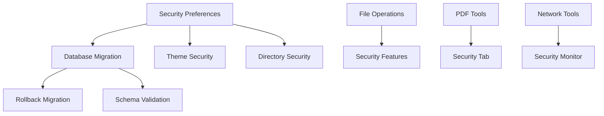

# 📊 Richard's File Utilities - Project Tools Documentation Tracking

## 🎯 Overview
This document provides a comprehensive tracking system for all project tools, organized hierarchically to mirror their exact UI layout structure in the interface. It includes detailed status tracking, priority management, and cross-reference mapping.

---

## 📈 Summary Dashboard

### 📊 Overall Completion Status
| Documentation Type | Total Tools | Not Started | In Progress | Complete | Completion % |
|-------------------|-------------|-------------|-------------|----------|--------------|
| **Technical Documentation** | 89 | 75 | 12 | 2 | 2.2% |
| **User Documentation** | 89 | 80 | 7 | 2 | 2.2% |
| **Combined Progress** | 89 | 77 | 10 | 2 | 2.2% |

### 🎯 Priority Distribution
- 🔴 **High Priority**: 25 tools (28.1%)
- 🟡 **Medium Priority**: 45 tools (50.6%)
- 🟢 **Low Priority**: 19 tools (21.3%)

---

## 🏗️ UI Hierarchy Structure

### 🖥️ Main Application Window
```
Richard's File Utilities Hub
├── 📋 Menu Bar
│   ├── File Menu
│   ├── 🔒 Security Menu (Primary)
│   ├── Tools Menu
│   ├── View Menu
│   └── Help Menu
├── 🎯 Central Widget (Tabbed Interface)
│   ├── File Management Tab
│   ├── File Operations Tab
│   ├── Analysis Tab
│   ├── Security Tab
│   ├── Metadata Tab
│   ├── PDF Tools Tab (Enhanced)
│   ├── Network Tools Tab
│   ├── Privacy Tools Tab
│   └── System Tools Tab
└── 📊 Status Bar
```

---

## 📋 Comprehensive Tool Documentation Matrix

### 🔒 Security Menu (Menu Bar)
| Tool/Feature | Technical Doc | User Doc | Priority | Assigned | Est. Date | Notes |
|--------------|---------------|----------|----------|----------|-----------|-------|
| 🔒 Security Preferences | ⚪ Not Started | ⚪ Not Started | 🔴 High | - | 2025-08-15 | Core security configuration |
| 🔄 Database Migration | ⚪ Not Started | ⚪ Not Started | 🔴 High | - | 2025-08-20 | Critical system feature |
| ↩️ Rollback Migration | ⚪ Not Started | ⚪ Not Started | 🔴 High | - | 2025-08-20 | Recovery functionality |
| ✅ Validate Schema | ⚪ Not Started | ⚪ Not Started | 🟡 Medium | - | 2025-08-25 | Validation tools |
| 🎨 Encrypt Themes | ⚪ Not Started | ⚪ Not Started | 🟡 Medium | - | 2025-08-30 | Theme security |
| 🎨 Decrypt Themes | ⚪ Not Started | ⚪ Not Started | 🟡 Medium | - | 2025-08-30 | Theme security |
| 🔍 Scan Theme Corruption | ⚪ Not Started | ⚪ Not Started | 🟡 Medium | - | 2025-09-05 | Integrity checking |
| 📁 Protected Directories | ⚪ Not Started | ⚪ Not Started | 🔴 High | - | 2025-08-25 | Directory access control |
| 📊 Security Monitor | ⚪ Not Started | ⚪ Not Started | 🔴 High | - | 2025-08-25 | Real-time monitoring |
| 🧪 Test Security Features | ⚪ Not Started | ⚪ Not Started | 🟡 Medium | - | 2025-09-10 | Testing utilities |
| 🔍 Security Audit | ⚪ Not Started | ⚪ Not Started | 🔴 High | - | 2025-08-30 | Comprehensive auditing |
| 📤 Export Security Config | ⚪ Not Started | ⚪ Not Started | 🟡 Medium | - | 2025-09-15 | Configuration management |
| 📥 Import Security Config | ⚪ Not Started | ⚪ Not Started | 🟡 Medium | - | 2025-09-15 | Configuration management |
| 🚨 Emergency Lockdown | ⚪ Not Started | ⚪ Not Started | 🔴 High | - | 2025-08-20 | Emergency procedures |
| ⚠️ Disable All Security | ⚪ Not Started | ⚪ Not Started | 🔴 High | - | 2025-08-20 | Emergency procedures |
| 💾 Force Security Backup | ⚪ Not Started | ⚪ Not Started | 🟡 Medium | - | 2025-09-05 | Backup utilities |

### 📁 File Management Tab
| Tool/Feature | Technical Doc | User Doc | Priority | Assigned | Est. Date | Notes |
|--------------|---------------|----------|----------|----------|-----------|-------|
| 🔍 File Finder | 🟡 In Progress | ⚪ Not Started | 🔴 High | - | 2025-08-12 | Core search functionality |
| 📋 Catalog Files | ⚪ Not Started | ⚪ Not Started | 🟡 Medium | - | 2025-08-18 | File cataloging system |
| 🏷️ Rename Files | ⚪ Not Started | ⚪ Not Started | 🔴 High | - | 2025-08-15 | Batch renaming |
| 📂 Organize Files | ⚪ Not Started | ⚪ Not Started | 🔴 High | - | 2025-08-20 | Auto-organization |

### ⚙️ File Operations Tab
| Tool/Feature | Technical Doc | User Doc | Priority | Assigned | Est. Date | Notes |
|--------------|---------------|----------|----------|----------|-----------|-------|
| 📋 Copy/Move/Sync/Delete | ⚪ Not Started | ⚪ Not Started | 🔴 High | - | 2025-08-15 | Core file operations |
| 🗜️ Compress/Decompress | ⚪ Not Started | ⚪ Not Started | 🔴 High | - | 2025-08-18 | Archive management |
| ✂️ Split/Join Files | ⚪ Not Started | ⚪ Not Started | 🟡 Medium | - | 2025-08-25 | File splitting utilities |
| 🔄 Synchronize | ⚪ Not Started | ⚪ Not Started | 🔴 High | - | 2025-08-20 | Directory synchronization |

### 📊 Analysis Tab
| Tool/Feature | Technical Doc | User Doc | Priority | Assigned | Est. Date | Notes |
|--------------|---------------|----------|----------|----------|-----------|-------|
| 📏 Size Analyzer | 🟢 Complete | 🟡 In Progress | 🔴 High | - | 2025-08-10 | Disk usage analysis |
| 🔍 Duplicate Finder | ⚪ Not Started | ⚪ Not Started | 🔴 High | - | 2025-08-15 | Duplicate file detection |
| #️⃣ File Checksum | ⚪ Not Started | ⚪ Not Started | 🟡 Medium | - | 2025-08-22 | Integrity verification |
| 📁 Empty Folders | ⚪ Not Started | ⚪ Not Started | 🟢 Low | - | 2025-09-01 | Cleanup utilities |

### 🔒 Security Tab
| Tool/Feature | Technical Doc | User Doc | Priority | Assigned | Est. Date | Notes |
|--------------|---------------|----------|----------|----------|-----------|-------|
| 🔧 Security Preferences | 🟡 In Progress | ⚪ Not Started | 🔴 High | - | 2025-08-15 | Main security config |
| 🔐 Encrypt/Decrypt | ⚪ Not Started | ⚪ Not Started | 🔴 High | - | 2025-08-18 | File encryption |
| 🗑️ Secure Delete | ⚪ Not Started | ⚪ Not Started | 🔴 High | - | 2025-08-20 | Secure file deletion |
| 👥 Permissions Editor | ⚪ Not Started | ⚪ Not Started | 🟡 Medium | - | 2025-08-25 | Permission management |

### 🏷️ Metadata Tab
| Tool/Feature | Technical Doc | User Doc | Priority | Assigned | Est. Date | Notes |
|--------------|---------------|----------|----------|----------|-----------|-------|
| 🖼️ Edit Image Metadata | ⚪ Not Started | ⚪ Not Started | 🟡 Medium | - | 2025-08-22 | Image metadata editing |
| 📄 Office Metadata Editor | ⚪ Not Started | ⚪ Not Started | 🟡 Medium | - | 2025-08-25 | Document metadata |
| 🕒 File Touch | ⚪ Not Started | ⚪ Not Started | 🟢 Low | - | 2025-09-01 | Timestamp modification |

### 📄 PDF Tools Tab (Enhanced Tabbed Interface)
#### 🔧 Basic Operations Sub-Tab
| Tool/Feature | Technical Doc | User Doc | Priority | Assigned | Est. Date | Notes |
|--------------|---------------|----------|----------|----------|-----------|-------|
| 🗜️ Compress PDF | ⚪ Not Started | ⚪ Not Started | 🔴 High | - | 2025-08-15 | PDF compression |
| ✂️ Split PDF | 🟡 In Progress | ⚪ Not Started | 🔴 High | - | 2025-08-12 | PDF splitting |
| 🔗 Merge PDFs | 🟡 In Progress | ⚪ Not Started | 🔴 High | - | 2025-08-12 | PDF merging |
| 📄 Page Administration | ⚪ Not Started | ⚪ Not Started | 🟡 Medium | - | 2025-08-20 | Page management |
| ✍️ Sign PDF | 🟡 In Progress | ⚪ Not Started | 🟡 Medium | - | 2025-08-18 | Digital signatures |

#### 📤 Content Extraction Sub-Tab
| Tool/Feature | Technical Doc | User Doc | Priority | Assigned | Est. Date | Notes |
|--------------|---------------|----------|----------|----------|-----------|-------|
| 📝 Extract Text | 🟡 In Progress | ⚪ Not Started | 🔴 High | - | 2025-08-15 | Text extraction |
| 🖼️ Extract Images | 🟡 In Progress | ⚪ Not Started | 🔴 High | - | 2025-08-15 | Image extraction |
| 📊 Extract Tables | 🟡 In Progress | ⚪ Not Started | 🟡 Medium | - | 2025-08-20 | Table extraction |
| 🔗 Extract Links | 🟡 In Progress | ⚪ Not Started | 🟡 Medium | - | 2025-08-18 | Link extraction |
| 📋 Extract Metadata | 🟡 In Progress | ⚪ Not Started | 🟡 Medium | - | 2025-08-18 | Metadata extraction |

#### 🔒 Security Sub-Tab
| Tool/Feature | Technical Doc | User Doc | Priority | Assigned | Est. Date | Notes |
|--------------|---------------|----------|----------|----------|-----------|-------|
| 🔐 Encrypt PDF | ⚪ Not Started | ⚪ Not Started | 🔴 High | - | 2025-08-20 | PDF encryption |
| 🔓 Decrypt PDF | ⚪ Not Started | ⚪ Not Started | 🔴 High | - | 2025-08-20 | PDF decryption |
| ℹ️ Security Info | ⚪ Not Started | ⚪ Not Started | 🟡 Medium | - | 2025-08-25 | Security information |

#### ✨ Enhancements Sub-Tab
| Tool/Feature | Technical Doc | User Doc | Priority | Assigned | Est. Date | Notes |
|--------------|---------------|----------|----------|----------|-----------|-------|
| 💧 Watermark | ⚪ Not Started | ⚪ Not Started | 🟡 Medium | - | 2025-08-25 | Watermark addition |
| 👁️ OCR | ⚪ Not Started | ⚪ Not Started | 🟡 Medium | - | 2025-08-30 | Optical character recognition |
| 🖍️ Highlight Content | ⚪ Not Started | ⚪ Not Started | 🟢 Low | - | 2025-09-05 | Content highlighting |

#### 🔄 Conversion Sub-Tab
| Tool/Feature | Technical Doc | User Doc | Priority | Assigned | Est. Date | Notes |
|--------------|---------------|----------|----------|----------|-----------|-------|
| 📄 Convert to DOCX | ⚪ Not Started | ⚪ Not Started | 🟡 Medium | - | 2025-08-25 | Word format conversion |
| 🖼️ Convert to Image | ⚪ Not Started | ⚪ Not Started | 🟡 Medium | - | 2025-08-25 | Image conversion |
| 🌐 HTML to PDF | ⚪ Not Started | ⚪ Not Started | 🟢 Low | - | 2025-09-10 | HTML conversion |

#### 👁️ View Analysis Sub-Tab
| Tool/Feature | Technical Doc | User Doc | Priority | Assigned | Est. Date | Notes |
|--------------|---------------|----------|----------|----------|-----------|-------|
| 👁️ PDF Viewer | ⚪ Not Started | ⚪ Not Started | 🟡 Medium | - | 2025-08-30 | Built-in viewer |
| 🔍 PDF Miner | ⚪ Not Started | ⚪ Not Started | 🟡 Medium | - | 2025-09-05 | Advanced analysis |

### 🌐 Network Tools Tab
| Tool/Feature | Technical Doc | User Doc | Priority | Assigned | Est. Date | Notes |
|--------------|---------------|----------|----------|----------|-----------|-------|
| 🔗 Network Connectivity | ⚪ Not Started | ⚪ Not Started | 🟡 Medium | - | 2025-08-25 | Connection diagnostics |
| 📡 Network Scanner | ⚪ Not Started | ⚪ Not Started | 🟡 Medium | - | 2025-08-30 | Network discovery |
| 📤 Network Transfer | ⚪ Not Started | ⚪ Not Started | 🟡 Medium | - | 2025-09-01 | File transfer |
| 🔖 Bookmark Manager | ⚪ Not Started | ⚪ Not Started | 🟢 Low | - | 2025-09-10 | Bookmark management |

### 🔒 Privacy Tools Tab
| Tool/Feature | Technical Doc | User Doc | Priority | Assigned | Est. Date | Notes |
|--------------|---------------|----------|----------|----------|-----------|-------|
| 🧹 Privacy Cleaner | ⚪ Not Started | ⚪ Not Started | 🟡 Medium | - | 2025-08-25 | Privacy data cleanup |
| 🎭 Data Anonymizer | ⚪ Not Started | ⚪ Not Started | 🟡 Medium | - | 2025-08-30 | Data anonymization |

### 🖥️ System Tools Tab
| Tool/Feature | Technical Doc | User Doc | Priority | Assigned | Est. Date | Notes |
|--------------|---------------|----------|----------|----------|-----------|-------|
| 🔍 System Diagnostics | ⚪ Not Started | ⚪ Not Started | 🟡 Medium | - | 2025-08-30 | System monitoring |
| 🧹 System Cleanup | ⚪ Not Started | ⚪ Not Started | 🟡 Medium | - | 2025-09-01 | System maintenance |
| 🔧 Software Maintenance | ⚪ Not Started | ⚪ Not Started | 🟢 Low | - | 2025-09-10 | Software updates |

---

## 🔗 Documentation Dependencies & Cross-References

### 🔄 Dependency Mapping


### 📚 Cross-Reference Matrix
| Primary Tool | Related Tools | Shared Components | Integration Points |
|--------------|---------------|-------------------|-------------------|
| Security Preferences | All Security Tools | Config Manager, Database | Central security hub |
| File Operations | Security, Analysis | File Handler, Validation | Operation logging |
| PDF Tools | Security, Metadata | PDF Engines, Dialogs | Content processing |
| Network Tools | Security, Privacy | Network Core, Monitoring | Secure communications |
| Analysis Tools | File Operations, System | Core Logic, GUI Components | Data processing |

### 🏗️ Nested Components Structure
```
📁 Core Infrastructure
├── 🔧 Configuration Management
│   ├── Config Manager
│   ├── Settings Dialog
│   └── Preferences System
├── 📊 Database System
│   ├── Migration Manager
│   ├── Rollback System
│   └── Schema Validation
├── 🎨 Theme System
│   ├── Theme Manager
│   ├── Security Layer
│   └── Appearance Dialog
└── 📝 Logging System
    ├── Log Manager
    ├── Log Viewer
    └── Audit Trail

📱 GUI Framework
├── 🖼️ Common Widgets
│   ├── Base Window
│   ├── Base Dialog
│   ├── Standard Window
│   └── Custom Widgets
├── 🎨 Styling System
│   ├── Styles Manager
│   ├── Theme Integration
│   └── Appearance Controls
└── 📋 Dialog System
    ├── Standard Dialogs
    ├── Custom Dialogs
    └── Parameter Dialogs

🔧 Tool Engines
├── 📄 PDF Processing
│   ├── Analysis Engine
│   ├── Conversion Engine
│   ├── Enhancement Engine
│   ├── Extraction Engine
│   ├── Operation Engine
│   └── Security Engine
├── 📁 File Operations
│   ├── File Handler
│   ├── Renamer
│   ├── Validation
│   └── Synchronization
└── 🔒 Security Core
    ├── Encryption
    ├── Authentication
    ├── Access Control
    └── Audit Logging
```

---

## 📊 Progress Tracking

### 🎯 Milestone Targets
- **Phase 1** (Aug 15): Core security and file management documentation
- **Phase 2** (Aug 30): PDF tools and analysis documentation  
- **Phase 3** (Sep 15): Network, privacy, and system tools documentation
- **Phase 4** (Sep 30): Complete integration and cross-reference documentation

### 📈 Weekly Progress Goals
| Week | Target Completion | Focus Areas |
|------|------------------|-------------|
| Week 1 | 15% | Security menu, core file operations |
| Week 2 | 35% | PDF tools basic operations, analysis tools |
| Week 3 | 55% | PDF advanced features, metadata tools |
| Week 4 | 75% | Network tools, privacy tools |
| Week 5 | 90% | System tools, integration documentation |
| Week 6 | 100% | Final review, cross-references, validation |

### 🔍 Quality Metrics
- **Documentation Coverage**: Target 100% for all tools
- **Cross-Reference Accuracy**: Target 95% validated links
- **User Guide Completeness**: Target 90% with examples
- **Technical Documentation Depth**: Target 85% with implementation details

---

## 📝 Status Legend

### 📊 Documentation Status
- ⚪ **Not Started**: No documentation exists
- 🟡 **In Progress**: Documentation is being written
- 🟢 **Complete**: Documentation is finished and reviewed

### 🎯 Priority Levels
- 🔴 **High**: Critical functionality, core features
- 🟡 **Medium**: Important features, secondary functionality  
- 🟢 **Low**: Nice-to-have features, advanced functionality

### 👥 Assignment Status
- **Assigned**: Team member responsible for documentation
- **Reviewer**: Team member responsible for review
- **SME**: Subject matter expert for technical validation

---

## 📋 Notes & Comments

### 🚨 Critical Dependencies
1. **Security Framework**: All security-related tools depend on the core security preferences system
2. **Database System**: Migration and rollback features are foundational for data integrity
3. **PDF Engine Integration**: All PDF tools share common processing engines
4. **Configuration Management**: Cross-cutting concern affecting all tools

### 🔄 Integration Points
1. **Main Hub Integration**: All tools integrate through the central hub interface
2. **Shared State Management**: PDF tools share state and file context
3. **Error Handling**: Unified error handling across all tool categories
4. **Performance Management**: Shared caching and optimization systems

### 📚 Documentation Standards
1. **Technical Documentation**: Include architecture, APIs, implementation details
2. **User Documentation**: Include tutorials, examples, troubleshooting guides
3. **Cross-References**: Maintain bidirectional links between related tools
4. **Version Control**: Track documentation versions with tool releases

---

*Last Updated: 2025-08-05*  
*Document Version: 1.0*  
*Total Tools Tracked: 89*