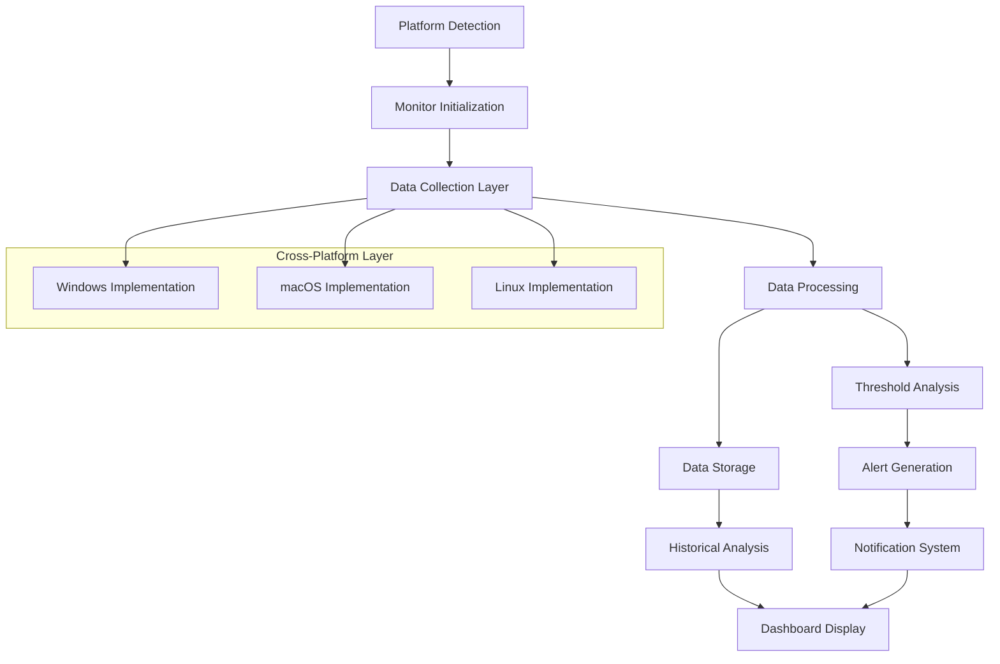
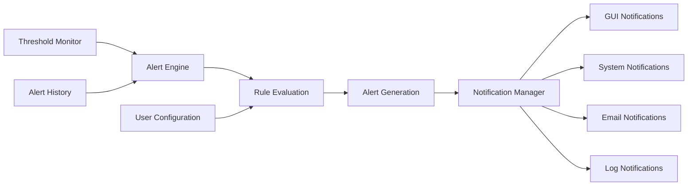
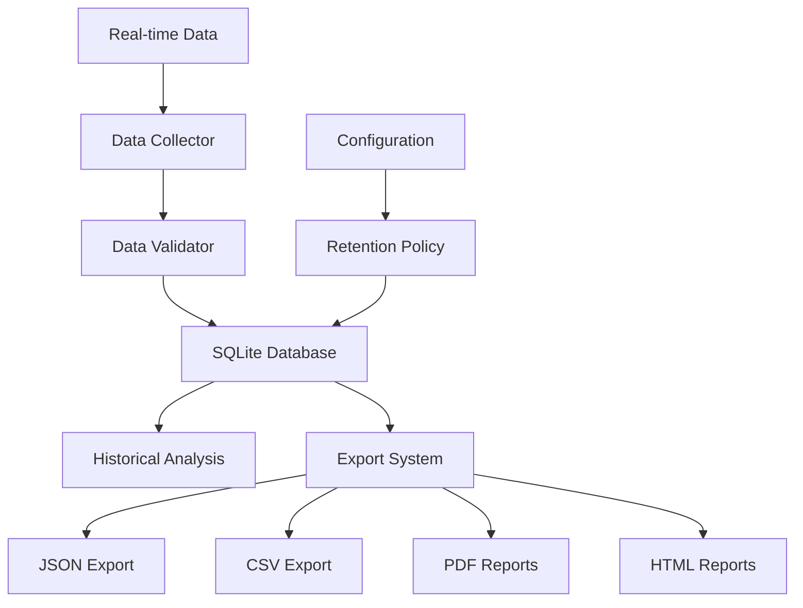

# Diagnostics Monitoring System - Design Document

## Overview

The Diagnostics Monitoring System provides comprehensive cross-platform system monitoring capabilities for Richard's File Utilities. It implements four essential monitoring tools with real-time data collection, historical analysis, configurable alerts, and unified dashboard interface.

## Architecture

### Core Components

```
diagnostics_monitoring/
├── __init__.py                     # Module initialization
├── README.md                       # User documentation
├── DESIGN.md                       # This design document
├── requirements.txt                # Additional dependencies
├── core/                           # Core utilities and base classes
│   ├── __init__.py
│   ├── monitor_base.py             # Base class for all monitoring tools
│   ├── platform_detector.py       # Cross-platform detection utilities
│   ├── data_collector.py          # Data collection framework
│   ├── alert_manager.py            # Alert system management
│   ├── threshold_manager.py        # Configurable threshold management
│   ├── data_storage.py             # Historical data persistence
│   ├── export_manager.py           # Data export and reporting
│   └── system_utils.py             # Cross-platform system utilities
├── monitors/                       # Individual monitoring tools
│   ├── __init__.py
│   ├── disk_health/                # Disk Health Monitor
│   │   ├── __init__.py
│   │   ├── disk_monitor.py         # Main disk monitoring class
│   │   ├── smart_analyzer.py       # SMART data analysis
│   │   ├── space_tracker.py        # Disk space tracking
│   │   └── platform_impl/          # Platform-specific implementations
│   │       ├── __init__.py
│   │       ├── windows_disk.py     # Windows disk monitoring
│   │       ├── macos_disk.py       # macOS disk monitoring
│   │       └── linux_disk.py       # Linux disk monitoring
│   ├── performance/                # RAM & CPU Usage Tracker
│   │   ├── __init__.py
│   │   ├── performance_monitor.py  # Main performance monitoring
│   │   ├── memory_tracker.py       # Memory usage tracking
│   │   ├── cpu_tracker.py          # CPU usage tracking
│   │   ├── process_analyzer.py     # Process-level analysis
│   │   └── platform_impl/          # Platform-specific implementations
│   │       ├── __init__.py
│   │       ├── windows_perf.py     # Windows performance monitoring
│   │       ├── macos_perf.py       # macOS performance monitoring
│   │       └── linux_perf.py       # Linux performance monitoring
│   ├── filesystem/                 # File System Integrity Check
│   │   ├── __init__.py
│   │   ├── integrity_monitor.py    # Main integrity monitoring
│   │   ├── scanner_engine.py       # File system scanning
│   │   ├── corruption_detector.py  # Corruption detection algorithms
│   │   ├── repair_advisor.py       # Repair recommendations
│   │   └── platform_impl/          # Platform-specific implementations
│   │       ├── __init__.py
│   │       ├── windows_fs.py       # Windows filesystem checks
│   │       ├── macos_fs.py         # macOS filesystem checks
│   │       └── linux_fs.py         # Linux filesystem checks
│   └── battery/                    # Battery Health Monitor
│       ├── __init__.py
│       ├── battery_monitor.py      # Main battery monitoring
│       ├── health_analyzer.py      # Battery health analysis
│       ├── cycle_tracker.py        # Charge cycle tracking
│       └── platform_impl/          # Platform-specific implementations
│           ├── __init__.py
│           ├── windows_battery.py  # Windows battery monitoring
│           ├── macos_battery.py    # macOS battery monitoring
│           └── linux_battery.py    # Linux battery monitoring
├── gui/                            # GUI components
│   ├── __init__.py
│   ├── diagnostics_hub.py          # Main diagnostics interface
│   ├── dashboard/                  # Dashboard components
│   │   ├── __init__.py
│   │   ├── main_dashboard.py       # Main dashboard window
│   │   ├── real_time_widgets.py    # Real-time monitoring widgets
│   │   ├── historical_charts.py    # Historical data visualization
│   │   ├── alert_panel.py          # Alert management panel
│   │   └── system_overview.py      # System overview widget
│   ├── monitors/                   # Monitor-specific GUI
│   │   ├── __init__.py
│   │   ├── disk_health_gui.py      # Disk health interface
│   │   ├── performance_gui.py      # Performance monitoring interface
│   │   ├── filesystem_gui.py       # Filesystem integrity interface
│   │   └── battery_gui.py          # Battery monitoring interface
│   ├── dialogs/                    # Configuration dialogs
│   │   ├── __init__.py
│   │   ├── threshold_config.py     # Threshold configuration dialog
│   │   ├── alert_config.py         # Alert configuration dialog
│   │   ├── export_dialog.py        # Data export dialog
│   │   └── settings_dialog.py      # General settings dialog
│   └── widgets/                    # Custom widgets
│       ├── __init__.py
│       ├── monitoring_chart.py     # Custom chart widget
│       ├── status_indicator.py     # Status indicator widget
│       ├── progress_ring.py        # Circular progress widget
│       └── alert_badge.py          # Alert notification badge
├── data/                           # Data storage and management
│   ├── __init__.py
│   ├── database/                   # Database management
│   │   ├── __init__.py
│   │   ├── db_manager.py           # Database connection manager
│   │   ├── schema.py               # Database schema definitions
│   │   └── migrations/             # Database migrations
│   │       └── __init__.py
│   ├── models/                     # Data models
│   │   ├── __init__.py
│   │   ├── disk_data.py            # Disk monitoring data models
│   │   ├── performance_data.py     # Performance data models
│   │   ├── filesystem_data.py      # Filesystem data models
│   │   ├── battery_data.py         # Battery data models
│   │   └── alert_data.py           # Alert data models
│   └── exporters/                  # Data export modules
│       ├── __init__.py
│       ├── json_exporter.py        # JSON export functionality
│       ├── csv_exporter.py         # CSV export functionality
│       ├── pdf_exporter.py         # PDF report generation
│       └── html_exporter.py        # HTML report generation
├── alerts/                         # Alert system
│   ├── __init__.py
│   ├── alert_engine.py             # Main alert processing engine
│   ├── notification_manager.py     # Notification delivery
│   ├── escalation_manager.py       # Alert escalation logic
│   ├── handlers/                   # Alert handlers
│   │   ├── __init__.py
│   │   ├── gui_handler.py          # GUI notification handler
│   │   ├── system_handler.py       # System notification handler
│   │   ├── email_handler.py        # Email notification handler
│   │   └── log_handler.py          # Log-based alert handler
│   └── rules/                      # Alert rules and conditions
│       ├── __init__.py
│       ├── threshold_rules.py      # Threshold-based rules
│       ├── trend_rules.py          # Trend analysis rules
│       └── custom_rules.py         # User-defined rules
├── config/                         # Configuration management
│   ├── __init__.py
│   ├── monitor_config.py           # Monitor configuration
│   ├── alert_config.py             # Alert configuration
│   ├── dashboard_config.py         # Dashboard configuration
│   └── defaults/                   # Default configurations
│       ├── __init__.py
│       ├── thresholds.json         # Default threshold values
│       ├── alerts.json             # Default alert settings
│       └── dashboard.json          # Default dashboard layout
├── utils/                          # Utility modules
│   ├── __init__.py
│   ├── formatters.py               # Data formatting utilities
│   ├── validators.py               # Input validation utilities
│   ├── converters.py               # Unit conversion utilities
│   ├── schedulers.py               # Task scheduling utilities
│   └── helpers.py                  # General helper functions
├── tests/                          # Test suite
│   ├── __init__.py
│   ├── conftest.py                 # Test configuration
│   ├── test_core/                  # Core functionality tests
│   │   ├── __init__.py
│   │   ├── test_monitor_base.py
│   │   ├── test_data_collector.py
│   │   ├── test_alert_manager.py
│   │   └── test_data_storage.py
│   ├── test_monitors/              # Monitor-specific tests
│   │   ├── __init__.py
│   │   ├── test_disk_health.py
│   │   ├── test_performance.py
│   │   ├── test_filesystem.py
│   │   └── test_battery.py
│   ├── test_gui/                   # GUI tests
│   │   ├── __init__.py
│   │   ├── test_dashboard.py
│   │   ├── test_dialogs.py
│   │   └── test_widgets.py
│   ├── test_integration/           # Integration tests
│   │   ├── __init__.py
│   │   ├── test_cross_platform.py
│   │   ├── test_data_flow.py
│   │   └── test_alert_system.py
│   └── fixtures/                   # Test fixtures and data
│       ├── __init__.py
│       ├── sample_data.py
│       └── mock_systems.py
└── docs/                           # Documentation
    ├── __init__.py
    ├── user_guide.md               # User documentation
    ├── api_reference.md            # API documentation
    ├── installation.md             # Installation guide
    ├── configuration.md            # Configuration guide
    ├── troubleshooting.md          # Troubleshooting guide
    └── platform_notes.md           # Platform-specific notes
```

## Monitoring Tools Specifications

### 1. Disk Health Monitor

**Purpose**: Monitor disk health using SMART data and track disk space usage

**Key Features**:
- SMART attribute monitoring (temperature, reallocated sectors, etc.)
- Disk space tracking with real-time updates
- Predictive failure analysis
- Cross-platform disk enumeration
- Historical trend analysis
- Configurable space and health thresholds

**Platform Implementations**:
- **Windows**: WMI queries, diskpart integration, Windows API
- **macOS**: diskutil, IOKit framework, system_profiler
- **Linux**: smartctl, /proc/diskstats, sysfs filesystem

**Data Collection**:
- SMART attributes (temperature, power-on hours, error counts)
- Disk space (total, used, free, percentage)
- I/O statistics (read/write operations, throughput)
- Disk model, serial number, firmware version

### 2. RAM & CPU Usage Tracker

**Purpose**: Monitor system performance with real-time metrics and historical analysis

**Key Features**:
- Real-time CPU usage monitoring (per-core and aggregate)
- Memory usage tracking (physical, virtual, swap)
- Process-level performance analysis
- Load average and system responsiveness metrics
- Historical performance trends
- Configurable performance thresholds

**Platform Implementations**:
- **Windows**: Performance Counters, WMI, Windows API
- **macOS**: Activity Monitor APIs, sysctl, vm_stat
- **Linux**: /proc/stat, /proc/meminfo, /proc/loadavg

**Data Collection**:
- CPU usage (user, system, idle, iowait)
- Memory usage (total, available, used, cached, buffers)
- Process information (top consumers, resource usage)
- System load and responsiveness metrics

### 3. File System Integrity Check

**Purpose**: Automated file system scanning and corruption detection

**Key Features**:
- Automated file system scanning
- Corruption detection algorithms
- File integrity verification
- Bad sector detection
- Repair recommendations
- Scheduled integrity checks

**Platform Implementations**:
- **Windows**: chkdsk integration, NTFS analysis, Windows API
- **macOS**: fsck integration, Disk Utility APIs, HFS+/APFS support
- **Linux**: fsck utilities, ext2/3/4 analysis, filesystem-specific tools

**Data Collection**:
- File system health status
- Corruption detection results
- Bad sector counts and locations
- File system metadata integrity
- Repair operation results

### 4. Battery Health Monitor

**Purpose**: Monitor battery health and charge cycle tracking

**Key Features**:
- Battery health status monitoring
- Charge cycle tracking and analysis
- Power consumption analysis
- Battery capacity degradation tracking
- Charging pattern analysis
- Battery lifespan predictions

**Platform Implementations**:
- **Windows**: WMI battery queries, Power Management APIs
- **macOS**: IOKit Power Sources, system_profiler battery info
- **Linux**: /sys/class/power_supply, ACPI battery information

**Data Collection**:
- Battery capacity (design, current, percentage)
- Charge cycles and charging patterns
- Power consumption rates
- Battery temperature and voltage
- Health status and degradation metrics

## Technical Architecture

### Data Flow Architecture



### Alert System Architecture



### Data Storage Architecture



## Integration with RFU Hub

### Main Hub Integration
- **Diagnostics Button**: Add to main RFU Hub interface
- **Consistent Styling**: Use RFU's BaseWindow and theme system
- **Error Handling**: Integrate with existing error_handler
- **Logging**: Use RFU's LogManager for all operations
- **Configuration**: Extend existing ConfigManager

### Configuration Integration
- **Settings Management**: Store settings in RFU configuration
- **User Preferences**: Integrate with user preference system
- **Theme Support**: Support all RFU themes and appearance settings

## Performance Considerations

### Optimization Strategies
- **Threaded Monitoring**: Run monitoring in background threads
- **Efficient Data Collection**: Minimize system impact during monitoring
- **Smart Caching**: Cache frequently accessed data
- **Batch Operations**: Group database operations for efficiency

### Resource Management
- **CPU Usage**: Limit monitoring overhead to <5% CPU usage
- **Memory Usage**: Efficient memory management for large datasets
- **Disk I/O**: Minimize disk operations through intelligent caching
- **Network Usage**: No network operations for core monitoring

## Security and Privacy

### Data Protection
- **Local Storage**: All data stored locally, no cloud transmission
- **Secure Access**: Proper permission handling for system data
- **Data Encryption**: Sensitive data encrypted at rest
- **Privacy Controls**: User control over data collection and retention

### System Security
- **Privilege Management**: Minimal required privileges
- **Safe Operations**: Read-only monitoring where possible
- **Audit Trail**: Complete logging of all operations
- **Error Isolation**: Prevent monitoring errors from affecting system

## Testing Strategy

### Unit Testing
- **Core Functionality**: Test all core utilities and base classes
- **Monitor-Specific Tests**: Individual tests for each monitoring tool
- **Cross-Platform Tests**: Platform-specific implementation testing
- **Error Handling Tests**: Test error conditions and recovery

### Integration Testing
- **GUI Integration**: Test GUI components and interactions
- **RFU Integration**: Verify integration with main RFU Hub
- **Data Flow Testing**: Test complete data collection and storage
- **Alert System Testing**: Verify alert generation and delivery

### Performance Testing
- **Resource Usage**: Monitor system impact during testing
- **Stress Testing**: Test with high data volumes and long runs
- **Memory Leak Testing**: Verify proper resource cleanup
- **Concurrent Access**: Test multi-threaded operations

## Future Enhancements

### Planned Features
- **Machine Learning**: Predictive analysis using historical data
- **Custom Dashboards**: User-configurable dashboard layouts
- **Advanced Analytics**: Detailed system analysis and recommendations
- **Remote Monitoring**: Optional remote system monitoring
- **Plugin Architecture**: Support for third-party monitoring plugins

### Extensibility
- **Custom Monitors**: Framework for creating custom monitoring tools
- **API Integration**: Integration with system management APIs
- **Scripting Support**: PowerShell/bash script integration
- **Third-party Integration**: Integration with external monitoring tools

This design provides a comprehensive framework for implementing a robust, cross-platform diagnostics monitoring system that integrates seamlessly with Richard's File Utilities while providing powerful system monitoring capabilities with real-time updates, historical analysis, and configurable alerting.