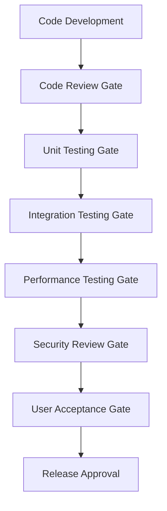

# Quality Assurance Protocols for File Utilities 2 Checksum Module

## Table of Contents

1. [Overview](#overview)
2. [QA Framework Architecture](#qa-framework-architecture)
3. [Code Quality Standards](#code-quality-standards)
4. [Testing Protocols](#testing-protocols)
5. [Release Management](#release-management)
6. [Maintenance Protocols](#maintenance-protocols)
7. [User Experience Standards](#user-experience-standards)
8. [Documentation Requirements](#documentation-requirements)
9. [Quality Metrics and KPIs](#quality-metrics-and-kpis)
10. [Escalation Procedures](#escalation-procedures)
11. [Automated Quality Validation](#automated-quality-validation)
12. [Integration with Existing Infrastructure](#integration-with-existing-infrastructure)
13. [Templates and Checklists](#templates-and-checklists)

---

## Overview

### Purpose
This document establishes comprehensive Quality Assurance protocols for the file_utilities_2 checksum module, prioritizing **data integrity and accuracy** while maintaining high standards for user experience and code maintainability in a mixed development/end-user environment.

### Scope
- Core checksum calculation and verification logic
- PyQt5 GUI components and user interfaces
- Testing frameworks and validation procedures
- Documentation and user guides
- Release and deployment processes
- Ongoing maintenance and monitoring

### Quality Principles
1. **Data Integrity First**: Absolute accuracy in checksum calculations
2. **Reliability**: Consistent behavior across all supported platforms
3. **Maintainability**: Clean, well-documented, and testable code
4. **User Experience**: Intuitive and responsive interfaces
5. **Performance**: Efficient processing of large files
6. **Security**: Safe handling of file operations and user data

---

## QA Framework Architecture

### Quality Gates


### Quality Levels
- **Level 1**: Critical (Data Integrity) - Zero tolerance for failures
- **Level 2**: High (User Experience) - Must meet defined standards
- **Level 3**: Medium (Performance) - Should meet benchmarks
- **Level 4**: Low (Documentation) - Should be complete and accurate

---

## Code Quality Standards

### 1. Data Integrity Standards

#### Checksum Calculation Requirements
- **Accuracy**: 100% accuracy required for all supported algorithms (MD5, SHA1, SHA256, SHA512)
- **Consistency**: Identical results across multiple runs for the same file
- **Completeness**: Handle all file sizes from 0 bytes to multi-gigabyte files
- **Error Handling**: Graceful handling of file access errors, permission issues, and corrupted data

#### Validation Requirements
```python
# Example validation pattern
def validate_checksum_accuracy(file_path, algorithm, expected_checksum):
    """
    Validates checksum calculation accuracy.
    
    Requirements:
    - Must match reference implementation results
    - Must be consistent across multiple calculations
    - Must handle edge cases (empty files, large files, special characters)
    """
    pass
```

#### Critical Code Patterns
- **Chunk-based Processing**: Always use streaming for large files
- **Memory Management**: Prevent memory leaks during long operations
- **Thread Safety**: Ensure thread-safe signal emissions
- **Cancellation Support**: Responsive cancellation within 100ms

### 2. Code Style Standards

#### Python Code Standards
- **PEP 8 Compliance**: Mandatory for all Python code
- **Type Hints**: Required for all public methods and complex functions
- **Docstrings**: Google-style docstrings for all classes and public methods
- **Error Handling**: Explicit exception handling with meaningful messages

#### PyQt5 GUI Standards
- **Signal/Slot Connections**: Use modern PyQt5 signal syntax
- **Thread Management**: Proper thread lifecycle management
- **Resource Cleanup**: Explicit cleanup of GUI resources
- **Responsive UI**: Non-blocking operations for all file processing

### 3. Code Review Guidelines

#### Mandatory Review Checklist
- [ ] **Data Integrity**: Checksum calculations are mathematically correct
- [ ] **Algorithm Implementation**: Follows standard specifications
- [ ] **Error Handling**: Comprehensive error scenarios covered
- [ ] **Performance**: Efficient memory usage and processing
- [ ] **Thread Safety**: Proper PyQt5 threading patterns
- [ ] **User Experience**: Responsive UI with progress feedback
- [ ] **Documentation**: Code is well-documented and self-explanatory
- [ ] **Testing**: Adequate test coverage for new functionality

#### Review Process
1. **Automated Checks**: Linting, type checking, basic tests
2. **Peer Review**: At least one senior developer review
3. **Data Integrity Review**: Specialized review for checksum logic
4. **Integration Review**: Impact assessment on existing functionality

---

## Testing Protocols

### 1. Test Coverage Requirements

#### Minimum Coverage Targets
- **Core Logic**: 95% line coverage, 100% branch coverage
- **GUI Components**: 85% line coverage, 90% branch coverage
- **Integration Points**: 100% coverage of public APIs
- **Error Handling**: 100% coverage of error paths

#### Test Categories
```python
# Test markers for pytest
@pytest.mark.critical      # Data integrity tests
@pytest.mark.performance   # Performance benchmarks
@pytest.mark.gui          # GUI functionality tests
@pytest.mark.integration  # Integration tests
@pytest.mark.regression   # Regression tests
```

### 2. Data Integrity Testing

#### Checksum Accuracy Tests
```python
class ChecksumAccuracyTests:
    """Critical tests for checksum calculation accuracy."""
    
    def test_known_vectors(self):
        """Test against known test vectors for each algorithm."""
        # Test with NIST test vectors
        # Test with RFC test vectors
        # Test with custom validation sets
        
    def test_file_size_variations(self):
        """Test accuracy across different file sizes."""
        # Empty files (0 bytes)
        # Small files (< 1KB)
        # Medium files (1KB - 1MB)
        # Large files (> 1MB)
        # Very large files (> 1GB)
        
    def test_content_variations(self):
        """Test accuracy with different content types."""
        # Binary data
        # Text data with various encodings
        # Files with null bytes
        # Files with special characters
```

#### Cross-Platform Validation
- **Windows**: Test on Windows 10/11 with different file systems
- **Linux**: Test on major distributions (Ubuntu, CentOS, Debian)
- **macOS**: Test on recent macOS versions
- **File Systems**: NTFS, ext4, APFS, FAT32 compatibility

### 3. Performance Testing

#### Benchmark Requirements
```python
class PerformanceBenchmarks:
    """Performance benchmarks for checksum operations."""
    
    PERFORMANCE_TARGETS = {
        'small_files': {'max_time': 0.1, 'min_throughput': '10MB/s'},
        'large_files': {'max_time': 60.0, 'min_throughput': '50MB/s'},
        'memory_usage': {'max_increase': '50MB'},
        'gui_responsiveness': {'max_freeze': 0.1}
    }
```

#### Load Testing
- **Concurrent Operations**: Multiple checksum calculations
- **Large File Handling**: Files up to 10GB
- **Memory Stress**: Extended operation periods
- **GUI Stress**: Rapid user interactions during processing

### 4. GUI Testing

#### Automated GUI Tests
```python
class GUITests:
    """Automated tests for GUI functionality."""
    
    def test_progress_tracking(self):
        """Verify progress tracking accuracy and responsiveness."""
        
    def test_cancellation(self):
        """Verify operation cancellation works correctly."""
        
    def test_error_display(self):
        """Verify error messages are displayed correctly."""
```

#### Manual GUI Testing Checklist
- [ ] **Progress Bars**: Accurate progress indication
- [ ] **Status Messages**: Clear and informative messages
- [ ] **Cancel Functionality**: Responsive cancellation
- [ ] **Error Handling**: User-friendly error messages
- [ ] **File Selection**: Proper file/directory selection
- [ ] **Results Display**: Clear presentation of results

### 5. Regression Testing

#### Automated Regression Suite
- **Daily Runs**: Automated execution of full test suite
- **Pre-Release Runs**: Comprehensive testing before releases
- **Performance Regression**: Benchmark comparison with previous versions
- **Compatibility Regression**: Cross-platform compatibility verification

---

## Release Management

### 1. Release Validation Checklist

#### Pre-Release Validation
- [ ] **All Tests Pass**: 100% pass rate on critical tests
- [ ] **Performance Benchmarks**: Meet or exceed performance targets
- [ ] **Security Scan**: No high or critical security vulnerabilities
- [ ] **Documentation**: All documentation updated and accurate
- [ ] **Compatibility**: Tested on all supported platforms
- [ ] **User Acceptance**: UAT completed successfully

#### Release Approval Process
1. **Technical Review**: Lead developer approval
2. **QA Sign-off**: QA team validation complete
3. **Security Review**: Security team approval
4. **Product Owner**: Business requirements met

### 2. Version Control Standards

#### Semantic Versioning
- **MAJOR.MINOR.PATCH** format
- **MAJOR**: Breaking changes or major new features
- **MINOR**: New features, backward compatible
- **PATCH**: Bug fixes, backward compatible

#### Release Branches
```bash
# Release branch naming convention
release/v2.1.0
hotfix/v2.0.1
feature/data-integrity-enhancement
```

### 3. Deployment Validation

#### Post-Deployment Checks
- [ ] **Smoke Tests**: Basic functionality verification
- [ ] **Integration Tests**: Verify integration points
- [ ] **Performance Tests**: Confirm performance targets
- [ ] **User Feedback**: Monitor initial user feedback

#### Rollback Procedures
1. **Immediate Rollback**: Critical issues affecting data integrity
2. **Planned Rollback**: Performance or usability issues
3. **Rollback Validation**: Verify rollback success
4. **Post-Rollback Analysis**: Root cause analysis and prevention

---

## Maintenance Protocols

### 1. Ongoing Monitoring

#### Health Check Procedures
```python
class HealthChecks:
    """Automated health checks for the checksum module."""
    
    def check_algorithm_accuracy(self):
        """Verify checksum algorithms are still accurate."""
        
    def check_performance_degradation(self):
        """Monitor for performance regression."""
        
    def check_memory_leaks(self):
        """Monitor for memory leaks during extended use."""
```

#### Monitoring Schedule
- **Daily**: Automated health checks
- **Weekly**: Performance trend analysis
- **Monthly**: Comprehensive system review
- **Quarterly**: Security and dependency updates

### 2. Bug Reporting and Resolution

#### Bug Classification
- **Critical**: Data integrity issues, security vulnerabilities
- **High**: Functionality broken, performance degradation
- **Medium**: Minor functionality issues, usability problems
- **Low**: Documentation issues, cosmetic problems

#### Resolution SLAs
- **Critical**: 4 hours response, 24 hours resolution
- **High**: 8 hours response, 72 hours resolution
- **Medium**: 24 hours response, 1 week resolution
- **Low**: 48 hours response, 2 weeks resolution

### 3. Dependency Management

#### Dependency Monitoring
- **Security Vulnerabilities**: Automated scanning for CVEs
- **Version Updates**: Track new versions of dependencies
- **Compatibility**: Verify compatibility with new versions
- **License Compliance**: Monitor license changes

#### Update Procedures
1. **Security Updates**: Immediate evaluation and testing
2. **Minor Updates**: Quarterly evaluation cycle
3. **Major Updates**: Annual evaluation with full testing
4. **Breaking Changes**: Careful evaluation with migration plan

---

## User Experience Standards

### 1. Interface Consistency

#### GUI Standards
- **Visual Consistency**: Consistent styling across all components
- **Interaction Patterns**: Standard PyQt5 interaction patterns
- **Accessibility**: Support for keyboard navigation and screen readers
- **Responsiveness**: No UI freezing during operations

#### Progress Feedback Requirements
- **Real-time Updates**: Progress bars update smoothly
- **Time Estimates**: Accurate ETA calculations
- **Cancellation**: Immediate response to cancel requests
- **Status Messages**: Clear, informative status updates

### 2. Error Handling Standards

#### User-Friendly Error Messages
```python
class ErrorMessageStandards:
    """Standards for user-facing error messages."""
    
    ERROR_TEMPLATES = {
        'file_not_found': "File not found: {filename}. Please check the file path and try again.",
        'permission_denied': "Permission denied: {filename}. Please check file permissions.",
        'calculation_error': "Error calculating checksum: {error}. Please try again or contact support."
    }
```

#### Error Recovery
- **Graceful Degradation**: Partial functionality when possible
- **Recovery Suggestions**: Actionable suggestions for users
- **Support Information**: Clear paths to get help
- **Error Logging**: Detailed logging for troubleshooting

### 3. Performance Standards

#### Response Time Requirements
- **File Selection**: < 100ms response time
- **Calculation Start**: < 500ms to begin processing
- **Progress Updates**: Every 100ms during processing
- **Cancellation**: < 100ms response to cancel

#### Throughput Requirements
- **Small Files** (< 1MB): > 10MB/s processing rate
- **Large Files** (> 100MB): > 50MB/s processing rate
- **Memory Usage**: < 100MB peak memory usage
- **GUI Responsiveness**: No freezing > 100ms

---

## Documentation Requirements

### 1. Technical Documentation Standards

#### Code Documentation
- **API Documentation**: Complete API reference with examples
- **Architecture Documentation**: System design and component interactions
- **Algorithm Documentation**: Detailed explanation of checksum implementations
- **Testing Documentation**: Test strategy and coverage reports

#### Documentation Format
```python
def calculate_checksum(file_path: str, algorithm: str) -> str:
    """
    Calculate checksum for a file using specified algorithm.
    
    Args:
        file_path: Path to the file to process
        algorithm: Checksum algorithm ('md5', 'sha1', 'sha256', 'sha512')
        
    Returns:
        Hexadecimal string representation of the checksum
        
    Raises:
        FileNotFoundError: If the specified file does not exist
        ValueError: If the algorithm is not supported
        PermissionError: If file cannot be read due to permissions
        
    Example:
        >>> checksum = calculate_checksum('/path/to/file.txt', 'sha256')
        >>> print(f"SHA256: {checksum}")
    """
```

### 2. User Documentation Standards

#### User Guide Requirements
- **Getting Started**: Quick start guide for new users
- **Feature Documentation**: Complete feature descriptions with screenshots
- **Troubleshooting**: Common issues and solutions
- **FAQ**: Frequently asked questions and answers

#### Help System Integration
- **Context-Sensitive Help**: Help relevant to current user action
- **Search Functionality**: Searchable help content
- **Examples**: Practical examples for common use cases
- **Video Tutorials**: Visual guides for complex operations

### 3. Change Documentation

#### Release Notes Standards
```markdown
## Version 2.1.0 - 2024-01-15

### New Features
- Enhanced progress tracking with ETA calculations
- Support for batch checksum verification

### Improvements
- 25% performance improvement for large files
- Improved error messages and user feedback

### Bug Fixes
- Fixed memory leak during extended operations
- Corrected progress bar accuracy for small files

### Breaking Changes
- None

### Migration Guide
- No migration required for this release
```

---

## Quality Metrics and KPIs

### 1. Data Integrity Metrics

#### Accuracy Metrics
- **Checksum Accuracy**: 100% accuracy target (zero tolerance)
- **Cross-Platform Consistency**: 100% identical results across platforms
- **Algorithm Compliance**: 100% compliance with standard specifications
- **Test Vector Validation**: 100% pass rate on standard test vectors

#### Reliability Metrics
- **Error Rate**: < 0.01% error rate in production
- **Crash Rate**: < 0.001% crash rate during operations
- **Data Corruption**: Zero incidents of data corruption
- **False Positives**: < 0.001% false positive rate in verification

### 2. Performance Metrics

#### Processing Performance
- **Throughput**: Minimum 50MB/s for large files
- **Memory Efficiency**: < 100MB peak memory usage
- **CPU Utilization**: < 80% CPU usage during processing
- **Response Time**: < 100ms for UI interactions

#### Scalability Metrics
- **File Size Limits**: Support files up to 10GB
- **Concurrent Operations**: Support 5 concurrent checksums
- **Long-Running Operations**: Stable operation for 24+ hours
- **Resource Cleanup**: 100% resource cleanup after operations

### 3. User Experience Metrics

#### Usability Metrics
- **Task Completion Rate**: > 95% successful task completion
- **Error Recovery Rate**: > 90% successful error recovery
- **User Satisfaction**: > 4.0/5.0 user satisfaction score
- **Support Ticket Rate**: < 1% of users require support

#### Interface Metrics
- **UI Responsiveness**: < 100ms response to user actions
- **Progress Accuracy**: ± 5% accuracy in progress reporting
- **Cancellation Response**: < 100ms response to cancel requests
- **Error Message Clarity**: > 90% users understand error messages

### 4. Code Quality Metrics

#### Test Coverage Metrics
- **Line Coverage**: > 95% for core logic, > 85% for GUI
- **Branch Coverage**: > 90% for all components
- **Test Pass Rate**: 100% pass rate for critical tests
- **Regression Detection**: > 95% regression detection rate

#### Maintainability Metrics
- **Code Complexity**: Cyclomatic complexity < 10 per function
- **Documentation Coverage**: > 90% of public APIs documented
- **Code Review Coverage**: 100% of changes reviewed
- **Technical Debt**: < 5% of development time on technical debt

---

## Escalation Procedures

### 1. Quality Issue Classification

#### Severity Levels
- **Severity 1**: Data integrity compromise, security vulnerability
- **Severity 2**: Major functionality broken, performance degradation > 50%
- **Severity 3**: Minor functionality issues, usability problems
- **Severity 4**: Documentation issues, cosmetic problems

#### Impact Assessment
- **Critical**: Affects data integrity or security
- **High**: Affects core functionality or many users
- **Medium**: Affects specific features or some users
- **Low**: Minor impact on user experience

### 2. Escalation Matrix

| Severity | Impact | Response Time | Escalation Level | Notification |
|----------|--------|---------------|------------------|--------------|
| 1 | Critical | 1 hour | Executive | All stakeholders |
| 1 | High | 2 hours | Management | Technical leads |
| 2 | Critical | 4 hours | Management | Technical leads |
| 2 | High | 8 hours | Team Lead | Development team |
| 3 | Medium | 24 hours | Developer | QA team |
| 4 | Low | 48 hours | Developer | Documentation team |

### 3. Escalation Process

#### Step 1: Initial Assessment
1. **Issue Detection**: Automated monitoring or user report
2. **Severity Classification**: Assign severity and impact levels
3. **Initial Response**: Acknowledge issue and begin investigation
4. **Stakeholder Notification**: Notify appropriate stakeholders

#### Step 2: Investigation and Resolution
1. **Root Cause Analysis**: Identify underlying cause
2. **Impact Assessment**: Determine full scope of impact
3. **Resolution Planning**: Develop resolution strategy
4. **Implementation**: Execute resolution plan

#### Step 3: Validation and Communication
1. **Resolution Validation**: Verify issue is resolved
2. **Regression Testing**: Ensure no new issues introduced
3. **Stakeholder Update**: Communicate resolution status
4. **Post-Mortem**: Conduct lessons learned session

### 4. Communication Protocols

#### Internal Communication
- **Slack/Teams**: Real-time updates during active incidents
- **Email**: Formal notifications and status updates
- **Dashboard**: Real-time status dashboard for ongoing issues
- **Reports**: Weekly quality reports and trend analysis

#### External Communication
- **User Notifications**: Proactive communication for user-facing issues
- **Release Notes**: Document resolved issues in release notes
- **Support Documentation**: Update support materials as needed
- **Community Updates**: Communicate with user community when appropriate

---

## Automated Quality Validation

### 1. Continuous Integration Pipeline

#### CI/CD Quality Gates
```yaml
# Example CI pipeline configuration
quality_gates:
  - name: "Code Quality"
    checks:
      - linting
      - type_checking
      - security_scan
  - name: "Data Integrity"
    checks:
      - checksum_accuracy_tests
      - cross_platform_validation
      - algorithm_compliance
  - name: "Performance"
    checks:
      - benchmark_tests
      - memory_leak_detection
      - load_testing
  - name: "Integration"
    checks:
      - integration_tests
      - gui_tests
      - compatibility_tests
```

#### Automated Test Execution
- **Pre-Commit Hooks**: Basic quality checks before code commit
- **Pull Request Validation**: Comprehensive testing on pull requests
- **Nightly Builds**: Full test suite execution every night
- **Release Validation**: Complete validation before releases

### 2. Quality Monitoring

#### Real-Time Monitoring
```python
class QualityMonitor:
    """Real-time quality monitoring system."""
    
    def monitor_checksum_accuracy(self):
        """Continuously monitor checksum calculation accuracy."""
        
    def monitor_performance_metrics(self):
        """Track performance metrics and detect degradation."""
        
    def monitor_error_rates(self):
        """Monitor error rates and detect anomalies."""
```

#### Alerting System
- **Critical Alerts**: Immediate notification for data integrity issues
- **Performance Alerts**: Notification for performance degradation
- **Trend Alerts**: Early warning for negative trends
- **Capacity Alerts**: Notification for resource constraints

### 3. Automated Reporting

#### Quality Dashboards
- **Real-Time Status**: Current system health and quality metrics
- **Trend Analysis**: Historical trends and patterns
- **Performance Metrics**: Throughput, response times, resource usage
- **Test Results**: Test execution results and coverage metrics

#### Automated Reports
- **Daily Quality Report**: Summary of key quality metrics
- **Weekly Trend Report**: Analysis of quality trends
- **Monthly Quality Review**: Comprehensive quality assessment
- **Release Quality Report**: Quality assessment for each release

---

## Integration with Existing Infrastructure

### 1. Testing Framework Integration

#### pytest Integration
```python
# pytest.ini configuration for QA protocols
[pytest]
testpaths = file_utilities_2/tests
python_files = test_*.py
python_classes = Test*
python_functions = test_*

# QA-specific markers
markers =
    critical: Critical data integrity tests
    performance: Performance benchmark tests
    gui: GUI functionality tests
    integration: Integration tests
    regression: Regression tests
    security: Security validation tests

# Quality gates
addopts = 
    --cov=file_utilities_2
    --cov-report=html
    --cov-report=term-missing
    --cov-fail-under=90
    --benchmark-only
    --benchmark-sort=mean
```

#### Test Organization
```
file_utilities_2/tests/
├── unit/                   # Unit tests
│   ├── test_checksum_core.py
│   ├── test_algorithms.py
│   └── test_error_handling.py
├── integration/            # Integration tests
│   ├── test_gui_integration.py
│   ├── test_thread_integration.py
│   └── test_signal_integration.py
├── performance/            # Performance tests
│   ├── test_benchmarks.py
│   ├── test_memory_usage.py
│   └── test_scalability.py
├── security/              # Security tests
│   ├── test_file_handling.py
│   └── test_input_validation.py
└── regression/            # Regression tests
    ├── test_compatibility.py
    └── test_known_issues.py
```

### 2. Documentation Integration

#### Existing Documentation Structure
```
file_utilities_2/docs/
├── QA_PROTOCOLS.md         # This document
├── PYQT5_CONVERSION_SUMMARY.md
├── progress_tracking_guide.md
├── checksum_files.md
├── api/                    # API documentation
├── user_guide/            # User documentation
├── development/           # Development guides
└── quality/               # Quality documentation
    ├── test_reports/
    ├── performance_reports/
    └── security_reports/
```

### 3. Development Workflow Integration

#### Git Workflow Integration
```bash
# Pre-commit hooks for quality assurance
pre-commit:
  - id: quality-check
    name: Quality Check
    entry: python -m qa_tools.quality_check
    language: python
    stages: [commit]
    
  - id: data-integrity-test
    name: Data Integrity Test
    entry: pytest -m critical
    language: python
    stages: [commit]
```

#### Code Review Integration
- **Automated Checks**: Quality gates in pull request validation
- **Review Templates**: Standardized review checklists
- **Quality Metrics**: Integration with code review tools
- **Documentation Updates**: Automatic documentation generation

### 4. Monitoring Integration

#### Existing Monitoring Systems
- **Performance Monitoring**: Integration with existing performance tools
- **Error Tracking**: Integration with error tracking systems
- **User Analytics**: Integration with user behavior analytics
- **System Health**: Integration with system monitoring tools

---

## Templates and Checklists

### 1. Code Review Checklist

#### Data Integrity Review
```markdown
## Data Integrity Review Checklist

### Checksum Calculation
- [ ] Algorithm implementation follows standard specifications
- [ ] Handles all file sizes correctly (0 bytes to multi-GB)
- [ ] Consistent results across multiple runs
- [ ] Proper error handling for file access issues
- [ ] Memory-efficient processing for large files

### Verification Logic
- [ ] Accurate comparison of calculated vs expected checksums
- [ ] Case-insensitive comparison where appropriate
- [ ] Proper handling of different checksum formats
- [ ] Clear error messages for verification failures

### Edge Cases
- [ ] Empty files (0 bytes)
- [ ] Very large files (> 1GB)
- [ ] Files with special characters in names
- [ ] Files on different file systems
- [ ] Network-mounted files
```

#### Performance Review
```markdown
## Performance Review Checklist

### Memory Usage
- [ ] No memory leaks during extended operations
- [ ] Efficient memory usage for large files
- [ ] Proper cleanup of resources
- [ ] Streaming processing for large files

### Processing Speed
- [ ] Meets minimum throughput requirements
- [ ] Efficient algorithm implementation
- [ ] Minimal CPU overhead
- [ ] Responsive progress updates

### GUI Performance
- [ ] Non-blocking UI during processing
- [ ] Smooth progress bar updates
- [ ] Responsive cancellation
- [ ] No UI freezing
```

### 2. Testing Checklist

#### Pre-Release Testing
```markdown
## Pre-Release Testing Checklist

### Critical Tests
- [ ] All checksum accuracy tests pass (100%)
- [ ] Cross-platform compatibility verified
- [ ] Performance benchmarks meet targets
- [ ] Memory leak tests pass
- [ ] Security vulnerability scan clean

### Integration Tests
- [ ] GUI integration tests pass
- [ ] Thread safety tests pass
- [ ] Signal/slot connections verified
- [ ] Error handling tests pass
- [ ] Cancellation functionality verified

### User Acceptance Tests
- [ ] Basic workflow testing completed
- [ ] Error scenario testing completed
- [ ] Performance testing with real files
- [ ] Documentation accuracy verified
- [ ] User feedback incorporated
```

### 3. Release Checklist

#### Release Preparation
```markdown
## Release Preparation Checklist

### Code Quality
- [ ] All code reviews completed and approved
- [ ] No critical or high severity issues open
- [ ] Code coverage meets minimum requirements
- [ ] Documentation updated and accurate
- [ ] Version numbers updated consistently

### Testing
- [ ] Full test suite passes (100%)
- [ ] Performance benchmarks meet targets
- [ ] Security scan completed with no critical issues
- [ ] Cross-platform testing completed
- [ ] Regression testing completed

### Documentation
- [ ] Release notes prepared and reviewed
- [ ] User documentation updated
- [ ] API documentation updated
- [ ] Migration guide prepared (if needed)
- [ ] Known issues documented

### Deployment
- [ ] Deployment plan reviewed and approved
- [ ] Rollback plan prepared and tested
- [ ] Monitoring and alerting configured
- [ ] Support team briefed on changes
- [ ] Communication plan executed
```

### 4. Bug Report Template

```markdown
## Bug Report Template

### Bug Information
- **Title**: [Clear, descriptive title]
- **Severity**: [Critical/High/Medium/Low]
- **Priority**: [P1/P2/P3/P4]
- **Component**: [Core/GUI/Documentation/Other]
- **Version**: [Version number where bug was found]

### Environment
- **Operating System**: [Windows/Linux/macOS version]
- **Python Version**: [Python version]
- **PyQt5 Version**: [PyQt5 version]
- **File System**: [NTFS/ext4/APFS/other]

### Description
[Detailed description of the issue]

### Steps to Reproduce
1. [Step 1]
2. [Step 2]
3. [Step 3]

### Expected Behavior
[What should happen]

### Actual Behavior
[What actually happens]

### Additional Information
- **Files Affected**: [File paths/types if relevant]
- **Error Messages**: [Exact error messages]
- **Screenshots**: [If applicable]
- **Logs**: [Relevant log entries]

### Data Integrity Impact
- [ ] Affects checksum calculation accuracy
- [ ] Affects verification results
- [ ] Could lead to data corruption
- [ ] No data integrity impact
```

### 5. Performance Test Template

```python
"""
Performance Test Template

This template provides a standardized approach for performance testing
of checksum operations with specific focus on data integrity.
"""

import pytest
import time
import psutil
from file_utilities_2.core.check_sum import ChecksumLogic

class TestPerformanceTemplate:
    """Template for performance testing."""
    
    # Performance targets
    PERFORMANCE_TARGETS = {
        'small_files': {
            'max_time': 0.1,        # seconds
            'min_throughput': 10,    # MB/s
        },
        'large_files': {
            'max_time': 60.0,       # seconds
            'min_throughput': 50,    # MB/s
        },
        'memory': {
            'max_increase': 50,      # MB
        },
        'gui': {
            'max_freeze': 0.1,      # seconds
        }
    }
    
    @pytest.mark.performance
    def test_throughput_performance(self, test_file_path, file_size):
        """Test processing throughput meets requirements."""
        checksummer = ChecksumLogic(test_file_path, 'sha256')
        
        start_time = time.time()
        result = checksummer.calculate_sha256(test_file_path)
        end_time = time.time()
        
        duration = end_time - start_time
        throughput = (file_size / (1024 * 1024)) / duration  # MB/s
        
        # Verify accuracy first (data integrity priority)
        assert result is not None, "Checksum calculation failed"
        
        # Then verify performance
        target = self._get_performance_target(file_size)
        assert throughput >= target['min_throughput'], \
            f"Throughput {throughput:.2f} MB/s below target {target['min_throughput']} MB/s"
    
    @pytest.mark.performance
    def test_memory_efficiency(self, large_test_file):
        """Test memory usage remains within limits."""
        process = psutil.Process()
        initial_memory = process.memory_info().rss / (1024 * 1024)  # MB
        
        checksummer = ChecksumLogic(large_test_file, 'sha256')
        result = checksummer.calculate_sha256(large_test_file)
        
        final_memory = process.memory_info().rss / (1024 * 1024)  # MB
        memory_increase = final_memory - initial_memory
        
        # Verify