# Size Analyzer Architecture Diagrams and Visual Representations

## Table of Contents

1. [Overview](#overview)
2. [System Architecture](#system-architecture)
3. [Component Diagrams](#component-diagrams)
4. [Data Flow Diagrams](#data-flow-diagrams)
5. [Sequence Diagrams](#sequence-diagrams)
6. [Class Diagrams](#class-diagrams)
7. [Migration Architecture](#migration-architecture)
8. [Hub Integration Architecture](#hub-integration-architecture)
9. [Threading Model](#threading-model)
10. [Configuration Architecture](#configuration-architecture)

---

## Overview

This document provides comprehensive visual representations of the Size Analyzer architecture, including system components, data flows, and interaction patterns. These diagrams illustrate the migration from legacy architecture to the modern file_utilities_2 framework.

### Diagram Conventions

- **Blue boxes**: Core components
- **Green boxes**: GUI components  
- **Orange boxes**: Integration components
- **Purple boxes**: Configuration/utility components
- **Solid arrows**: Direct method calls
- **Dashed arrows**: Signal/event communication
- **Dotted arrows**: Data flow

---

## System Architecture

### High-Level System Overview

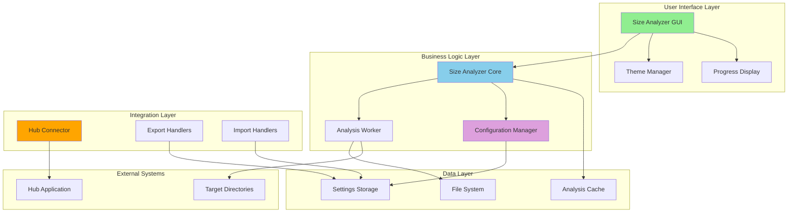
```mermaid
graph TB
    subgraph "User Interface Layer"
        GUI[Size Analyzer GUI]
        Theme[Theme Manager]
        Progress[Progress Display]
    end
    
    subgraph "Business Logic Layer"
        Core[Size Analyzer Core]
        Worker[Analysis Worker]
        Config[Configuration Manager]
    end
    
    subgraph "Integration Layer"
        Hub[Hub Connector]
        Export[Export Handlers]
        Import[Import Handlers]
    end
    
    subgraph "Data Layer"
        FS[File System]
        Cache[Analysis Cache]
        Settings[Settings Storage]
    end
    
    subgraph "External Systems"
        HubApp[Hub Application]
        FileSystem[Target Directories]
    end
    
    GUI --> Core
    GUI --> Theme
    GUI --> Progress
    Core --> Worker
    Core --> Config
    Worker --> FS
    Hub --> HubApp
    Export --> Settings
    Import --> Settings
    Config --> Settings
    Core --> Cache
    Worker --> FileSystem
    
    style GUI fill:#90EE90
    style Core fill:#87CEEB
    style Hub fill:#FFA500
    style Config fill:#DDA0DD
```

### Migration Architecture Comparison

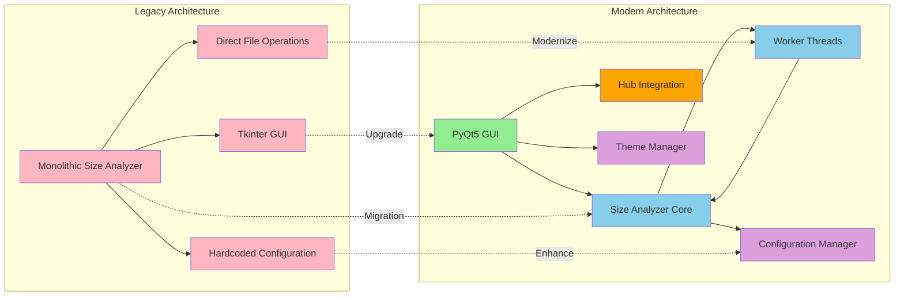
```mermaid
graph LR
    subgraph "Legacy Architecture"
        L1[Monolithic Size Analyzer]
        L2[Tkinter GUI]
        L3[Direct File Operations]
        L4[Hardcoded Configuration]
        
        L1 --> L2
        L1 --> L3
        L1 --> L4
    end
    
    subgraph "Modern Architecture"
        M1[Size Analyzer Core]
        M2[PyQt5 GUI]
        M3[Worker Threads]
        M4[Configuration Manager]
        M5[Hub Integration]
        M6[Theme Manager]
        
        M2 --> M1
        M1 --> M3
        M1 --> M4
        M2 --> M5
        M2 --> M6
        M3 --> M1
    end
    
    L1 -.->|Migration| M1
    L2 -.->|Upgrade| M2
    L3 -.->|Modernize| M3
    L4 -.->|Enhance| M4
    
    style L1 fill:#FFB6C1
    style L2 fill:#FFB6C1
    style L3 fill:#FFB6C1
    style L4 fill:#FFB6C1
    style M1 fill:#87CEEB
    style M2 fill:#90EE90
    style M3 fill:#87CEEB
    style M4 fill:#DDA0DD
    style M5 fill:#FFA500
    style M6 fill:#DDA0DD
```

---

## Component Diagrams

### Core Components Structure

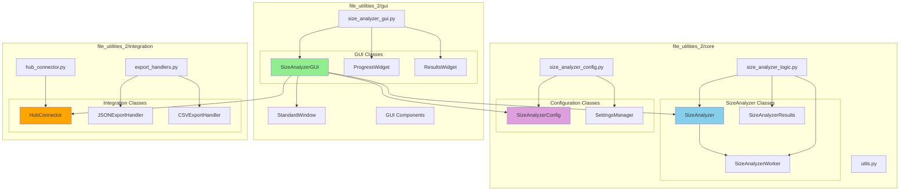
```mermaid
graph TB
    subgraph "file_utilities_2/core"
        SAL[size_analyzer_logic.py]
        SAC[size_analyzer_config.py]
        Utils[utils.py]
        
        subgraph "SizeAnalyzer Classes"
            SA[SizeAnalyzer]
            SAW[SizeAnalyzerWorker]
            SAR[SizeAnalyzerResults]
        end
        
        subgraph "Configuration Classes"
            Config[SizeAnalyzerConfig]
            Settings[SettingsManager]
        end
    end
    
    subgraph "file_utilities_2/gui"
        SAGUI[size_analyzer_gui.py]
        SW[StandardWindow]
        Components[GUI Components]
        
        subgraph "GUI Classes"
            MainGUI[SizeAnalyzerGUI]
            ProgressWidget[ProgressWidget]
            ResultsWidget[ResultsWidget]
        end
    end
    
    subgraph "file_utilities_2/integration"
        HC[hub_connector.py]
        EH[export_handlers.py]
        
        subgraph "Integration Classes"
            HubConn[HubConnector]
            JSONExport[JSONExportHandler]
            CSVExport[CSVExportHandler]
        end
    end
    
    SAL --> SA
    SAL --> SAW
    SAL --> SAR
    SAC --> Config
    SAC --> Settings
    
    SAGUI --> MainGUI
    SAGUI --> ProgressWidget
    SAGUI --> ResultsWidget
    MainGUI --> SW
    
    HC --> HubConn
    EH --> JSONExport
    EH --> CSVExport
    
    MainGUI --> SA
    MainGUI --> Config
    MainGUI --> HubConn
    SA --> SAW
    
    style SA fill:#87CEEB
    style MainGUI fill:#90EE90
    style HubConn fill:#FFA500
    style Config fill:#DDA0DD
```

### GUI Component Hierarchy

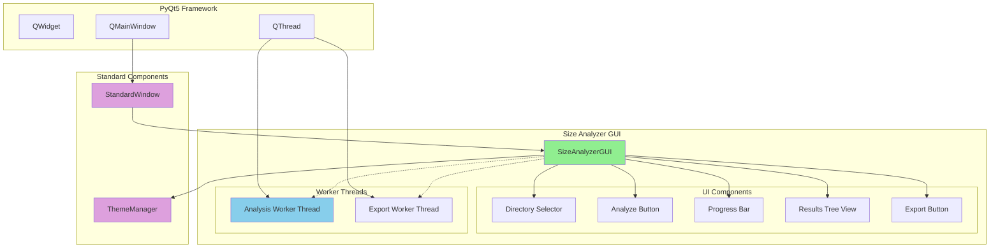
```mermaid
graph TB
    subgraph "PyQt5 Framework"
        QWidget[QWidget]
        QMainWindow[QMainWindow]
        QThread[QThread]
    end
    
    subgraph "Standard Components"
        SW[StandardWindow]
        TM[ThemeManager]
    end
    
    subgraph "Size Analyzer GUI"
        SAGUI[SizeAnalyzerGUI]
        
        subgraph "UI Components"
            DirSelect[Directory Selector]
            AnalyzeBtn[Analyze Button]
            ProgressBar[Progress Bar]
            ResultsTree[Results Tree View]
            ExportBtn[Export Button]
        end
        
        subgraph "Worker Threads"
            AnalysisWorker[Analysis Worker Thread]
            ExportWorker[Export Worker Thread]
        end
    end
    
    QMainWindow --> SW
    SW --> SAGUI
    QThread --> AnalysisWorker
    QThread --> ExportWorker
    
    SAGUI --> DirSelect
    SAGUI --> AnalyzeBtn
    SAGUI --> ProgressBar
    SAGUI --> ResultsTree
    SAGUI --> ExportBtn
    SAGUI --> TM
    
    SAGUI -.-> AnalysisWorker
    SAGUI -.-> ExportWorker
    
    style SAGUI fill:#90EE90
    style SW fill:#DDA0DD
    style AnalysisWorker fill:#87CEEB
    style TM fill:#DDA0DD
```

---

## Data Flow Diagrams

### Analysis Data Flow

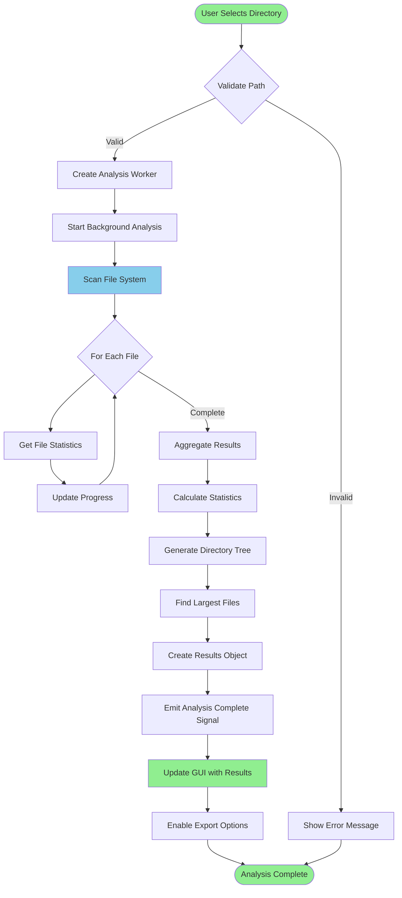
```mermaid
flowchart TD
    Start([User Selects Directory]) --> Validate{Validate Path}
    Validate -->|Invalid| Error[Show Error Message]
    Validate -->|Valid| CreateWorker[Create Analysis Worker]
    
    CreateWorker --> StartAnalysis[Start Background Analysis]
    StartAnalysis --> ScanFiles[Scan File System]
    
    ScanFiles --> ProcessFile{For Each File}
    ProcessFile --> GetStats[Get File Statistics]
    GetStats --> UpdateProgress[Update Progress]
    UpdateProgress --> ProcessFile
    
    ProcessFile -->|Complete| Aggregate[Aggregate Results]
    Aggregate --> CalculateStats[Calculate Statistics]
    CalculateStats --> GenerateTree[Generate Directory Tree]
    GenerateTree --> FindLargest[Find Largest Files]
    FindLargest --> CreateResults[Create Results Object]
    
    CreateResults --> EmitComplete[Emit Analysis Complete Signal]
    EmitComplete --> UpdateGUI[Update GUI with Results]
    UpdateGUI --> EnableExport[Enable Export Options]
    EnableExport --> End([Analysis Complete])
    
    Error --> End
    
    style Start fill:#90EE90
    style End fill:#90EE90
    style ScanFiles fill:#87CEEB
    style UpdateGUI fill:#90EE90
```

### Configuration Data Flow

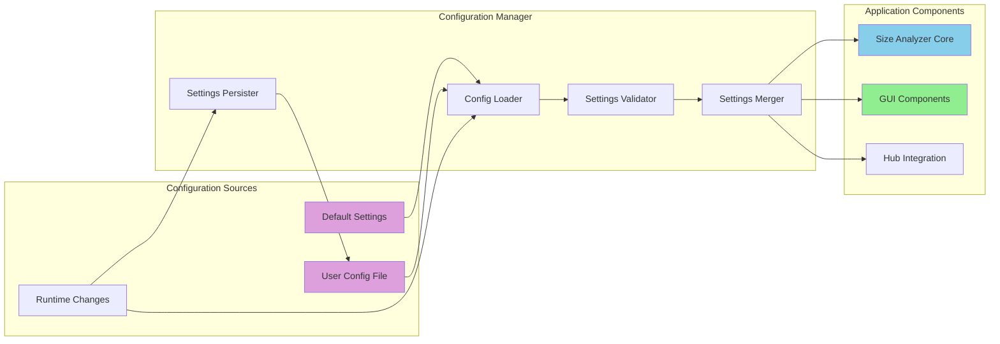
```mermaid
flowchart LR
    subgraph "Configuration Sources"
        Default[Default Settings]
        UserFile[User Config File]
        Runtime[Runtime Changes]
    end
    
    subgraph "Configuration Manager"
        Loader[Config Loader]
        Validator[Settings Validator]
        Merger[Settings Merger]
        Persister[Settings Persister]
    end
    
    subgraph "Application Components"
        Core[Size Analyzer Core]
        GUI[GUI Components]
        Hub[Hub Integration]
    end
    
    Default --> Loader
    UserFile --> Loader
    Runtime --> Loader
    
    Loader --> Validator
    Validator --> Merger
    Merger --> Core
    Merger --> GUI
    Merger --> Hub
    
    Runtime --> Persister
    Persister --> UserFile
    
    style Default fill:#DDA0DD
    style UserFile fill:#DDA0DD
    style Core fill:#87CEEB
    style GUI fill:#90EE90
```

### Hub Communication Flow

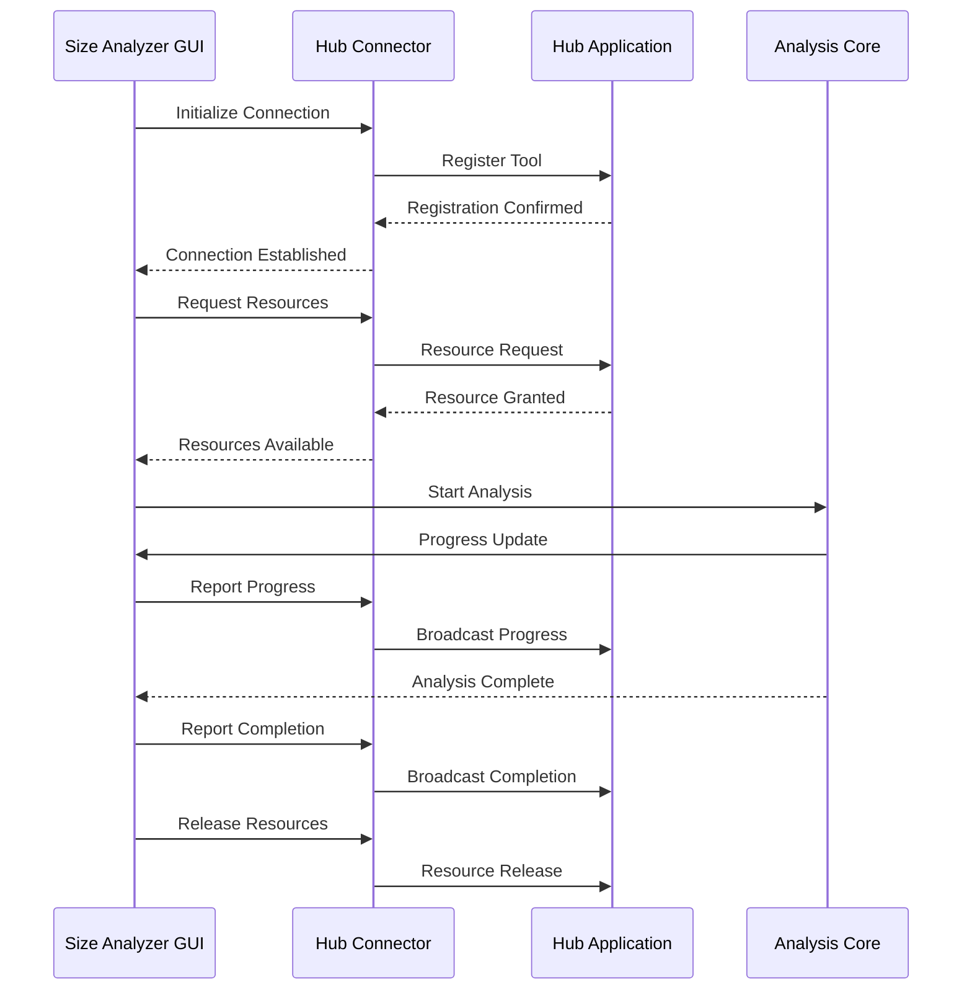
```mermaid
sequenceDiagram
    participant GUI as Size Analyzer GUI
    participant Hub as Hub Connector
    participant HubApp as Hub Application
    participant Core as Analysis Core
    
    GUI->>Hub: Initialize Connection
    Hub->>HubApp: Register Tool
    HubApp-->>Hub: Registration Confirmed
    Hub-->>GUI: Connection Established
    
    GUI->>Hub: Request Resources
    Hub->>HubApp: Resource Request
    HubApp-->>Hub: Resource Granted
    Hub-->>GUI: Resources Available
    
    GUI->>Core: Start Analysis
    Core->>GUI: Progress Update
    GUI->>Hub: Report Progress
    Hub->>HubApp: Broadcast Progress
    
    Core-->>GUI: Analysis Complete
    GUI->>Hub: Report Completion
    Hub->>HubApp: Broadcast Completion
    
    GUI->>Hub: Release Resources
    Hub->>HubApp: Resource Release
```

---

## Sequence Diagrams

### Complete Analysis Workflow

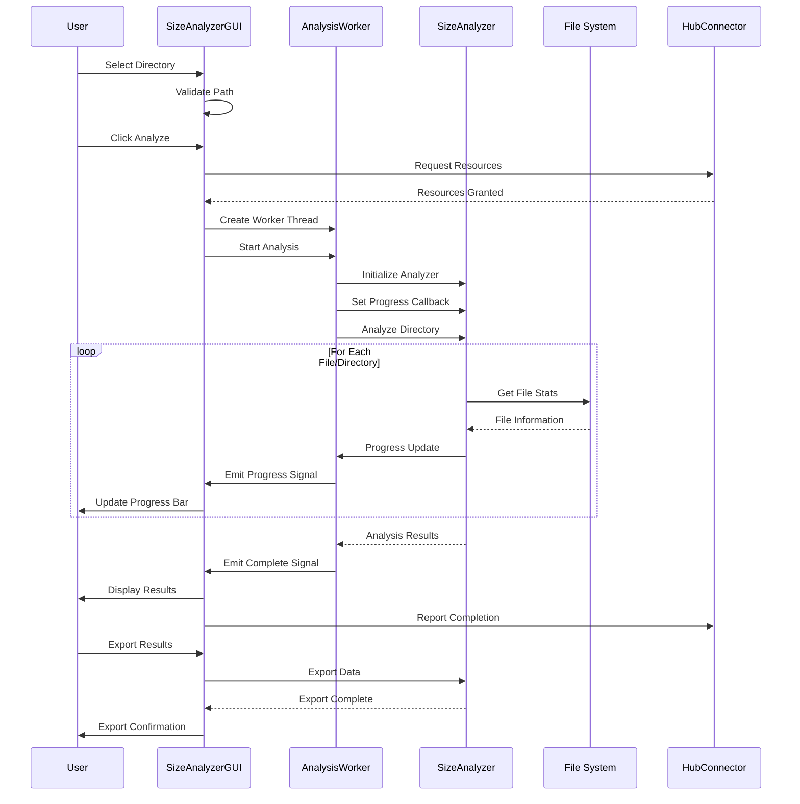
```mermaid
sequenceDiagram
    participant User
    participant GUI as SizeAnalyzerGUI
    participant Worker as AnalysisWorker
    participant Core as SizeAnalyzer
    participant FS as File System
    participant Hub as HubConnector
    
    User->>GUI: Select Directory
    GUI->>GUI: Validate Path
    User->>GUI: Click Analyze
    
    GUI->>Hub: Request Resources
    Hub-->>GUI: Resources Granted
    
    GUI->>Worker: Create Worker Thread
    GUI->>Worker: Start Analysis
    
    Worker->>Core: Initialize Analyzer
    Worker->>Core: Set Progress Callback
    Worker->>Core: Analyze Directory
    
    loop For Each File/Directory
        Core->>FS: Get File Stats
        FS-->>Core: File Information
        Core->>Worker: Progress Update
        Worker->>GUI: Emit Progress Signal
        GUI->>User: Update Progress Bar
    end
    
    Core-->>Worker: Analysis Results
    Worker->>GUI: Emit Complete Signal
    GUI->>User: Display Results
    GUI->>Hub: Report Completion
    
    User->>GUI: Export Results
    GUI->>Core: Export Data
    Core-->>GUI: Export Complete
    GUI->>User: Export Confirmation
```

### Error Handling Sequence

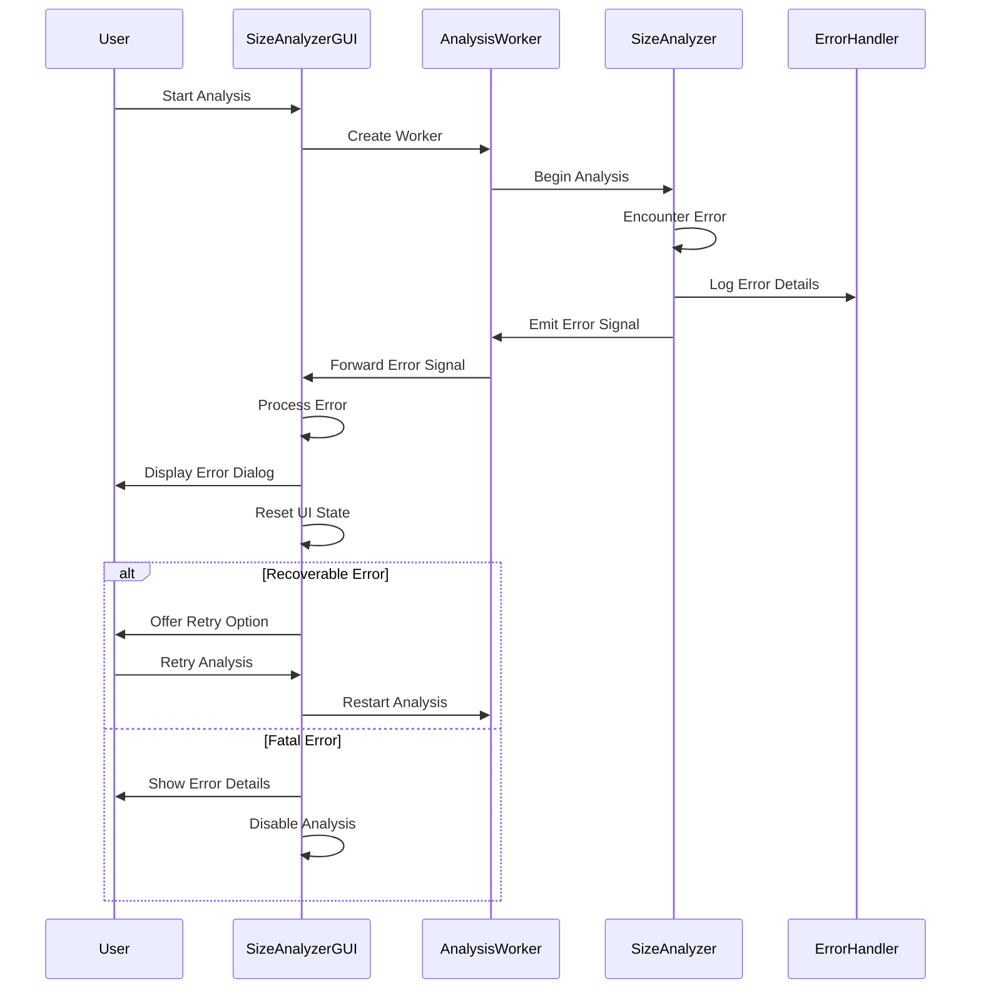
```mermaid
sequenceDiagram
    participant User
    participant GUI as SizeAnalyzerGUI
    participant Worker as AnalysisWorker
    participant Core as SizeAnalyzer
    participant Error as ErrorHandler
    
    User->>GUI: Start Analysis
    GUI->>Worker: Create Worker
    Worker->>Core: Begin Analysis
    
    Core->>Core: Encounter Error
    Core->>Error: Log Error Details
    Core->>Worker: Emit Error Signal
    Worker->>GUI: Forward Error Signal
    
    GUI->>GUI: Process Error
    GUI->>User: Display Error Dialog
    GUI->>GUI: Reset UI State
    
    alt Recoverable Error
        GUI->>User: Offer Retry Option
        User->>GUI: Retry Analysis
        GUI->>Worker: Restart Analysis
    else Fatal Error
        GUI->>User: Show Error Details
        GUI->>GUI: Disable Analysis
    end
```

---

## Class Diagrams

### Core Classes Structure

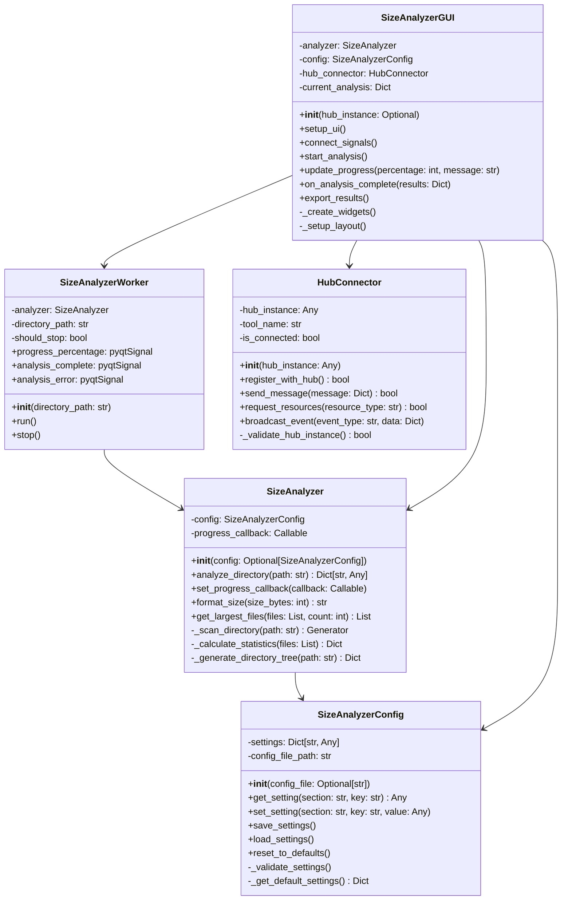
```mermaid
classDiagram
    class SizeAnalyzer {
        -config: SizeAnalyzerConfig
        -progress_callback: Callable
        +__init__(config: Optional[SizeAnalyzerConfig])
        +analyze_directory(path: str) Dict[str, Any]
        +set_progress_callback(callback: Callable)
        +format_size(size_bytes: int) str
        +get_largest_files(files: List, count: int) List
        -_scan_directory(path: str) Generator
        -_calculate_statistics(files: List) Dict
        -_generate_directory_tree(path: str) Dict
    }
    
    class SizeAnalyzerWorker {
        -analyzer: SizeAnalyzer
        -directory_path: str
        -should_stop: bool
        +__init__(directory_path: str)
        +run()
        +stop()
        +progress_percentage: pyqtSignal
        +analysis_complete: pyqtSignal
        +analysis_error: pyqtSignal
    }
    
    class SizeAnalyzerConfig {
        -settings: Dict[str, Any]
        -config_file_path: str
        +__init__(config_file: Optional[str])
        +get_setting(section: str, key: str) Any
        +set_setting(section: str, key: str, value: Any)
        +save_settings()
        +load_settings()
        +reset_to_defaults()
        -_validate_settings()
        -_get_default_settings() Dict
    }
    
    class SizeAnalyzerGUI {
        -analyzer: SizeAnalyzer
        -config: SizeAnalyzerConfig
        -hub_connector: HubConnector
        -current_analysis: Dict
        +__init__(hub_instance: Optional)
        +setup_ui()
        +connect_signals()
        +start_analysis()
        +update_progress(percentage: int, message: str)
        +on_analysis_complete(results: Dict)
        +export_results()
        -_create_widgets()
        -_setup_layout()
    }
    
    class HubConnector {
        -hub_instance: Any
        -tool_name: str
        -is_connected: bool
        +__init__(hub_instance: Any)
        +register_with_hub() bool
        +send_message(message: Dict) bool
        +request_resources(resource_type: str) bool
        +broadcast_event(event_type: str, data: Dict)
        -_validate_hub_instance() bool
    }
    
    SizeAnalyzer --> SizeAnalyzerConfig
    SizeAnalyzerWorker --> SizeAnalyzer
    SizeAnalyzerGUI --> SizeAnalyzer
    SizeAnalyzerGUI --> SizeAnalyzerConfig
    SizeAnalyzerGUI --> HubConnector
    SizeAnalyzerGUI --> SizeAnalyzerWorker
```

### Inheritance Hierarchy

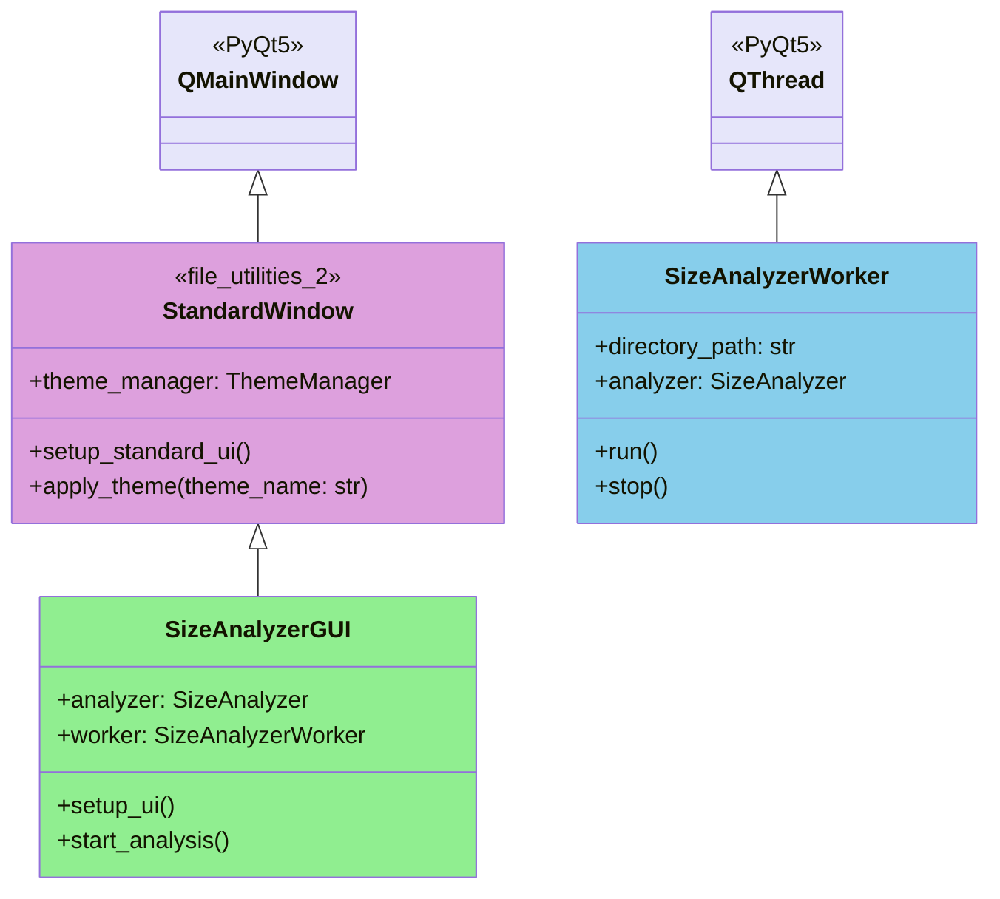
```mermaid
classDiagram
    class QMainWindow {
        <<PyQt5>>
    }
    
    class QThread {
        <<PyQt5>>
    }
    
    class StandardWindow {
        <<file_utilities_2>>
        +theme_manager: ThemeManager
        +setup_standard_ui()
        +apply_theme(theme_name: str)
    }
    
    class SizeAnalyzerGUI {
        +analyzer: SizeAnalyzer
        +worker: SizeAnalyzerWorker
        +setup_ui()
        +start_analysis()
    }
    
    class SizeAnalyzerWorker {
        +directory_path: str
        +analyzer: SizeAnalyzer
        +run()
        +stop()
    }
    
    QMainWindow <|-- StandardWindow
    StandardWindow <|-- SizeAnalyzerGUI
    QThread <|-- SizeAnalyzerWorker
    
    style QMainWindow fill:#E6E6FA
    style QThread fill:#E6E6FA
    style StandardWindow fill:#DDA0DD
    style SizeAnalyzerGUI fill:#90EE90
    style SizeAnalyzerWorker fill:#87CEEB
```

---

## Migration Architecture

### Migration Process Flow

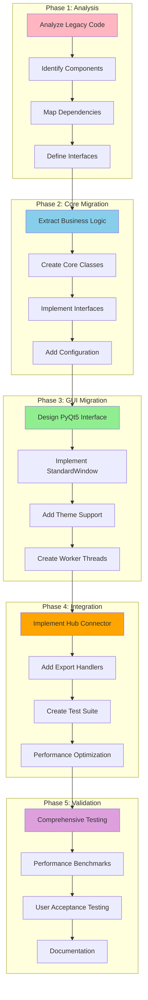
```mermaid
flowchart TD
    subgraph "Phase 1: Analysis"
        A1[Analyze Legacy Code]
        A2[Identify Components]
        A3[Map Dependencies]
        A4[Define Interfaces]
    end
    
    subgraph "Phase 2: Core Migration"
        B1[Extract Business Logic]
        B2[Create Core Classes]
        B3[Implement Interfaces]
        B4[Add Configuration]
    end
    
    subgraph "Phase 3: GUI Migration"
        C1[Design PyQt5 Interface]
        C2[Implement StandardWindow]
        C3[Add Theme Support]
        C4[Create Worker Threads]
    end
    
    subgraph "Phase 4: Integration"
        D1[Implement Hub Connector]
        D2[Add Export Handlers]
        D3[Create Test Suite]
        D4[Performance Optimization]
    end
    
    subgraph "Phase 5: Validation"
        E1[Comprehensive Testing]
        E2[Performance Benchmarks]
        E3[User Acceptance Testing]
        E4[Documentation]
    end
    
    A1 --> A2 --> A3 --> A4
    A4 --> B1
    B1 --> B2 --> B3 --> B4
    B4 --> C1
    C1 --> C2 --> C3 --> C4
    C4 --> D1
    D1 --> D2 --> D3 --> D4
    D4 --> E1
    E1 --> E2 --> E3 --> E4
    
    style A1 fill:#FFB6C1
    style B1 fill:#87CEEB
    style C1 fill:#90EE90
    style D1 fill:#FFA500
    style E1 fill:#DDA0DD
```

### Component Migration Mapping

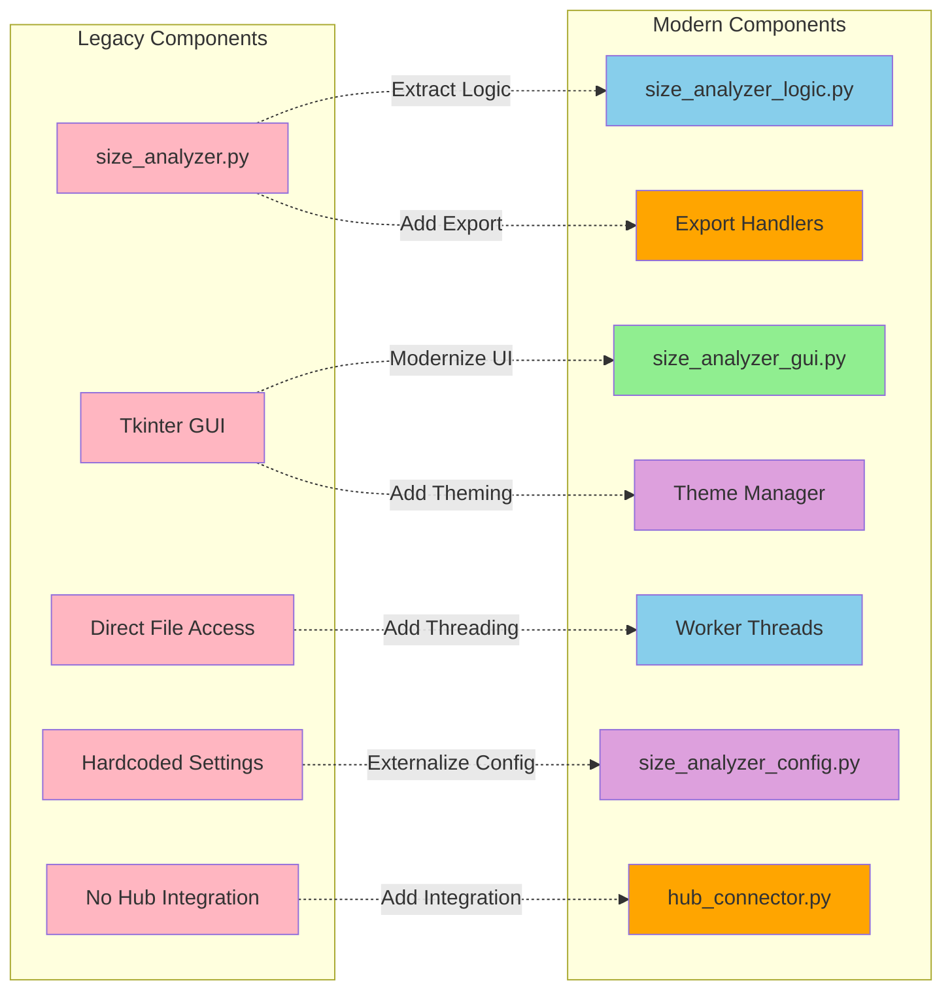
```mermaid
graph LR
    subgraph "Legacy Components"
        L1[size_analyzer.py]
        L2[Tkinter GUI]
        L3[Direct File Access]
        L4[Hardcoded Settings]
        L5[No Hub Integration]
    end
    
    subgraph "Modern Components"
        M1[size_analyzer_logic.py]
        M2[size_analyzer_gui.py]
        M3[Worker Threads]
        M4[size_analyzer_config.py]
        M5[hub_connector.py]
        M6[Theme Manager]
        M7[Export Handlers]
    end
    
    L1 -.->|Extract Logic| M1
    L2 -.->|Modernize UI| M2
    L3 -.->|Add Threading| M3
    L4 -.->|Externalize Config| M4
    L5 -.->|Add Integration| M5
    L2 -.->|Add Theming| M6
    L1 -.->|Add Export| M7
    
    style L1 fill:#FFB6C1
    style L2 fill:#FFB6C1
    style L3 fill:#FFB6C1
    style L4 fill:#FFB6C1
    style L5 fill:#FFB6C1
    style M1 fill:#87CEEB
    style M2 fill:#90EE90
    style M3 fill:#87CEEB
    style M4 fill:#DDA0DD
    style M5 fill:#FFA500
    style M6 fill:#DDA0DD
    style M7 fill:#FFA500
```

---

## Hub Integration Architecture

### Hub Communication Architecture

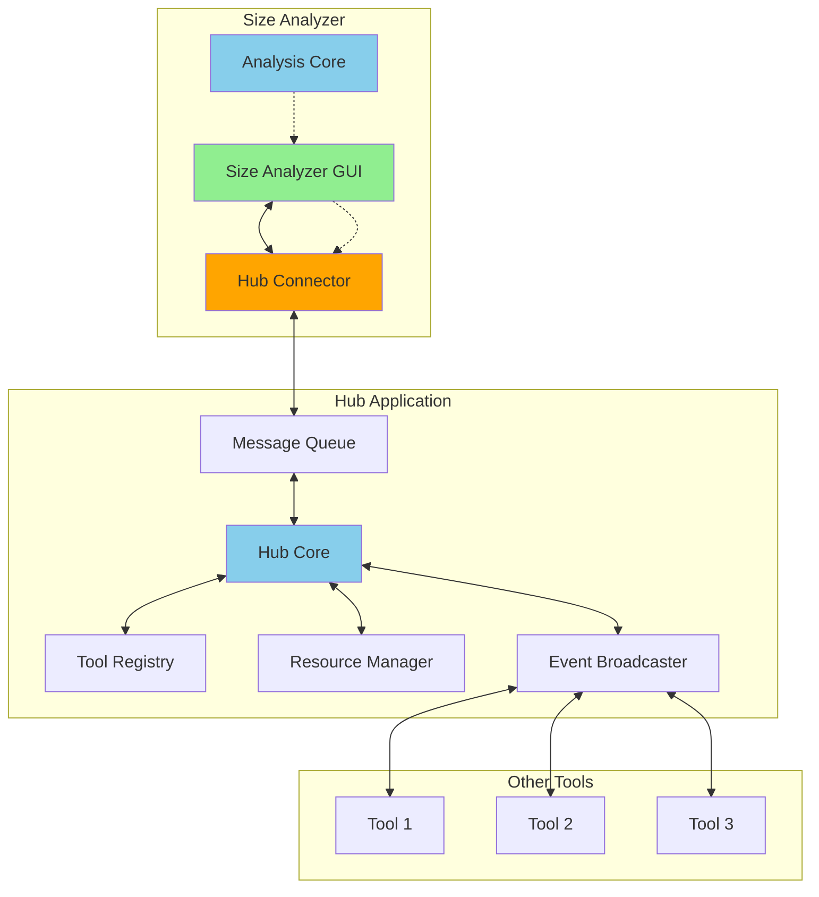
```mermaid
graph TB
    subgraph "Hub Application"
        HubCore[Hub Core]
        ToolRegistry[Tool Registry]
        ResourceManager[Resource Manager]
        EventBroadcaster[Event Broadcaster]
        MessageQueue[Message Queue]
    end
    
    subgraph "Size Analyzer"
        SAGUI[Size Analyzer GUI]
        HubConnector[Hub Connector]
        AnalysisCore[Analysis Core]
    end
    
    subgraph "Other Tools"
        Tool1[Tool 1]
        Tool2[Tool 2]
        Tool3[Tool 3]
    end
    
    SAGUI <--> HubConnector
    HubConnector <--> MessageQueue
    MessageQueue <--> HubCore
    
    HubCore <--> ToolRegistry
    HubCore <--> ResourceManager
    HubCore <--> EventBroadcaster
    
    EventBroadcaster <--> Tool1
    EventBroadcaster <--> Tool2
    EventBroadcaster <--> Tool3
    
    AnalysisCore -.-> SAGUI
    SAGUI -.-> HubConnector
    
    style SAGUI fill:#90EE90
    style HubConnector fill:#FFA500
    style HubCore fill:#87CEEB
    style AnalysisCore fill:#87CEEB
```

### Resource Coordination Flow

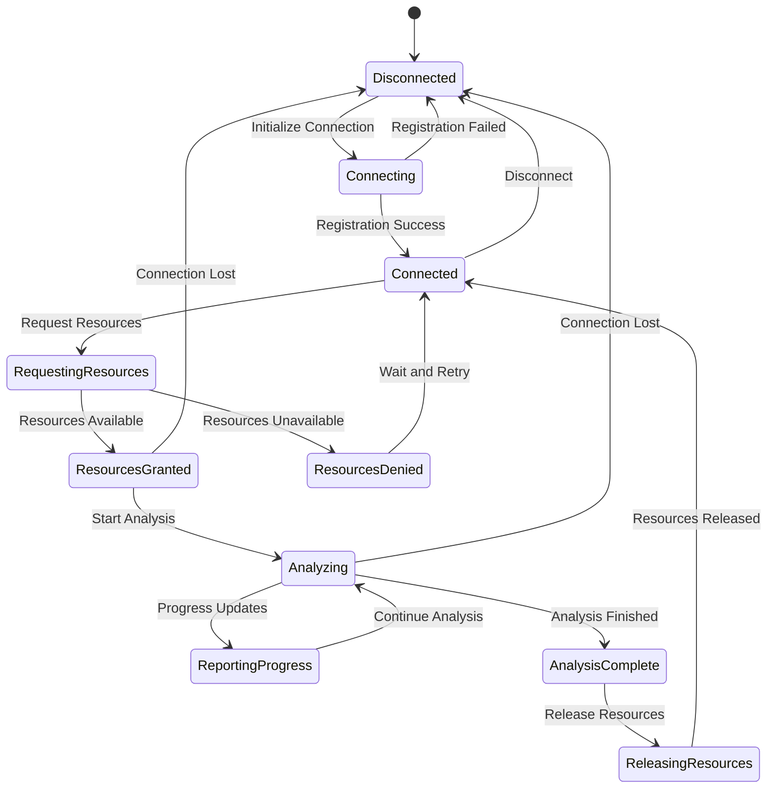
```mermaid
stateDiagram-v2
    [*] --> Disconnected
    Disconnected --> Connecting: Initialize Connection
    Connecting --> Connected: Registration Success
    Connecting --> Disconnected: Registration Failed
    
    Connected --> RequestingResources: Request Resources
    RequestingResources --> ResourcesGranted: Resources Available
    RequestingResources --> ResourcesDenied: Resources Unavailable
    ResourcesDenied --> Connected: Wait and Retry
    
    ResourcesGranted --> Analyzing: Start Analysis
    Analyzing --> ReportingProgress: Progress Updates
    ReportingProgress --> Analyzing: Continue Analysis
    Analyzing --> AnalysisComplete: Analysis Finished
    
    AnalysisComplete --> ReleasingResources: Release Resources
    ReleasingResources --> Connected: Resources Released
    
    Connected --> Disconnected: Disconnect
    ResourcesGranted --> Disconnected: Connection Lost
    Analyzing --> Disconnected: Connection Lost
```

---

## Threading Model

### Thread Architecture

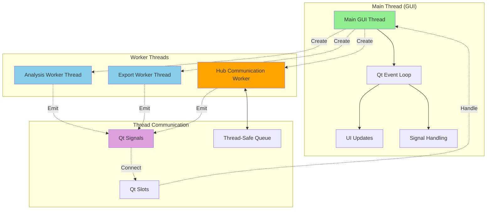
```mermaid
graph TB
    subgraph "Main Thread (GUI)"
        MainGUI[Main GUI Thread]
        EventLoop[Qt Event Loop]
        UIUpdates[UI Updates]
        SignalHandling[Signal Handling]
    end
    
    subgraph "Worker Threads"
        AnalysisWorker[Analysis Worker Thread]
        ExportWorker[Export Worker Thread]
        HubWorker[Hub Communication Worker]
    end
    
    subgraph "Thread Communication"
        Signals[Qt Signals]
        Slots[Qt Slots]
        Queue[Thread-Safe Queue]
    end
    
    MainGUI --> EventLoop
    EventLoop --> UIUpdates
    EventLoop --> SignalHandling
    
    MainGUI -.->|Create| AnalysisWorker
    MainGUI -.->|Create| ExportWorker
    MainGUI -.->|Create| HubWorker
    
    AnalysisWorker -.->|Emit| Signals
    ExportWorker -.->|Emit| Signals
    HubWorker -.->|Emit| Signals
    
    Signals -.->|Connect| Slots
    Slots -.->|Handle| MainGUI
    
    HubWorker <--> Queue
    
    style MainGUI fill:#90EE90
    style AnalysisWorker fill:#87CEEB
    style ExportWorker fill:#87CEEB
    style HubWorker fill:#FFA500
    style Signals fill:#DDA0DD
```

### Thread Safety Patterns

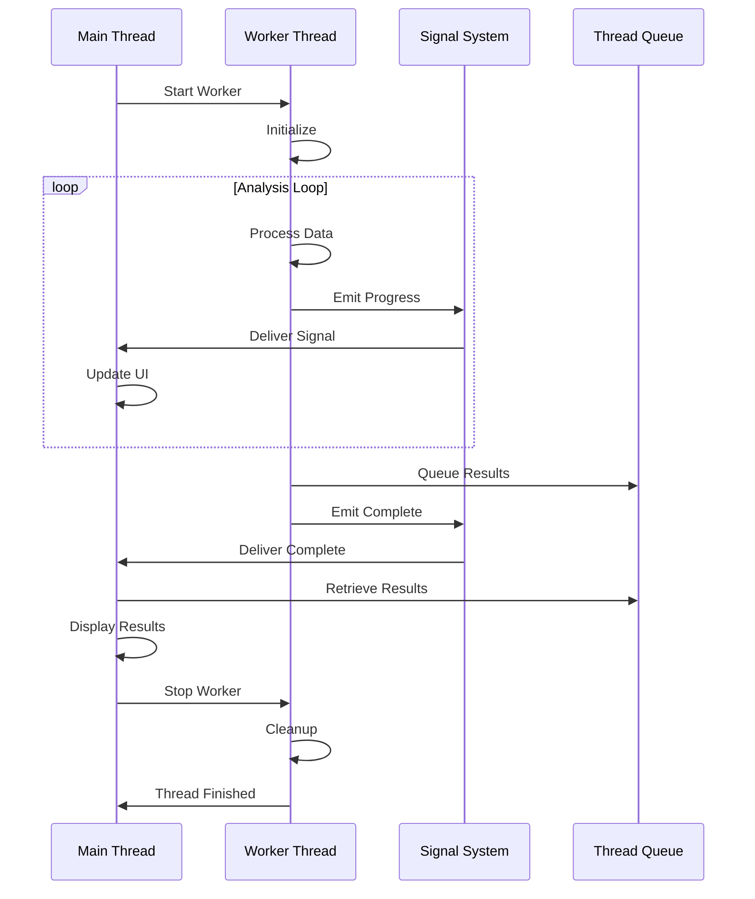
```mermaid
sequenceDiagram
    participant Main as Main Thread
    participant Worker as Worker Thread
    participant Signal as Signal System
    participant Queue as Thread Queue
    
    Main->>Worker: Start Worker
    Worker->>Worker: Initialize
    
    loop Analysis Loop
        Worker->>Worker: Process Data
        Worker->>Signal: Emit Progress
        Signal->>Main: Deliver Signal
        Main->>Main: Update UI
    end
    
    Worker->>Queue: Queue Results
    Worker->>Signal: Emit Complete
    Signal->>Main: Deliver Complete
    Main->>Queue: Retrieve Results
    Main->>Main: Display Results
    
    Main->>Worker: Stop Worker
    Worker->>Worker: Cleanup
    Worker->>Main: Thread Finished
```

---

## Configuration Architecture

### Configuration System Structure

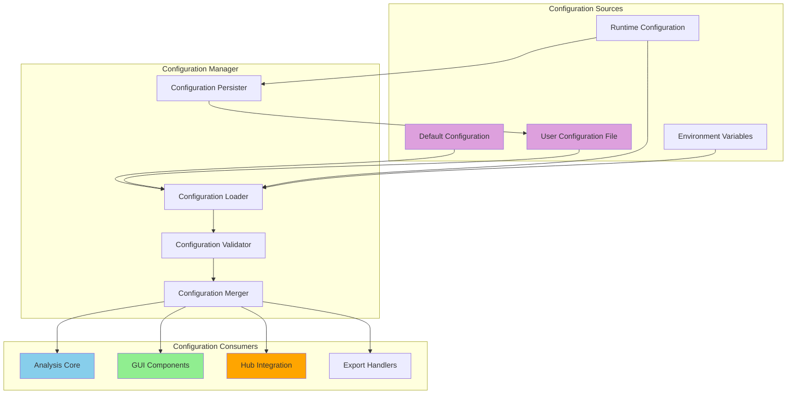
```mermaid
graph TB
    subgraph "Configuration Sources"
        DefaultConfig[Default Configuration]
        UserConfig[User Configuration File]
        RuntimeConfig[Runtime Configuration]
        EnvironmentVars[Environment Variables]
    end
    
    subgraph "Configuration Manager"
        ConfigLoader[Configuration Loader]
        ConfigValidator[Configuration Validator]
        ConfigMerger[Configuration Merger]
        ConfigPersister[Configuration Persister]
    end
    
    subgraph "Configuration Consumers"
        AnalysisCore[Analysis Core]
        GUIComponents[GUI Components]
        HubIntegration[Hub Integration]
        ExportHandlers[Export Handlers]
    end
    
    DefaultConfig --> ConfigLoader
    UserConfig --> ConfigLoader
    RuntimeConfig --> ConfigLoader
    EnvironmentVars --> ConfigLoader
    
    ConfigLoader --> ConfigValidator
    ConfigValidator --> ConfigMerger
    ConfigMerger --> AnalysisCore
    ConfigMerger --> GUIComponents
    ConfigMerger --> HubIntegration
    ConfigMerger --> ExportHandlers
    
    RuntimeConfig --> ConfigPersister
    ConfigPersister --> UserConfig
    
    style DefaultConfig fill:#DDA0DD
    style UserConfig fill:#DDA0DD
    style AnalysisCore fill:#87CEEB
    style GUIComponents fill:#90EE90
    style HubIntegration fill:#FFA500
```

### Configuration Hierarchy

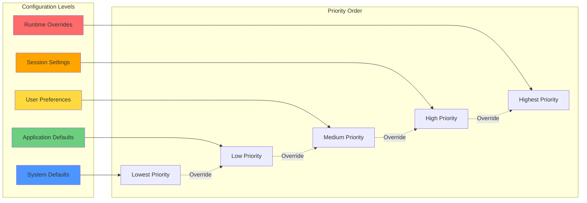
```mermaid
graph LR
    subgraph "Configuration Levels"
        L1[System Defaults]
        L2[Application Defaults]
        L3[User Preferences]
        L4[Session Settings]
        L5[Runtime Overrides]
    end
    
    subgraph "Priority Order"
        P1[Lowest Priority]
        P2[Low Priority]
        P3[Medium Priority]
        P4[High Priority]
        P5[Highest Priority]
    end
    
    L1 --> P1
    L2 --> P2
    L3 --> P3
    L4 --> P4
    L5 --> P5
    
    P1 -.->|Override| P2
    P2 -.->|Override| P3
    P3 -.->|Override| P4
    P4 -.->|Override| P5
    
    style L5 fill:#FF6B6B
    style L4 fill:#FFA500
    style L3 fill:#FFD93D
    style L2 fill:#6BCF7F
    style L1 fill:#4D96FF
```

This comprehensive set of architecture diagrams provides visual representations of all major aspects of the Size Analyzer migration, from high-level system architecture to detailed component interactions, threading models, and configuration management. These diagrams serve as essential references for understanding the system design and supporting future development and maintenance activities.