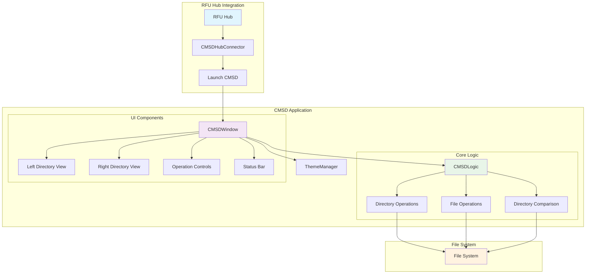
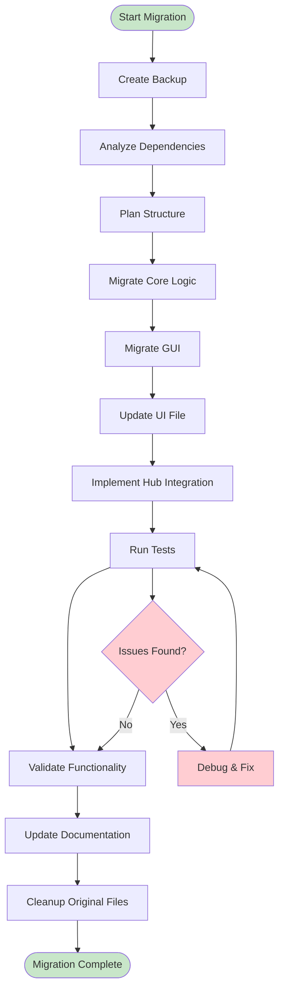

# CMSD Comprehensive Migration & Integration Plan

## 📋 Executive Summary

This document outlines the comprehensive migration plan for moving `cmsd.py` and `cmsd.ui` from the root directory into the `file_utilities_2` folder with full PyQt5 compatibility and RFU Hub integration. The CMSD (Content Management System Directory) tool is a file comparison and management utility that provides dual directory views for comparing and moving files between directories.

**Migration Objectives:**
- ✅ Migrate CMSD to `file_utilities_2` package structure
- ✅ Convert from legacy BaseWindow to StandardWindow architecture
- ✅ Integrate with RFU Hub system as a menu item
- ✅ Ensure full PyQt5 compatibility and modern UI standards
- ✅ Maintain all existing functionality while improving architecture
- ✅ Implement comprehensive testing and validation framework

---

## 🎯 Migration Scope & Requirements

### Current State Analysis
```
Root Directory Files:
├── cmsd.py (304 lines) - Main application logic
└── cmsd.ui (323 lines) - Qt Designer UI file

Dependencies:
├── PyQt5.QtGui (QStandardItemModel, QStandardItem)
├── PyQt5.QtWidgets (QApplication)
├── PyQt5.uic (UI loading)
├── gui.common.base_window (BaseWindow - LEGACY)
└── gui.common.dialogs (get_existing_directory - LEGACY)
```

### Target State Architecture
```
file_utilities_2/
├── core/
│   └── cmsd_logic.py (Business logic)
├── gui/
│   ├── cmsd_gui.py (GUI implementation)
│   └── cmsd.ui (Migrated UI file)
├── integration/
│   └── cmsd_connector.py (Hub integration)
└── tests/
    ├── test_cmsd_core.py
    ├── test_cmsd_gui.py
    └── test_cmsd_integration.py
```

---

## 📊 Detailed Migration Plan

### Phase 1: Pre-Migration Analysis & Backup
**Status:** ⏳ Pending

#### 1.1 Create Backup Structure
```bash
backup/cmsd_migration/YYYY-MM-DD_HH-MM-SS/
├── cmsd.py (original)
├── cmsd.ui (original)
├── backup_manifest.txt
└── dependency_analysis.json
```

#### 1.2 Dependency Analysis
- **PyQt5 Components:** ✅ Compatible
  - `QStandardItemModel`, `QStandardItem` → Modern PyQt5
  - `QApplication` → Standard application framework
  - `uic.loadUi` → UI file loading mechanism

- **Legacy Dependencies:** ⚠️ Requires Migration
  - `gui.common.base_window.BaseWindow` → `file_utilities_2.gui.standard_window.StandardWindow`
  - `gui.common.dialogs.get_existing_directory` → `StandardWindow.get_directory_path()`

#### 1.3 Functionality Mapping
| Current Feature | Migration Target | Implementation Notes |
|----------------|------------------|---------------------|
| Dual directory views | Core logic + GUI | Maintain QStandardItemModel approach |
| File selection/management | Core logic | Extract to business logic layer |
| Directory comparison | Core logic | Enhance with better algorithms |
| File operations (copy/delete) | Core logic | Add error handling and progress |
| Menu system | Hub integration | Convert to RFU Hub menu item |

---

### Phase 2: Directory Structure Planning
**Status:** ⏳ Pending

#### 2.1 Core Logic Structure
```python
# file_utilities_2/core/cmsd_logic.py
class CMSDLogic:
    """Business logic for Content Management System Directory operations."""
    
    def __init__(self):
        self.left_directory: str = "."
        self.right_directory: str = "."
        self.selected_files: List[str] = []
    
    def load_directory_contents(self, directory: str) -> List[str]
    def compare_directories(self) -> DirectoryComparison
    def copy_files(self, source_files: List[str], destination: str) -> OperationResult
    def delete_files(self, files: List[str]) -> OperationResult
    def get_directory_statistics(self, directory: str) -> DirectoryStats
```

#### 2.2 GUI Implementation Structure
```python
# file_utilities_2/gui/cmsd_gui.py
class CMSDWindow(StandardWindow):
    """CMSD GUI implementation using StandardWindow architecture."""
    
    def __init__(self):
        super().__init__(title="Content Management System Directory")
        self.cmsd_logic = CMSDLogic()
        self._setup_ui()
        self._connect_signals()
    
    def _setup_ui(self) -> None
    def _connect_signals(self) -> None
    def _update_directory_views(self) -> None
    def _handle_file_selection(self) -> None
```

#### 2.3 Hub Integration Structure
```python
# file_utilities_2/integration/cmsd_connector.py
class CMSDHubConnector:
    """Hub integration for CMSD utility."""
    
    @staticmethod
    def get_menu_info() -> dict
    
    @staticmethod
    def launch_utility(parent=None) -> CMSDWindow
    
    @staticmethod
    def get_utility_info() -> dict
```

---

### Phase 3: Core Logic Migration
**Status:** ⏳ Pending

#### 3.1 Extract Business Logic
- **Directory Management**
  - Extract directory loading logic from GUI
  - Implement robust error handling
  - Add progress reporting for large directories

- **File Operations**
  - Separate file operations from UI logic
  - Add operation validation and safety checks
  - Implement atomic operations with rollback

- **Comparison Engine**
  - Enhance directory comparison algorithms
  - Add file metadata comparison options
  - Implement filtering and search capabilities

#### 3.2 Enhanced Features
```python
class DirectoryComparison:
    """Enhanced directory comparison results."""
    only_left: List[str]
    only_right: List[str]
    common: List[str]
    different_sizes: List[Tuple[str, int, int]]
    different_dates: List[Tuple[str, datetime, datetime]]

class OperationResult:
    """Operation result with detailed feedback."""
    success: bool
    processed_files: List[str]
    failed_files: List[Tuple[str, str]]  # (file, error)
    total_bytes: int
    duration: float
```

---

### Phase 4: GUI Migration & PyQt5 Conversion
**Status:** ⏳ Pending

#### 4.1 StandardWindow Migration
```python
# Migration from BaseWindow to StandardWindow
class CMSDWindow(StandardWindow):
    def __init__(self):
        super().__init__(
            title="Content Management System Directory",
            icon_path=self._get_cmsd_icon()
        )
        self.cmsd_logic = CMSDLogic()
        self._setup_cmsd_ui()
        self._apply_cmsd_theme()
```

#### 4.2 UI Component Modernization
- **Replace Legacy Dialogs**
  ```python
  # Old: gui.common.dialogs.get_existing_directory
  # New: self.get_directory_path("Select Directory")
  ```

- **Enhanced File Views**
  - Implement custom QStandardItemModel with metadata
  - Add file icons and size information
  - Implement drag-and-drop functionality

- **Progress Integration**
  - Add progress bars for file operations
  - Implement status updates during operations
  - Add cancellation support for long operations

#### 4.3 Theme Integration
```python
def _apply_cmsd_theme(self):
    """Apply CMSD-specific theming."""
    ThemeManager.apply_utility_window_theme(self)
    
    # Custom styling for dual-pane layout
    self.setStyleSheet(f"""
        QListView {{
            border: 1px solid {Colors.BORDER};
            background-color: {Colors.INPUT_BACKGROUND};
            selection-background-color: {Colors.ACCENT_PRIMARY};
        }}
        
        QGroupBox {{
            font-weight: bold;
            border: 2px solid {Colors.BORDER};
            margin: {Spacing.MEDIUM}px 0px;
            padding-top: {Spacing.SMALL}px;
        }}
    """)
```

---

### Phase 5: UI File Migration & Standardization
**Status:** ⏳ Pending

#### 5.1 UI File Analysis
Current `cmsd.ui` structure:
- **Main Window:** 800x600 with dual QListView components
- **Controls:** Filter input, selection buttons, operation radio buttons
- **Menu System:** File menu with directory selection actions

#### 5.2 UI Modernization Plan
```xml
<!-- Enhanced UI structure -->
<ui version="4.0">
 <class>CMSDMainWindow</class>
 <widget class="QMainWindow" name="CMSDMainWindow">
  <!-- Modern layout with improved spacing -->
  <widget class="QWidget" name="centralwidget">
   <!-- Header section with title and controls -->
   <widget class="QGroupBox" name="directoryGroup">
    <property name="title">
     <string>Directory Comparison</string>
    </property>
    <!-- Left and right directory panels -->
   </widget>
   
   <!-- Operation controls section -->
   <widget class="QGroupBox" name="operationsGroup">
    <property name="title">
     <string>File Operations</string>
    </property>
    <!-- Enhanced operation buttons with icons -->
   </widget>
  </widget>
 </widget>
</ui>
```

#### 5.3 UI Enhancement Features
- **Responsive Layout:** Implement proper layout managers
- **Icon Integration:** Add file type icons and operation icons
- **Accessibility:** Improve keyboard navigation and screen reader support
- **Modern Controls:** Replace basic buttons with enhanced styled components

---

### Phase 6: Hub Integration Implementation
**Status:** ⏳ Pending

#### 6.1 Hub Connector Implementation
```python
# file_utilities_2/integration/cmsd_connector.py
class CMSDHubConnector:
    """Hub integration for CMSD utility."""
    
    @staticmethod
    def get_menu_info() -> dict:
        """Get menu information for RFU Hub."""
        return {
            'name': 'Content Management System Directory',
            'description': 'Compare and manage files between two directories',
            'category': 'File Management',
            'icon': 'cmsd.png',
            'shortcut': 'Ctrl+Shift+C',
            'tooltip': 'Launch CMSD for directory comparison and file management'
        }
    
    @staticmethod
    def launch_utility(parent=None) -> 'CMSDWindow':
        """Launch CMSD utility from hub."""
        from file_utilities_2.gui.cmsd_gui import CMSDWindow
        window = CMSDWindow()
        window.show()
        return window
    
    @staticmethod
    def get_utility_info() -> dict:
        """Get detailed utility information."""
        return {
            'version': '2.0.0',
            'author': 'File Utilities Team',
            'last_updated': '2025-07-28',
            'features': [
                'Dual directory comparison',
                'File selection and management',
                'Batch file operations',
                'Directory synchronization tools'
            ]
        }
```

#### 6.2 Hub Registration
```python
# Update file_utilities_2/integration/hub_connector.py
def get_available_utilities():
    """Get list of all available utilities."""
    utilities = [
        # ... existing utilities ...
        {
            'id': 'cmsd',
            'connector': CMSDHubConnector,
            'module': 'file_utilities_2.integration.cmsd_connector'
        }
    ]
    return utilities
```

---

### Phase 7: Import Path Updates & Module Initialization
**Status:** ⏳ Pending

#### 7.1 Package Integration
```python
# Update file_utilities_2/__init__.py
from .core.cmsd_logic import CMSDLogic
from .gui.cmsd_gui import CMSDWindow
from .integration.cmsd_connector import CMSDHubConnector

__all__ = [
    # ... existing exports ...
    "CMSDLogic",
    "CMSDWindow", 
    "CMSDHubConnector",
]
```

#### 7.2 Module Initialization Files
```python
# file_utilities_2/core/__init__.py
from .cmsd_logic import CMSDLogic

# file_utilities_2/gui/__init__.py  
from .cmsd_gui import CMSDWindow

# file_utilities_2/integration/__init__.py
from .cmsd_connector import CMSDHubConnector
```

#### 7.3 Import Path Migration
| Legacy Import | New Import | Notes |
|---------------|------------|-------|
| `from gui.common.base_window import BaseWindow` | `from file_utilities_2.gui.standard_window import StandardWindow` | Architecture change |
| `from gui.common.dialogs import get_existing_directory` | `self.get_directory_path()` | Method call on StandardWindow |
| Direct UI loading | `from file_utilities_2.gui import cmsd_gui` | Package-based import |

---

### Phase 8: Testing Framework Setup
**Status:** ⏳ Pending

#### 8.1 Core Logic Tests
```python
# file_utilities_2/tests/test_cmsd_core.py
class TestCMSDLogic(unittest.TestCase):
    """Test CMSD core logic functionality."""
    
    def setUp(self):
        self.cmsd = CMSDLogic()
        self.test_dir_left = tempfile.mkdtemp()
        self.test_dir_right = tempfile.mkdtemp()
    
    def test_directory_loading(self):
        """Test directory content loading."""
        
    def test_directory_comparison(self):
        """Test directory comparison functionality."""
        
    def test_file_operations(self):
        """Test file copy/move/delete operations."""
        
    def test_error_handling(self):
        """Test error handling in various scenarios."""
```

#### 8.2 GUI Tests
```python
# file_utilities_2/tests/test_cmsd_gui.py
class TestCMSDGUI(unittest.TestCase):
    """Test CMSD GUI functionality."""
    
    def setUp(self):
        self.app = QApplication.instance() or QApplication([])
        self.window = CMSDWindow()
    
    def test_window_initialization(self):
        """Test window setup and initialization."""
        
    def test_ui_components(self):
        """Test UI component functionality."""
        
    def test_signal_connections(self):
        """Test signal/slot connections."""
        
    def test_theme_application(self):
        """Test theme and styling application."""
```

#### 8.3 Integration Tests
```python
# file_utilities_2/tests/test_cmsd_integration.py
class TestCMSDIntegration(unittest.TestCase):
    """Test CMSD hub integration."""
    
    def test_hub_connector(self):
        """Test hub connector functionality."""
        
    def test_menu_integration(self):
        """Test menu integration with RFU Hub."""
        
    def test_utility_launch(self):
        """Test utility launch from hub."""
```

---

### Phase 9: Migration Validation & Testing
**Status:** ⏳ Pending

#### 9.1 Functionality Validation
- **Core Features Testing**
  - Directory loading and display
  - File selection and management
  - Directory comparison accuracy
  - File operation reliability

- **UI/UX Validation**
  - Window layout and responsiveness
  - Theme application and consistency
  - User interaction flows
  - Error message display

- **Integration Validation**
  - Hub menu integration
  - Utility launch mechanism
  - Cross-component communication

#### 9.2 Performance Testing
```python
# Performance benchmarks
def test_large_directory_performance():
    """Test performance with large directories (10k+ files)."""
    
def test_file_operation_performance():
    """Test file operation performance and progress reporting."""
    
def test_memory_usage():
    """Test memory usage during extended operations."""
```

#### 9.3 Regression Testing
- **Backward Compatibility**
  - Verify all original functionality preserved
  - Test edge cases and error conditions
  - Validate file operation safety

- **Cross-Platform Testing**
  - Windows path handling
  - File permission management
  - UI rendering consistency

---

### Phase 10: Documentation & Cleanup
**Status:** ⏳ Pending

#### 10.1 API Documentation
```python
"""
CMSD API Documentation

Core Classes:
- CMSDLogic: Business logic for directory operations
- CMSDWindow: Main GUI window implementation
- CMSDHubConnector: Hub integration interface

Usage Examples:
```python
# Standalone usage
from file_utilities_2.gui.cmsd_gui import CMSDWindow
window = CMSDWindow()
window.show()

# Hub integration
from file_utilities_2.integration.cmsd_connector import CMSDHubConnector
window = CMSDHubConnector.launch_utility()
```
"""
```

#### 10.2 Migration Documentation
- **Migration Summary Report**
- **Breaking Changes Documentation**
- **Upgrade Guide for Users**
- **Developer Integration Guide**

#### 10.3 Cleanup Tasks
- Remove original files from root directory
- Update any remaining references
- Clean up temporary migration files
- Update project documentation

---

### Phase 11: Final Verification & Rollback Preparation
**Status:** ⏳ Pending

#### 11.1 Final Validation Checklist
- [ ] All functionality migrated and tested
- [ ] Hub integration working correctly
- [ ] No import errors or missing dependencies
- [ ] UI/UX consistent with other utilities
- [ ] Performance meets or exceeds original
- [ ] Documentation complete and accurate

#### 11.2 Rollback Procedures
```bash
# Rollback script preparation
backup/cmsd_migration/rollback.sh:
#!/bin/bash
# Restore original files
cp backup/cmsd_migration/YYYY-MM-DD_HH-MM-SS/cmsd.py ./
cp backup/cmsd_migration/YYYY-MM-DD_HH-MM-SS/cmsd.ui ./

# Remove migrated files
rm -rf file_utilities_2/core/cmsd_logic.py
rm -rf file_utilities_2/gui/cmsd_gui.py
rm -rf file_utilities_2/gui/cmsd.ui
rm -rf file_utilities_2/integration/cmsd_connector.py
rm -rf file_utilities_2/tests/test_cmsd_*
```

#### 11.3 Success Criteria
- ✅ CMSD launches successfully from RFU Hub
- ✅ All directory operations function correctly
- ✅ UI is consistent with other file_utilities_2 tools
- ✅ No performance degradation
- ✅ All tests pass
- ✅ Documentation is complete

---

## 🔧 Technical Implementation Details

### Mermaid Architecture Diagram



### Migration Flow Diagram



---

## 📋 Risk Assessment & Mitigation

### High Risk Items
1. **UI File Compatibility** - Risk: UI file may not load correctly
   - Mitigation: Test UI loading early, have fallback programmatic UI
   
2. **File Operation Safety** - Risk: Data loss during file operations
   - Mitigation: Implement atomic operations, comprehensive testing
   
3. **Hub Integration Complexity** - Risk: Integration issues with RFU Hub
   - Mitigation: Follow established patterns, thorough integration testing

### Medium Risk Items
1. **Performance Degradation** - Risk: Slower performance after migration
   - Mitigation: Performance benchmarking, optimization if needed
   
2. **Theme Consistency** - Risk: UI doesn't match other utilities
   - Mitigation: Use StandardWindow and ThemeManager consistently

### Low Risk Items
1. **Import Path Issues** - Risk: Missing imports after migration
   - Mitigation: Comprehensive import testing, clear documentation

---

## 📅 Timeline Estimate

| Phase | Estimated Duration | Dependencies |
|-------|-------------------|--------------|
| Pre-Migration Analysis | 2-3 hours | None |
| Directory Structure Planning | 1-2 hours | Phase 1 complete |
| Core Logic Migration | 4-6 hours | Phase 2 complete |
| GUI Migration | 6-8 hours | Phase 3 complete |
| UI File Migration | 2-3 hours | Phase 4 complete |
| Hub Integration | 3-4 hours | Phase 5 complete |
| Import Updates | 1-2 hours | Phase 6 complete |
| Testing Framework | 4-5 hours | Phase 