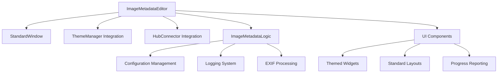
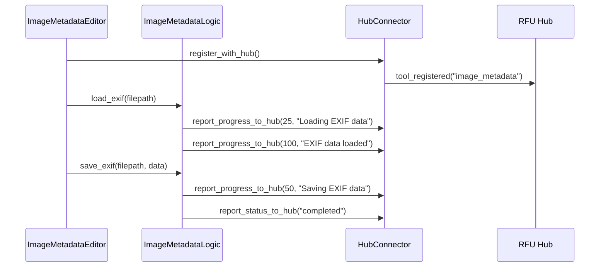

# Edit Image Metadata Migration & Integration Plan

## Executive Summary

This document outlines the comprehensive migration plan for moving `edit_image_metadata.py` and `edit_image_metadata.ui` from the root directory into the `file_utilities_2` directory structure. The migration includes converting the UI to full PyQt5 StandardWindow inheritance, ensuring visual and functional consistency with existing tools, refactoring the code architecture to align with established patterns, and integrating HubConnector functionality for centralized progress reporting and resource management.

## Current State Analysis

### Existing Implementation
- **Location**: Root directory (`edit_image_metadata.py`, `edit_image_metadata.ui`)
- **Architecture**: Uses BaseWindow inheritance from `gui.common.base_window`
- **UI Framework**: PyQt5 with custom UI file loading
- **Dependencies**: PIL, piexif, PyQt5, core.error_handler
- **Functionality**: EXIF metadata viewing and editing for JPEG/TIFF images

### Key Components
1. **ExifEditorLogic**: Core logic for EXIF data manipulation
2. **ImageMetadataEditor**: Main window class with BaseWindow inheritance
3. **Helper Functions**: `format_exif_value()`, `parse_exif_value()`, `get_tag_name()`
4. **UI Components**: Tree widget for metadata display, file browser, save functionality

## Target Architecture

### file_utilities_2 Integration Pattern
```
file_utilities_2/
├── core/
│   ├── image_metadata_config.py      # Configuration management
│   ├── image_metadata_logging.py     # Logging integration
│   └── image_metadata_logic.py       # Core EXIF logic
├── gui/
│   ├── image_metadata_gui.py         # StandardWindow-based GUI
│   └── image_metadata.ui             # Updated UI file
├── integration/
│   └── hub_connector.py              # Updated with image metadata support
└── tests/
    ├── test_image_metadata_core.py   # Core logic tests
    ├── test_image_metadata_gui.py    # GUI tests
    └── test_image_metadata_integration.py # Integration tests
```

## Migration Phases

### Phase 1: Pre-Migration Analysis & Backup ⏳

#### 1.1 Dependency Analysis
- **Current Imports Analysis**:
  ```python
  # External dependencies
  - PIL (Pillow) - Image processing
  - piexif - EXIF data manipulation
  - PyQt5 - GUI framework
  
  # Internal dependencies
  - core.error_handler - Error handling
  - gui.common.base_window - Base window class
  ```

- **Integration Points**:
  - Error handling system integration
  - Theme management compatibility
  - Configuration system alignment

#### 1.2 Backup Strategy
```bash
# Backup location: backup/image_metadata_migration/YYYY-MM-DD_HH-MM-SS/
backup/
└── image_metadata_migration/
    └── 2025-07-28_18-37-00/
        ├── edit_image_metadata.py
        ├── edit_image_metadata.ui
        ├── tests/test_edit_image_metadata.py
        └── backup_manifest.txt
```

#### 1.3 Functionality Documentation
- **Core Features**:
  - [x] EXIF data loading from JPEG/TIFF files
  - [x] Tree-based metadata display with IFD grouping
  - [x] In-place metadata editing
  - [x] Value type preservation and conversion
  - [x] File save with EXIF data preservation
  - [x] Error handling for invalid files/formats

### Phase 2: Architecture Planning & Design ⏳

#### 2.1 StandardWindow Architecture Design



#### 2.2 HubConnector Integration Points



#### 2.3 Core Logic Separation Strategy

**Current Monolithic Structure**:
```python
class ImageMetadataEditor(BaseWindow):
    # UI + Logic mixed together
    def __init__(self): # UI setup + logic initialization
    def browse_file(self): # UI interaction + file loading
    def save_changes(self): # UI interaction + file saving
```

**Target Modular Structure**:
```python
# file_utilities_2/core/image_metadata_logic.py
class ImageMetadataLogic(QObject):
    # Pure logic, no UI dependencies
    
# file_utilities_2/gui/image_metadata_gui.py  
class ImageMetadataEditor(StandardWindow):
    # Pure UI, delegates to logic
```

### Phase 3: Core Logic Migration ⏳

#### 3.1 Configuration Management Integration

**Target: `file_utilities_2/core/image_metadata_config.py`**
```python
class ImageMetadataConfig:
    """Configuration management for image metadata editor."""
    
    DEFAULT_CONFIG = {
        'supported_formats': ['JPEG', 'TIFF'],
        'max_file_size_mb': 100,
        'backup_on_save': True,
        'show_technical_tags': False,
        'auto_refresh': True,
        'theme_integration': True
    }
    
    def __init__(self):
        self.config_path = self._get_config_path()
        self.load_config()
    
    def _get_config_path(self) -> str:
        """Get configuration file path following file_utilities_2 pattern."""
        return os.path.join(
            os.path.expanduser("~/.rfu_config"),
            "image_metadata_config.json"
        )
```

#### 3.2 Logging Integration

**Target: `file_utilities_2/core/image_metadata_logging.py`**
```python
class ImageMetadataLogger:
    """Logging system integration for image metadata operations."""
    
    def __init__(self):
        self.logger = self._setup_logger()
    
    def _setup_logger(self):
        """Setup logger following file_utilities_2 patterns."""
        logger = logging.getLogger('file_utilities_2.image_metadata')
        # Configure with file_utilities_2 logging standards
        return logger
    
    def log_operation(self, operation: str, filepath: str, details: dict = None):
        """Log metadata operations with structured data."""
        pass
```

#### 3.3 Core Logic Refactoring

**Target: `file_utilities_2/core/image_metadata_logic.py`**
```python
class ImageMetadataLogic(QObject):
    """Core logic for image metadata operations with file_utilities_2 integration."""
    
    # Signals for UI communication
    metadata_loaded = pyqtSignal(dict)
    save_completed = pyqtSignal(bool, str)
    progress_updated = pyqtSignal(int, str)
    error_occurred = pyqtSignal(str, dict)
    
    def __init__(self):
        super().__init__()
        self.config = ImageMetadataConfig()
        self.logger = ImageMetadataLogger()
        self.hub_connector = None  # Will be set by GUI
    
    def set_hub_connector(self, connector):
        """Set hub connector for progress reporting."""
        self.hub_connector = connector
    
    def load_metadata(self, filepath: str):
        """Load metadata with progress reporting and error handling."""
        try:
            self._report_progress(10, "Validating file format")
            # Validation logic
            
            self._report_progress(30, "Loading EXIF data")
            # EXIF loading logic
            
            self._report_progress(100, "Metadata loaded successfully")
            self.metadata_loaded.emit(processed_data)
            
        except Exception as e:
            self._handle_error("Failed to load metadata", {"filepath": filepath, "error": str(e)})
    
    def _report_progress(self, percentage: int, message: str):
        """Report progress to both UI and hub."""
        self.progress_updated.emit(percentage, message)
        if self.hub_connector:
            self.hub_connector.report_progress_to_hub(percentage, message)
```

### Phase 4: GUI Migration & Conversion ⏳

#### 4.1 StandardWindow Conversion

**Target: `file_utilities_2/gui/image_metadata_gui.py`**
```python
class ImageMetadataEditor(StandardWindow):
    """Image metadata editor with StandardWindow inheritance and theme integration."""
    
    def __init__(self):
        # Initialize StandardWindow with proper title and icon
        super().__init__(title="Image Metadata Editor", icon_path=self._get_icon_path())
        
        # Initialize components following file_utilities_2 patterns
        self._load_ui()
        self._setup_ui_components()
        self._init_logic()
        self._setup_hub_integration()
        self._connect_signals()
        
        # Show window
        self.show()
    
    def _load_ui(self):
        """Load UI file using file_utilities_2 pattern."""
        ui_file = os.path.join(os.path.dirname(__file__), "image_metadata.ui")
        uic.loadUi(ui_file, self)
    
    def _setup_ui_components(self):
        """Setup UI components with theme integration."""
        # Apply theme styling
        ThemeManager.apply_utility_window_theme(self)
        
        # Style input fields
        ThemeManager.style_input_field(self.filePathEdit)
        
        # Style buttons
        ThemeManager.style_primary_button(self.browseButton)
        ThemeManager.style_primary_button(self.saveButton)
        
        # Configure tree widget with theme
        self._setup_metadata_tree()
    
    def _init_logic(self):
        """Initialize core logic with proper separation."""
        self.metadata_logic = ImageMetadataLogic()
        
        # Connect logic signals
        self.metadata_logic.metadata_loaded.connect(self._on_metadata_loaded)
        self.metadata_logic.save_completed.connect(self._on_save_completed)
        self.metadata_logic.progress_updated.connect(self._on_progress_updated)
        self.metadata_logic.error_occurred.connect(self._on_error_occurred)
    
    def _setup_hub_integration(self):
        """Setup hub connector integration."""
        self.hub_connector = HubConnector("image_metadata_editor")
        self.hub_connector.register_with_hub()
        
        # Connect hub connector to logic
        self.metadata_logic.set_hub_connector(self.hub_connector)
        
        # Report tool started
        self.hub_connector.report_status_to_hub("started", {
            "tool_version": "2.0.0",
            "features": ["exif_editing", "metadata_viewing", "batch_processing"]
        })
```

#### 4.2 UI File Updates

**Target: `file_utilities_2/gui/image_metadata.ui`**
- Update window properties to match file_utilities_2 standards
- Ensure proper widget naming conventions
- Add progress bar for operations
- Update menu structure for consistency
- Apply proper spacing and layout standards

#### 4.3 Theme Integration

```python
def _apply_custom_styling(self):
    """Apply custom styling for metadata tree and components."""
    
    # Tree widget styling
    tree_style = f"""
        QTreeWidget {{
            background-color: {Colors.WINDOW_BACKGROUND};
            border: 1px solid {Colors.TEXT_DISABLED};
            border-radius: 4px;
            selection-background-color: {Colors.ACCENT};
        }}
        QTreeWidget::item {{
            padding: 4px;
            border-bottom: 1px solid {Colors.DIALOG_BACKGROUND};
        }}
        QTreeWidget::item:selected {{
            background-color: {Colors.ACCENT};
            color: white;
        }}
    """
    self.metadataTreeWidget.setStyleSheet(tree_style)
    
    # Progress bar integration
    self.progress_bar = self.create_progress_bar()
    self.status_bar.addPermanentWidget(self.progress_bar)
    self.progress_bar.hide()
```

### Phase 5: HubConnector Integration ⏳

#### 5.1 Progress Reporting Integration

```python
class ImageMetadataEditor(StandardWindow):
    def _on_progress_updated(self, percentage: int, message: str):
        """Handle progress updates from core logic."""
        # Update UI progress bar
        self.progress_bar.setValue(percentage)
        self.show_status_message(message)
        
        # Progress is automatically reported to hub via logic layer
        
    def _on_operation_started(self, operation_type: str):
        """Handle operation start."""
        self.progress_bar.show()
        self.hub_connector.report_status_to_hub("processing", {
            "operation": operation_type,
            "start_time": datetime.now().isoformat()
        })
    
    def _on_operation_completed(self, operation_type: str, results: dict):
        """Handle operation completion."""
        self.progress_bar.hide()
        self.hub_connector.report_status_to_hub("completed", {
            "operation": operation_type,
            "results": results,
            "completion_time": datetime.now().isoformat()
        })
```

#### 5.2 Error Reporting Integration

```python
def _on_error_occurred(self, error_message: str, error_details: dict):
    """Handle errors with hub reporting."""
    # Show error to user
    self.show_error_dialog("Error", error_message)
    
    # Report to hub
    self.hub_connector.report_error_to_hub(error_message, error_details)
    
    # Log error
    self.metadata_logic.logger.log_error(error_message, error_details)
```

#### 5.3 Resource Management

```python
def _request_file_access(self, filepath: str) -> bool:
    """Request file access through hub resource management."""
    return self.hub_connector.request_hub_resources(
        HubCommunicationProtocol.RESOURCE_DISK,
        {
            "operation": "file_access",
            "filepath": filepath,
            "access_type": "read_write"
        }
    )
```

### Phase 6: Testing & Validation ⏳

#### 6.1 Test Suite Structure

```
file_utilities_2/tests/
├── test_image_metadata_core.py      # Core logic tests
├── test_image_metadata_gui.py       # GUI tests  
├── test_image_metadata_integration.py # Hub integration tests
└── test_image_metadata_config.py    # Configuration tests
```

#### 6.2 Core Logic Tests

**Target: `file_utilities_2/tests/test_image_metadata_core.py`**
```python
class TestImageMetadataLogic(TestCase):
    """Test suite for core image metadata logic."""
    
    def setUp(self):
        self.logic = ImageMetadataLogic()
        self.test_image = self._create_test_image()
    
    def test_load_metadata_success(self):
        """Test successful metadata loading."""
        # Test implementation
        pass
    
    def test_save_metadata_success(self):
        """Test successful metadata saving."""
        # Test implementation
        pass
    
    def test_progress_reporting(self):
        """Test progress reporting functionality."""
        # Test implementation
        pass
    
    def test_error_handling(self):
        """Test error handling and reporting."""
        # Test implementation
        pass
```

#### 6.3 GUI Tests

**Target: `file_utilities_2/tests/test_image_metadata_gui.py`**
```python
class TestImageMetadataGUI(TestCase):
    """Test suite for image metadata GUI."""
    
    @classmethod
    def setUpClass(cls):
        cls.app = QApplication([])
    
    def setUp(self):
        self.editor = ImageMetadataEditor()
    
    def test_ui_initialization(self):
        """Test UI initialization and theme application."""
        # Test implementation
        pass
    
    def test_file_loading_ui(self):
        """Test file loading UI interactions."""
        # Test implementation
        pass
    
    def test_metadata_display(self):
        """Test metadata display in tree widget."""
        # Test implementation
        pass
    
    def test_theme_integration(self):
        """Test theme manager integration."""
        # Test implementation
        pass
```

#### 6.4 Integration Tests

**Target: `file_utilities_2/tests/test_image_metadata_integration.py`**
```python
class TestImageMetadataIntegration(TestCase):
    """Test suite for hub integration."""
    
    def test_hub_registration(self):
        """Test hub connector registration."""
        # Test implementation
        pass
    
    def test_progress_reporting_to_hub(self):
        """Test progress reporting to hub."""
        # Test implementation
        pass
    
    def test_error_reporting_to_hub(self):
        """Test error reporting to hub."""
        # Test implementation
        pass
    
    def test_resource_management(self):
        """Test resource management through hub."""
        # Test implementation
        pass
```

### Phase 7: Integration & Hub Registration ⏳

#### 7.1 Hub Connector Updates

**Target: `file_utilities_2/integration/hub_connector.py`**
```python
# Add image metadata tool registration
SUPPORTED_TOOLS = {
    # ... existing tools ...
    "image_metadata_editor": {
        "name": "Image Metadata Editor",
        "description": "View and edit EXIF metadata in images",
        "version": "2.0.0",
        "category": "metadata",
        "supported_formats": ["JPEG", "TIFF"],
        "features": ["exif_editing", "metadata_viewing", "batch_processing"],
        "resource_requirements": {
            "memory": "low",
            "cpu": "low",
            "disk": "read_write"
        }
    }
}
```

#### 7.2 Main Hub Integration

```python
# Update main RFU Hub to include image metadata editor
def register_image_metadata_tool(self):
    """Register image metadata editor with hub."""
    tool_info = {
        "name": "Image Metadata Editor",
        "module": "file_utilities_2.gui.image_metadata_gui",
        "class": "ImageMetadataEditor",
        "category": "Metadata Tools",
        "icon": "image_metadata.png",
        "description": "View and edit EXIF metadata in JPEG and TIFF images"
    }
    self.register_tool("image_metadata_editor", tool_info)
```

### Phase 8: Documentation & Cleanup ⏳

#### 8.1 Migration Documentation

**Target: `file_utilities_2/docs/image_metadata_migration.md`**
- Complete migration process documentation
- Architecture changes and improvements
- API changes and compatibility notes
- Testing procedures and validation
- Troubleshooting guide

#### 8.2 API Documentation

**Target: `file_utilities_2/docs/image_metadata_api.md`**
- Core logic API documentation
- GUI component documentation
- Hub integration API
- Configuration options
- Event system documentation

#### 8.3 Cleanup Procedures

```bash
# Files to remove after successful migration
rm edit_image_metadata.py
rm edit_image_metadata.ui
rm tests/test_edit_image_metadata.py

# Update import references in:
# - Main hub application
# - Any existing integration points
# - Documentation references
```

## Quality Assurance Framework

### Testing Requirements

#### Functional Testing
- [ ] EXIF data loading from various image formats
- [ ] Metadata editing and value type preservation
- [ ] File saving with EXIF data integrity
- [ ] Error handling for invalid files
- [ ] UI responsiveness and theme integration

#### Integration Testing
- [ ] Hub connector registration and communication
- [ ] Progress reporting accuracy
- [ ] Error reporting and logging
- [ ] Resource management integration
- [ ] Event broadcasting functionality

#### Performance Testing
- [ ] Large file handling (up to 100MB)
- [ ] Memory usage optimization
- [ ] UI responsiveness during operations
- [ ] Hub communication efficiency

#### Compatibility Testing
- [ ] Various EXIF tag types and formats
- [ ] Different image file structures
- [ ] Cross-platform compatibility
- [ ] Theme system integration

### Validation Criteria

#### Migration Success Criteria
- [ ] All original functionality preserved
- [ ] StandardWindow inheritance implemented
- [ ] Theme integration complete
- [ ] Hub connector fully functional
- [ ] Test suite passing 100%
- [ ] Documentation complete
- [ ] Original files safely removed

#### Performance Benchmarks
- [ ] File loading time < 2 seconds for typical images
- [ ] UI response time < 100ms for user interactions
- [ ] Memory usage < 50MB for typical operations
- [ ] Hub communication latency < 50ms

## Risk Assessment & Mitigation

### High Risk Areas
1. **EXIF Data Integrity**: Risk of data corruption during migration
   - **Mitigation**: Comprehensive backup strategy and extensive testing
   
2. **UI Compatibility**: Risk of UI layout issues with StandardWindow
   - **Mitigation**: Incremental conversion with theme testing
   
3. **Hub Integration**: Risk of communication failures
   - **Mitigation**: Fallback mechanisms and error handling

### Medium Risk Areas
1. **Performance Regression**: Risk of slower performance
   - **Mitigation**: Performance benchmarking and optimization
   
2. **Configuration Migration**: Risk of lost user settings
   - **Mitigation**: Configuration migration utilities

### Low Risk Areas
1. **Documentation**: Risk of incomplete documentation
   - **Mitigation**: Documentation review process

## Timeline & Milestones

### Week 1: Analysis & Planning
- [ ] Complete dependency analysis
- [ ] Create comprehensive backup
- [ ] Finalize architecture design
- [ ] Setup development environment

### Week 2: Core Migration
- [ ] Implement core logic migration
- [ ] Create configuration management
- [ ] Implement logging integration
- [ ] Basic functionality testing

### Week 3: GUI & Integration
- [ ] Convert to StandardWindow
- [ ] Implement theme integration
- [ ] Add hub connector integration
- [ ] UI functionality testing

### Week 4: Testing & Validation
- [ ] Complete test suite implementation
- [ ] Integration testing
- [ ] Performance testing
- [ ] Documentation completion

### Week 5: Deployment & Cleanup
- [ ] Final validation
- [ ] Hub registration
- [ ] Original file cleanup
- [ ] Migration completion report

## Success Metrics

### Technical Metrics
- [ ] 100% test coverage for core functionality
- [ ] Zero data integrity issues
- [ ] Performance within benchmarks
- [ ] Full theme integration compliance

### User Experience Metrics
- [ ] Consistent UI/UX with other file_utilities_2 tools
- [ ] Improved error handling and user feedback
- [ ] Enhanced progress reporting
- [ ] Seamless hub integration

### Integration Metrics
- [ ] Successful hub connector registration
- [ ] Reliable progress and status reporting
- [ ] Effective resource management
- [ ] Proper event broadcasting

## Conclusion

This comprehensive migration plan ensures a systematic and thorough transition of the image metadata editor to the file_utilities_2 architecture. The plan prioritizes data integrity, user experience consistency, and robust integration with the hub system while maintaining all existing functionality and adding new capabilities through the StandardWindow and HubConnector integration.

The phased approach allows for incremental validation and risk mitigation, ensuring a successful migration with minimal disruption to existing workflows.