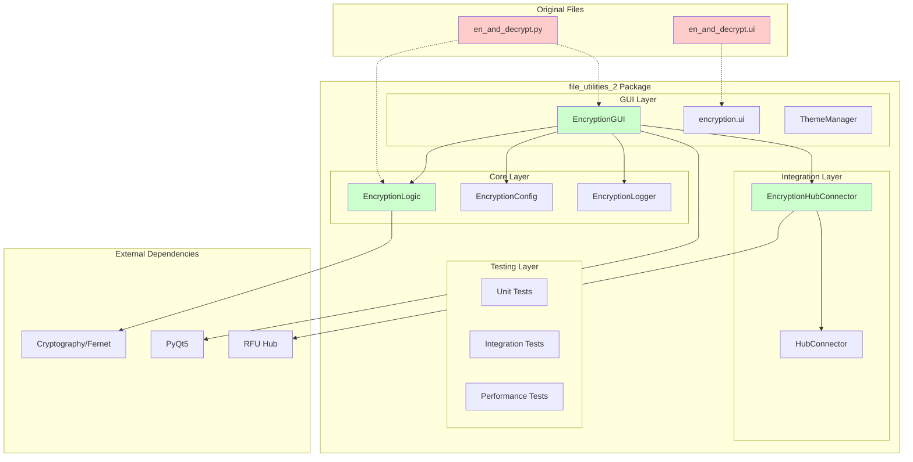
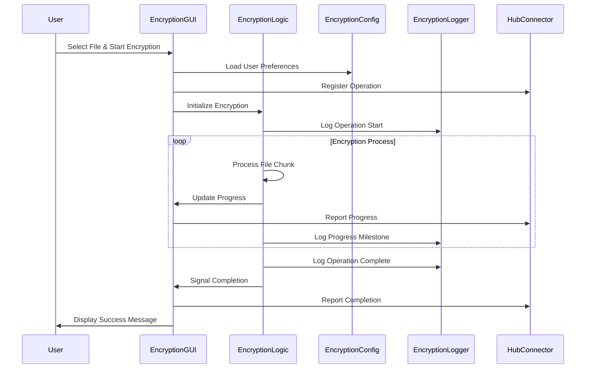

# Encryption/Decryption Migration - Technical Specifications & API Reference

**Document Type**: Technical Specifications & API Reference  
**Migration Target**: file_utilities_2 package integration  
**Date Created**: 2025-07-28 17:35:00 UTC+2  
**Document Version**: 1.0  
**Specification Level**: Detailed Implementation Guide  

---

## Architecture Overview

### System Architecture Diagram



### Component Interaction Flow



---

## Core Module Specifications

### EncryptionLogic Class Specification

#### Class Definition
```python
class EncryptionLogic(QObject):
    """
    Core encryption/decryption logic with progress tracking and hub integration.
    
    This class handles all cryptographic operations, progress tracking, and
    communication with the hub system for resource coordination.
    """
```

#### Signal Definitions
```python
# Progress tracking signals
progress_updated = pyqtSignal(int, int, str)    # current, total, message
file_progress = pyqtSignal(int, int)            # processed_bytes, total_bytes
operation_complete = pyqtSignal(str)            # completion_message
error_occurred = pyqtSignal(str)                # error_message
milestone_reached = pyqtSignal(str, dict)       # milestone_name, details

# Hub integration signals
hub_progress_update = pyqtSignal(int, str)      # percentage, message
hub_status_change = pyqtSignal(str, dict)       # status, details
hub_error_report = pyqtSignal(str, dict)        # error_message, details

# Operation control signals
operation_started = pyqtSignal(str, dict)       # operation_type, parameters
operation_cancelled = pyqtSignal(str)           # cancellation_reason
```

#### Constructor Specification
```python
def __init__(self, hub_instance=None, config_instance=None, logger_instance=None):
    """
    Initialize EncryptionLogic with optional dependencies.
    
    Args:
        hub_instance: Optional hub instance for integration
        config_instance: Optional configuration instance
        logger_instance: Optional logger instance
        
    Raises:
        ImportError: If cryptography library is not available
        RuntimeError: If initialization fails
    """
```

#### Key Management Methods
```python
def generate_key(self) -> bytes:
    """
    Generate a new Fernet encryption key.
    
    Returns:
        bytes: 32-byte Fernet key
        
    Raises:
        CryptographyError: If key generation fails
    """

def validate_key(self, key: bytes) -> bool:
    """
    Validate Fernet key format and structure.
    
    Args:
        key: Key bytes to validate
        
    Returns:
        bool: True if key is valid, False otherwise
    """

def save_key(self, key: bytes, file_path: str) -> bool:
    """
    Save encryption key to file with proper permissions.
    
    Args:
        key: Key bytes to save
        file_path: Target file path
        
    Returns:
        bool: True if save successful, False otherwise
        
    Raises:
        PermissionError: If file cannot be written
        OSError: If file system error occurs
    """

def load_key(self, file_path: str) -> bytes:
    """
    Load encryption key from file with validation.
    
    Args:
        file_path: Path to key file
        
    Returns:
        bytes: Loaded key bytes
        
    Raises:
        FileNotFoundError: If key file doesn't exist
        ValueError: If key format is invalid
        PermissionError: If file cannot be read
    """
```

#### File Operation Methods
```python
def encrypt_file(self, file_path: str, key: bytes, output_path: str = None) -> bool:
    """
    Encrypt a single file with progress tracking.
    
    Args:
        file_path: Path to file to encrypt
        key: Encryption key
        output_path: Optional output path (defaults to file_path + '.encrypted')
        
    Returns:
        bool: True if encryption successful, False otherwise
        
    Raises:
        FileNotFoundError: If input file doesn't exist
        PermissionError: If file access denied
        CryptographyError: If encryption fails
        
    Emits:
        progress_updated: Regular progress updates
        file_progress: Byte-level progress
        milestone_reached: Key milestones (start, 25%, 50%, 75%, complete)
    """

def decrypt_file(self, file_path: str, key: bytes, output_path: str = None) -> bool:
    """
    Decrypt a single file with progress tracking.
    
    Args:
        file_path: Path to encrypted file
        key: Decryption key
        output_path: Optional output path (defaults to removing .encrypted)
        
    Returns:
        bool: True if decryption successful, False otherwise
        
    Raises:
        FileNotFoundError: If input file doesn't exist
        ValueError: If file is not encrypted or corrupted
        InvalidToken: If key is incorrect
        PermissionError: If file access denied
        
    Emits:
        progress_updated: Regular progress updates
        file_progress: Byte-level progress
        milestone_reached: Key milestones
    """

def encrypt_directory(self, directory_path: str, key: bytes, 
                     recursive: bool = True) -> Dict[str, Any]:
    """
    Encrypt all files in a directory with detailed results.
    
    Args:
        directory_path: Path to directory
        key: Encryption key
        recursive: Whether to process subdirectories
        
    Returns:
        Dict containing:
            - 'total_files': Total files processed
            - 'successful': Number of successful encryptions
            - 'failed': Number of failed encryptions
            - 'errors': List of error details
            - 'duration': Total operation time
            - 'total_bytes': Total bytes processed
            
    Emits:
        progress_updated: Overall directory progress
        file_progress: Individual file progress
        milestone_reached: Directory milestones
    """

def decrypt_directory(self, directory_path: str, key: bytes,
                     recursive: bool = True) -> Dict[str, Any]:
    """
    Decrypt all .encrypted files in directory with detailed results.
    
    Args:
        directory_path: Path to directory
        key: Decryption key
        recursive: Whether to process subdirectories
        
    Returns:
        Dict containing operation results (same format as encrypt_directory)
        
    Emits:
        progress_updated: Overall directory progress
        file_progress: Individual file progress
        milestone_reached: Directory milestones
    """
```

#### Control and Monitoring Methods
```python
def stop(self):
    """
    Stop current operation gracefully.
    
    Sets internal cancellation flag and allows current chunk to complete
    before stopping. Safe to call multiple times.
    
    Emits:
        operation_cancelled: When cancellation is processed
    """

def is_running(self) -> bool:
    """
    Check if an operation is currently running.
    
    Returns:
        bool: True if operation in progress, False otherwise
    """

def get_statistics(self) -> Dict[str, Any]:
    """
    Get comprehensive operation statistics.
    
    Returns:
        Dict containing:
            - 'operations_completed': Total operations completed
            - 'total_bytes_processed': Total bytes processed
            - 'average_speed': Average processing speed (bytes/sec)
            - 'error_count': Total errors encountered
            - 'uptime': Total time since initialization
            - 'current_operation': Current operation details (if any)
    """

def get_performance_metrics(self) -> Dict[str, Any]:
    """
    Get detailed performance metrics.
    
    Returns:
        Dict containing:
            - 'memory_usage': Current memory usage
            - 'cpu_usage': Current CPU usage
            - 'disk_io': Disk I/O statistics
            - 'processing_speed': Current processing speed
            - 'progress_accuracy': Progress reporting accuracy
    """
```

### EncryptionConfig Class Specification

#### Class Definition
```python
class EncryptionConfig:
    """
    Configuration management for encryption operations.
    
    Handles persistent storage of user preferences, validation of settings,
    and coordination with hub configuration system.
    """
```

#### Configuration Schema
```python
DEFAULT_CONFIG_SCHEMA = {
    "user_preferences": {
        "default_key_directory": str,
        "auto_generate_key_names": bool,
        "confirm_overwrite": bool,
        "show_progress_details": bool,
        "remember_last_directory": bool
    },
    "security_settings": {
        "secure_key_storage": bool,
        "key_derivation_iterations": int,
        "secure_delete_temp_files": bool,
        "audit_all_operations": bool
    },
    "performance_settings": {
        "buffer_size": int,
        "progress_update_frequency": int,
        "max_memory_usage": int,
        "concurrent_operations_limit": int
    },
    "ui_settings": {
        "window_size": tuple,
        "window_position": tuple,
        "theme_preference": str,
        "show_advanced_options": bool
    },
    "hub_integration": {
        "enable_hub_communication": bool,
        "report_progress_to_hub": bool,
        "coordinate_resources": bool,
        "sync_configuration": bool
    }
}
```

#### Constructor and Core Methods
```python
def __init__(self, config_path: str = None, hub_instance=None):
    """
    Initialize configuration management.
    
    Args:
        config_path: Optional custom config file path
        hub_instance: Optional hub instance for synchronization
    """

def get_setting(self, key: str, default=None) -> Any:
    """
    Get configuration setting with dot notation support.
    
    Args:
        key: Setting key (supports dot notation like 'user_preferences.default_key_directory')
        default: Default value if setting not found
        
    Returns:
        Setting value or default
        
    Example:
        config.get_setting('performance_settings.buffer_size', 8192)
    """

def set_setting(self, key: str, value: Any) -> bool:
    """
    Set configuration setting with validation.
    
    Args:
        key: Setting key (supports dot notation)
        value: Setting value
        
    Returns:
        bool: True if setting was valid and saved, False otherwise
        
    Raises:
        ValueError: If value fails validation
        TypeError: If value type is incorrect
    """

def validate_settings(self) -> List[Dict[str, str]]:
    """
    Validate all configuration settings.
    
    Returns:
        List of validation issues, each containing:
            - 'key': Setting key with issue
            - 'issue': Description of the problem
            - 'severity': 'error', 'warning', or 'info'
            - 'suggestion': Suggested fix
    """

def reset_to_defaults(self, section: str = None) -> bool:
    """
    Reset configuration to default values.
    
    Args:
        section: Optional section to reset (resets all if None)
        
    Returns:
        bool: True if reset successful
    """

def export_config(self, file_path: str, include_sensitive: bool = False) -> bool:
    """
    Export configuration to file.
    
    Args:
        file_path: Target export file path
        include_sensitive: Whether to include sensitive settings
        
    Returns:
        bool: True if export successful
    """

def import_config(self, file_path: str, merge: bool = True) -> bool:
    """
    Import configuration from file.
    
    Args:
        file_path: Source import file path
        merge: Whether to merge with existing config or replace
        
    Returns:
        bool: True if import successful
        
    Raises:
        FileNotFoundError: If import file doesn't exist
        ValueError: If import file format is invalid
    """
```

### EncryptionLogger Class Specification

#### Class Definition
```python
class EncryptionLogger:
    """
    Comprehensive logging system for encryption operations.
    
    Provides structured logging, audit trails, performance metrics,
    and security event tracking for all encryption activities.
    """
```

#### Constructor and Core Methods
```python
def __init__(self, log_path: str = None, config_instance=None):
    """
    Initialize logging system.
    
    Args:
        log_path: Optional custom log file path
        config_instance: Optional configuration instance
    """

def log_operation_start(self, operation_type: str, file_path: str, 
                       file_size: int, parameters: Dict[str, Any] = None) -> str:
    """
    Log operation start and return operation ID.
    
    Args:
        operation_type: Type of operation ('encrypt', 'decrypt', 'key_gen', etc.)
        file_path: Path to file being processed
        file_size: Size of file in bytes
        parameters: Additional operation parameters
        
    Returns:
        str: Unique operation ID for tracking
    """

def log_operation_complete(self, operation_id: str, file_path: str,
                          duration: float, result: Dict[str, Any]):
    """
    Log successful operation completion.
    
    Args:
        operation_id: Operation ID from log_operation_start
        file_path: Path to processed file
        duration: Operation duration in seconds
        result: Operation results and statistics
    """

def log_operation_error(self, operation_id: str, file_path: str,
                       error: str, details: Dict[str, Any]):
    """
    Log operation error with detailed information.
    
    Args:
        operation_id: Operation ID from log_operation_start
        file_path: Path to file that caused error
        error: Error message
        details: Additional error details and context
    """

def log_security_event(self, event_type: str, details: Dict[str, Any]):
    """
    Log security-related events.
    
    Args:
        event_type: Type of security event
        details: Event details and context
        
    Security events include:
        - Key generation
        - Key access
        - Failed decryption attempts
        - Permission violations
        - Suspicious activity
    """

def get_operation_history(self, limit: int = 100, 
                         operation_type: str = None) -> List[Dict[str, Any]]:
    """
    Get recent operation history.
    
    Args:
        limit: Maximum number of operations to return
        operation_type: Optional filter by operation type
        
    Returns:
        List of operation records
    """

def export_audit_log(self, file_path: str, start_date: datetime = None,
                    end_date: datetime = None, format: str = 'json') -> bool:
    """
    Export audit log to file.
    
    Args:
        file_path: Target export file path
        start_date: Optional start date filter
        end_date: Optional end date filter
        format: Export format ('json', 'csv', 'xml')
        
    Returns:
        bool: True if export successful
    """
```

---

## GUI Module Specifications

### EncryptionGUI Class Specification

#### Class Definition
```python
class EncryptionGUI(StandardWindow):
    """
    Enhanced encryption GUI with StandardWindow base and hub integration.
    
    Provides comprehensive user interface for encryption operations with
    real-time progress tracking, configuration management, and hub communication.
    """
```

#### Signal Definitions
```python
# Operation signals
encryption_started = pyqtSignal(str, str)       # file_path, operation_type
encryption_progress = pyqtSignal(int, str)      # percentage, message
encryption_completed = pyqtSignal(str, dict)    # file_path, results
encryption_error = pyqtSignal(str, str)         # file_path, error_message

# Hub integration signals
hub_status_update = pyqtSignal(str, dict)       # status, details
hub_resource_request = pyqtSignal(str, dict)    # resource_type, requirements

# UI state signals
ui_state_changed = pyqtSignal(str, bool)        # component, enabled
file_selection_changed = pyqtSignal(list)       # selected_files
key_status_changed = pyqtSignal(bool, str)      # key_loaded, key_info
```

#### Constructor and Initialization
```python
def __init__(self, hub_instance=None, config_instance=None):
    """
    Initialize encryption GUI with StandardWindow base.
    
    Args:
        hub_instance: Optional hub instance for integration
        config_instance: Optional configuration instance
    """

def _setup_ui(self):
    """
    Setup enhanced UI with StandardWindow components.
    
    Creates all UI components using StandardWindow factory methods
    and applies consistent theming and layout.
    """

def _setup_hub_integration(self):
    """
    Setup hub integration and register with hub.
    
    Initializes hub connector, registers tool with hub,
    and establishes communication channels.
    """

def _load_configuration(self):
    """
    Load user configuration and apply to UI.
    
    Restores window state, user preferences, and
    applies saved settings to UI components.
    """
```

#### UI Component Creation Methods
```python
def _create_file_selection_group(self) -> QGroupBox:
    """
    Create enhanced file selection interface.
    
    Returns:
        QGroupBox: File selection group with:
            - File path display
            - Browse buttons for files and directories
            - Drag-and-drop area
            - Selected files list
            - File information display
    """

def _create_key_management_group(self) -> QGroupBox:
    """
    Create key management interface.
    
    Returns:
        QGroupBox: Key management group with:
            - Key status display
            - Generate new key button
            - Load existing key button
            - Key information display
            - Key validation status
    """

def _create_operations_group(self) -> QGroupBox:
    """
    Create encryption/decryption operations interface.
    
    Returns:
        QGroupBox: Operations group with:
            - Encrypt button
            - Decrypt button
            - Operation mode selection
            - Batch operation options
            - Advanced settings
    """

def _create_progress_group(self) -> QGroupBox:
    """
    Create progress tracking interface.
    
    Returns:
        QGroupBox: Progress group with:
            - Overall progress bar
            - File progress bar
            - Status message display
            - Time estimation
            - Cancel button
    """

def _create_configuration_group(self) -> QGroupBox:
    """
    Create configuration management interface.
    
    Returns:
        QGroupBox: Configuration group with:
            - Settings button
            - Preferences display
            - Import/export options
            - Reset to defaults
    """
```

#### File Operation Methods
```python
def select_files(self):
    """
    Enhanced file selection with validation.
    
    Opens file dialog with appropriate filters,
    validates selected files, and updates UI.
    """

def select_directory(self):
    """
    Enhanced directory selection with validation.
    
    Opens directory dialog, scans for processable files,
    and displays directory information.
    """

def add_files_from_drag_drop(self, file_paths: List[str]):
    """
    Add files from drag-and-drop operation.
    
    Args:
        file_paths: List of dropped file paths
        
    Validates dropped files and adds them to selection.
    """

def clear_file_selection(self):
    """
    Clear current file selection and reset UI.
    """

def validate_file_selection(self) -> bool:
    """
    Validate current file selection.
    
    Returns:
        bool: True if selection is valid for operations
    """
```

#### Key Management Methods
```python
def generate_new_key(self):
    """
    Generate new encryption key with enhanced options.
    
    Provides options for key naming, storage location,
    and automatic saving with user confirmation.
    """

def load_existing_key(self):
    """
    Load existing key with validation and error handling.
    
    Opens key file dialog, validates key format,
    and updates key status display.
    """

def validate_current_key(self) -> bool:
    """
    Validate currently loaded key.
    
    Returns:
        bool: True if key is valid and ready for use
    """

def clear_current_key(self):
    """
    Clear currently loaded key and update UI.
    """

def show_key_information(self):
    """
    Display detailed information about current key.
    
    Shows key creation date, file path, and usage statistics.
    """
```

#### Operation Control Methods
```python
def start_encryption(self):
    """
    Start encryption operation with comprehensive validation.
    
    Validates files, key, and settings before starting operation.
    Provides user confirmation and progress tracking.
    """

def start_decryption(self):
    """
    Start decryption operation with comprehensive validation.
    
    Validates encrypted files, key, and settings before starting.
    Provides user confirmation and progress tracking.
    """

def stop_current_operation(self):
    """
    Stop current operation gracefully.
    
    Requests operation cancellation and provides user feedback
    about cancellation progress.
    """

def pause_current_operation(self):
    """
    Pause current operation (if supported).
    
    Temporarily halts operation while maintaining state
    for later resumption.
    """

def resume_current_operation(self):
    """
    Resume paused operation.
    
    Continues operation from paused state with
    progress restoration.
    """
```

#### Progress and Status Methods
```python
def update_overall_progress(self, percentage: int, message: str):
    """
    Update overall operation progress.
    
    Args:
        percentage: Progress percentage (0-100)
        message: Progress message
        
    Updates progress bar, status message, and time estimation.
    """

def update_file_progress(self, processed: int, total: int, filename: str):
    """
    Update individual file progress.
    
    Args:
        processed: Bytes processed
        total: Total bytes
        filename: Current file name
        
    Updates file-specific progress display.
    """

def show_operation_complete(self, results: Dict[str, Any]):
    """
    Display operation completion results.
    
    Args:
        results: Operation results and statistics
        
    Shows completion dialog with detailed results.
    """

def show_operation_error(self, error_message: str, details: Dict[str, Any]):
    """
    Display operation error with recovery options.
    
    Args:
        error_message: Primary error message
        details: Additional error details
        
    Shows error dialog with troubleshooting suggestions.
    """
```

#### Drag-and-Drop Implementation
```python
def dragEnterEvent(self, event: QDragEnterEvent):
    """
    Handle drag enter events with file validation.
    
    Args:
        event: Drag enter event
        
    Validates dragged content and provides visual feedback.
    """

def dragMoveEvent(self, event: QDragMoveEvent):
    """
    Handle drag move events with visual feedback.
    
    Args:
        event: Drag move event
        
    Updates visual feedback based on drop target.
    """

def dropEvent(self, event: QDropEvent):
    """
    Handle file drop events with comprehensive processing.
    
    Args:
        event: Drop event
        
    Processes dropped files and updates file selection.
    """
```

---

## Integration Module Specifications

### EncryptionHubConnector Class Specification

#### Class Definition
```python
class EncryptionHubConnector(HubConnector):
    """
    Hub connector for encryption operations.
    
    Extends base HubConnector with encryption-specific functionality
    for progress reporting, resource coordination, and configuration sync.
    """
```

#### Constructor and Initialization
```python
def __init__(self, tool_name: str = "EncryptionTool", hub_instance=None):
    """
    Initialize encryption-specific hub connector.
    
    Args:
        tool_name: Name for tool registration
        hub_instance: Hub instance for communication
    """
```

#### Progress Reporting Methods
```python
def report_encryption_progress(self, file_path: str, percentage: int, 
                              message: str, details: Dict[str, Any] = None):
    """
    Report encryption progress to hub.
    
    Args:
        file_path: File being processed
        percentage: Progress percentage
        message: Progress message
        details: Additional progress details
    """

def report_operation_milestone(self, milestone: str, file_path: str,
                              details: Dict[str, Any]):
    """
    Report operation milestone to hub.
    
    Args:
        milestone: Milestone name
        file_path: File being processed
        details: Milestone details
    """

def report_batch_progress(self, completed: int, total: int, 
                         current_file: str, overall_percentage: int):
    """
    Report batch operation progress to hub.
    
    Args:
        completed: Files completed
        total: Total files
        current_file: Currently processing file
        overall_percentage: Overall progress percentage
    """
```

#### Resource Management Methods
```python
def request_encryption_resources(self, file_size: int, operation: str,
                               priority: str = "normal") -> bool:
    """
    Request resources for encryption operation.
    
    Args:
        file_size: Size of file to process
        operation: Operation type ('encrypt', 'decrypt')
        priority: Operation priority ('low', 'normal', 'high')
        
    Returns:
        bool: True if resources granted
    """

def release_encryption_resources(self, operation_id: str):
    """
    Release resources after operation completion.
    
    Args:
        operation_id: Operation ID to release resources for
    """

def get_resource_status(self) -> Dict[str, Any]:
    """
    Get current resource allocation status.
    
    Returns:
        Dict containing resource usage and availability
    """
```

#### Configuration Synchronization Methods
```python
def sync_configuration_with_hub(self, config: Dict[str, Any]) -> bool:
    """
    Synchronize configuration with hub.
    
    Args:
        config: Configuration to synchronize
        
    Returns:
        bool: True if synchronization successful
    """

def get_hub_configuration(self) -> Dict[str, Any]:
    """
    Get configuration from hub.
    
    Returns:
        Dict containing hub configuration
    """

def notify_configuration_change(self, key: str, value: Any):
    """
    Notify hub of configuration change.
    
    Args:
        key: Configuration key that changed
        value: New configuration value
    """
```

#### Error and Event Reporting Methods
```python
def report_encryption_error(self, file_path: str, operation: str,
                           error_message: str, details: Dict[str, Any]):
    """
    Report encryption error to hub.
    
    Args:
        file_path: File that caused error
        operation: Operation type
        error_message: Error message
        details: Additional error details
    """

def report_security_event(self, event_type: str, details: Dict[str, Any]):
    """
    Report security event to hub.
    
    Args:
        event_type: Type of security event
        details: Event details
    """

def broadcast_operation_event(self, event_type: str, file_path: str,
                             details: Dict[str, Any]):
    """
    Broadcast operation event to other tools.
    
    Args:
        event_type: Event type
        file_path: File involved in event
        details: Event details
    """
```

---

## Testing Specifications

### Unit Test Specifications

#### Core Logic Tests
```python
class TestEncryptionLogic(unittest.TestCase):
    """Comprehensive unit tests for EncryptionLogic class."""
    
    def setUp(self):
        """Set up test fixtures and mock dependencies."""
        
    def test_key_generation(self):
        """Test Fernet key generation and validation."""
        
    def test_key_validation(self):
        """Test key format validation with various inputs."""
        
    def test_file_encryption_small(self):
        """Test encryption of small files (< 1MB)."""
        
    def test_file_encryption_large(self):
        """Test encryption of large files (> 100MB)."""
        
    def test_file_decryption_accuracy(self):
        """Test decryption accuracy and data integrity."""
        
    def test_directory_batch_operations(self):
        """Test batch encryption/decryption of directories."""
        
    def test_progress_tracking_accuracy(self):
        """Test progress reporting accuracy across file sizes."""
        
    def test_operation_cancellation(self):
        """Test graceful operation cancellation."""
        
    def test_error_handling_scenarios(self):
        """Test error handling for various failure scenarios."""
        
    def test_performance_benchmarks(self):
        """Test performance against established benchmarks."""
```

#### Configuration Tests
```python
class TestEncryptionConfig(unittest.TestCase):
    """Unit tests for EncryptionConfig class."""
    
    def test_setting_persistence(self):
        """Test configuration setting persistence."""
        
    def test_validation_framework(self):
        """Test setting validation with invalid inputs."""
        
    def test_default_value_handling(self):
        """Test default value management and fallbacks."""
        
    def test_export_import_functionality(self):
        """Test configuration export and import."""
        
    def test_schema_validation(self):
        """Test configuration schema validation."""
        
    def test_migration_compatibility(self):
        """Test configuration migration from older versions."""
```

#### Logging Tests
```python
class TestEncryptionLogger(unittest.TestCase):
    """Unit tests for EncryptionLogger class."""
    
    def test_operation_logging(self):
        """Test operation start/complete/error logging."""