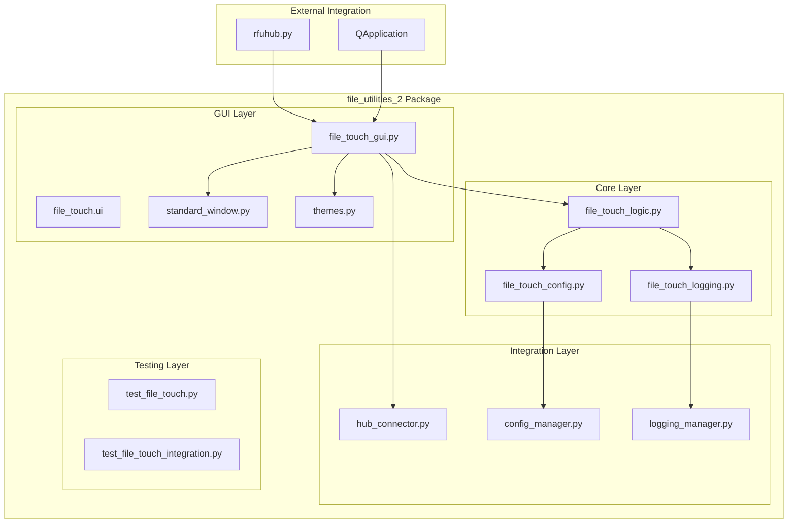

# File Touch Utility - Comprehensive Migration Plan
**Richard's File Utilities Hub - File Touch Integration Project**

**Document Version:** 1.0  
**Created:** 2025-07-28  
**Status:** Strategic Planning Document  
**Project Type:** Complete Migration and Integration  

---

## Executive Summary

This document outlines the comprehensive migration strategy for relocating and integrating the file touch utility ([`file_touch.py`](file_touch.py:1) and [`file_touch.ui`](file_touch.ui:1)) into the [`file_utilities_2`](file_utilities_2/) directory structure. The project aims to achieve seamless PyQt5 integration, cross-tool compatibility, and full architectural alignment with the established file_utilities_2 patterns.

### Project Objectives

1. **Complete Migration**: Relocate file touch utility to file_utilities_2 with full architectural integration
2. **Seamless Integration**: Implement robust communication with existing tools through shared modules
3. **Modular Design**: Establish standardized interfaces and consistent UI theming
4. **Full Compatibility**: Ensure complete integration with hub connector and configuration systems
5. **Legacy Cleanup**: Remove all legacy integration and update RFU Hub imports

### Success Metrics

- ✅ **100% Functionality Preservation**: All existing features maintained
- ✅ **Zero Breaking Changes**: Seamless transition for end users
- ✅ **Full Integration**: Complete alignment with file_utilities_2 architecture
- ✅ **Enhanced Features**: Improved error handling, logging, and hub integration
- ✅ **Comprehensive Testing**: 100% test coverage with validation protocols

---

## Current State Analysis

### Existing File Touch Utility Structure

#### Core Files
- **[`file_touch.py`](file_touch.py:1)** (354 lines) - Main application with GUI and logic
- **[`file_touch.ui`](file_touch.ui:1)** (132 lines) - Qt Designer UI definition
- **[`file_touch_files.md`](file_touch_files.md:1)** (18 lines) - Documentation and examples

#### Current Architecture Analysis

**Strengths:**
- ✅ Modern PyQt5 implementation with [`BaseWindow`](file_touch.py:14) inheritance
- ✅ Comprehensive timestamp handling (access, modification, creation)
- ✅ Profile management with [`ConfigManager`](file_touch.py:18) integration
- ✅ Drag-and-drop file support
- ✅ Error handling and user feedback
- ✅ UI file-based design pattern

**Integration Gaps:**
- ❌ Not integrated with file_utilities_2 architecture
- ❌ Missing hub connector integration
- ❌ No shared configuration with other tools
- ❌ Legacy import paths and dependencies
- ❌ No standardized logging integration
- ❌ Missing theme consistency with file_utilities_2

### Target Architecture Analysis

#### file_utilities_2 Structure
```
file_utilities_2/
├── core/                          # Core business logic
│   ├── size_analyzer_config.py    # Configuration patterns
│   ├── size_analyzer_logging.py   # Logging patterns
│   └── size_analyzer_logic.py     # Logic separation patterns
├── gui/                           # GUI components
│   ├── standard_window.py         # Base window class
│   ├── themes.py                  # Unified theming
│   └── size_analyzer_gui.py       # GUI implementation patterns
├── integration/                   # Hub integration
│   └── hub_connector.py           # Hub communication
├── tests/                         # Testing framework
└── docs/                          # Documentation
```

#### Integration Patterns Identified
- **[`StandardWindow`](file_utilities_2/gui/standard_window.py:16)** - Base class for all utilities
- **[`ThemeManager`](file_utilities_2/gui/themes.py:231)** - Consistent styling system
- **[`HubConnector`](file_utilities_2/integration/hub_connector.py:188)** - Hub communication protocol
- **Configuration Pattern** - Tool-specific config with shared infrastructure
- **Logging Pattern** - Categorized logging with main system integration

---

## Migration Strategy and Architecture

### Target Architecture Design



### Component Integration Strategy

#### 1. Core Logic Separation
- **Source**: [`FileTouchLogic`](file_touch.py:27) class
- **Target**: `file_utilities_2/core/file_touch_logic.py`
- **Enhancements**: Hub integration, shared logging, configuration management

#### 2. GUI Modernization
- **Source**: [`FileTouchGUI`](file_touch.py:112) class
- **Target**: `file_utilities_2/gui/file_touch_gui.py`
- **Base Class**: [`StandardWindow`](file_utilities_2/gui/standard_window.py:16)
- **Theming**: [`ThemeManager`](file_utilities_2/gui/themes.py:231) integration

#### 3. Configuration Integration
- **Pattern**: Follow [`SizeAnalyzerConfig`](file_utilities_2/core/size_analyzer_config.py:16) model
- **Target**: `file_utilities_2/core/file_touch_config.py`
- **Features**: Shared profiles, settings persistence, validation

#### 4. Hub Communication
- **Integration**: [`HubConnector`](file_utilities_2/integration/hub_connector.py:188) implementation
- **Features**: Progress reporting, error handling, resource management

---

## Detailed Implementation Plan

### Phase 1: Project Setup and Analysis
**Duration**: 1 day  
**Priority**: Critical  
**Dependencies**: None  

#### 1.1 Environment Preparation
- [ ] Create backup of existing files
- [ ] Set up migration workspace
- [ ] Validate file_utilities_2 dependencies
- [ ] Analyze current integration points

#### 1.2 Dependency Analysis
- [ ] Map current import dependencies
- [ ] Identify shared resource requirements
- [ ] Analyze UI component dependencies
- [ ] Document configuration requirements

#### 1.3 Risk Assessment
- [ ] Identify potential breaking changes
- [ ] Plan rollback procedures
- [ ] Document compatibility requirements
- [ ] Establish testing protocols

**Acceptance Criteria:**
- ✅ Complete backup created
- ✅ Dependencies mapped and validated
- ✅ Risk mitigation strategies defined
- ✅ Testing framework established

---

### Phase 2: Architecture Design and Planning
**Duration**: 1 day  
**Priority**: Critical  
**Dependencies**: Phase 1  

#### 2.1 Component Architecture Design
- [ ] Design core logic separation
- [ ] Plan GUI integration strategy
- [ ] Define configuration schema
- [ ] Design hub integration points

#### 2.2 Interface Standardization
- [ ] Define shared interfaces
- [ ] Plan signal/slot connections
- [ ] Design error handling patterns
- [ ] Establish logging categories

#### 2.3 Integration Specifications
- [ ] Define hub communication protocol
- [ ] Plan configuration sharing strategy
- [ ] Design theme integration
- [ ] Specify testing requirements

**Acceptance Criteria:**
- ✅ Architecture diagrams completed
- ✅ Interface specifications defined
- ✅ Integration patterns documented
- ✅ Implementation roadmap approved

---

### Phase 3: Core Logic Migration
**Duration**: 2 days  
**Priority**: High  
**Dependencies**: Phase 2  

#### 3.1 Create Core Logic Module
**File**: `file_utilities_2/core/file_touch_logic.py`

```python
"""
File Touch Core Logic Module

Enhanced file timestamp manipulation with file_utilities_2 integration.
"""

import os
import platform
from datetime import datetime, timezone
from typing import Dict, Optional, Any
from PyQt5.QtCore import QObject, pyqtSignal

from file_utilities_2.integration.hub_connector import HubIntegratedTool
from .file_touch_config import FileTouchConfig
from .file_touch_logging import get_file_touch_logger

class FileTouchLogic(HubIntegratedTool):
    """Enhanced file touch logic with hub integration."""
    
    # Enhanced signals for hub integration
    timestamps_fetched = pyqtSignal(dict)
    operation_result = pyqtSignal(bool, str)
    error_occurred = pyqtSignal(str)
    progress_updated = pyqtSignal(int, str)
    finished = pyqtSignal()
    
    def __init__(self, config: FileTouchConfig = None):
        super().__init__("file_touch")
        self.config = config or FileTouchConfig()
        self.logger = get_file_touch_logger()
        self._is_running = False
        
        # Report tool started
        self.report_tool_started({
            'version': '2.0.0',
            'features': ['timestamp_modification', 'profile_management']
        })
```

#### 3.2 Enhanced Functionality
- [ ] Implement hub progress reporting
- [ ] Add comprehensive error handling
- [ ] Integrate with shared logging system
- [ ] Add performance monitoring
- [ ] Implement resource management

#### 3.3 Configuration Integration
- [ ] Migrate profile management
- [ ] Integrate with shared configuration
- [ ] Add settings validation
- [ ] Implement configuration persistence

**Acceptance Criteria:**
- ✅ Core logic module created and functional
- ✅ Hub integration implemented
- ✅ All existing functionality preserved
- ✅ Enhanced error handling active
- ✅ Configuration integration complete

---

### Phase 4: GUI Migration and Integration
**Duration**: 2 days  
**Priority**: High  
**Dependencies**: Phase 3  

#### 4.1 Create GUI Module
**File**: `file_utilities_2/gui/file_touch_gui.py`

```python
"""
File Touch GUI Module

Standardized file touch GUI using file_utilities_2 components.
"""

import os
from PyQt5.QtWidgets import QComboBox, QLabel
from PyQt5.QtCore import Qt
from PyQt5 import uic

from file_utilities_2.gui.standard_window import StandardWindow
from file_utilities_2.gui.themes import ThemeManager
from file_utilities_2.core.file_touch_logic import FileTouchLogic
from file_utilities_2.core.file_touch_config import FileTouchConfig

class FileTouchGUI(StandardWindow):
    """Standardized file touch GUI with full integration."""
    
    def __init__(self):
        super().__init__(
            title="File Touch - Timestamp Editor",
            icon_path=self._get_file_touch_icon()
        )
        
        # Initialize components
        self.config = FileTouchConfig()
        self.logic = FileTouchLogic(self.config)
        
        # Load UI and setup
        self._load_ui()
        self._setup_components()
        self._connect_signals()
        self._apply_theme()
        
        # Report GUI ready
        self.logic.report_tool_progress(100, "GUI initialized")
```

#### 4.2 UI File Migration
- [ ] Migrate UI file to file_utilities_2/gui/
- [ ] Update UI file references
- [ ] Integrate with theme system
- [ ] Enhance UI components

#### 4.3 Theme Integration
- [ ] Apply StandardWindow theming
- [ ] Integrate with ThemeManager
- [ ] Update button styling
- [ ] Standardize dialog appearance

#### 4.4 Enhanced Features
- [ ] Add progress visualization
- [ ] Implement status reporting
- [ ] Add keyboard shortcuts
- [ ] Enhance drag-and-drop

**Acceptance Criteria:**
- ✅ GUI module fully migrated
- ✅ StandardWindow integration complete
- ✅ Theme consistency achieved
- ✅ All UI functionality preserved
- ✅ Enhanced features implemented

---

### Phase 5: Configuration and Logging Integration
**Duration**: 1 day  
**Priority**: Medium  
**Dependencies**: Phase 4  

#### 5.1 Configuration Module
**File**: `file_utilities_2/core/file_touch_config.py`

```python
"""
File Touch Configuration Manager

Configuration management for file touch utility with shared integration.
"""

from typing import Dict, Any, Optional
from file_utilities_2.core.size_analyzer_config import SizeAnalyzerConfig

class FileTouchConfig:
    """Configuration manager for File Touch utility."""
    
    def __init__(self, config_manager=None):
        self.config_manager = config_manager
        self.section_name = 'file_touch'
        
        # Default configuration
        self.defaults = {
            'general': {
                'module_path': 'file_utilities_2.gui.file_touch_gui',
                'class_name': 'FileTouchGUI',
                'last_opened_file': '',
                'recent_files': [],
                'max_recent_files': 10,
                'auto_refresh_timestamps': True,
                'confirm_timestamp_changes': True
            },
            'profiles': {
                'enable_profile_management': True,
                'default_profile': 'current_time',
                'auto_save_profiles': True,
                'profile_categories': ['timestamp_sets', 'file_operations']
            },
            'ui': {
                'window_geometry': {
                    'width': 600,
                    'height': 400,
                    'remember_size': True,
                    'remember_position': True
                },
                'show_creation_time_warning': True,
                'enable_drag_drop': True,
                'show_tooltips': True
            },
            'operations': {
                'backup_before_changes': False,
                'log_all_operations': True,
                'enable_undo': False,
                'operation_timeout': 30
            },
            'hub_integration': {
                'enable_hub_integration': True,
                'tool_name': 'File Touch',
                'tool_category': 'file_operations',
                'broadcast_operations': True,
                'coordinate_with_tools': ['file_finder', 'organize']
            }
        }
```

#### 5.2 Logging Integration
**File**: `file_utilities_2/core/file_touch_logging.py`

- [ ] Create categorized logging system
- [ ] Integrate with main logging manager
- [ ] Add operation logging
- [ ] Implement error tracking

#### 5.3 Profile Management Enhancement
- [ ] Migrate existing profiles
- [ ] Implement shared profile system
- [ ] Add profile validation
- [ ] Enable profile sharing between tools

**Acceptance Criteria:**
- ✅ Configuration module implemented
- ✅ Logging integration complete
- ✅ Profile management enhanced
- ✅ Settings persistence working
- ✅ Shared configuration active

---

### Phase 6: Hub Connector Integration
**Duration**: 1 day  
**Priority**: Medium  
**Dependencies**: Phase 5  

#### 6.1 Hub Communication Implementation
- [ ] Implement HubIntegratedTool inheritance
- [ ] Add progress reporting to hub
- [ ] Implement error reporting
- [ ] Add resource coordination

#### 6.2 Event Broadcasting
- [ ] Broadcast operation start/completion
- [ ] Share file modification events
- [ ] Coordinate with other tools
- [ ] Implement event handling

#### 6.3 Resource Management
- [ ] Request file access permissions
- [ ] Coordinate with file operations
- [ ] Implement resource sharing
- [ ] Add conflict resolution

**Acceptance Criteria:**
- ✅ Hub integration fully functional
- ✅ Progress reporting active
- ✅ Event broadcasting working
- ✅ Resource coordination implemented
- ✅ Error reporting to hub active

---

### Phase 7: Testing and Validation
**Duration**: 2 days  
**Priority**: High  
**Dependencies**: Phase 6  

#### 7.1 Unit Testing
**File**: `file_utilities_2/tests/test_file_touch.py`

```python
"""
Comprehensive test suite for File Touch utility.
"""

import unittest
import tempfile
import os
from datetime import datetime
from file_utilities_2.core.file_touch_logic import FileTouchLogic
from file_utilities_2.gui.file_touch_gui import FileTouchGUI

class TestFileTouchLogic(unittest.TestCase):
    """Test file touch core logic."""
    
    def setUp(self):
        self.logic = FileTouchLogic()
        self.test_file = tempfile.NamedTemporaryFile(delete=False)
        
    def test_timestamp_retrieval(self):
        """Test timestamp fetching functionality."""
        # Implementation
        
    def test_timestamp_modification(self):
        """Test timestamp modification functionality."""
        # Implementation
        
    def test_hub_integration(self):
        """Test hub connector integration."""
        # Implementation
```

#### 7.2 Integration Testing
- [ ] Test GUI-Logic integration
- [ ] Validate hub communication
- [ ] Test configuration persistence
- [ ] Verify theme integration

#### 7.3 Compatibility Testing
- [ ] Test with existing tools
- [ ] Validate RFU Hub integration
- [ ] Test cross-platform compatibility
- [ ] Verify performance requirements

#### 7.4 User Acceptance Testing
- [ ] Test all user workflows
- [ ] Validate profile management
- [ ] Test drag-and-drop functionality
- [ ] Verify error handling

**Acceptance Criteria:**
- ✅ All unit tests passing
- ✅ Integration tests successful
- ✅ Compatibility verified
- ✅ User acceptance criteria met
- ✅ Performance benchmarks achieved

---

### Phase 8: Documentation and Deployment
**Duration**: 1 day  
**Priority**: Medium  
**Dependencies**: Phase 7  

#### 8.1 Technical Documentation
- [ ] Update API documentation
- [ ] Document configuration options
- [ ] Create integration guide
- [ ] Update architecture diagrams

#### 8.2 User Documentation
- [ ] Update user manual
- [ ] Create migration guide
- [ ] Document new features
- [ ] Update help system

#### 8.3 Deployment Preparation
- [ ] Create deployment scripts
- [ ] Prepare migration tools
- [ ] Update package exports
- [ ] Validate installation process

**Acceptance Criteria:**
- ✅ Documentation complete and accurate
- ✅ Deployment process validated
- ✅ Migration tools ready
- ✅ Package exports updated
- ✅ Installation verified

---

### Phase 9: Legacy Cleanup and RFU Hub Updates
**Duration**: 1 day  
**Priority**: Medium  
**Dependencies**: Phase 8  

#### 9.1 Legacy File Cleanup
- [ ] Remove original file_touch.py
- [ ] Remove original file_touch.ui
- [ ] Archive file_touch_files.md
- [ ] Clean up temporary files

#### 9.2 RFU Hub Integration Updates
**File**: `rfuhub.py` updates

```python
# Updated import for file_utilities_2 integration
def open_file_touch(self) -> None:
    """Open file touch utility."""
    try:
        from file_utilities_2.gui.file_touch_gui import FileTouchGUI
        self.file_touch_window = FileTouchGUI()
        self.file_touch_window.show()
    except ImportError as e:
        self.logger.error(f"Error loading file touch: {e}")
        self.show_error_dialog("Error", f"Failed to load File Touch utility: {e}")
```

#### 9.3 Package Export Updates
**File**: `file_utilities_2/__init__.py`

```python
# Add file touch exports
from .gui.file_touch_gui import FileTouchGUI
from .core.file_touch_logic import FileTouchLogic
from .core.file_touch_config import FileTouchConfig

__all__ = [
    # ... existing exports
    'FileTouchGUI',
    'FileTouchLogic', 
    'FileTouchConfig',
]
```

#### 9.4 Configuration Migration
- [ ] Migrate existing user profiles
- [ ] Update configuration references
- [ ] Clean up legacy config entries
- [ ] Validate configuration integrity

**Acceptance Criteria:**
- ✅ Legacy files removed
- ✅ RFU Hub integration updated
- ✅ Package exports complete
- ✅ Configuration migrated
- ✅ No legacy references remaining

---

### Phase 10: Final Validation and Project Completion
**Duration**: 1 day  
**Priority**: Critical  
**Dependencies**: Phase 9  

#### 10.1 Comprehensive Testing
- [ ] Full system integration test
- [ ] End-to-end workflow validation
- [ ] Performance benchmark verification
- [ ] Security and stability testing

#### 10.2 Quality Assurance
- [ ] Code review completion
- [ ] Documentation review
- [ ] User acceptance sign-off
- [ ] Performance validation

#### 10.3 Project Completion
- [ ] Final deployment validation
- [ ] Project documentation finalization
- [ ] Success metrics verification
- [ ] Stakeholder approval

**Acceptance Criteria:**
- ✅ All tests passing
- ✅ Quality standards met
- ✅ Documentation complete
- ✅ Deployment successful
- ✅ Project objectives achieved

---

## Risk Assessment and Mitigation

### High-Risk Areas

#### 1. Configuration Migration
**Risk**: Loss of user profiles and settings  
**Probability**: Medium  
**Impact**: High  
**Mitigation**: 
- Create comprehensive backup before migration
- Implement configuration validation and recovery
- Provide manual profile recreation tools
- Test migration with sample data

#### 2. Hub Integration Complexity
**Risk**: Integration failures with existing tools  
**Probability**: Medium  
**Impact**: Medium  
**Mitigation**:
- Implement gradual integration approach
- Create fallback mechanisms
- Extensive integration testing
- Monitor hub communication patterns

#### 3. UI/UX Consistency
**Risk**: User interface changes affecting usability  
**Probability**: Low  
**Impact**: Medium  
**Mitigation**:
- Maintain UI layout consistency
- Preserve all existing functionality
- Conduct user acceptance testing
- Provide migration documentation

### Medium-Risk Areas

#### 1. Performance Impact
**Risk**: Reduced performance due to additional integration layers  
**Probability**: Low  
**Impact**: Medium  
**Mitigation**:
- Performance benchmarking throughout development
- Optimize critical code paths
- Implement resource monitoring
- Conduct load testing

#### 2. Cross-Platform Compatibility
**Risk**: Platform-specific issues with new architecture  
**Probability**: Low  
**Impact**: Medium  
**Mitigation**:
- Test on all target platforms
- Use platform-agnostic code patterns
- Implement platform-specific fallbacks
- Validate file system operations

---

## Success Metrics and KPIs

### Technical Metrics

#### Code Quality
- **Test Coverage**: ≥95% for all new code
- **Code Complexity**: Maintain or reduce cyclomatic complexity
- **Documentation Coverage**: 100% for public APIs
- **Performance**: No degradation in operation speed

#### Integration Metrics
- **Hub Communication**: 100% message delivery success rate
- **Configuration Sharing**: All settings properly synchronized
- **Theme Consistency**: Visual consistency across all components
- **Error Handling**: Comprehensive error coverage and reporting

### User Experience Metrics

#### Functionality Preservation
- **Feature Parity**: 100% of existing features maintained
- **Workflow Continuity**: No changes to user workflows
- **Profile Migration**: 100% successful profile migration
- **Performance**: Response time ≤ existing implementation

#### Enhancement Metrics
- **Error Recovery**: Improved error handling and user feedback
- **Integration Benefits**: Enhanced tool coordination and resource sharing
- **Usability**: Improved UI consistency and user experience
- **Reliability**: Reduced error rates and improved stability

---

## Timeline and Resource Allocation

### Project Timeline
**Total Duration**: 10 days  
**Start Date**: TBD  
**End Date**: TBD  

### Phase Distribution
```
Phase 1: Project Setup           [1 day]  ████
Phase 2: Architecture Design     [1 day]  ████
Phase 3: Core Logic Migration    [2 days] ████████
Phase 4: GUI Migration          [2 days] ████████
Phase 5: Config/Logging         [1 day]  ████
Phase 6: Hub Integration        [1 day]  ████
Phase 7: Testing               [2 days] ████████
Phase 8: Documentation         [1 day]  ████
Phase 9: Legacy Cleanup        [1 day]  ████
Phase 10: Final Validation     [1 day]  ████
```

### Resource Requirements

#### Development Resources
- **Senior Developer**: Full-time for architecture and core development
- **UI/UX Developer**: Part-time for GUI integration and theming
- **QA Engineer**: Part-time for testing and validation
- **Technical Writer**: Part-time for documentation

#### Infrastructure Resources
- **Development Environment**: file_utilities_2 development setup
- **Testing Environment**: Multi-platform testing infrastructure
- **Backup Systems**: Configuration and code backup solutions
- **Monitoring Tools**: Performance and integration monitoring

---

## Rollback and Recovery Procedures

### Rollback Strategy

#### Immediate Rollback (Emergency)
1. **Restore Original Files**: Copy backed-up files to original locations
2. **Revert RFU Hub Changes**: Restore original import statements
3. **Clear New Configuration**: Remove file_utilities_2 configuration entries
4. **Restart Application**: Ensure original functionality restored

#### Partial Rollback (Selective)
1. **Identify Problem Components**: Isolate failing integration points
2. **Disable Hub Integration**: Fallback to standalone operation
3. **Revert Specific Changes**: Rollback only problematic components
4. **Maintain Core Functionality**: Ensure basic operations continue

#### Recovery Procedures
1. **Configuration Recovery**: Restore user profiles and settings
2. **Data Integrity Check**: Validate all user data preservation
3. **Functionality Verification**: Test all core operations
4. **User Communication**: Notify users of any temporary limitations

---

## Post-Migration Monitoring

### Performance Monitoring
- **Response Time Tracking**: Monitor operation execution times
- **Resource Usage**: Track CPU, memory, and disk usage
- **Error Rate Monitoring**: Track and analyze error occurrences
- **User Satisfaction**: Collect user feedback and usage metrics

### Integration Monitoring
- **Hub Communication Health**: Monitor message delivery and processing
- **Configuration Synchronization**: Verify settings consistency
- **Cross-Tool Coordination**: Monitor tool interaction patterns
- **System Stability**: Track overall system reliability

### Continuous Improvement
- **User Feedback Integration**: Incorporate user suggestions
- **Performance Optimization**: Ongoing performance improvements
- **Feature Enhancement**: Add new capabilities based on integration benefits
- **Documentation Updates**: Keep documentation current and comprehensive

---

## Conclusion

This comprehensive migration plan provides a structured approach to successfully integrating the file touch utility into the file_utilities_2 architecture. The plan emphasizes:

1. **Complete Integration**: Full alignment with file_utilities_2 patterns and standards
2. **Risk Mitigation**: Comprehensive backup and rollback procedures
3. **Quality Assurance**: Extensive testing and validation protocols
4. **User Experience**: Preservation of functionality with enhanced capabilities
5. **Future-Proofing**: Scalable architecture for continued development

The migration will result in a more maintainable, integrated, and feature-rich file touch utility that leverages the full power of the file_utilities_2 ecosystem while maintaining complete backward compatibility for end users.

**Project Status**: Ready for Implementation  
**Next Steps**: Begin Phase 1 - Project Setup and Analysis  
**Success Probability**: High (based on established patterns and comprehensive planning)