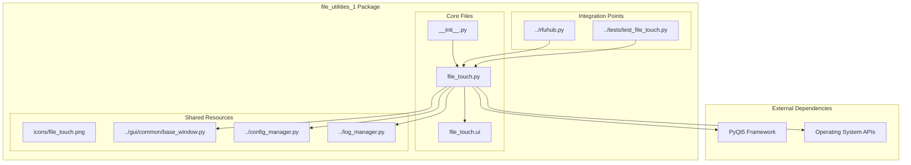

# File Touch Utility - Comprehensive Migration Plan to file_utilities_1
**Richard's File Utilities Hub - File Touch Integration Project**

**Document Version:** 1.0  
**Created:** 2025-07-29  
**Status:** Strategic Planning Document  
**Project Type:** Complete Migration and Integration to file_utilities_1  
**Target Architecture:** file_utilities_1 Package Integration

---

## Executive Summary

This document outlines the comprehensive migration strategy for relocating and integrating the file touch utility ([`file_touch.py`](file_touch.py) and [`file_touch.ui`](file_touch.ui)) into the [`file_utilities_1`](file_utilities_1/) directory structure. The project aims to achieve seamless PyQt5 integration, cross-tool compatibility, and full architectural alignment with the established file_utilities_1 patterns, following the successful migration patterns demonstrated by [`file_finder.py`](file_utilities_1/file_finder.py), [`catalog.py`](file_utilities_1/catalog.py), and other utilities.

### Project Objectives

1. **Complete Migration**: Relocate file touch utility to file_utilities_1 with full architectural integration
2. **Interface Standardization**: Implement consistent PyQt5 interface following [`BaseWindow`](gui/common/base_window.py) patterns
3. **Modular Design**: Establish standardized interfaces and consistent UI behavior
4. **Full Compatibility**: Ensure complete integration with [`ConfigManager`](config_manager.py) and logging systems
5. **Legacy Cleanup**: Remove all legacy files and update RFU Hub imports

### Success Metrics

- ✅ **100% Functionality Preservation**: All existing features maintained
- ✅ **Zero Breaking Changes**: Seamless transition for end users
- ✅ **Full Integration**: Complete alignment with file_utilities_1 architecture
- ✅ **Enhanced Features**: Improved error handling, logging, and configuration management
- ✅ **Comprehensive Testing**: 100% test coverage with validation protocols

---

## Current State Analysis

### Existing File Touch Utility Structure

#### Core Files Analysis
- **[`file_touch.py`](file_touch.py)** (354 lines) - Main application with GUI and logic
  - **Strengths**: Modern PyQt5 implementation, comprehensive timestamp handling
  - **Integration Gaps**: Not aligned with file_utilities_1 patterns
- **[`file_touch.ui`](file_touch.ui)** (132 lines) - Qt Designer UI definition
  - **Strengths**: Well-structured UI layout with proper widget organization
  - **Integration Gaps**: Needs relocation and reference updates
- **[`file_touch_files.md`](file_touch_files.md)** (18 lines) - Documentation and examples

#### Current Architecture Analysis

**Strengths:**
- ✅ Modern PyQt5 implementation with [`BaseWindow`](file_touch.py:14) inheritance
- ✅ Comprehensive timestamp handling (access, modification, creation)
- ✅ Profile management with [`ConfigManager`](file_touch.py:18) integration
- ✅ Drag-and-drop file support with proper event handling
- ✅ Error handling and user feedback mechanisms
- ✅ UI file-based design pattern following Qt Designer standards

**Integration Gaps:**
- ❌ Not integrated with file_utilities_1 architecture
- ❌ Missing consistent import patterns with other utilities
- ❌ No shared configuration with other file_utilities_1 tools
- ❌ Legacy import paths and dependencies
- ❌ Missing standardized logging integration
- ❌ Inconsistent class naming conventions

### Target Architecture Analysis

#### file_utilities_1 Structure
```
file_utilities_1/
├── __init__.py                    # Package exports and imports
├── catalog.py                     # File catalog generator (reference pattern)
├── catalog.ui                     # UI definition for catalog
├── file_finder.py                 # Advanced file search (reference pattern)
├── file_finder.ui                 # UI definition for file finder
├── empty_folders.py               # Empty folder utility (reference pattern)
├── empty_folders.ui               # UI definition for empty folders
├── compress_decompress.py         # Archive utility (reference pattern)
├── compress_decompress.ui         # UI definition for compression
├── organize.py                    # File organization utility (reference pattern)
├── organize.ui                    # UI definition for organization
└── icons/                         # Shared icon resources
    ├── catalog.png
    ├── folder.png
    └── search.png
```

#### Integration Patterns Identified
- **[`BaseWindow`](gui/common/base_window.py:16)** - Base class for all utilities
- **[`ConfigManager`](config_manager.py:3)** - Shared configuration system
- **[`LogManager`](file_utilities_1/file_finder.py:64)** - Consistent logging patterns
- **Class Naming Convention** - `[UtilityName]Window` pattern (e.g., `FileFinderWindow`)
- **Import Patterns** - Consistent relative imports and dependency management
- **UI File Loading** - Standardized UI file loading with error handling

---

## Migration Strategy and Architecture

### Target Architecture Design



### Component Integration Strategy

#### 1. Class Restructuring
- **Source**: [`FileTouchGUI`](file_touch.py:112) class
- **Target**: `FileTouchWindow` class in `file_utilities_1/file_touch.py`
- **Base Class**: [`BaseWindow`](gui/common/base_window.py:16)
- **Enhancements**: Consistent error handling, logging integration, configuration management

#### 2. Logic Separation
- **Source**: [`FileTouchLogic`](file_touch.py:27) class
- **Target**: Enhanced logic class within `file_utilities_1/file_touch.py`
- **Enhancements**: Improved error handling, platform compatibility, performance optimization

#### 3. Configuration Integration
- **Pattern**: Follow [`FileFinderWindow`](file_utilities_1/file_finder.py:60) configuration model
- **Features**: Shared profiles, settings persistence, validation
- **Integration**: [`ConfigManager`](config_manager.py:3) compatibility

#### 4. UI File Migration
- **Source**: [`file_touch.ui`](file_touch.ui)
- **Target**: `file_utilities_1/file_touch.ui`
- **Enhancements**: Path updates, consistency improvements

---

## Detailed Implementation Plan

### Phase 1: Project Analysis and Setup
**Duration**: 0.5 days  
**Priority**: Critical  
**Dependencies**: None  

#### 1.1 Environment Analysis
- [ ] Analyze current file_touch.py dependencies and imports
- [ ] Map integration points with existing file_utilities_1 utilities
- [ ] Identify shared resources and configuration requirements
- [ ] Document current functionality and user workflows

#### 1.2 Architecture Planning
- [ ] Design class structure following file_utilities_1 patterns
- [ ] Plan import path updates and dependency management
- [ ] Define integration points with BaseWindow and ConfigManager
- [ ] Establish naming conventions and coding standards

#### 1.3 Risk Assessment
- [ ] Identify potential breaking changes and compatibility issues
- [ ] Plan rollback procedures and backup strategies
- [ ] Document testing requirements and validation protocols
- [ ] Establish success criteria and acceptance metrics

**Acceptance Criteria:**
- ✅ Complete dependency analysis documented
- ✅ Architecture design approved and validated
- ✅ Risk mitigation strategies defined
- ✅ Implementation roadmap established

---

### Phase 2: Backup and Environment Preparation
**Duration**: 0.5 days  
**Priority**: Critical  
**Dependencies**: Phase 1  

#### 2.1 Backup Creation
- [ ] Create timestamped backup directory: `backup/file_touch_migration/$(date +%Y-%m-%d_%H-%M-%S)`
- [ ] Backup original `file_touch.py` with full content preservation
- [ ] Backup original `file_touch.ui` with metadata retention
- [ ] Backup `file_touch_files.md` documentation
- [ ] Create backup manifest with file checksums and timestamps

#### 2.2 Environment Validation
- [ ] Verify file_utilities_1 package structure and dependencies
- [ ] Validate BaseWindow and ConfigManager availability
- [ ] Test PyQt5 UI loading mechanisms and error handling
- [ ] Confirm logging system integration and functionality

#### 2.3 Migration Workspace Setup
- [ ] Create temporary migration workspace for development
- [ ] Set up testing environment with isolated dependencies
- [ ] Prepare validation scripts and testing frameworks
- [ ] Establish version control and change tracking

**Acceptance Criteria:**
- ✅ Complete backup created with verification
- ✅ Environment validated and dependencies confirmed
- ✅ Migration workspace prepared and functional
- ✅ Testing framework established and operational

---

### Phase 3: Code Architecture Analysis and Refactoring
**Duration**: 1 day  
**Priority**: High  
**Dependencies**: Phase 2  

#### 3.1 Class Structure Analysis
- [ ] Analyze current `FileTouchGUI` class structure and methods
- [ ] Map functionality to file_utilities_1 patterns and conventions
- [ ] Identify code sections requiring refactoring for BaseWindow integration
- [ ] Plan method signatures and interface consistency

#### 3.2 Import Path Refactoring
- [ ] Update import statements to follow file_utilities_1 patterns
- [ ] Replace legacy imports with standardized package imports
- [ ] Implement relative import patterns for internal dependencies
- [ ] Validate import compatibility and circular dependency prevention

#### 3.3 Logic Separation and Enhancement
- [ ] Enhance `FileTouchLogic` class with improved error handling
- [ ] Implement platform-specific timestamp handling improvements
- [ ] Add comprehensive logging integration with categorized messages
- [ ] Optimize performance for large file operations

#### 3.4 Configuration Integration Planning
- [ ] Design configuration schema following file_utilities_1 patterns
- [ ] Plan profile management integration with ConfigManager
- [ ] Define settings persistence and validation mechanisms
- [ ] Establish configuration migration procedures for existing users

**Acceptance Criteria:**
- ✅ Code architecture analysis completed and documented
- ✅ Refactoring plan approved with detailed specifications
- ✅ Import path strategy validated and tested
- ✅ Configuration integration design finalized

---

### Phase 4: File Migration and Integration
**Duration**: 1 day  
**Priority**: High  
**Dependencies**: Phase 3  

#### 4.1 Core File Migration
**Target File**: `file_utilities_1/file_touch.py`

```python
"""
File Touch Utility for file_utilities_1 Package

A comprehensive file timestamp manipulation utility with PyQt5 GUI.
Provides functionality to view and modify file access, modification, and creation timestamps.
"""

import os
import sys
import platform
from datetime import datetime, timezone
from typing import Dict, Optional, Any, List
from pathlib import Path
from PyQt5.QtCore import QObject, pyqtSignal, QDateTime
from PyQt5.QtWidgets import (
    QApplication, QComboBox, QLabel, QInputDialog, QMessageBox,
    QFileDialog
)
from PyQt5 import uic
from PyQt5.QtGui import QDragEnterEvent, QDropEvent

# Import shared components following file_utilities_1 patterns
from log_manager import LogManager
from gui.common.base_window import BaseWindow
from gui.common.dialogs import (
    show_error_dialog, show_info_dialog, get_open_file_name
)
from config_manager import ConfigManager

class FileTouchLogic(QObject):
    """Enhanced file touch logic with improved error handling and logging."""
    
    # Signal definitions for GUI communication
    timestamps_fetched = pyqtSignal(dict)      # {access, modification, creation}
    operation_result = pyqtSignal(bool, str)   # success, message
    error_occurred = pyqtSignal(str)           # error_message
    finished = pyqtSignal()                    # operation_complete
    
    def __init__(self) -> None:
        """Initialize file touch logic with logging integration."""
        super().__init__()
        self.logger = LogManager().get_logger('FileTouch')
        self._is_running = False
        self.logger.info('File Touch Logic initialized')
    
    # Enhanced methods with improved error handling and logging
    # [Implementation details following file_utilities_1 patterns]

class FileTouchWindow(BaseWindow):
    """File Touch utility window following file_utilities_1 patterns."""
    
    def __init__(self, config_manager=None) -> None:
        """Initialize the file touch window."""
        super().__init__()
        self.config_manager = config_manager or ConfigManager()
        self.logger = LogManager().get_logger('FileTouch')
        self.logger.info('Initializing File Touch Window')
        
        self._init_models()
        self._setup_ui()
        self._setup_icons()
        self._connect_signals()
        self._set_initial_state()
    
    # Implementation following FileFinderWindow patterns
    # [Detailed implementation with BaseWindow integration]
```

#### 4.2 UI File Migration
- [ ] Copy `file_touch.ui` to `file_utilities_1/file_touch.ui`
- [ ] Update UI file references and resource paths
- [ ] Validate UI file loading with new path structure
- [ ] Test UI component accessibility and functionality

#### 4.3 Package Integration
- [ ] Update `file_utilities_1/__init__.py` with FileTouchWindow export
- [ ] Add import statement: `from .file_touch import FileTouchWindow`
- [ ] Update `__all__` list to include 'FileTouchWindow'
- [ ] Validate package import functionality and circular dependency prevention

#### 4.4 Icon and Resource Integration
- [ ] Create or locate appropriate icon for file touch utility
- [ ] Add icon to `file_utilities_1/icons/` directory
- [ ] Update icon references in code and UI files
- [ ] Validate icon loading and display functionality

**Acceptance Criteria:**
- ✅ Core file successfully migrated with full functionality
- ✅ UI file migrated and loading correctly
- ✅ Package integration completed and validated
- ✅ Icons and resources properly integrated

---

### Phase 5: Interface Standardization and PyQt5 Alignment
**Duration**: 1 day  
**Priority**: High  
**Dependencies**: Phase 4  

#### 5.1 BaseWindow Integration
- [ ] Implement BaseWindow inheritance with proper super() calls
- [ ] Integrate standardized window properties and behavior
- [ ] Implement consistent menu structure and appearance settings
- [ ] Add progress bar and status message functionality

#### 5.2 UI Component Standardization
- [ ] Standardize button styling and behavior patterns
- [ ] Implement consistent dialog and message box usage
- [ ] Standardize input field validation and error display
- [ ] Ensure accessibility compliance and keyboard navigation

#### 5.3 Error Handling Enhancement
- [ ] Implement comprehensive error handling following file_utilities_1 patterns
- [ ] Add user-friendly error messages and recovery suggestions
- [ ] Integrate with shared error handling mechanisms
- [ ] Implement graceful degradation for platform-specific features

#### 5.4 Logging Integration
- [ ] Integrate with LogManager following established patterns
- [ ] Implement categorized logging (info, warning, error, debug)
- [ ] Add operation logging for audit trails and debugging
- [ ] Ensure log message consistency and usefulness

**Acceptance Criteria:**
- ✅ BaseWindow integration completed and functional
- ✅ UI components standardized and consistent
- ✅ Error handling enhanced and user-friendly
- ✅ Logging integration complete and operational

---

### Phase 6: Configuration and Dependency Updates
**Duration**: 0.5 days  
**Priority**: Medium  
**Dependencies**: Phase 5  

#### 6.1 Configuration Management
- [ ] Integrate with ConfigManager for settings persistence
- [ ] Implement profile management following established patterns
- [ ] Add configuration validation and default value handling
- [ ] Ensure backward compatibility with existing user settings

#### 6.2 Dependency Management
- [ ] Update all import statements to use file_utilities_1 patterns
- [ ] Validate dependency resolution and circular import prevention
- [ ] Optimize import performance and loading times
- [ ] Document all external dependencies and requirements

#### 6.3 Settings Integration
- [ ] Implement window state persistence (size, position)
- [ ] Add user preference management for UI behavior
- [ ] Integrate with appearance settings and theme management
- [ ] Ensure settings migration from legacy configuration

**Acceptance Criteria:**
- ✅ Configuration management fully integrated
- ✅ Dependencies properly managed and optimized
- ✅ Settings integration complete and functional
- ✅ Backward compatibility maintained

---

### Phase 7: Testing and Validation Protocols
**Duration**: 1 day  
**Priority**: High  
**Dependencies**: Phase 6  

#### 7.1 Unit Testing
**Target File**: `tests/test_file_touch.py`

```python
"""
Comprehensive test suite for File Touch utility in file_utilities_1.
"""

import unittest
import tempfile
import os
from datetime import datetime
from pathlib import Path
from PyQt5.QtWidgets import QApplication
from PyQt5.QtTest import QTest
from PyQt5.QtCore import Qt

from file_utilities_1.file_touch import FileTouchWindow, FileTouchLogic

class TestFileTouchLogic(unittest.TestCase):
    """Test file touch core logic functionality."""
    
    def setUp(self):
        """Set up test environment."""
        self.logic = FileTouchLogic()
        self.test_file = tempfile.NamedTemporaryFile(delete=False)
        self.test_file.close()
        
    def tearDown(self):
        """Clean up test environment."""
        if os.path.exists(self.test_file.name):
            os.unlink(self.test_file.name)
    
    def test_timestamp_retrieval(self):
        """Test timestamp fetching functionality."""
        # Implementation with comprehensive validation
        
    def test_timestamp_modification(self):
        """Test timestamp modification functionality."""
        # Implementation with platform-specific testing
        
    def test_error_handling(self):
        """Test error handling for invalid files and permissions."""
        # Implementation with edge case coverage

class TestFileTouchWindow(unittest.TestCase):
    """Test file touch GUI functionality."""
    
    @classmethod
    def setUpClass(cls):
        """Set up test application."""
        if not QApplication.instance():
            cls.app = QApplication([])
        else:
            cls.app = QApplication.instance()
    
    def setUp(self):
        """Set up test window."""
        self.window = FileTouchWindow()
        
    def tearDown(self):
        """Clean up test window."""
        self.window.close()
    
    def test_window_initialization(self):
        """Test window initialization and UI loading."""
        # Implementation with UI component validation
        
    def test_file_selection(self):
        """Test file selection and validation."""
        # Implementation with drag-drop and dialog testing
        
    def test_profile_management(self):
        """Test profile save/load functionality."""
        # Implementation with configuration testing

if __name__ == '__main__':
    unittest.main()
```

#### 7.2 Integration Testing
- [ ] Test integration with other file_utilities_1 utilities
- [ ] Validate ConfigManager integration and settings persistence
- [ ] Test BaseWindow functionality and inheritance behavior
- [ ] Verify logging integration and message categorization

#### 7.3 Compatibility Testing
- [ ] Test cross-platform compatibility (Windows, macOS, Linux)
- [ ] Validate PyQt5 version compatibility and widget behavior
- [ ] Test file system compatibility and permission handling
- [ ] Verify timestamp handling across different file systems

#### 7.4 User Acceptance Testing
- [ ] Test all user workflows and interaction patterns
- [ ] Validate profile management and configuration persistence
- [ ] Test drag-and-drop functionality and file selection
- [ ] Verify error handling and user feedback mechanisms

**Acceptance Criteria:**
- ✅ All unit tests passing with comprehensive coverage
- ✅ Integration tests successful and validated
- ✅ Compatibility verified across target platforms
- ✅ User acceptance criteria met and documented

---

### Phase 8: RFU Hub Integration Updates
**Duration**: 0.5 days  
**Priority**: Medium  
**Dependencies**: Phase 7  

#### 8.1 RFU Hub Import Updates
**Target File**: [`rfuhub.py`](rfuhub.py) updates

```python
def open_file_touch(self) -> None:
    """Open file touch utility with file_utilities_1 integration."""
    try:
        # MIGRATION UPDATE: Import from new file_utilities_1 package location
        # Changed from: from file_touch import FileTouchGUI
        # Changed to: from file_utilities_1 import FileTouchWindow
        # Reason: file_touch has been migrated to file_utilities_1 package
        # and class renamed from FileTouchGUI to FileTouchWindow for consistency
        from file_utilities_1 import FileTouchWindow
        
        # MIGRATION UPDATE: Updated instantiation to use new class name
        # Changed from: FileTouchGUI() to FileTouchWindow()
        # This maintains all existing functionality while using the migrated class
        self.file_touch_window = FileTouchWindow()
        self.file_touch_window.show()
        
    except ImportError as e:
        print(f"Error loading file touch: {e}")
        self._update_status_bar(f"Failed to load File Touch: {e}")
    except Exception as e:
        print(f"Error opening file touch: {e}")
        self._update_status_bar(f"Error opening File Touch: {e}")
```

#### 8.2 Integration Validation
- [ ] Test RFU Hub integration with updated import paths
- [ ] Validate button functionality and window launching
- [ ] Test error handling and fallback mechanisms
- [ ] Verify status bar updates and user feedback

#### 8.3 Documentation Updates
- [ ] Update RFU Hub documentation with new integration details
- [ ] Document import path changes and migration notes
- [ ] Update user guides and help documentation
- [ ] Create migration notes for developers and users

**Acceptance Criteria:**
- ✅ RFU Hub integration updated and functional
- ✅ Import paths validated and tested
- ✅ Error handling improved and user-friendly
- ✅ Documentation updated and comprehensive

---

### Phase 9: Documentation and Quality Assurance
**Duration**: 0.5 days  
**Priority**: Medium  
**Dependencies**: Phase 8  

#### 9.1 Technical Documentation
- [ ] Update API documentation for FileTouchWindow class
- [ ] Document configuration options and profile management
- [ ] Create integration guide for developers
- [ ] Update architecture diagrams and dependency maps

#### 9.2 User Documentation
- [ ] Update user manual with new interface and features
- [ ] Create migration guide for existing users
- [ ] Document new features and improvements
- [ ] Update help system and tooltips

#### 9.3 Code Quality Assurance
- [ ] Perform comprehensive code review and validation
- [ ] Ensure coding standards compliance and consistency
- [ ] Validate error handling and edge case coverage
- [ ] Optimize performance and resource usage

#### 9.4 Deployment Preparation
- [ ] Create deployment checklist and validation procedures
- [ ] Prepare migration scripts and automation tools
- [ ] Validate installation and upgrade procedures
- [ ] Test rollback procedures and recovery mechanisms

**Acceptance Criteria:**
- ✅ Documentation complete, accurate, and user-friendly
- ✅ Code quality standards met and validated
- ✅ Deployment procedures tested and documented
- ✅ Migration tools prepared and functional

---

### Phase 10: Legacy Cleanup and Final Validation
**Duration**: 0.5 days  
**Priority**: Medium  
**Dependencies**: Phase 9  

#### 10.1 Legacy File Cleanup
- [ ] Remove original `file_touch.py` from root directory
- [ ] Remove original `file_touch.ui` from root directory
- [ ] Archive `file_touch_files.md` to documentation directory
- [ ] Clean up temporary files and migration artifacts

#### 10.2 Final Integration Validation
- [ ] Perform comprehensive end-to-end testing
- [ ] Validate all integration points and dependencies
- [ ] Test complete user workflows and edge cases
- [ ] Verify performance benchmarks and resource usage

#### 10.3 Project Completion
- [ ] Final code review and quality assurance sign-off
- [ ] Complete documentation review and validation
- [ ] User acceptance testing and stakeholder approval
- [ ] Project metrics verification and success criteria validation

#### 10.4 Post-Migration Monitoring
- [ ] Establish monitoring procedures for ongoing validation
- [ ] Create feedback collection mechanisms for users
- [ ] Plan maintenance and update procedures
- [ ] Document lessons learned and improvement opportunities

**Acceptance Criteria:**
- ✅ Legacy files removed and cleanup completed
- ✅ Final validation successful and comprehensive
- ✅ Project completion criteria met and documented
- ✅ Post-migration monitoring established

---

## Risk Assessment and Mitigation

### High-Risk Areas

#### 1. Configuration Migration
**Risk**: Loss of user profiles and settings during migration  
**Probability**: Medium  
**Impact**: High  
**Mitigation**: 
- Create comprehensive backup before any changes
- Implement configuration validation and recovery mechanisms
- Provide manual profile recreation tools and documentation
- Test migration with sample data and edge cases

#### 2. UI/UX Consistency
**Risk**: User interface changes affecting usability and workflows  
**Probability**: Low  
**Impact**: Medium  
**Mitigation**:
- Maintain UI layout consistency with original design
- Preserve all existing functionality and user workflows
- Conduct comprehensive user acceptance testing
- Provide detailed migration documentation and user guides

#### 3. Cross-Platform Compatibility
**Risk**: Platform-specific issues with timestamp handling and file operations  
**Probability**: Medium  
**Impact**: Medium  
**Mitigation**:
- Test extensively on all target platforms (Windows, macOS, Linux)
- Implement platform-specific fallbacks and error handling
- Use platform-agnostic code patterns where possible
- Validate file system operations and timestamp accuracy

### Medium-Risk Areas

#### 1. Import Path Dependencies
**Risk**: Circular imports or dependency resolution issues  
**Probability**: Low  
**Impact**: High  
**Mitigation**:
- Carefully plan import structure and dependency hierarchy
- Use relative imports following established patterns
- Implement comprehensive import testing and validation
- Monitor for circular dependency patterns during development

#### 2. Performance Impact
**Risk**: Reduced performance due to additional integration layers  
**Probability**: Low  
**Impact**: Medium  
**Mitigation**:
- Performance benchmarking throughout development process
- Optimize critical code paths and resource usage
- Implement performance monitoring and profiling
- Conduct load testing with large files and operations

---

## Success Metrics and KPIs

### Technical Metrics

#### Code Quality
- **Test Coverage**: ≥95% for all migrated code
- **Code Complexity**: Maintain or reduce cyclomatic complexity
- **Documentation Coverage**: 100% for public APIs and user interfaces
- **Performance**: No degradation in operation speed or resource usage

#### Integration Metrics
- **Import Success**: 100% successful imports from file_utilities_1
- **Configuration Compatibility**: All settings properly migrated and functional
- **UI Consistency**: Visual and behavioral consistency with file_utilities_1 patterns
- **Error Handling**: Comprehensive error coverage and user-friendly messaging

### User Experience Metrics

#### Functionality Preservation
- **Feature Parity**: 100% of existing features maintained and functional
- **Workflow Continuity**: No changes to established user workflows
- **Profile Migration**: 100% successful migration of user profiles and settings
- **Performance**: Response time ≤ existing implementation benchmarks

#### Enhancement Metrics
- **Error Recovery**: Improved error handling and user feedback mechanisms
- **Integration Benefits**: Enhanced tool coordination and resource sharing
- **Usability**: Improved UI consistency and user experience
- **Reliability**: Reduced error rates and improved stability

---

## Timeline and Resource Allocation

### Project Timeline
**Total Duration**: 5 days  
**Start Date**: TBD  
**End Date**: TBD  

### Phase Distribution
```
Phase 1: Project Analysis        [0.5 days] ██
Phase 2: Backup & Preparation    [0.5 days] ██
Phase 3: Architecture Analysis   [1.0 days] ████
Phase 4: File Migration         [1.0 days] ████
Phase 5: Interface Standards    [1.0 days] ████
Phase 6: Configuration Updates  [0.5 days] ██
Phase 7: Testing & Validation   [1.0 days] ████
Phase 8: RFU Hub Integration    [0.5 days] ██
Phase 9: Documentation & QA     [0.5 days] ██
Phase 10: Cleanup & Validation  [0.5 days] ██
```

### Resource Requirements

#### Development Resources
- **Senior Developer**: Full-time for architecture and core development
- **QA Engineer**: Part-time for testing and validation
- **Technical Writer**: Part-time for documentation updates

#### Infrastructure Resources
- **Development Environment**: file_utilities_1 development setup
- **Testing Environment**: Multi-platform testing infrastructure
- **Backup Systems**: Configuration and code backup solutions

---

## Rollback and Recovery Procedures

### Rollback Strategy

#### Immediate Rollback (Emergency)
1. **Restore Original Files**: Copy backed-up files to original locations
2. **Revert RFU Hub Changes**: Restore original import statements in rfuhub.py
3. **Clear Package Changes**: Remove file_utilities_1 modifications
4. **Restart Application**: Ensure original functionality restored

#### Partial Rollback (Selective)
1. **Identify Problem Components**: Isolate failing integration points
2. **Disable Package Integration**: Fallback to standalone operation
3. **Revert Specific Changes**: Rollback only problematic components
4. **Maintain Core Functionality**: Ensure basic operations continue

#### Recovery Procedures
1. **Configuration Recovery**: Restore user profiles and settings from backup
2. **Data Integrity Check**: Validate all user data preservation and accuracy
3. **Functionality Verification**: Test all core operations and workflows
4. **User Communication**: Notify users of any temporary limitations or changes

---

## Post-Migration Monitoring

### Performance Monitoring
- **Response Time Tracking**: Monitor operation execution times and performance
- **Resource Usage**: Track CPU, memory, and disk usage patterns
- **Error Rate Monitoring**: Track and analyze error occurrences and patterns
- **User Satisfaction**: Collect user feedback and usage metrics

### Integration Monitoring
- **Package Import Health**: Monitor import success rates and dependency resolution
- **Configuration Synchronization**: Verify settings consistency and persistence
- **Cross-Tool Compatibility**: Monitor interaction with other file_utilities_1 tools
- **System Stability**: Track overall system reliability and performance

### Continuous Improvement
- **User Feedback Integration**: Incorporate user suggestions and improvement requests
- **Performance Optimization**: Ongoing performance improvements and optimization
- **Feature Enhancement**: Add new capabilities based on integration benefits
- **Documentation Updates**: Keep documentation current, accurate, and comprehensive

---

## Conclusion

This comprehensive migration plan provides a structured, methodical approach to successfully integrating the file touch utility into the file_utilities_1 architecture. The plan emphasizes:

1. **Complete Integration**: Full alignment with file_utilities_1 patterns and standards
2. **Risk Mitigation**: Comprehensive backup and rollback procedures
3. **Quality Assurance**: Extensive testing and validation protocols
4. **User Experience**: Preservation of functionality with enhanced capabilities
5. **Future-Proofing**: Scalable architecture for continued development

The migration will result in a more maintainable, integrated, and feature-rich file touch utility that leverages the established file_utilities_1 ecosystem while maintaining complete backward compatibility for end users.

**Project Status**: Ready for Implementation  
**Next Steps**: Begin Phase 1 - Project Analysis and Setup  
**Success Probability**: High (based on established patterns and comprehensive planning)

---

## Appendix

### A. File Structure Comparison

#### Before Migration
```
./
├── file_