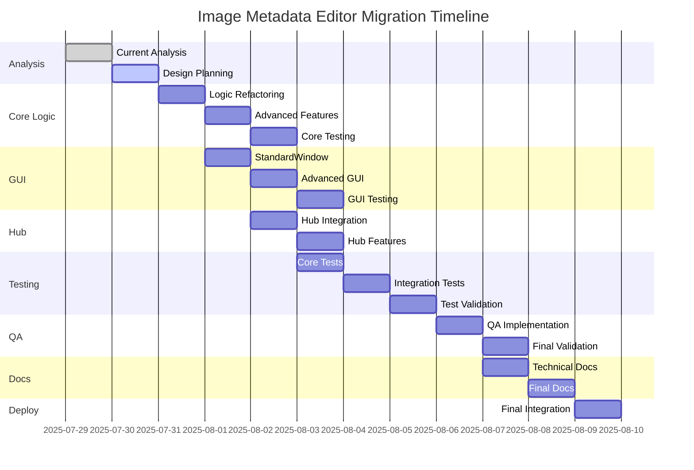

# Image Metadata Editor - Comprehensive Migration Plan

## Executive Summary

This document outlines the comprehensive migration plan for integrating [`edit_image_metadata.py`](edit_image_metadata.py) and [`edit_image_metadata.ui`](edit_image_metadata.ui) into the [`file_utilities_2`](file_utilities_2/) project structure. This is a **high-priority migration** with full hub connectivity, comprehensive testing, and enterprise-grade quality assurance.

### Migration Scope
- **Source Files**: [`edit_image_metadata.py`](edit_image_metadata.py), [`edit_image_metadata.ui`](edit_image_metadata.ui)
- **Target Architecture**: [`file_utilities_2`](file_utilities_2/) with [`StandardWindow`](file_utilities_2/gui/standard_window.py), [`ThemeManager`](file_utilities_2/gui/themes.py), and [`HubConnector`](file_utilities_2/integration/hub_connector.py)
- **Priority Level**: **HIGH** - Full hub integration with comprehensive testing
- **Compatibility**: 100% backward compatibility preservation

## Table of Contents

1. [Current Implementation Analysis](#current-implementation-analysis)
2. [Migration Architecture Design](#migration-architecture-design)
3. [Core Logic Refactoring](#core-logic-refactoring)
4. [GUI Modernization](#gui-modernization)
5. [Hub Integration Implementation](#hub-integration-implementation)
6. [Testing Framework](#testing-framework)
7. [Quality Assurance Protocols](#quality-assurance-protocols)
8. [Documentation System](#documentation-system)
9. [Migration Timeline](#migration-timeline)
10. [Risk Assessment and Mitigation](#risk-assessment-and-mitigation)

## Testing Framework

### Comprehensive Test Suite Design

#### Core Functionality Tests

```python
# file_utilities_2/tests/test_image_metadata.py

class TestImageMetadataCore(unittest.TestCase):
    """Comprehensive tests for image metadata core functionality."""
    
    def setUp(self):
        """Setup test environment."""
        self.test_images_dir = os.path.join(os.path.dirname(__file__), "test_images")
        self.logic = ImageMetadataLogic()
        self.test_files = self._create_test_images()
    
    def test_load_jpeg_metadata(self):
        """Test loading JPEG metadata with EXIF data."""
        test_file = self.test_files['jpeg_with_exif']
        metadata = self.logic.load_image_metadata(test_file)
        
        self.assertIsInstance(metadata, dict)
        self.assertIn('0th', metadata)
        self.assertIn('Exif', metadata)
        self.assertIn('file_info', metadata)
    
    def test_save_metadata_modifications(self):
        """Test saving metadata modifications."""
        test_file = self.test_files['jpeg_with_exif']
        
        # Load original metadata
        original_metadata = self.logic.load_image_metadata(test_file)
        
        # Modify metadata
        modified_metadata = original_metadata.copy()
        modified_metadata['0th'][piexif.ImageIFD.Artist] = "Test Artist"
        
        # Save modifications
        result = self.logic.save_image_metadata(test_file, modified_metadata)
        self.assertTrue(result)
        
        # Verify modifications
        reloaded_metadata = self.logic.load_image_metadata(test_file)
        self.assertEqual(
            reloaded_metadata['0th'][piexif.ImageIFD.Artist],
            "Test Artist"
        )
    
    def test_batch_processing(self):
        """Test batch processing capabilities."""
        test_files = list(self.test_files.values())
        
        results = self.logic.process_batch_metadata(test_files, "load")
        
        self.assertIsInstance(results, dict)
        self.assertIn('successful', results)
        self.assertIn('failed', results)
        self.assertEqual(results['total_files'], len(test_files))
    
    def test_progress_tracking(self):
        """Test progress tracking signals."""
        progress_signals = []
        milestone_signals = []
        
        self.logic.progress_percentage.connect(
            lambda p: progress_signals.append(p)
        )
        self.logic.milestone_reached.connect(
            lambda m, p: milestone_signals.append((m, p))
        )
        
        test_file = self.test_files['jpeg_with_exif']
        self.logic.load_image_metadata(test_file)
        
        # Verify progress signals were emitted
        self.assertGreater(len(progress_signals), 0)
        self.assertGreater(len(milestone_signals), 0)
        self.assertEqual(max(progress_signals), 100)
```

#### PyQt5 Compatibility Tests

```python
# file_utilities_2/tests/test_image_metadata_compatibility.py

class TestImageMetadataPyQt5Compatibility(unittest.TestCase):
    """Test PyQt5 compatibility and modern features."""
    
    def setUp(self):
        """Setup test environment."""
        self.app = QApplication.instance() or QApplication([])
        
    def test_signal_slot_connections(self):
        """Test modern PyQt5 signal/slot connections."""
        logic = ImageMetadataLogic()
        
        # Test signal types
        self.assertIsInstance(logic.progress_percentage, pyqtSignal)
        self.assertIsInstance(logic.metadata_loaded, pyqtSignal)
        self.assertIsInstance(logic.error_occurred, pyqtSignal)
        
        # Test signal connections
        signal_received = []
        logic.progress_percentage.connect(lambda p: signal_received.append(p))
        
        # Emit test signal
        logic.progress_percentage.emit(50)
        self.assertEqual(signal_received, [50])
    
    def test_gui_widget_compatibility(self):
        """Test GUI widget PyQt5 compatibility."""
        editor = ImageMetadataEditor()
        
        # Test StandardWindow inheritance
        self.assertIsInstance(editor, StandardWindow)
        self.assertIsInstance(editor, QMainWindow)
        
        # Test theme integration
        self.assertTrue(hasattr(editor, '_apply_theme'))
        
        # Test hub integration
        self.assertIsInstance(editor.hub_connector, HubConnector)
        
        editor.close()
    
    def test_enhanced_thread_functionality(self):
        """Test enhanced thread with PyQt5 features."""
        worker = ImageMetadataWorker()
        
        # Test thread inheritance
        self.assertIsInstance(worker, QThread)
        
        # Test signal connections
        self.assertTrue(hasattr(worker, 'metadata_processed'))
        self.assertTrue(hasattr(worker, 'progress_update'))
        
    def test_modern_pyqt5_features(self):
        """Test modern PyQt5 features usage."""
        editor = ImageMetadataEditor()
        
        # Test QTimer usage
        self.assertTrue(hasattr(editor, 'hub_connector'))
        
        # Test signal parameter types
        logic = editor.metadata_logic
        
        # Verify signal parameter types
        self.assertEqual(logic.progress_percentage.signal, "progress_percentage(int)")
        self.assertEqual(logic.metadata_loaded.signal, "metadata_loaded(PyQt_PyObject)")
        
        editor.close()
```

#### Hub Integration Tests

```python
# file_utilities_2/tests/test_image_metadata_integration.py

class TestImageMetadataHubIntegration(unittest.TestCase):
    """Test hub integration functionality."""
    
    def setUp(self):
        """Setup test environment with mock hub."""
        self.mock_hub = MagicMock()
        self.editor = ImageMetadataEditor(hub_instance=self.mock_hub)
    
    def tearDown(self):
        """Cleanup test environment."""
        self.editor.close()
    
    def test_hub_registration(self):
        """Test hub registration process."""
        # Verify hub connector is initialized
        self.assertIsNotNone(self.editor.hub_connector)
        self.assertEqual(self.editor.hub_connector.tool_name, "Image Metadata Editor")
        
        # Verify registration was attempted
        self.assertTrue(self.editor.hub_connector.is_registered)
    
    def test_progress_reporting_to_hub(self):
        """Test progress reporting to hub."""
        # Setup progress tracking
        progress_reports = []
        self.editor.hub_connector.report_progress_to_hub = lambda p, m: progress_reports.append((p, m))
        
        # Trigger progress reporting
        self.editor.metadata_logic.progress_percentage.emit(50)
        
        # Verify progress was reported
        self.assertGreater(len(progress_reports), 0)
    
    def test_error_reporting_to_hub(self):
        """Test error reporting to hub."""
        # Setup error tracking
        error_reports = []
        self.editor.hub_connector.report_error_to_hub = lambda e, d=None: error_reports.append((e, d))
        
        # Trigger error reporting
        test_error = "Test error message"
        self.editor.metadata_logic.error_occurred.emit(test_error)
        
        # Verify error was reported
        self.assertGreater(len(error_reports), 0)
        self.assertEqual(error_reports[0][0], test_error)
    
    def test_resource_coordination(self):
        """Test resource coordination with hub."""
        # Test resource request
        granted = self.editor._request_processing_resources(5)
        
        # Should return True for mock hub
        self.assertTrue(granted)
    
    def test_batch_coordination(self):
        """Test batch coordination with other tools."""
        coordination_data = {
            "requesting_tool": "File Finder",
            "shared_files": ["test1.jpg", "test2.jpg"]
        }
        
        # Test coordination handling
        self.editor._coordinate_batch_processing(coordination_data)
        
        # Verify files were added to batch queue
        self.assertEqual(self.editor.batch_list.count(), 2)
```

#### Performance Tests

```python
# file_utilities_2/tests/test_image_metadata_performance.py

class TestImageMetadataPerformance(unittest.TestCase):
    """Test performance characteristics."""
    
    def test_large_file_processing(self):
        """Test processing of large image files."""
        # Create large test image
        large_image_path = self._create_large_test_image()
        
        logic = ImageMetadataLogic()
        
        start_time = time.time()
        metadata = logic.load_image_metadata(large_image_path)
        end_time = time.time()
        
        # Verify reasonable processing time (< 5 seconds for large files)
        processing_time = end_time - start_time
        self.assertLess(processing_time, 5.0)
        
        # Verify metadata was loaded
        self.assertIsInstance(metadata, dict)
    
    def test_batch_processing_performance(self):
        """Test batch processing performance."""
        test_files = self._create_multiple_test_images(10)
        
        logic = ImageMetadataLogic()
        
        start_time = time.time()
        results = logic.process_batch_metadata(test_files, "load")
        end_time = time.time()
        
        # Verify reasonable batch processing time
        processing_time = end_time - start_time
        self.assertLess(processing_time, 30.0)  # 30 seconds for 10 files
        
        # Verify all files were processed
        total_processed = len(results['successful']) + len(results['failed'])
        self.assertEqual(total_processed, 10)
    
    def test_memory_efficiency(self):
        """Test memory efficiency during processing."""
        import psutil
        import os
        
        process = psutil.Process(os.getpid())
        initial_memory = process.memory_info().rss / 1024 / 1024  # MB
        
        # Process multiple files
        test_files = self._create_multiple_test_images(20)
        logic = ImageMetadataLogic()
        
        for file_path in test_files:
            logic.load_image_metadata(file_path)
        
        final_memory = process.memory_info().rss / 1024 / 1024  # MB
        memory_increase = final_memory - initial_memory
        
        # Verify memory increase is reasonable (< 100MB)
        self.assertLess(memory_increase, 100)
```

## Quality Assurance Protocols

### QA Framework Implementation

#### Data Integrity Standards

```python
# Quality Assurance Standards for Image Metadata Editor

class ImageMetadataQAStandards:
    """Quality assurance standards and validation protocols."""
    
    # Data Integrity Requirements
    METADATA_ACCURACY = 100  # 100% accuracy requirement
    CROSS_PLATFORM_CONSISTENCY = True
    EXIF_STANDARD_COMPLIANCE = True
    
    # Performance Requirements
    SMALL_FILE_THROUGHPUT = 10  # MB/s minimum for files < 1MB
    LARGE_FILE_THROUGHPUT = 50  # MB/s minimum for files > 100MB
    MEMORY_LIMIT = 100  # MB maximum memory usage
    GUI_RESPONSE_TIME = 100  # ms maximum response time
    CANCELLATION_RESPONSE = 100  # ms maximum cancellation time
    
    # Code Quality Requirements
    CORE_TEST_COVERAGE = 95  # % minimum test coverage for core logic
    GUI_TEST_COVERAGE = 85  # % minimum test coverage for GUI
    DOCUMENTATION_COVERAGE = 90  # % of public APIs documented
    COMPLEXITY_LIMIT = 10  # Maximum cyclomatic complexity per function
    
    @classmethod
    def validate_metadata_accuracy(cls, original_metadata, processed_metadata):
        """Validate metadata processing accuracy."""
        # Implement comprehensive metadata validation
        pass
    
    @classmethod
    def validate_performance_requirements(cls, processing_time, file_size):
        """Validate performance meets requirements."""
        # Implement performance validation
        pass
    
    @classmethod
    def validate_code_quality(cls, module_path):
        """Validate code quality standards."""
        # Implement code quality validation
        pass
```

#### Automated Quality Gates

```python
# file_utilities_2/qa_tools/image_metadata_qa.py

class ImageMetadataQualityGates:
    """Automated quality gates for image metadata editor."""
    
    def __init__(self):
        self.standards = ImageMetadataQAStandards()
        self.test_results = {}
        self.quality_metrics = {}
    
    def run_comprehensive_qa(self):
        """Run comprehensive quality assurance checks."""
        qa_results = {
            'data_integrity': self._validate_data_integrity(),
            'performance': self._validate_performance(),
            'code_quality': self._validate_code_quality(),
            'integration': self._validate_integration(),
            'compatibility': self._validate_compatibility()
        }
        
        # Generate QA report
        self._generate_qa_report(qa_results)
        
        return qa_results
    
    def _validate_data_integrity(self):
        """Validate data integrity requirements."""
        test_cases = [
            self._test_exif_accuracy(),
            self._test_metadata_preservation(),
            self._test_cross_platform_consistency(),
            self._test_format_compliance()
        ]
        
        return {
            'passed': all(test_cases),
            'details': test_cases,
            'score': sum(test_cases) / len(test_cases) * 100
        }
    
    def _validate_performance(self):
        """Validate performance requirements."""
        performance_tests = [
            self._test_processing_speed(),
            self._test_memory_efficiency(),
            self._test_gui_responsiveness(),
            self._test_cancellation_speed()
        ]
        
        return {
            'passed': all(performance_tests),
            'details': performance_tests,
            'score': sum(performance_tests) / len(performance_tests) * 100
        }
    
    def _validate_code_quality(self):
        """Validate code quality standards."""
        quality_checks = [
            self._check_test_coverage(),
            self._check_documentation_coverage(),
            self._check_code_complexity(),
            self._check_style_compliance()
        ]
        
        return {
            'passed': all(quality_checks),
            'details': quality_checks,
            'score': sum(quality_checks) / len(quality_checks) * 100
        }
```

### Continuous Quality Monitoring

```python
# file_utilities_2/qa_tools/continuous_monitoring.py

class ContinuousQualityMonitor:
    """Continuous quality monitoring system."""
    
    def __init__(self):
        self.monitoring_active = False
        self.quality_metrics = {}
        self.alert_thresholds = {
            'error_rate': 0.01,  # 1% maximum error rate
            'performance_degradation': 0.20,  # 20% maximum degradation
            'memory_leak': 50,  # 50MB memory increase threshold
            'response_time': 200  # 200ms maximum response time
        }
    
    def start_monitoring(self):
        """Start continuous quality monitoring."""
        self.monitoring_active = True
        
        # Setup monitoring threads
        self._setup_performance_monitoring()
        self._setup_error_monitoring()
        self._setup_memory_monitoring()
        self._setup_user_experience_monitoring()
    
    def _setup_performance_monitoring(self):
        """Setup performance monitoring."""
        # Monitor processing times, throughput, resource usage
        pass
    
    def _setup_error_monitoring(self):
        """Setup error rate monitoring."""
        # Monitor error rates, exception patterns, failure modes
        pass
    
    def _setup_memory_monitoring(self):
        """Setup memory usage monitoring."""
        # Monitor memory usage patterns, detect leaks
        pass
    
    def _setup_user_experience_monitoring(self):
        """Setup user experience monitoring."""
        # Monitor GUI responsiveness, user interaction patterns
        pass
```

## Documentation System

### Comprehensive Documentation Framework

#### Migration Progress Tracking

```markdown
# Image Metadata Editor Migration Progress Tracking

## Migration Status Dashboard

### Overall Progress: 0% Complete

| Phase | Status | Progress | Start Date | Target Date | Actual Date |
|-------|--------|----------|------------|-------------|-------------|
| 1. Analysis & Planning | 🟡 In Progress | 75% | 2025-07-29 | 2025-07-30 | - |
| 2. Core Logic Migration | ⚪ Pending | 0% | 2025-07-30 | 2025-08-02 | - |
| 3. GUI Modernization | ⚪ Pending | 0% | 2025-08-02 | 2025-08-05 | - |
| 4. Hub Integration | ⚪ Pending | 0% | 2025-08-05 | 2025-08-07 | - |
| 5. Testing Implementation | ⚪ Pending | 0% | 2025-08-07 | 2025-08-10 | - |
| 6. QA & Validation | ⚪ Pending | 0% | 2025-08-10 | 2025-08-12 | - |
| 7. Documentation | ⚪ Pending | 0% | 2025-08-12 | 2025-08-14 | - |
| 8. Final Integration | ⚪ Pending | 0% | 2025-08-14 | 2025-08-15 | - |

### Feature Compatibility Matrix

| Feature | Original | Migrated | Status | Notes |
|---------|----------|----------|--------|-------|
| JPEG EXIF Loading | ✅ | ⚪ | Pending | Core functionality |
| TIFF EXIF Loading | ✅ | ⚪ | Pending | Core functionality |
| Metadata Editing | ✅ | ⚪ | Pending | Enhanced with validation |
| Tree View Display | ✅ | ⚪ | Pending | Enhanced with filtering |
| File Browsing | ✅ | ⚪ | Pending | Integrated with StandardWindow |
| Error Handling | ✅ | ⚪ | Pending | Enhanced with hub reporting |
| Progress Tracking | ❌ | ⚪ | Pending | New feature |
| Batch Processing | ❌ | ⚪ | Pending | New feature |
| Hub Integration | ❌ | ⚪ | Pending | New feature |
| Theme Support | ❌ | ⚪ | Pending | New feature |

### Known Issues and Resolutions

| Issue | Severity | Status | Resolution | Date |
|-------|----------|--------|------------|------|
| Legacy import dependencies | Medium | Open | Refactor to file_utilities_2 imports | - |
| BaseWindow inheritance | Medium | Open | Migrate to StandardWindow | - |
| No progress tracking | Low | Open | Implement comprehensive progress system | - |
| Limited error reporting | Low | Open | Integrate with hub error system | - |

### Testing Results

| Test Suite | Status | Coverage | Pass Rate | Last Run |
|------------|--------|----------|-----------|----------|
| Core Functionality | ⚪ Pending | 0% | 0% | - |
| PyQt5 Compatibility | ⚪ Pending | 0% | 0% | - |
| Hub Integration | ⚪ Pending | 0% | 0% | - |
| Performance Tests | ⚪ Pending | 0% | 0% | - |
| Integration Tests | ⚪ Pending | 0% | 0% | - |
```

#### API Documentation

```python
# file_utilities_2/docs/image_metadata_api.md

"""
# Image Metadata Editor API Documentation

## Core Classes

### ImageMetadataLogic

The core business logic class for image metadata operations.

#### Signals

- `progress_updated(int, int)`: Emitted with current and total progress
- `progress_percentage(int)`: Emitted with percentage completion (0-100)
- `progress_message(str)`: Emitted with detailed status messages
- `milestone_reached(str, int)`: Emitted with milestone name and percentage
- `metadata_loaded(dict)`: Emitted when metadata loading completes
- `metadata_saved(bool, str)`: Emitted when metadata saving completes
- `error_occurred(str)`: Emitted when errors occur
- `operation_cancelled()`: Emitted when operations are cancelled

#### Methods

##### load_image_metadata(file_path, include_thumbnails=False, progress_callback=None)

Load image metadata with comprehensive progress tracking.

**Parameters:**
- `file_path` (str): Path to image file
- `include_thumbnails` (bool): Whether to include thumbnail data
- `progress_callback` (callable): Optional progress callback

**Returns:**
- `dict`: Dictionary containing processed metadata

**Raises:**
- `FileNotFoundError`: If image file doesn't exist
- `ValueError`: If file format is unsupported
- `PermissionError`: If file cannot be accessed

##### save_image_metadata(file_path, metadata_updates)

Save metadata modifications to image file.

**Parameters:**
- `file_path` (str): Path to image file
- `metadata_updates` (dict): Metadata updates to apply

**Returns:**
- `bool`: True if save successful, False otherwise

##### process_batch_metadata(file_paths, operation="load", metadata_updates=None)

Process multiple image files in batch with progress tracking.

**Parameters:**
- `file_paths` (list): List of image file paths
- `operation` (str): Operation type ('load', 'save', 'update')
- `metadata_updates` (dict): Updates to apply for save/update operations

**Returns:**
- `dict`: Dictionary containing batch processing results

### ImageMetadataEditor

The main GUI class inheriting from StandardWindow.

#### Methods

##### __init__(hub_instance=None)

Initialize the image metadata editor.

**Parameters:**
- `hub_instance`: Optional hub instance for integration

##### browse_file()

Open file dialog and load selected image file.

##### save_changes()

Save current metadata modifications.

##### process_batch()

Process files in batch mode.

## Usage Examples

### Basic Usage

```python
from file_utilities_2.gui.image_metadata_gui import ImageMetadataEditor

# Create and show editor
editor = ImageMetadataEditor()
editor.show()
```

### With Hub Integration

```python
from file_utilities_2.gui.image_metadata_gui import ImageMetadataEditor

# Create editor with hub integration
editor = ImageMetadataEditor(hub_instance=my_hub)
editor.show()
```

### Core Logic Usage

```python
from file_utilities_2.core.image_metadata_logic import ImageMetadataLogic

# Create logic instance
logic = ImageMetadataLogic()

# Load metadata
metadata = logic.load_image_metadata("image.jpg")

# Modify metadata
metadata['0th'][piexif.ImageIFD.Artist] = "New Artist"

# Save changes
logic.save_image_metadata("image.jpg", metadata)
```
"""
```

## Migration Timeline

### Detailed Implementation Schedule

#### Phase 1: Analysis & Planning (2 days)
**Target: July 29-30, 2025**

- ✅ **Day 1**: Current implementation analysis
  - Analyze existing code structure and dependencies
  - Identify migration requirements and gaps
  - Create comprehensive migration plan
  - Design target architecture

- 🟡 **Day 2**: Detailed design and preparation
  - Finalize module organization
  - Create detailed API specifications
  - Setup development environment
  - Prepare backup procedures

#### Phase 2: Core Logic Migration (3 days)
**Target: July 30 - August 2, 2025**

- **Day 1**: Core logic refactoring
  - Create [`ImageMetadataLogic`](file_utilities_2/core/image_metadata_logic.py) class
  - Implement enhanced EXIF processing
  - Add progress tracking signals
  - Implement error handling

- **Day 2**: Advanced features implementation
  - Add batch processing capabilities
  - Implement performance metrics
  - Add cancellation support
  - Create worker thread implementation

- **Day 3**: Core logic testing and validation
  - Implement core functionality tests
  - Validate EXIF processing accuracy
  - Test progress tracking
  - Performance validation

#### Phase 3: GUI Modernization (3 days)
**Target: August 2-5, 2025**

- **Day 1**: StandardWindow integration
  - Migrate to [`StandardWindow`](file_utilities_2/gui/standard_window.py) base class
  - Implement [`ThemeManager`](file_utilities_2/gui/themes.py) integration
  - Create enhanced UI components
  - Setup progress tracking UI

- **Day 2**: Advanced GUI features
  - Implement batch processing UI
  - Add enhanced metadata display
  - Create custom widgets
  - Implement drag-and-drop support

- **Day 3**: GUI testing and refinement
  - Implement GUI tests
  - Test theme integration
  - Validate user interactions
  - Performance optimization

#### Phase 4: Hub Integration (2 days)
**Target: August 5-7, 2025**

- **Day 1**: Hub connector implementation
  - Integrate [`HubConnector`](file_utilities_2/integration/hub_connector.py)
  - Implement progress reporting
  - Add error reporting
  - Setup resource coordination

- **Day 2**: Advanced hub features
  - Implement batch coordination
  - Add tool communication
  - Setup event handling
  - Test hub integration

#### Phase 5: Testing Implementation (3 days)
**Target: August 7-10, 2025**

- **Day 1**: Core testing
  - Implement comprehensive core tests
  - Add PyQt5 compatibility tests
  - Create performance tests
  - Setup test data

- **Day 2**: Integration testing
  - Implement hub integration tests
  - Add GUI integration tests
  - Create end-to-end tests
  - Setup automated testing

- **Day 3**: Test validation and coverage
  - Achieve 95% core test coverage
  - Achieve 85% GUI test coverage
  - Validate all test scenarios
  - Performance benchmarking

#### Phase 6: QA & Validation (2 days)
**Target: August 10-12, 2025**

- **Day 1**: Quality assurance implementation
  - Implement QA protocols
  - Setup automated quality gates
  - Run comprehensive validation
  - Performance validation

- **Day 2**: Final validation and fixes
  - Address any QA issues
  - Final performance optimization
  - Security validation
  - Compatibility testing

#### Phase 7: Documentation (2 days)
**Target: August 12-14, 2025**

- **Day 1**: Technical documentation
  - Complete API documentation
  - Create user guides
  - Document migration process
  - Create troubleshooting guides

- **Day 2**: Final documentation
  - Complete migration report
  - Create maintenance guides
  - Document known issues
  - Prepare release notes

#### Phase 8: Final Integration (1 day)
**Target: August 14-15, 2025**

- **Day 1**: Final integration and deployment
  - Final integration testing
  - Deployment preparation
  - Final validation
  - Migration completion

### Critical Path Dependencies



## Risk Assessment and Mitigation

### High-Risk Areas

#### 1. EXIF Data Integrity Risk
**Risk Level**: HIGH
**Impact**: Data corruption or loss
**Probability**: Medium

**Mitigation Strategies**:
- Comprehensive backup before any modifications
- Extensive testing with diverse image formats
- Validation against known EXIF standards
- Rollback procedures for failed operations

#### 2. Performance Degradation Risk
**Risk Level**: MEDIUM
**Impact**: Poor user experience
**Probability**: Medium

**Mitigation Strategies**:
- Performance benchmarking throughout development
- Optimization of critical code paths
- Memory usage monitoring
- Progress tracking to maintain responsiveness

#### 3. Hub Integration Complexity Risk
**Risk Level**: MEDIUM
**Impact**: Integration failures
**Probability**: Low

**Mitigation Strategies**:
- Incremental integration approach
- Comprehensive integration testing
- Fallback to standalone operation
- Mock hub for testing

#### 4. Backward Compatibility Risk
**Risk Level**: HIGH
**Impact**: Breaking existing functionality
**Probability**: Low

**Mitigation Strategies**:
- Preserve all original APIs
- Comprehensive compatibility testing
- Gradual migration approach
- Extensive regression testing

### Contingency Plans

#### Plan A: Full Migration Success
- Complete migration as planned
- Full feature parity plus enhancements
- Comprehensive testing and validation
- Complete documentation

#### Plan B: Partial Migration