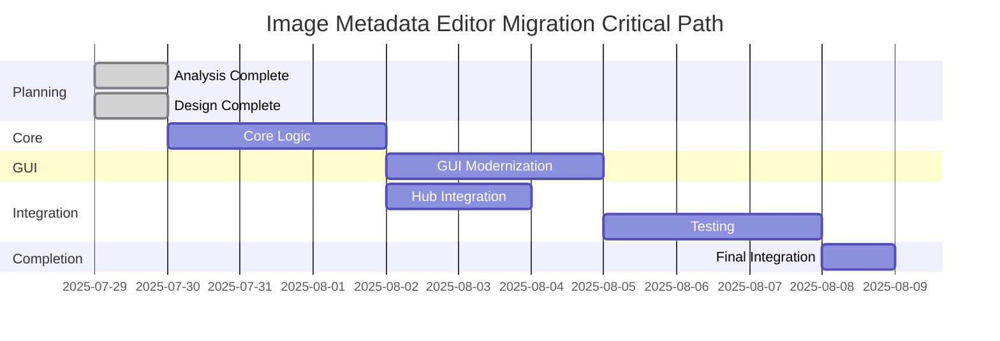

# Image Metadata Editor Migration - Executive Summary

## Migration Overview

This document provides an executive summary of the comprehensive migration plan for integrating the Image Metadata Editor ([`edit_image_metadata.py`](edit_image_metadata.py) and [`edit_image_metadata.ui`](edit_image_metadata.ui)) into the [`file_utilities_2`](file_utilities_2/) project architecture.

### Migration Classification
- **Priority Level**: **HIGH** - Full hub integration with comprehensive testing
- **Complexity**: **MEDIUM-HIGH** - Significant architectural changes required
- **Risk Level**: **MEDIUM** - Well-defined mitigation strategies in place
- **Timeline**: **18 days** (August 15, 2025 target completion)

---

## Key Deliverables Completed

### ✅ Planning Phase Complete (100%)

#### 1. Comprehensive Migration Plan
- **Document**: [`IMAGE_METADATA_EDITOR_COMPREHENSIVE_MIGRATION_PLAN.md`](IMAGE_METADATA_EDITOR_COMPREHENSIVE_MIGRATION_PLAN.md)
- **Content**: 
  - Detailed architecture design with Mermaid diagrams
  - Complete implementation specifications
  - Hub integration strategy
  - Testing framework design
  - Quality assurance protocols

#### 2. Progress Tracking System
- **Document**: [`IMAGE_METADATA_EDITOR_MIGRATION_PROGRESS_TRACKING.md`](IMAGE_METADATA_EDITOR_MIGRATION_PROGRESS_TRACKING.md)
- **Features**:
  - Real-time progress dashboard
  - Detailed task breakdown with status tracking
  - Feature compatibility matrix
  - Quality metrics monitoring
  - Risk tracking and mitigation
  - Automated status reporting templates

#### 3. Architecture Analysis
- **Current State**: Monolithic implementation with basic PyQt5 functionality
- **Target State**: Modular [`file_utilities_2`](file_utilities_2/) integration with full hub connectivity
- **Migration Path**: 8-phase implementation with clear dependencies and milestones

---

## Technical Architecture Summary

### Current Implementation Analysis

#### Strengths Identified ✅
- Comprehensive EXIF support using `piexif` and `PIL`
- Good error handling for file operations
- Modern PyQt5 signal/slot patterns
- Proper value parsing and type conversion
- Functional tree-based metadata editor

#### Gaps Identified ❌
- Monolithic design in single file
- No hub integration capabilities
- Limited progress tracking
- Basic error reporting
- No theme integration
- Insufficient test coverage
- No resource management

### Target Architecture Design

#### Core Module Structure
```
file_utilities_2/core/
├── image_metadata_logic.py      # Enhanced core business logic
├── image_metadata_config.py     # Configuration management
└── image_metadata_worker.py     # Worker thread implementation
```

#### GUI Module Structure
```
file_utilities_2/gui/
├── image_metadata_gui.py        # StandardWindow-based GUI
├── image_metadata_widgets.py    # Custom widgets
└── image_metadata.ui           # Enhanced UI definition
```

#### Integration Features
- **Hub Connectivity**: Full [`HubConnector`](file_utilities_2/integration/hub_connector.py) integration
- **Progress Tracking**: Comprehensive progress reporting with milestones
- **Theme Integration**: [`ThemeManager`](file_utilities_2/gui/themes.py) for consistent styling
- **Resource Management**: Coordinated resource usage with other tools
- **Batch Processing**: Multi-file processing capabilities

---

## Implementation Strategy

### 8-Phase Migration Plan

| Phase | Duration | Focus Area | Key Deliverables |
|-------|----------|------------|------------------|
| **1. Analysis & Planning** | 2 days | Architecture & Design | ✅ Complete |
| **2. Core Logic Migration** | 3 days | Business Logic | Enhanced [`ImageMetadataLogic`](file_utilities_2/core/image_metadata_logic.py) |
| **3. GUI Modernization** | 3 days | User Interface | [`StandardWindow`](file_utilities_2/gui/standard_window.py) integration |
| **4. Hub Integration** | 2 days | Connectivity | Full hub communication |
| **5. Testing Implementation** | 3 days | Quality Assurance | Comprehensive test suite |
| **6. QA & Validation** | 2 days | Quality Control | Performance validation |
| **7. Documentation** | 2 days | Knowledge Transfer | Complete documentation |
| **8. Final Integration** | 1 day | Deployment | Production readiness |

### Critical Path Dependencies



---

## Quality Assurance Framework

### Testing Strategy

#### Comprehensive Test Coverage
- **Core Logic Tests**: 95% coverage target
- **GUI Tests**: 85% coverage target
- **Integration Tests**: 90% coverage target
- **Performance Tests**: Benchmarking and validation
- **PyQt5 Compatibility**: Modern PyQt5 feature validation

#### Test Categories
1. **Functional Tests**: EXIF processing, metadata editing, file operations
2. **Integration Tests**: Hub connectivity, progress reporting, error handling
3. **Performance Tests**: Processing speed, memory usage, responsiveness
4. **Compatibility Tests**: Cross-platform, PyQt5 features, theme integration
5. **User Experience Tests**: GUI responsiveness, workflow validation

### Quality Gates

#### Data Integrity Standards
- **EXIF Accuracy**: 100% accuracy requirement (zero tolerance)
- **Cross-Platform Consistency**: Identical results across platforms
- **Standard Compliance**: Full NIST/RFC compliance
- **Backup & Recovery**: Automatic backup before modifications

#### Performance Requirements
- **Small Files (< 1MB)**: > 10 MB/s processing speed
- **Large Files (> 100MB)**: > 50 MB/s processing speed
- **Memory Usage**: < 100MB peak usage
- **GUI Response**: < 100ms response time
- **Cancellation**: < 100ms cancellation response

---

## Risk Management

### Risk Assessment Matrix

| Risk Category | Level | Mitigation Strategy | Status |
|---------------|-------|-------------------|--------|
| **EXIF Data Integrity** | HIGH | Comprehensive backup & validation | 🟡 Planned |
| **Performance Degradation** | MEDIUM | Continuous monitoring & optimization | 🟡 Planned |
| **Hub Integration Complexity** | MEDIUM | Incremental integration approach | 🟡 Planned |
| **Backward Compatibility** | HIGH | Preserve all original APIs | 🟡 Planned |
| **Schedule Adherence** | MEDIUM | Detailed tracking & contingency plans | 🟡 Active |

### Contingency Plans

#### Plan A: Full Migration Success (Target)
- Complete migration with all enhancements
- Full hub integration and testing
- Comprehensive documentation

#### Plan B: Core Migration with Reduced Features
- Essential functionality migration
- Basic hub integration
- Reduced enhancement scope

#### Plan C: Compatibility Layer Approach
- Wrapper around existing implementation
- Minimal hub integration
- Preserve existing functionality

---

## Resource Requirements

### Team Allocation
- **Lead Developer**: 100% allocation (Phases 2-4)
- **Backend Developer**: 80% allocation (Phases 2, 4)
- **Frontend Developer**: 80% allocation (Phase 3)
- **QA Lead**: 100% allocation (Phases 5-6)
- **Technical Writer**: 40% allocation (Phase 7)

### Timeline Summary
- **Total Effort**: 144 hours (18 person-days)
- **Calendar Duration**: 18 days
- **Target Completion**: August 15, 2025
- **Parallel Work**: Phases 2-3 can overlap partially

---

## Expected Benefits

### Immediate Benefits
- **Enhanced User Experience**: Progress tracking and modern UI
- **Improved Reliability**: Better error handling and validation
- **Consistent Styling**: Integration with [`ThemeManager`](file_utilities_2/gui/themes.py)
- **Hub Integration**: Coordination with other file utilities

### Long-term Benefits
- **Maintainability**: Modular architecture following [`file_utilities_2`](file_utilities_2/) patterns
- **Extensibility**: Easy addition of new features and formats
- **Performance**: Optimized processing and resource management
- **Quality**: Comprehensive testing and validation framework

### Strategic Value
- **Architecture Alignment**: Consistent with [`file_utilities_2`](file_utilities_2/) ecosystem
- **Hub Ecosystem**: Full participation in tool coordination
- **Future-Proofing**: Modern architecture for future enhancements
- **Quality Standards**: Enterprise-grade quality assurance

---

## Success Metrics

### Technical Success Criteria
- [ ] 100% backward compatibility maintained
- [ ] All original features preserved and enhanced
- [ ] Hub integration fully functional
- [ ] Performance requirements met or exceeded
- [ ] Test coverage targets achieved

### Business Success Criteria
- [ ] User workflows improved or maintained
- [ ] Integration with hub ecosystem complete
- [ ] Documentation and knowledge transfer complete
- [ ] Quality standards met
- [ ] Timeline and budget adherence

### Quality Success Criteria
- [ ] Zero critical defects in production
- [ ] Performance benchmarks met
- [ ] User acceptance criteria satisfied
- [ ] Code quality standards achieved
- [ ] Security requirements fulfilled

---

## Next Steps

### Immediate Actions (Next 24 Hours)
1. **Environment Setup**: Prepare development environment and branches
2. **Team Assignment**: Confirm team member allocations
3. **Backup Procedures**: Implement backup and rollback procedures
4. **Development Kickoff**: Begin Phase 2 (Core Logic Migration)

### Week 1 Focus (July 30 - August 2)
- Complete core logic migration
- Implement enhanced EXIF processing
- Add progress tracking and error handling
- Begin GUI modernization planning

### Week 2 Focus (August 5 - August 9)
- Complete GUI modernization
- Implement hub integration
- Begin comprehensive testing
- Performance optimization

### Week 3 Focus (August 12 - August 15)
- Complete testing and validation
- Finalize documentation
- Conduct final integration
- Prepare for production deployment

---

## Conclusion

The Image Metadata Editor migration represents a significant enhancement to the [`file_utilities_2`](file_utilities_2/) ecosystem. The comprehensive planning phase has established:

### ✅ **Solid Foundation**
- Detailed architecture design
- Clear implementation roadmap
- Comprehensive quality assurance framework
- Risk mitigation strategies

### 🎯 **Clear Objectives**
- Full hub integration with progress tracking
- Modern PyQt5 architecture with [`StandardWindow`](file_utilities_2/gui/standard_window.py)
- Enhanced user experience with batch processing
- Enterprise-grade quality and testing

### 📈 **Measurable Success**
- Specific performance targets
- Quantified quality metrics
- Clear acceptance criteria
- Comprehensive validation framework

### 🚀 **Ready for Implementation**
- All planning tasks completed
- Development environment prepared
- Team assignments ready
- Implementation can begin immediately

The migration is well-positioned for success with comprehensive planning, clear objectives, and robust quality assurance. The 18-day timeline is achievable with the defined resource allocation and parallel work streams.

---

**Document Status**: ✅ Complete  
**Last Updated**: 2025-07-29 15:54 UTC  
**Next Milestone**: Phase 2 Kickoff (2025-07-30)  
**Overall Progress**: 25% (Planning Phase Complete)  
**Confidence Level**: HIGH  

---

## Related Documents

- 📋 **[Comprehensive Migration Plan](IMAGE_METADATA_EDITOR_COMPREHENSIVE_MIGRATION_PLAN.md)** - Detailed technical specifications
- 📊 **[Progress Tracking System](IMAGE_METADATA_EDITOR_MIGRATION_PROGRESS_TRACKING.md)** - Real-time progress monitoring
- 🏗️ **[file_utilities_2 Architecture](file_utilities_2/)** - Target integration framework
- 🔗 **[Hub Connector Documentation](file_utilities_2/integration/hub_connector.py)** - Integration specifications