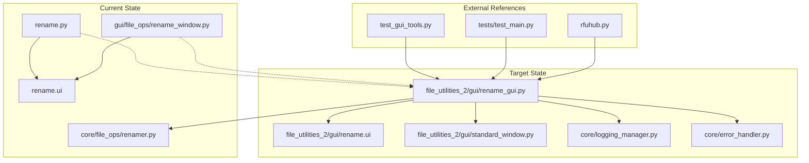

# Rename Files Migration Comprehensive Plan

## Executive Summary

This document outlines the comprehensive migration plan for consolidating the rename functionality from the root directory (`rename.py` and `rename.ui`) and `gui/file_ops/rename_window.py` into a single, improved implementation within the `file_utilities_2/gui/` directory structure.

## Current State Analysis

### Implementation Analysis Completed ✅

**Root Directory Implementation (`rename.py`):**
- **Strengths:**
  - Comprehensive metadata extraction (EXIF, audio tags)
  - Rich date formatting options (5 different formats)
  - Robust error handling with detailed UI error management
  - Complete feature set including prefix/suffix/case/date operations
  - Direct UI file loading with validation

- **Architecture:** Inherits from `BaseWindow`, uses `uic.loadUi()`
- **Dependencies:** PIL, mutagen, PyQt5, gui.common modules
- **Features:** 9 rename modes, metadata-based renaming, filtering

**GUI Directory Implementation (`gui/file_ops/rename_window.py`):**
- **Strengths:**
  - Modern architecture using core modules
  - Standardized logging with LogManager
  - Uses FileRenamer core class for business logic
  - Better separation of concerns
  - Comprehensive error handling and user feedback

- **Architecture:** Inherits from `BaseWindow`, uses core modules
- **Dependencies:** Core modules (FileRenamer, LogManager, error_handler)
- **Features:** Cleaner code structure, better maintainability

**Core Logic (`core/file_ops/renamer.py`):**
- **Strengths:**
  - Pure business logic separation
  - Static methods for reusability
  - Comprehensive file type support
  - Clean API design

## Migration Strategy

### Consolidation Approach
Create a **unified implementation** that combines:
1. **UI richness** from root `rename.py`
2. **Modern architecture** from `gui/file_ops/rename_window.py`
3. **Core business logic** from `core/file_ops/renamer.py`
4. **Standardized patterns** from `file_utilities_2/gui/standard_window.py`

## Detailed Migration Plan

### Phase 1: Analysis and Backup ✅
- [x] Analyze both implementations for best features
- [ ] Create backup of original files
- [ ] Document current dependencies and references

### Phase 2: Design and Architecture
- [ ] Design consolidated implementation architecture
- [ ] Plan integration with StandardWindow pattern
- [ ] Design improved UI layout and functionality
- [ ] Plan PyQt5 compatibility verification

### Phase 3: Implementation
- [ ] Create `file_utilities_2/gui/rename_gui.py` with consolidated features
- [ ] Migrate and update `rename.ui` to new location
- [ ] Implement StandardWindow inheritance
- [ ] Integrate core FileRenamer functionality
- [ ] Add enhanced error handling and logging

### Phase 4: Integration
- [ ] Update import statements for new location
- [ ] Update file path references
- [ ] Update `file_utilities_2/gui/__init__.py`
- [ ] Create integration connector if needed

### Phase 5: External References Update
- [ ] Update `test_gui_tools.py` reference
- [ ] Update `tests/test_main.py` references
- [ ] Update `rfuhub.py` integration
- [ ] Update any configuration files

### Phase 6: Testing and Validation
- [ ] Create comprehensive test suite
- [ ] Validate PyQt5 compatibility
- [ ] Test all rename features and edge cases
- [ ] Perform integration testing
- [ ] Validate UI functionality

### Phase 7: Cleanup and Documentation
- [ ] Remove original files after verification
- [ ] Update documentation
- [ ] Create migration completion report

## Technical Specifications

### New Implementation Architecture

```
file_utilities_2/gui/rename_gui.py
├── Class: RenameGUI(StandardWindow)
├── Features:
│   ├── All 9 rename modes from original
│   ├── Metadata extraction (images, audio)
│   ├── 5 date format options
│   ├── File filtering and selection
│   ├── Batch processing
│   └── Enhanced error handling
├── Dependencies:
│   ├── file_utilities_2.gui.standard_window
│   ├── core.file_ops.renamer
│   ├── core.logging_manager
│   └── core.error_handler
└── UI: file_utilities_2/gui/rename.ui
```

### Key Features to Consolidate

1. **Rename Modes (from root rename.py):**
   - Add prefix/suffix
   - Remove prefix/suffix
   - New name replacement
   - Case conversion (upper/lower)
   - Date prefix/suffix
   - Metadata-based renaming

2. **Enhanced Features (from gui implementation):**
   - Modern logging integration
   - Standardized error handling
   - Core business logic separation
   - Better user feedback

3. **New Standardized Features:**
   - StandardWindow inheritance
   - Consistent theming
   - Standardized dialogs
   - Progress indication

### File Structure After Migration

```
file_utilities_2/
├── gui/
│   ├── __init__.py (updated)
│   ├── rename_gui.py (new consolidated)
│   ├── rename.ui (migrated)
│   └── standard_window.py
├── core/ (existing)
└── tests/
    └── test_rename_gui.py (new)
```

## Dependencies and References

### Files Requiring Updates

1. **Direct References:**
   - `test_gui_tools.py` (line 62)
   - `tests/test_main.py` (line 47)
   - `gui/file_ops/rename_window.py` (line 33)

2. **Import Updates:**
   - Any modules importing from root rename.py
   - Integration points in rfuhub.py

3. **Configuration Files:**
   - Any setup scripts referencing rename files
   - Project configuration files

### Import Statement Changes

**Before:**
```python
from rename import FileRenamerWindow
from gui.file_ops.rename_window import RenameWindow
```

**After:**
```python
from file_utilities_2.gui.rename_gui import RenameGUI
```

## Risk Assessment and Mitigation

### Risks
1. **Functionality Loss:** Missing features during consolidation
2. **Integration Issues:** Breaking existing integrations
3. **UI Compatibility:** PyQt5 compatibility issues
4. **Performance Impact:** Changes affecting performance

### Mitigation Strategies
1. **Comprehensive Testing:** Full feature validation before cleanup
2. **Backup Strategy:** Complete backup before any changes
3. **Incremental Migration:** Phase-by-phase implementation
4. **Rollback Plan:** Ability to restore original files

## Success Criteria

### Functional Requirements
- [ ] All original rename features working
- [ ] Enhanced error handling and logging
- [ ] Consistent UI theming
- [ ] Proper PyQt5 compatibility
- [ ] All external integrations working

### Technical Requirements
- [ ] Clean code architecture
- [ ] Proper module structure
- [ ] Comprehensive test coverage
- [ ] Documentation completeness
- [ ] Performance maintained or improved

## Timeline and Milestones

### Immediate Tasks (Phase 1-2)
1. Create backup of original files
2. Design consolidated architecture
3. Plan UI improvements

### Implementation Phase (Phase 3-4)
1. Create consolidated rename_gui.py
2. Migrate and update UI file
3. Update all references

### Validation Phase (Phase 5-6)
1. Comprehensive testing
2. Integration validation
3. Performance verification

### Completion Phase (Phase 7)
1. Cleanup original files
2. Documentation updates
3. Migration report

## Mermaid Architecture Diagram



## Next Steps

1. **Immediate:** Create backup of original files
2. **Design:** Finalize consolidated architecture
3. **Implement:** Begin creating new consolidated implementation
4. **Test:** Validate functionality at each step
5. **Deploy:** Update all references and integrations

---

**Document Status:** Draft - Ready for Implementation
**Last Updated:** 2025-07-28
**Next Review:** After Phase 1 Completion