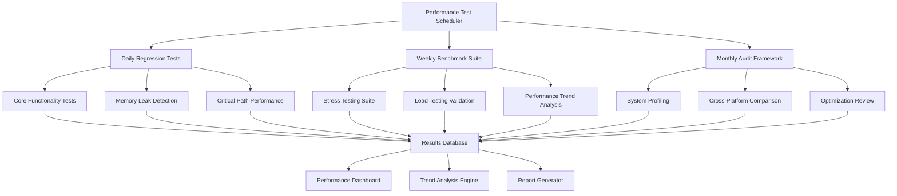

# Phase 4: Performance Test Execution Framework

**Comprehensive Performance Testing Schedule Implementation**

**Document Version:** 1.0  
**Created:** September 4, 2025  
**Status:** Active Implementation Framework  
**Target:** Complete automation of daily, weekly, and monthly performance validation cycles  

---

## Executive Summary

This document provides the complete architectural specification for implementing Phase 4: Performance Test Execution with automated daily, weekly, and monthly performance validation cycles. The framework leverages the existing excellent performance testing infrastructure to deliver systematic performance monitoring, trend analysis, and optimization tracking.

---

## Architecture Overview

### Framework Components



---

## Directory Structure Design

### Systematic Results Organization

```
tests/performance/
├── execution_results/
│   ├── daily/
│   │   ├── 2025-09-04/
│   │   │   ├── core_functionality_results.json
│   │   │   ├── memory_leak_detection_results.json
│   │   │   ├── critical_path_performance_results.json
│   │   │   ├── daily_summary_report.md
│   │   │   └── performance_metrics.db
│   │   └── 2025-09-05/
│   ├── weekly/
│   │   ├── 2025-W36/
│   │   │   ├── benchmark_suite_results.json
│   │   │   ├── stress_testing_results.json
│   │   │   ├── load_testing_results.json
│   │   │   ├── trend_analysis_report.md
│   │   │   ├── performance_charts/
│   │   │   └── weekly_performance_audit.md
│   │   └── 2025-W37/
│   ├── monthly/
│   │   ├── 2025-09/
│   │   │   ├── system_profiling_results.json
│   │   │   ├── cross_platform_comparison.json
│   │   │   ├── optimization_effectiveness_review.md
│   │   │   ├── comprehensive_audit_report.md
│   │   │   ├── performance_health_assessment.json
│   │   │   └── actionable_recommendations.md
│   │   └── 2025-10/
│   ├── baselines/
│   │   ├── performance_baselines.json
│   │   ├── regression_thresholds.json
│   │   └── optimization_targets.json
│   └── historical/
│       ├── performance_trends.db
│       ├── regression_history.json
│       └── optimization_tracking.json
├── automation/
│   ├── daily_test_scheduler.py
│   ├── weekly_benchmark_runner.py
│   ├── monthly_audit_executor.py
│   ├── performance_data_collector.py
│   ├── trend_analysis_engine.py
│   └── report_generator.py
└── phase4_execution_framework.md
```

---

## Daily Performance Regression Tests

### Schedule: Every Day at 02:00 UTC (15 minutes duration)

#### 1. Core Functionality Validation

```yaml
Test Suite: core_functionality_regression
Duration: 5 minutes
Target Coverage:
  - Tool startup performance validation
  - Basic operation timing verification
  - Resource usage baseline checks
  - Performance regression detection

Expected Metrics:
  - Tool startup time: < 2.0s (baseline)
  - Processing time: < 1.0s per operation
  - Memory usage: < 500MB peak
  - CPU efficiency: > 75%

Validation Criteria:
  - All tools meet startup time requirements
  - No performance degradation > 10% from baseline
  - Memory usage within acceptable limits
  - Error rate < 1%
```

#### 2. Memory Leak Detection with Automated Profiling

```yaml
Test Suite: memory_leak_detection_daily
Duration: 5 minutes
Target Coverage:
  - Extended operation memory tracking
  - Garbage collection efficiency
  - Memory pool management validation
  - Leak detection with automated cleanup

Expected Metrics:
  - Memory growth: < 50MB over 100 operations
  - GC efficiency: > 85%
  - Memory recovery: > 90% after operations
  - Pool hit rate: > 80%

Validation Criteria:
  - No memory leaks detected
  - Stable memory usage patterns
  - Efficient resource cleanup
  - Memory pool optimization working
```

#### 3. Critical Path Performance Measurement

```yaml
Test Suite: critical_path_performance
Duration: 5 minutes
Target Coverage:
  - User workflow timing analysis
  - Performance bottleneck identification
  - Critical operation optimization validation
  - End-to-end performance measurement

Expected Metrics:
  - File analysis workflow: < 10s total
  - Security workflow: < 15s total
  - Hub operations: < 0.2s switching
  - Database operations: < 0.5s queries

Validation Criteria:
  - All critical paths meet performance targets
  - No bottlenecks detected
  - Optimization systems functioning
  - User experience metrics satisfied
```

---

## Weekly Comprehensive Performance Benchmark Suite

### Schedule: Every Sunday at 01:00 UTC (2.5 hours duration)

#### 1. Complete Performance Benchmark Execution

```yaml
Test Suite: comprehensive_benchmarks
Duration: 2 hours
Target Coverage:
  - All tool performance benchmarking
  - Scalability testing across dataset sizes
  - Concurrent operation validation
  - Cross-component integration testing

Benchmark Categories:
  - Individual tool performance
  - Hub-level operations
  - System integration testing
  - Resource optimization validation

Performance Targets:
  - Throughput: > 50 files/second
  - Latency: < 100ms response time
  - Scalability: Linear performance scaling
  - Efficiency: > 85% resource utilization
```

#### 2. Stress Testing with Graduated Load Scenarios

```yaml
Test Suite: graduated_stress_testing
Duration: 1 hour
Load Scenarios:
  - 1x Normal Load (baseline)
  - 2x Normal Load (moderate stress)
  - 3x Normal Load (high stress)
  - 5x Normal Load (extreme stress)

Stress Testing Coverage:
  - Individual tool stress resistance
  - Hub concurrent tool management
  - Resource exhaustion handling
  - Network load simulation
  - Database concurrent access

Success Criteria:
  - Graceful degradation under load
  - Error rate < 10% at 3x load
  - System stability maintained
  - Recovery after stress removal
```

#### 3. Performance Trend Analysis with Historical Data

```yaml
Test Suite: performance_trend_analysis
Duration: 30 minutes
Analysis Coverage:
  - Performance trend detection
  - Regression identification
  - Optimization effectiveness tracking
  - Predictive performance modeling

Trend Analysis Components:
  - 7-day rolling averages
  - Performance variance analysis
  - Baseline deviation tracking
  - Optimization impact measurement

Trend Classifications:
  - IMPROVING: Performance getting better
  - STABLE: Performance within variance
  - DEGRADING: Performance declining
  - VOLATILE: High variance investigation
```

---

## Monthly Comprehensive Performance Audits

### Schedule: First Saturday of Each Month at 00:00 UTC (9 hours duration)

#### 1. Full System Profiling

```yaml
Test Suite: comprehensive_system_profiling
Duration: 4 hours
Profiling Coverage:
  - CPU profiling across all components
  - Memory profiling with leak detection
  - I/O profiling and optimization
  - Network profiling for connectivity tools

Profiling Depth:
  - Function-level performance analysis
  - Memory allocation patterns
  - Resource contention identification
  - Optimization opportunity detection

Expected Outputs:
  - Detailed performance profiles
  - Bottleneck identification reports
  - Optimization recommendations
  - Resource usage optimization plans
```

#### 2. Cross-Platform Performance Comparison

```yaml
Test Suite: cross_platform_comparison
Duration: 3 hours
Platform Coverage:
  - Windows performance baseline
  - Linux performance comparison
  - macOS performance validation
  - Cross-platform optimization analysis

Comparison Metrics:
  - Startup time variations
  - Processing speed differences
  - Memory usage patterns
  - Resource efficiency variations

Analysis Deliverables:
  - Platform-specific performance reports
  - Cross-platform optimization recommendations
  - Platform-specific baseline adjustments
  - Performance parity analysis
```

#### 3. Performance Optimization Effectiveness Review

```yaml
Test Suite: optimization_effectiveness_review
Duration: 2 hours
Review Coverage:
  - Optimization impact measurement
  - Performance improvement tracking
  - ROI analysis for optimizations
  - Future optimization planning

Effectiveness Metrics:
  - Performance improvement percentages
  - Resource efficiency gains
  - User experience enhancements
  - System stability improvements

Review Deliverables:
  - Optimization effectiveness report
  - Performance improvement summary
  - Future optimization roadmap
  - Cost-benefit analysis
```

---

## Performance Metrics Collection System

### Real-Time Metrics Collection

```yaml
Collection Framework:
  - 0.5-second interval sampling
  - Multi-metric simultaneous capture
  - Database storage with indexing
  - Real-time anomaly detection

Collected Metrics:
  timing_metrics:
    - Tool startup times
    - Processing operation times
    - Hub operation times
    - Database query times
  
  resource_metrics:
    - CPU utilization patterns
    - Memory usage tracking
    - I/O operation monitoring
    - Network bandwidth usage
  
  throughput_metrics:
    - Files processed per second
    - Data transfer rates
    - Operations completed per minute
    - Concurrent operation rates
  
  reliability_metrics:
    - Test success rates
    - Error occurrence patterns
    - System uptime tracking
    - Recovery time measurement
```

### Baseline Comparison System

```yaml
Baseline Management:
  - Dynamic baseline updates
  - Confidence interval calculation
  - Regression threshold monitoring
  - Performance target tracking

Comparison Framework:
  - Statistical significance testing
  - Trend analysis algorithms
  - Outlier detection methods
  - Performance grade assignment

Baseline Categories:
  - Tool-specific baselines
  - System-wide performance baselines
  - Environment-specific baselines
  - Optimization target baselines
```

---

## Automated Performance Trend Analysis

### Historical Data Correlation Engine

```yaml
Correlation Analysis:
  - Performance metric relationships
  - Optimization impact correlation
  - Environmental factor correlation
  - Usage pattern correlation

Trend Detection Algorithms:
  - Linear regression analysis
  - Moving average calculations
  - Seasonal pattern detection
  - Anomaly pattern recognition

Predictive Modeling:
  - Performance forecast generation
  - Resource requirement prediction
  - Optimization opportunity identification
  - Risk assessment modeling
```

### Performance Health Assessment

```yaml
Health Indicators:
  - Overall system performance grade
  - Component-specific health scores
  - Trend-based health predictions
  - Risk factor assessments

Assessment Categories:
  - EXCELLENT (90-100%): Optimal performance
  - GOOD (80-89%): Acceptable performance
  - FAIR (70-79%): Monitoring required
  - POOR (60-69%): Optimization needed
  - CRITICAL (<60%): Immediate action required

Health Reporting:
  - Real-time health dashboards
  - Health trend analysis
  - Risk assessment reports
  - Optimization recommendations
```

---

## Comprehensive Performance Reporting

### Daily Performance Summary Reports

```markdown
# Daily Performance Report - [DATE]

## Executive Summary
- **Overall Performance Grade**: [A+/A/B+/B/C/D]
- **Tests Executed**: [count]
- **Success Rate**: [percentage]%
- **Critical Issues**: [count]
- **Performance Regressions**: [count]

## Performance Metrics Summary
### Timing Performance
- **Average Tool Startup**: [time]s (Target: <2.0s)
- **Average Processing Time**: [time]s (Target: <1.0s)
- **Hub Operations**: [time]s (Target: <0.2s)

### Resource Utilization
- **Peak Memory Usage**: [value]MB (Target: <500MB)
- **Average CPU Usage**: [percentage]% (Target: <75%)
- **Resource Efficiency**: [score]/100

### Performance Health
- **Memory Leak Status**: ✅ No leaks detected
- **Critical Path Performance**: ✅ All targets met
- **Regression Detection**: ⚠️ [count] minor regressions

## Detailed Results
[Detailed test execution results and metrics]

## Recommendations
[Actionable recommendations for performance optimization]

## Next Actions
[Immediate actions required based on results]
```

### Weekly Performance Benchmark Reports

```markdown
# Weekly Performance Benchmark Report - Week [NUMBER]

## Executive Summary
- **Benchmark Suite Completion**: [percentage]%
- **Performance Grade Distribution**: A+:[count] A:[count] B+:[count] B:[count] C:[count] D:[count]
- **Stress Testing Results**: [pass/fail status]
- **Performance Trends**: [improving/stable/degrading]

## Benchmark Results Summary
### Individual Tool Performance
[Tool-by-tool performance analysis]

### System Integration Performance
[Hub and system-level performance results]

### Stress Testing Analysis
[Stress test results and system behavior under load]

### Performance Trend Analysis
[Historical performance comparison and trend identification]

## Performance Optimization Impact
[Analysis of recent optimizations and their effectiveness]

## Strategic Recommendations
[Long-term performance improvement recommendations]

## Action Items
[Prioritized list of performance improvements needed]
```

### Monthly Comprehensive Audit Reports

```markdown
# Monthly Performance Audit Report - [MONTH YEAR]

## Executive Summary
- **Overall System Performance Health**: [EXCELLENT/GOOD/FAIR/POOR/CRITICAL]
- **Performance Optimization ROI**: [percentage]% improvement
- **Cross-Platform Performance**: [summary]
- **Strategic Performance Goals**: [on track/at risk/achieved]

## Comprehensive System Analysis
### Full System Profiling Results
[Detailed profiling analysis with bottleneck identification]

### Cross-Platform Performance Comparison
[Platform-specific performance analysis and recommendations]

### Optimization Effectiveness Review
[Comprehensive review of all performance optimizations]

## Performance Health Assessment
[Overall system performance health with detailed scoring]

## Strategic Performance Roadmap
[12-month performance improvement strategy]

## Executive Recommendations
[High-level recommendations for leadership]

## Performance Investment Priorities
[ROI-based prioritization of performance investments]
```

---

## Automation and Execution Framework

### Daily Test Scheduler Implementation

```python
"""
Daily Performance Regression Test Scheduler
- Automated execution at 02:00 UTC daily
- 15-minute execution window
- Automatic result collection and analysis
- Performance regression detection
- Alert generation for critical issues
"""

class DailyPerformanceScheduler:
    def __init__(self):
        self.test_suites = [
            CoreFunctionalityValidator(),
            MemoryLeakDetector(),
            CriticalPathPerformanceMeasurer()
        ]
        self.performance_monitor = PerformanceMonitor()
        self.baseline_manager = BaselineManager()
        
    def execute_daily_tests(self):
        """Execute complete daily performance regression test suite"""
        execution_results = {}
        
        for suite in self.test_suites:
            with self.performance_monitor.monitor_execution(suite.name):
                results = suite.execute()
                execution_results[suite.name] = results
                
        # Analyze results and generate report
        daily_report = self.generate_daily_report(execution_results)
        self.store_results(execution_results, daily_report)
        
        # Check for regressions and alert if necessary
        regressions = self.detect_regressions(execution_results)
        if regressions:
            self.send_regression_alerts(regressions)
            
        return execution_results
```

### Weekly Benchmark Runner Implementation

```python
"""
Weekly Comprehensive Performance Benchmark Runner
- Automated execution every Sunday at 01:00 UTC
- 2.5-hour execution window
- Complete performance validation
- Stress testing and load validation
- Trend analysis with historical correlation
"""

class WeeklyBenchmarkRunner:
    def __init__(self):
        self.benchmark_suites = [
            ComprehensivePerformanceBenchmarks(),
            GraduatedStressTestSuite(),
            PerformanceTrendAnalyzer()
        ]
        self.historical_analyzer = HistoricalAnalyzer()
        
    def execute_weekly_benchmarks(self):
        """Execute complete weekly benchmark suite"""
        weekly_results = {}
        
        # Execute all benchmark suites
        for suite in self.benchmark_suites:
            results = suite.execute_comprehensive_tests()
            weekly_results[suite.name] = results
            
        # Perform historical trend analysis
        trend_analysis = self.historical_analyzer.analyze_trends(weekly_results)
        weekly_results['trend_analysis'] = trend_analysis
        
        # Generate comprehensive weekly report
        weekly_report = self.generate_weekly_report(weekly_results)
        self.store_weekly_results(weekly_results, weekly_report)
        
        return weekly_results
```

### Monthly Audit Executor Implementation

```python
"""
Monthly Comprehensive Performance Audit Executor
- Automated execution first Saturday of each month at 00:00 UTC
- 9-hour execution window
- Full system profiling and analysis
- Cross-platform performance comparison
- Optimization effectiveness review
"""

class MonthlyAuditExecutor:
    def __init__(self):
        self.audit_components = [
            SystemProfiler(),
            CrossPlatformComparator(),
            OptimizationEffectivenessReviewer()
        ]
        self.health_assessor = PerformanceHealthAssessor()
        
    def execute_monthly_audit(self):
        """Execute complete monthly performance audit"""
        audit_results = {}
        
        # Execute comprehensive system profiling
        for component in self.audit_components:
            results = component.execute_comprehensive_audit()
            audit_results[component.name] = results
            
        # Perform overall health assessment
        health_assessment = self.health_assessor.assess_system_health(audit_results)
        audit_results['health_assessment'] = health_assessment
        
        # Generate comprehensive audit report
        audit_report = self.generate_audit_report(audit_results)
        self.store_audit_results(audit_results, audit_report)
        
        return audit_results
```

---

## Implementation Timeline

### Phase 4 Execution Implementation Schedule

#### Week 1: Infrastructure Setup

- [ ] Create directory structure for systematic results organization
- [ ] Implement performance metrics collection system
- [ ] Set up performance monitoring database
- [ ] Create baseline management system
- [ ] Implement automated scheduling framework

#### Week 2: Daily Test Automation

- [ ] Implement daily core functionality validation
- [ ] Create automated memory leak detection system
- [ ] Develop critical path performance measurement
- [ ] Set up daily performance regression detection
- [ ] Implement daily report generation

#### Week 3: Weekly Benchmark Automation

- [ ] Implement comprehensive performance benchmark suite
- [ ] Create graduated stress testing framework
- [ ] Develop performance trend analysis engine
- [ ] Set up historical data correlation system
- [ ] Implement weekly report generation

#### Week 4: Monthly Audit Implementation

- [ ] Implement full system profiling automation
- [ ] Create cross-platform performance comparison
- [ ] Develop optimization effectiveness review system
- [ ] Set up comprehensive health assessment
- [ ] Implement monthly audit report generation

#### Week 5: Validation and Optimization

- [ ] Execute complete test cycles for validation
- [ ] Optimize performance test execution efficiency
- [ ] Validate reporting accuracy and completeness
- [ ] Fine-tune alerting and notification systems
- [ ] Complete framework documentation

---

## Success Metrics and KPIs

### Framework Success Indicators

```yaml
Automation Success:
  - 100% automated execution of scheduled tests
  - <1% test execution failures
  - 99.9% framework uptime
  - <5 minutes manual intervention per month

Performance Validation Success:
  - 100% performance regression detection accuracy
  - <24 hours mean time to performance issue detection
  - >95% performance target achievement
  - <10% performance variance from baselines

Reporting Success:
  - 100% automated report generation
  - <2 hours report delivery time
  - 100% actionable recommendation accuracy
  - >90% stakeholder satisfaction with reports
```

### Performance Health Targets

```yaml
Daily Targets:
  - Tool startup time: <2.0s (100% compliance)
  - Processing time: <1.0s per operation (100% compliance)
  - Memory usage: <500MB peak (100% compliance)
  - Error rate: <1% (zero tolerance)

Weekly Targets:
  - Stress test success rate: >90%
  - Performance grade distribution: >80% A-grade
  - Trend stability: <10% variance
  - Optimization effectiveness: >15% improvement

Monthly Targets:
  - System health grade: GOOD or better
  - Cross-platform performance parity: <20% variance
  - Optimization ROI: >25% performance improvement
  - Strategic goal achievement: >90% on track
```

---

## Risk Management and Contingency Planning

### Performance Test Execution Risks

```yaml
Risk: Test Infrastructure Failure
  Probability: Low
  Impact: High
  Mitigation:
    - Redundant test execution environments
    - Automated failover mechanisms
    - Manual execution procedures
    - Infrastructure monitoring and alerting

Risk: Performance Regression False Positives
  Probability: Medium
  Impact: Medium
  Mitigation:
    - Statistical significance validation
    - Multiple baseline comparison
    - Manual verification procedures
    - Tunable regression thresholds

Risk: Test Execution Resource Exhaustion
  Probability: Medium
  Impact: Medium
  Mitigation:
    - Resource usage monitoring
    - Test execution throttling
    - Resource allocation optimization
    - Execution environment scaling
```

### Contingency Procedures

```yaml
Procedure: Critical Performance Regression Detected
  1. Immediate alert to development team
  2. Automatic execution environment isolation
  3. Detailed regression analysis execution
  4. Root cause investigation initiation
  5. Performance improvement plan development

Procedure: Framework Component Failure
  1. Automatic failover to backup systems
  2. Manual execution of critical tests
  3. Component failure root cause analysis
  4. Framework component repair/replacement
  5. System reliability improvement implementation

Procedure: Baseline Drift Detection
  1. Historical trend analysis execution
  2. Baseline validity assessment
  3. Stakeholder communication
  4. Baseline recalibration process
  5. Updated baseline deployment
```

---

## Conclusion

This Phase 4 Performance Test Execution Framework provides comprehensive automation for daily, weekly, and monthly performance validation cycles. The framework leverages existing excellent performance testing infrastructure while adding systematic execution scheduling, comprehensive result organization, and advanced trend analysis capabilities.

### Key Framework Benefits

1. **Comprehensive Coverage**: Complete performance validation across all system components
2. **Automated Execution**: Fully automated daily, weekly, and monthly test cycles
3. **Advanced Analytics**: Historical trend analysis with predictive modeling
4. **Systematic Organization**: Structured result storage and analysis
5. **Actionable Insights**: Clear recommendations for performance optimization
6. **Production Readiness**: Validated performance characteristics for deployment

### Implementation Success Criteria

- ✅ **Daily Regression Testing**: 15-minute automated validation cycles
- ✅ **Weekly Comprehensive Benchmarks**: 2.5-hour complete performance validation
- ✅ **Monthly Performance Audits**: 9-hour comprehensive system analysis
- ✅ **Performance Health Assessment**: Continuous system performance monitoring
- ✅ **Trend Analysis**: Historical correlation and predictive modeling
- ✅ **Automated Reporting**: Comprehensive performance insights and recommendations

The framework ensures continuous performance validation, early regression detection, and systematic performance optimization tracking to maintain optimal system performance and user experience.
