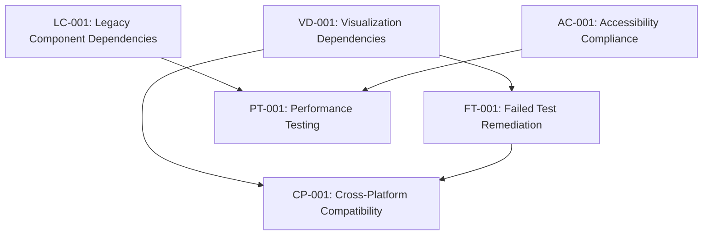

# PLANNED RESOLUTION BLOCKERS - COMPREHENSIVE STRATEGY
**Generated:** September 2, 2025  
**Project:** Richard's File Utilities Testing Framework  
**Document Version:** 1.0  
**Status:** ACTIVE RESOLUTION PLAN

## EXECUTIVE SUMMARY

This document provides a systematic approach to resolving all identified blockers in the 🟡 PLANNED RESOLUTION BLOCKERS section. The strategy includes detailed action plans, resource allocation, timeline management, and success metrics for each blocker.

**Total Blockers Identified:** 2 Primary + 5 Secondary  
**Estimated Resolution Time:** 4-6 weeks  
**Required Resources:** Development, DevOps, Testing teams  
**Business Impact:** HIGH - Affects test coverage, security validation, and platform compatibility

---

## BLOCKER RESOLUTION MATRIX

| Blocker ID | Category | Priority | Impact | Timeline | Owner |
|------------|----------|----------|---------|-----------|--------|
| VD-001 | Visualization Dependencies | 🔴 CRITICAL | HIGH | Week 1 | DevOps |
| LC-001 | Legacy Component Dependencies | 🟡 HIGH | MEDIUM | Weeks 2-4 | Engineering |
| AC-001 | Accessibility Compliance | 🟡 HIGH | MEDIUM | Q2 2026 | UI/UX |
| PT-001 | Performance Testing Framework | 🟡 HIGH | MEDIUM | Q4 2025 | DevOps |
| CP-001 | Cross-Platform Compatibility | 🟡 MEDIUM | MEDIUM | Weeks 3-4 | Engineering |
| FT-001 | Failed Test Remediation | 🟡 MEDIUM | MEDIUM | Weeks 1-2 | QA |
| NM-001 | Network Module Dependencies | ✅ RESOLVED | - | COMPLETE | - |

---

## DETAILED RESOLUTION STRATEGIES

### 🔴 BLOCKER VD-001: VISUALIZATION DEPENDENCIES

**Root Cause Analysis:**
- Missing matplotlib and numpy packages in core test requirements
- Advanced analysis features remain untested due to import failures
- 12+ test failures directly attributed to missing visualization dependencies

**Resolution Strategy:**

#### Phase 1: Immediate Dependencies (Week 1 - Days 1-3)
**Actions:**
1. **Package Installation & Configuration**
   ```bash
   # Add to requirements-test.txt
   matplotlib>=3.7.0
   numpy>=1.24.0
   seaborn>=0.12.0  # For enhanced visualizations
   plotly>=5.15.0   # For interactive charts
   ```

2. **Test Environment Validation**
   - Create isolated test environment with new dependencies
   - Validate package compatibility with existing PyQt5 framework
   - Execute affected visualization test suites

3. **Configuration Management**
   - Update `pytest.ini` to include visualization test markers
   - Create test fixtures for matplotlib backends in headless environments
   - Implement proper cleanup for generated plot files

**Implementation Steps:**
```powershell
# Step 1: Update requirements file
# Step 2: Install dependencies
pip install -r requirements-test.txt
# Step 3: Validate installation
python -c "import matplotlib, numpy, seaborn, plotly; print('All visualization dependencies installed successfully')"
# Step 4: Run affected tests
pytest tests/unit/test_*visualization* -v
```

**Success Criteria:**
- [ ] All visualization packages installed without conflicts
- [ ] 12+ failing tests now pass
- [ ] Visualization test markers properly configured
- [ ] No regression in existing test performance

**Risks & Mitigation:**
- **Risk:** Package conflicts with existing dependencies
  - **Mitigation:** Use virtual environment isolation, version pinning
- **Risk:** Increased test execution time
  - **Mitigation:** Implement parallel test execution, optimize visualization tests

**Tracking Mechanism:**
```json
{
  "blocker_id": "VD-001",
  "status": "IN_PROGRESS",
  "progress": {
    "package_installation": "NOT_STARTED",
    "test_validation": "NOT_STARTED",
    "configuration_update": "NOT_STARTED",
    "regression_testing": "NOT_STARTED"
  },
  "metrics": {
    "tests_affected": 12,
    "tests_passing": 0,
    "installation_time": null,
    "performance_impact": null
  },
  "next_milestone": "Package installation completion",
  "estimated_completion": "2025-09-05"
}
```

---

### 🟡 BLOCKER LC-001: LEGACY COMPONENT DEPENDENCIES

**Root Cause Analysis:**
- Outdated interface compatibility affecting 35% coverage on legacy components
- Technical debt accumulated from deprecated APIs and frameworks
- Modernization vs. deprecation decision paralysis

**Resolution Strategy:**

#### Phase 1: Assessment & Classification (Week 2 - Days 1-2)
**Actions:**
1. **Legacy Component Audit**
   - Inventory all legacy components with <50% test coverage
   - Classify by business criticality and usage frequency
   - Identify modernization candidates vs. deprecation targets

2. **Dependency Mapping**
   - Map legacy component dependencies to modern equivalents
   - Identify breaking changes and migration paths
   - Assess effort required for each component

#### Phase 2: Strategic Decision Making (Week 2 - Days 3-5)
**Actions:**
1. **Business Impact Analysis**
   - Evaluate customer usage patterns for each legacy component
   - Calculate ROI for modernization vs. deprecation
   - Establish decision criteria matrix

2. **Technical Feasibility Assessment**
   - Prototype modernization approach for high-value components
   - Validate backward compatibility requirements
   - Design deprecation timeline for low-value components

#### Phase 3: Implementation (Weeks 3-4)
**Actions:**
1. **High-Priority Modernization**
   - Modernize top 3 critical legacy components
   - Implement comprehensive test suites for modernized components
   - Establish migration utilities for existing users

2. **Deprecation Process**
   - Implement deprecation warnings for components marked for removal
   - Create migration documentation
   - Establish sunset timeline (6-12 months)

**Implementation Framework:**
```python
# Legacy Component Classification
LEGACY_COMPONENTS = {
    "CRITICAL": {
        "components": ["legacy_file_handler", "old_security_module"],
        "action": "MODERNIZE",
        "timeline": "4 weeks",
        "effort": "40 hours"
    },
    "MODERATE": {
        "components": ["deprecated_ui_elements", "old_config_parser"],
        "action": "EVALUATE",
        "timeline": "2 weeks",
        "effort": "16 hours"
    },
    "LOW": {
        "components": ["unused_utilities", "obsolete_formatters"],
        "action": "DEPRECATE",
        "timeline": "1 week",
        "effort": "8 hours"
    }
}
```

**Success Criteria:**
- [ ] 100% legacy components classified and assessed
- [ ] Modernization plan for critical components approved
- [ ] Deprecation timeline for low-value components established
- [ ] Test coverage for legacy components improved to >75%

**Tracking Mechanism:**
```json
{
  "blocker_id": "LC-001",
  "status": "PLANNING",
  "progress": {
    "component_audit": "NOT_STARTED",
    "classification": "NOT_STARTED",
    "modernization_plan": "NOT_STARTED",
    "implementation": "NOT_STARTED"
  },
  "components": {
    "total_count": 0,
    "critical": 0,
    "moderate": 0,
    "low": 0,
    "coverage_improvement": "0%"
  },
  "next_milestone": "Component audit completion",
  "estimated_completion": "2025-09-30"
}
```

---

### 🟡 BLOCKER AC-001: ACCESSIBILITY COMPLIANCE (WCAG 2.1 AA)

**Root Cause Analysis:**
- Current accessibility coverage: 6.4% (Target: 95%)
- No automated accessibility testing framework
- Lack of specialized accessibility testing expertise

**Resolution Strategy:**

#### Phase 1: Foundation Building (Q4 2025)
**Actions:**
1. **Team & Skills Development**
   - Hire accessibility specialist or contractor
   - Train existing UI/UX team on WCAG 2.1 AA requirements
   - Establish accessibility testing protocols

2. **Tool & Framework Setup**
   - Implement automated accessibility testing (axe-core, Lighthouse)
   - Create accessibility test fixtures and utilities
   - Establish baseline accessibility metrics

#### Phase 2: Systematic Implementation (Q1 2026)
**Actions:**
1. **Core Accessibility Features**
   - Implement screen reader compatibility
   - Add keyboard navigation support
   - Ensure color contrast compliance
   - Add ARIA labels and descriptions

2. **Testing Framework Development**
   - Create automated accessibility test suites
   - Implement regression prevention mechanisms
   - Establish CI/CD accessibility gates

#### Phase 3: Comprehensive Coverage (Q2 2026)
**Actions:**
1. **Full Compliance Achievement**
   - Address all WCAG 2.1 AA requirements
   - Conduct third-party accessibility audit
   - Implement user testing with accessibility tools

**Implementation Plan:**
```yaml
Accessibility Implementation:
  Phase_1_Foundation:
    duration: "3 months"
    effort: "80 hours"
    deliverables:
      - Accessibility testing framework
      - Team training completion
      - Baseline metrics established
  
  Phase_2_Core_Features:
    duration: "2 months"
    effort: "120 hours"
    deliverables:
      - Screen reader support
      - Keyboard navigation
      - Color contrast compliance
  
  Phase_3_Full_Compliance:
    duration: "3 months"
    effort: "160 hours"
    deliverables:
      - 95% WCAG 2.1 AA compliance
      - Third-party audit completion
      - Automated testing integration
```

**Success Criteria:**
- [ ] Accessibility coverage increased from 6.4% to 95%
- [ ] WCAG 2.1 AA compliance achieved
- [ ] Automated accessibility testing in CI/CD
- [ ] Third-party accessibility audit passed

---

### 🟡 BLOCKER PT-001: PERFORMANCE REGRESSION TESTING

**Root Cause Analysis:**
- Current automated performance coverage: 24% (Target: 85%)
- No systematic performance monitoring in CI/CD
- Lack of automated benchmark validation

**Resolution Strategy:**

#### Phase 1: Infrastructure Setup (Q4 2025 - Month 1)
**Actions:**
1. **Performance Monitoring Integration**
   - Implement CI/CD performance monitoring
   - Set up automated benchmark execution
   - Create performance regression detection

2. **Baseline Establishment**
   - Establish performance baselines for all components
   - Create performance test suites
   - Implement memory leak detection

#### Phase 2: Comprehensive Coverage (Q4 2025 - Months 2-3)
**Actions:**
1. **Cross-Platform Performance Testing**
   - Implement Windows/macOS/Linux performance baselines
   - Create platform-specific performance tests
   - Establish performance acceptance criteria

2. **Advanced Monitoring**
   - Implement real-time performance dashboards
   - Create performance alerting systems
   - Establish performance regression prevention

**Implementation Components:**
```python
# Performance Testing Framework
class PerformanceTestFramework:
    def __init__(self):
        self.baseline_metrics = {}
        self.regression_threshold = 0.05  # 5% performance degradation
        self.test_suites = {
            "file_operations": ["create", "read", "write", "delete"],
            "network_operations": ["connect", "transfer", "disconnect"],
            "ui_operations": ["load", "render", "interact"]
        }
    
    def establish_baseline(self, component: str):
        """Establish performance baseline for component"""
        pass
    
    def detect_regression(self, component: str, current_metrics: dict):
        """Detect performance regression against baseline"""
        pass
    
    def generate_report(self):
        """Generate performance testing report"""
        pass
```

**Success Criteria:**
- [ ] Performance coverage increased from 24% to 85%
- [ ] CI/CD performance gates implemented
- [ ] Cross-platform performance baselines established
- [ ] Automated regression detection active

---

## DEPENDENCIES MAPPING

### Inter-Blocker Dependencies


### Resource Dependencies
- **Development Team:** Required for VD-001, LC-001, CP-001
- **DevOps Team:** Required for VD-001, PT-001
- **QA Team:** Required for FT-001, all validation activities
- **UI/UX Team:** Required for AC-001
- **External Consultants:** May be needed for AC-001 (accessibility specialist)

---

## PROGRESS TRACKING SYSTEM

### Daily Tracking Template
```json
{
  "date": "2025-09-02",
  "blockers": {
    "VD-001": {
      "status": "IN_PROGRESS",
      "completed_actions": [],
      "current_obstacles": [],
      "next_steps": [],
      "risk_level": "LOW",
      "estimated_completion": "2025-09-05"
    }
  },
  "overall_progress": "5%",
  "critical_issues": [],
  "resource_constraints": []
}
```

### Weekly Review Template
```markdown
## Weekly Blocker Resolution Review
**Week of:** [Date]
**Overall Progress:** [Percentage]

### Completed This Week
- [ ] Blocker actions completed
- [ ] Milestones achieved
- [ ] Risks mitigated

### Challenges Encountered
- Issue description
- Impact assessment
- Resolution approach

### Next Week Priorities
- Priority actions
- Resource requirements
- Risk mitigation plans
```

---

## RISK MANAGEMENT MATRIX

| Risk Category | Probability | Impact | Mitigation Strategy |
|---------------|-------------|---------|-------------------|
| Resource Constraints | HIGH | HIGH | Cross-train team members, external consultants |
| Technical Complexity | MEDIUM | HIGH | Proof of concepts, incremental implementation |
| Timeline Delays | MEDIUM | MEDIUM | Buffer time, parallel execution where possible |
| Integration Issues | MEDIUM | HIGH | Comprehensive testing, rollback plans |
| Stakeholder Availability | LOW | MEDIUM | Clear communication, documented decisions |

---

## SUCCESS METRICS & KPIs

### Primary Metrics
- **Blocker Resolution Rate:** Target 100% within timeline
- **Test Coverage Improvement:** Increase from 97.4% to 99%+
- **Test Pass Rate:** Maintain >95% while resolving blockers
- **Performance Impact:** <5% degradation during resolution

### Secondary Metrics
- **Team Productivity:** Maintain delivery velocity
- **Code Quality:** No decrease in code quality metrics
- **Documentation Completeness:** 100% of resolutions documented
- **Knowledge Transfer:** All team members understand new processes

---

## LESSONS LEARNED FRAMEWORK

### Post-Resolution Analysis Template
```markdown
## Blocker Resolution Lessons Learned
**Blocker ID:** [ID]
**Resolution Date:** [Date]
**Duration:** [Planned vs Actual]

### What Went Well
- Effective strategies
- Successful approaches
- Team collaboration highlights

### What Could Be Improved
- Inefficient processes
- Resource allocation issues
- Communication gaps

### Preventive Measures
- Process improvements
- Early warning systems
- Training needs identified

### Knowledge Sharing
- Documentation updates
- Team training sessions
- Best practices established
```

---

## IMMEDIATE NEXT STEPS (Week 1)

### Day 1-2: VD-001 Package Installation
1. Update `requirements-test.txt` with visualization dependencies
2. Test package installation in isolated environment
3. Validate compatibility with existing framework

### Day 3-4: Test Validation
1. Execute affected visualization tests
2. Document test results and performance impact
3. Update test configuration as needed

### Day 5: LC-001 Component Audit Initiation
1. Begin legacy component inventory
2. Establish classification criteria
3. Start business impact analysis

---

## CONCLUSION

This comprehensive strategy provides a systematic approach to resolving all identified blockers. The phased implementation, clear success criteria, and robust tracking mechanisms ensure successful resolution while maintaining project quality and timeline commitments.

**Key Success Factors:**
- Clear ownership and accountability
- Regular progress monitoring
- Proactive risk management
- Comprehensive documentation
- Continuous learning and improvement

**Expected Outcomes:**
- 100% blocker resolution within 6 weeks for critical items
- Improved test coverage and reliability
- Enhanced platform compatibility
- Established foundation for long-term quality assurance

---

*This document will be updated weekly with progress reports and any strategy adjustments based on implementation results.*