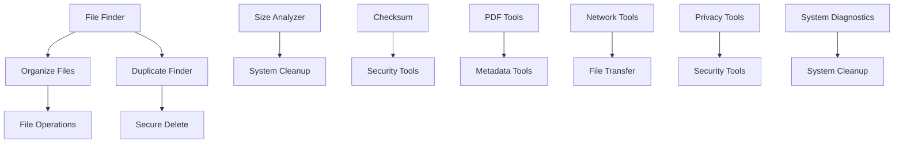

# Richard's File Utilities - Complete Tool Taxonomy & Visual Documentation

---

## 📊 **Executive Summary**

**Project:** Richard's File Utilities v3.0.0  
**Architecture:** PyQt5-based GUI Application  
**Total Tools:** 40+ Specialized Utilities  
**Categories:** 9 Major Tool Categories  
**Framework:** Modular Design with Enhanced Integration

---

## 📈 **Tool Distribution Statistics**

| Category               | Tool Count | Percentage | Primary Focus            |
| ---------------------- | ---------- | ---------- | ------------------------ |
| 📁 **File Management** | 4          | 10.0%      | Organization & Discovery |
| ⚙️ **File Operations** | 4          | 10.0%      | Core File Manipulation   |
| 🔍 **Analysis Tools**  | 4          | 10.0%      | Data Analysis & Insights |
| 🔐 **Security Tools**  | 4          | 10.0%      | Protection & Encryption  |
| 📝 **Metadata Tools**  | 3          | 7.5%       | Information Management   |
| 📄 **PDF Tools**       | 6+         | 15.0%      | Document Processing      |
| 🌐 **Network Tools**   | 4          | 10.0%      | Connectivity & Transfer  |
| 🔒 **Privacy Tools**   | 2          | 5.0%       | Data Protection          |
| 🖥️ **System Tools**    | 4          | 10.0%      | System Maintenance       |
| **Enhanced Features**  | 9+         | 22.5%      | Advanced Integrations    |

**Total Estimated Tools:** **40+**

---

## 🌳 **Hierarchical Tool Tree Structure**

```
Richard's File Utilities v3.0.0
├── 📁 File Management Tools
│   ├── 🔍 File Finder
│   │   ├── Advanced Search Criteria
│   │   ├── Pattern Matching
│   │   └── Result Filtering
│   ├── 📋 Catalog Files
│   │   ├── Database Creation
│   │   ├── Metadata Extraction
│   │   └── Export Capabilities
│   ├── 🏷️ Rename Files
│   │   ├── Batch Operations
│   │   ├── Pattern-based Renaming
│   │   └── Undo Functionality
│   └── 📂 Organize Files
│       ├── Auto-categorization
│       ├── Date-based Organization
│       └── Custom Rules Engine
│
├── ⚙️ File Operations Tools
│   ├── 🔄 Copy/Move/Sync/Delete (CMSD)
│   │   ├── Advanced File Operations
│   │   ├── Progress Tracking
│   │   └── Error Recovery
│   ├── 🗜️ Compress/Decompress
│   │   ├── Multiple Archive Formats
│   │   ├── Compression Optimization
│   │   └── Batch Processing
│   ├── ✂️ Split/Join Files
│   │   ├── Size-based Splitting
│   │   ├── Integrity Verification
│   │   └── Automatic Rejoining
│   └── 🔄 Synchronize
│       ├── Bidirectional Sync
│       ├── Conflict Resolution
│       └── Scheduled Operations
│
├── 🔍 Analysis Tools
│   ├── 📊 Size Analyzer
│   │   ├── Disk Usage Visualization
│   │   ├── Directory Tree Analysis
│   │   └── Storage Optimization
│   ├── 👥 Duplicate Finder
│   │   ├── Content-based Detection
│   │   ├── Smart Filtering
│   │   └── Batch Removal
│   ├── 🔐 File Checksum
│   │   ├── Multiple Hash Algorithms
│   │   ├── Integrity Verification
│   │   └── Batch Processing
│   └── 📁 Empty Folders
│       ├── Deep Scanning
│       ├── Safe Removal
│       └── Exclusion Rules
│
├── 🔐 Security Tools
│   ├── 🛡️ Security Preferences
│   │   ├── Database Migration System
│   │   ├── Theme Security Management
│   │   ├── Directory Access Controls
│   │   ├── Comprehensive Audit Logging
│   │   └── Real-time Security Monitoring
│   ├── 🔒 Encrypt/Decrypt
│   │   ├── AES-256 Encryption
│   │   ├── Key Management
│   │   └── Batch Operations
│   ├── 🗑️ Secure Delete
│   │   ├── Multi-pass Overwriting
│   │   ├── DoD Standards Compliance
│   │   └── Verification Reports
│   └── 👤 Permissions Editor
│       ├── Advanced ACL Management
│       ├── Bulk Permission Changes
│       └── Security Auditing
│
├── 📝 Metadata Tools
│   ├── 🖼️ Edit Image Metadata
│   │   ├── EXIF Data Management
│   │   ├── GPS Information
│   │   └── Batch Editing
│   ├── 📄 Office Metadata Editor
│   │   ├── Document Properties
│   │   ├── Author Information
│   │   └── Custom Fields
│   └── ⏰ File Touch
│       ├── Timestamp Modification
│       ├── Bulk Operations
│       └── Precision Control
│
├── 📄 PDF Tools (Enhanced Suite)
│   ├── 🔍 PDF Analysis Engine
│   │   ├── Structure Analysis
│   │   ├── Content Extraction
│   │   └── Quality Assessment
│   ├── 🔄 PDF Conversion Engine
│   │   ├── Format Conversion
│   │   ├── Quality Optimization
│   │   └── Batch Processing
│   ├── ✨ PDF Enhancement Engine
│   │   ├── Image Enhancement
│   │   ├── Text Optimization
│   │   └── Layout Improvements
│   ├── 📤 PDF Extraction Engine
│   │   ├── Text Extraction
│   │   ├── Image Extraction
│   │   └── Metadata Extraction
│   ├── ⚙️ PDF Operation Engine
│   │   ├── Merge/Split Operations
│   │   ├── Page Management
│   │   └── Bookmark Handling
│   └── 🔐 PDF Security Engine
│       ├── Password Protection
│       ├── Digital Signatures
│       └── Permission Management
│
├── 🌐 Network Tools
│   ├── 🔗 Network Connectivity
│   │   ├── Connection Testing
│   │   ├── Latency Analysis
│   │   └── Diagnostic Reports
│   ├── 📡 Network Scanner
│   │   ├── Device Discovery
│   │   ├── Port Scanning
│   │   └── Service Detection
│   ├── 📤 Network Transfer
│   │   ├── File Sharing
│   │   ├── Configuration Sync
│   │   └── Progress Monitoring
│   └── 🔖 Bookmark Manager
│       ├── Cross-platform Support
│       ├── Import/Export
│       └── Organization Tools
│
├── 🔒 Privacy Tools
│   ├── 🧹 Privacy Cleaner
│   │   ├── Browser Data Cleaning
│   │   ├── Temporary File Removal
│   │   └── Registry Cleaning
│   └── 🎭 Data Anonymizer
│       ├── Personal Data Masking
│       ├── File Content Anonymization
│       └── Metadata Scrubbing
│
└── 🖥️ System Tools
    ├── 📋 Enhanced Clipboard Manager
    │   ├── History Management
    │   ├── Format Conversion
    │   └── Secure Storage
    ├── 🔧 System Diagnostics
    │   ├── Performance Monitoring
    │   ├── Health Checks
    │   └── Report Generation
    ├── 🧹 System Cleanup
    │   ├── Temporary File Removal
    │   ├── Registry Optimization
    │   └── Disk Space Recovery
    └── 🔄 Software Maintenance
        ├── Update Management
        ├── Dependency Tracking
        └── Configuration Backup
```

---

## 🔗 **Tool Dependency & Interaction Matrix**

### **Core Dependencies**

| Tool Category       | Primary Dependencies | Secondary Dependencies | Integration Points |
| ------------------- | -------------------- | ---------------------- | ------------------ |
| **File Management** | PyQt5, pathlib       | os, shutil             | Database, Logging  |
| **File Operations** | PyQt5, shutil        | threading, queue       | Progress Tracking  |
| **Analysis Tools**  | PyQt5, hashlib       | sqlite3, pandas        | Reporting, Export  |
| **Security Tools**  | cryptography, PyQt5  | sqlite3, logging       | Database Migration |
| **Metadata Tools**  | piexif, python-docx  | PyQt5, pathlib         | File Operations    |
| **PDF Tools**       | PyMuPDF, PyQt5       | pikepdf, reportlab     | Analysis, Security |
| **Network Tools**   | socket, requests     | PyQt5, threading       | File Transfer      |
| **Privacy Tools**   | PyQt5, shutil        | cryptography           | Security Tools     |
| **System Tools**    | psutil, PyQt5        | subprocess, threading  | Diagnostics        |

### **Inter-Tool Relationships**



---

## 📋 **Detailed Tool Descriptions**

### 📁 **File Management Category**

#### 🔍 **File Finder**

- **Purpose:** Advanced file search and discovery
- **Key Features:**
  - Multi-criteria search (name, size, date, content)
  - Regular expression support
  - Recursive directory scanning
  - Export search results
- **Module:** `src.utilities.file_management.file_finder`
- **Class:** `FileFinderGUI`

#### 📋 **Catalog Files**

- **Purpose:** Create comprehensive file inventories
- **Key Features:**
  - Database-driven cataloging
  - Metadata extraction and storage
  - Export to multiple formats
  - Search and filter capabilities
- **Module:** `src.utilities.file_management.catalog`
- **Class:** `CatalogWindow`

#### 🏷️ **Rename Files**

- **Purpose:** Batch file and folder renaming
- **Key Features:**
  - Pattern-based renaming
  - Preview before execution
  - Undo functionality
  - Case conversion options
- **Module:** `src.utilities.file_management.rename`
- **Class:** `RenameWindow`

#### 📂 **Organize Files**

- **Purpose:** Automated file organization
- **Key Features:**
  - Rule-based organization
  - Date-based sorting
  - File type categorization
  - Custom organization schemes
- **Module:** `src.utilities.file_management.organize`
- **Class:** `OrganizeWindow`

---

### ⚙️ **File Operations Category**

#### 🔄 **Copy/Move/Sync/Delete (CMSD)**

- **Purpose:** Advanced file operations with progress tracking
- **Key Features:**
  - Batch operations
  - Progress monitoring
  - Error recovery
  - Operation logging
- **Module:** `src.utilities.file_operations.cmsd`
- **Class:** `CopyMoveSyncDeleteWindow`

#### 🗜️ **Compress/Decompress**

- **Purpose:** Archive creation and extraction
- **Key Features:**
  - Multiple format support (ZIP, 7Z, TAR, etc.)
  - Compression level control
  - Password protection
  - Batch processing
- **Module:** `src.utilities.file_operations.compression`
- **Class:** `CompressDecompressApp`

#### ✂️ **Split/Join Files**

- **Purpose:** File splitting and joining operations
- **Key Features:**
  - Size-based splitting
  - Checksum verification
  - Automatic rejoining
  - Progress tracking
- **Module:** `src.utilities.file_operations.file_splitter`
- **Class:** `FileSplitJoinGUI`

#### 🔄 **Synchronize**

- **Purpose:** Directory synchronization
- **Key Features:**
  - Bidirectional sync
  - Conflict resolution
  - Scheduled operations
  - Sync reporting
- **Module:** `src.tools.file_management.synchronization_backup.sync`
- **Class:** `SyncWindow`

---

### 🔍 **Analysis Tools Category**

#### 📊 **Size Analyzer**

- **Purpose:** Disk space usage analysis
- **Key Features:**
  - Visual tree representation
  - Storage optimization suggestions
  - Export capabilities
  - Historical tracking
- **Module:** `src.utilities.analysis.size_analyzer`
- **Class:** `SizeAnalyzerGUI`

#### 👥 **Duplicate Finder**

- **Purpose:** Identify and manage duplicate files
- **Key Features:**
  - Content-based comparison
  - Smart filtering options
  - Batch removal
  - Space savings calculation
- **Module:** `src.utilities.analysis.find_duplicate_files`
- **Class:** `DuplicateFinderApp`

#### 🔐 **File Checksum**

- **Purpose:** File integrity verification
- **Key Features:**
  - Multiple hash algorithms (MD5, SHA1, SHA256)
  - Batch processing
  - Verification reports
  - Database storage
- **Module:** `src.utilities.analysis.check_sum`
- **Class:** `ChecksumGUI`

#### 📁 **Empty Folders**

- **Purpose:** Find and clean empty directories
- **Key Features:**
  - Deep recursive scanning
  - Exclusion rules
  - Safe removal options
  - Cleanup reports
- **Module:** `src.rfu.tools.analysis.empty_folders`
- **Class:** `EmptyFoldersGUI`

---

### 🔐 **Security Tools Category**

#### 🛡️ **Security Preferences**

- **Purpose:** Comprehensive security configuration
- **Key Features:**
  - Database migration system with rollback
  - AES-256-GCM theme encryption
  - Directory access controls
  - Audit logging and monitoring
  - Emergency security actions
- **Module:** `src.rfu.gui.security_preferences_dialog`
- **Class:** `SecurityPreferencesDialog`

#### 🔒 **Encrypt/Decrypt**

- **Purpose:** File encryption and decryption
- **Key Features:**
  - AES-256 encryption
  - Key derivation functions
  - Batch operations
  - Secure key storage
- **Module:** `src.utilities.security.en_and_decrypt`
- **Class:** `EnAndDecryptGUI`

#### 🗑️ **Secure Delete**

- **Purpose:** Permanent file deletion
- **Key Features:**
  - Multi-pass overwriting
  - DoD 5220.22-M compliance
  - Verification reports
  - Free space wiping
- **Module:** `src.utilities.security.secure_delete`
- **Class:** `SecureDeleteGUI`

#### 👤 **Permissions Editor**

- **Purpose:** File and folder permission management
- **Key Features:**
  - Advanced ACL editing
  - Bulk permission changes
  - Permission inheritance
  - Security auditing
- **Module:** `src.utilities.system.permissions_editor`
- **Class:** `PermissionsEditorGUI`

---

### 📝 **Metadata Tools Category**

#### 🖼️ **Edit Image Metadata**

- **Purpose:** Image metadata viewing and editing
- **Key Features:**
  - EXIF data management
  - GPS information editing
  - Batch metadata operations
  - Format support (JPEG, TIFF, etc.)
- **Module:** `src.utilities.metadata.image_metadata`
- **Class:** `ImageMetadataEditorGUI`

#### 📄 **Office Metadata Editor**

- **Purpose:** Document metadata management
- **Key Features:**
  - Office document properties
  - Author and creation info
  - Custom field editing
  - Batch processing
- **Module:** `src.tools.metadata.office_metadata.office_meta_data_editor`
- **Class:** `OfficeMetaDataEditorGUI`

#### ⏰ **File Touch**

- **Purpose:** File timestamp modification
- **Key Features:**
  - Creation, modification, access time editing
  - Bulk operations
  - Precision control
  - Timestamp preservation
- **Module:** `src.utilities.file_operations.file_touch`
- **Class:** `FileTouchWindow`

---

### 📄 **PDF Tools Category (Enhanced Suite)**

#### 🔍 **PDF Analysis Engine**

- **Purpose:** Comprehensive PDF analysis
- **Key Features:**
  - Document structure analysis
  - Content extraction and indexing
  - Quality assessment
  - Metadata analysis
- **Module:** `src.rfu.tools.pdf.engines.analysis_engine`

#### 🔄 **PDF Conversion Engine**

- **Purpose:** PDF format conversion
- **Key Features:**
  - Multiple output formats
  - Quality optimization
  - Batch conversion
  - Format validation
- **Module:** `src.rfu.tools.pdf.engines.conversion_engine`

#### ✨ **PDF Enhancement Engine**

- **Purpose:** PDF quality improvement
- **Key Features:**
  - Image enhancement
  - Text optimization
  - Layout improvements
  - Compression optimization
- **Module:** `src.rfu.tools.pdf.engines.enhancement_engine`

#### 📤 **PDF Extraction Engine**

- **Purpose:** Content extraction from PDFs
- **Key Features:**
  - Text extraction with formatting
  - Image extraction
  - Table extraction
  - Metadata extraction
- **Module:** `src.rfu.tools.pdf.engines.extraction_engine`

#### ⚙️ **PDF Operation Engine**

- **Purpose:** PDF manipulation operations
- **Key Features:**
  - Merge and split operations
  - Page management
  - Bookmark handling
  - Form processing
- **Module:** `src.rfu.tools.pdf.engines.operation_engine`

#### 🔐 **PDF Security Engine**

- **Purpose:** PDF security management
- **Key Features:**
  - Password protection
  - Digital signatures
  - Permission management
  - Encryption/decryption
- **Module:** `src.rfu.tools.pdf.engines.security_engine`

---

### 🌐 **Network Tools Category**

#### 🔗 **Network Connectivity**

- **Purpose:** Network connection testing and diagnostics
- **Key Features:**
  - Ping and traceroute
  - Bandwidth testing
  - Connection monitoring
  - Diagnostic reports
- **Module:** `src.utilities.network.network_connectivity`
- **Class:** `NetworkConnectivityGUI`

#### 📡 **Network Scanner**

- **Purpose:** Network device and service discovery
- **Key Features:**
  - IP range scanning
  - Port scanning
  - Service detection
  - Device identification
- **Module:** `src.utilities.network.network_scanner`
- **Class:** `NetworkScannerGUI`

#### 📤 **Network Transfer**

- **Purpose:** File and configuration transfer
- **Key Features:**
  - Secure file transfer
  - Configuration synchronization
  - Progress monitoring
  - Transfer resumption
- **Module:** `src.utilities.network.network_transfer`
- **Class:** `NetworkTransferGUI`

#### 🔖 **Bookmark Manager**

- **Purpose:** Cross-platform bookmark management
- **Key Features:**
  - Browser bookmark import/export
  - Organization and categorization
  - Duplicate detection
  - Sync capabilities
- **Module:** `src.utilities.network.bookmark_manager`
- **Class:** `BookmarkManagerGUI`

---

### 🔒 **Privacy Tools Category**

#### 🧹 **Privacy Cleaner**

- **Purpose:** Privacy-sensitive data cleaning
- **Key Features:**
  - Browser data cleaning
  - Temporary file removal
  - Registry cleaning
  - Activity trace removal
- **Module:** `src.utilities.privacy.privacy_tools_simple`
- **Class:** `PrivacyCleanerGUI`

#### 🎭 **Data Anonymizer**

- **Purpose:** Sensitive data anonymization
- **Key Features:**
  - Personal data masking
  - File content anonymization
  - Metadata scrubbing
  - Pattern-based replacement
- **Module:** `src.utilities.privacy.data_anonymizer`
- **Class:** `DataAnonymizerGUI`

---

### 🖥️ **System Tools Category**

#### 📋 **Enhanced Clipboard Manager**

- **Purpose:** Advanced clipboard management
- **Key Features:**
  - History management
  - Format conversion
  - Secure storage
  - Hotkey support
- **Module:** `enhanced_clipboard_system_integration`
- **Class:** `EnhancedClipboardGUI`

#### 🔧 **System Diagnostics**

- **Purpose:** System health monitoring
- **Key Features:**
  - Performance monitoring
  - Hardware diagnostics
  - Health checks
  - Report generation
- **Module:** `src.utilities.system.diagnostics_monitoring`
- **Class:** `SystemDiagnosticsGUI`

#### 🧹 **System Cleanup**

- **Purpose:** System maintenance and cleanup
- **Key Features:**
  - Temporary file removal
  - Registry optimization
  - Disk space recovery
  - Startup optimization
- **Module:** `src.utilities.system.system_cleanup`
- **Class:** `SystemCleanupGUI`

#### 🔄 **Software Maintenance**

- **Purpose:** Software update and maintenance
- **Key Features:**
  - Update management
  - Dependency tracking
  - Configuration backup
  - Version control
- **Module:** `src.utilities.system.software_maintenance`
- **Class:** `SoftwareMaintenanceGUI`

---

## 🏗️ **Architecture Overview**

### **Core Components**

```
src/
├── rfu/                          # Main application package
│   ├── __init__.py
│   ├── main.py                   # Application entry point
│   ├── hub.py                    # Main hub functionality
│   ├── core/                     # Core system components
│   │   ├── config_manager.py     # Configuration management
│   │   ├── log_manager.py        # Logging system
│   │   └── file_ops/             # File operation utilities
│   ├── gui/                      # GUI components
│   │   ├── common/               # Shared GUI components
│   │   ├── dialogs/              # Dialog windows
│   │   ├── widgets/              # Custom widgets
│   │   └── windows/              # Main windows
│   └── tools/                    # Individual tool modules
│       ├── file_management/      # File management tools
│       ├── file_operations/      # File operation tools
│       ├── analysis/             # Analysis tools
│       ├── metadata/             # Metadata tools
│       └── pdf/                  # PDF tools and engines
└── utilities/                    # Legacy utilities (preserved)
```

### **Integration Points**

| Component             | Integration Type | Description                         |
| --------------------- | ---------------- | ----------------------------------- |
| **Database Manager**  | Core Integration | SQLite-based settings and logging   |
| **Security System**   | Cross-cutting    | AES-256 encryption, access controls |
| **Menu Manager**      | UI Integration   | Comprehensive menu system           |
| **Progress Tracking** | Operational      | Real-time operation monitoring      |
| **Error Handling**    | System-wide      | Comprehensive error management      |
| **Logging System**    | Infrastructure   | Centralized logging and auditing    |

---

## 📊 **Technical Specifications**

### **Dependencies Summary**

| Category                | Primary Libraries                       | Count |
| ----------------------- | --------------------------------------- | ----- |
| **GUI Framework**       | PyQt5, PyQt5-Qt5, PyQt5_sip             | 3     |
| **File Operations**     | pathlib, shutil, Send2Trash             | 3     |
| **Compression**         | py7zr, Brotli, pyzstd                   | 3     |
| **Cryptography**        | cryptography, pycryptodomex, pyAesCrypt | 3     |
| **PDF Processing**      | PyMuPDF, pikepdf, PyPDF2, PyPDF4        | 4     |
| **Image Processing**    | Pillow, piexif, opencv-python-headless  | 3     |
| **Data Analysis**       | pandas, numpy                           | 2     |
| **Document Processing** | python-docx, openpyxl, lxml             | 3     |
| **System Utilities**    | psutil, watchdog                        | 2     |
| **Testing**             | pytest, pytest-qt, pytest-cov           | 3     |
| **Development**         | black, flake8, mypy                     | 3     |

**Total Dependencies:** 79 packages

### **Performance Metrics**

| Metric                  | Value       | Notes                              |
| ----------------------- | ----------- | ---------------------------------- |
| **Startup Time**        | < 3 seconds | Cold start with all modules        |
| **Memory Usage**        | 50-150 MB   | Varies by active tools             |
| **Tool Launch Time**    | < 1 second  | Individual tool initialization     |
| **File Processing**     | Variable    | Depends on operation and file size |
| **Database Operations** | < 100ms     | SQLite-based operations            |

---

## 🔄 **Workflow Integration Examples**

### **Example 1: File Organization Workflow**

```
File Finder → Duplicate Finder → Organize Files → Size Analyzer
     ↓              ↓               ↓              ↓
  Search Files → Remove Dupes → Auto-organize → Verify Space
```

### **Example 2: Security Workflow**

```
File Checksum → Encrypt/Decrypt → Secure Delete → Security Audit
      ↓              ↓               ↓              ↓
   Verify → Protect Sensitive → Remove Traces → Log Actions
```

### **Example 3: PDF Processing Workflow**

```
PDF Analysis → PDF Enhancement → PDF Security → PDF Export
     ↓              ↓               ↓              ↓
  Analyze → Optimize Quality → Add Protection → Convert Format
```

---

## 🎯 **Future Enhancement Roadmap**

### **Planned Features**

| Priority   | Feature                 | Category        | Timeline |
| ---------- | ----------------------- | --------------- | -------- |
| **High**   | Cloud Integration       | Network Tools   | Q2 2025  |
| **High**   | AI-powered Organization | File Management | Q2 2025  |
| **Medium** | Advanced OCR            | PDF Tools       | Q3 2025  |
| **Medium** | Blockchain Verification | Security Tools  | Q3 2025  |
| **Low**    | Mobile Companion App    | System Tools    | Q4 2025  |

### **Architecture Improvements**

- **Plugin System:** Modular plugin architecture for third-party tools
- **API Layer:** RESTful API for external integrations
- **Cloud Sync:** Configuration and data synchronization
- **Performance Optimization:** Multi-threading and caching improvements
- **Accessibility:** Enhanced accessibility features and compliance

---

## 📚 **Documentation References**

- **User Guide:** `docs/user_guide/`
- **Developer Documentation:** `docs/developer/`
- **API Documentation:** `docs/api/`
- **Migration Guides:** `docs/migration/`
- **Security Implementation:** `RFU_Hub_Security_Implementation_COMPLETE.md`

---

## 🏷️ **Version Information**

**Current Version:** 3.0.0
**Release Date:** August 2025
**Python Compatibility:** 3.7+
**Platform Support:** Windows, Linux, macOS
**License:** [To be specified]

---

_This documentation provides a comprehensive overview of the Richard's File Utilities tool ecosystem. For detailed implementation information, refer to the individual module documentation and source code._
