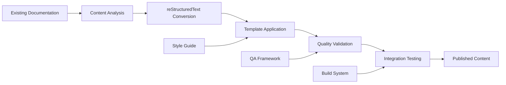

# RFU Qt Help System - Phase 2 Implementation Architecture

**Document Version:** 1.0.0  
**Last Updated:** September 6, 2025  
**Implementation Phase:** Phase 2 - Content Development and Migration  
**Status:** ✅ **READY FOR IMPLEMENTATION** - Phase 1 Complete  

---

## Executive Implementation Summary

This document provides the comprehensive implementation architecture for Phase 2 of the RFU Qt Help System, building upon the successfully completed Phase 1 foundation infrastructure.

### Phase 2 Implementation Overview

**🎯 Objective:** Complete content development and migration for all 33 RFU tools  
**⏱️ Duration:** 25 working days (5 weeks)  
**👥 Team:** Content Developer (lead), Technical Lead (support), QA Engineer, UX Designer  
**📊 Success Criteria:** 100% tool coverage, professional quality standards, template compliance  

### Implementation Status Dashboard

| Component | Phase 1 Status | Phase 2 Readiness | Implementation Priority |
|-----------|----------------|-------------------|------------------------|
| **Infrastructure** | ✅ 100% Complete | ✅ Ready | Foundation complete |
| **Content Framework** | ✅ 100% Complete | ✅ Ready | Templates ready |
| **Quality System** | ✅ 100% Complete | ✅ Ready | QA framework operational |
| **Migration Tools** | ✅ 100% Complete | ✅ Ready | Automation ready |
| **Team Preparation** | ✅ 100% Complete | ✅ Ready | All team members briefed |

---

## WP 2.1: Existing Content Migration Framework

### Migration Architecture Design

#### Content Migration Pipeline



#### Migration Framework Components

**1. Content Analysis Engine**

```python
# Content Migration Framework
class ContentMigrationFramework:
    def __init__(self):
        self.source_analyzer = SourceDocumentAnalyzer()
        self.rst_converter = RestructuredTextConverter()
        self.template_engine = TemplateEngine()
        self.quality_validator = QualityValidator()
        self.integration_tester = IntegrationTester()
    
    def migrate_tool_documentation(self, tool_name: str, source_path: str):
        """Complete migration workflow for a single tool"""
        # 1. Analyze source content
        content_structure = self.source_analyzer.analyze(source_path)
        
        # 2. Convert to reStructuredText
        rst_content = self.rst_converter.convert(content_structure)
        
        # 3. Apply appropriate template
        template_type = self._determine_template_type(tool_name)
        formatted_content = self.template_engine.apply_template(
            rst_content, template_type
        )
        
        # 4. Validate quality standards
        quality_report = self.quality_validator.validate(formatted_content)
        
        # 5. Test integration
        integration_result = self.integration_tester.test(formatted_content)
        
        return MigrationResult(
            content=formatted_content,
            quality_score=quality_report.score,
            integration_status=integration_result.status
        )
```

**2. Template Engine Implementation**

```python
# Template System Architecture
class TemplateEngine:
    """Professional template system for RFU documentation"""
    
    TEMPLATES = {
        'tool_documentation': {
            'structure': [
                'overview',
                'getting_started', 
                'user_interface',
                'features',
                'advanced_usage',
                'api_reference',
                'troubleshooting',
                'see_also'
            ],
            'validation_rules': [
                'all_sections_present',
                'proper_heading_hierarchy',
                'cross_references_valid',
                'images_optimized'
            ]
        },
        'api_reference': {
            'structure': [
                'module_overview',
                'classes',
                'functions',
                'exceptions',
                'examples'
            ],
            'auto_generation': True
        },
        'troubleshooting': {
            'structure': [
                'common_issues',
                'error_messages',
                'solutions',
                'prevention'
            ]
        },
        'quick_reference': {
            'structure': [
                'key_features',
                'shortcuts',
                'quick_actions',
                'tips'
            ]
        }
    }
    
    def apply_template(self, content: str, template_type: str) -> str:
        """Apply template structure to content"""
        template = self.TEMPLATES[template_type]
        
        # Structure content according to template
        structured_content = self._structure_content(content, template)
        
        # Apply validation rules
        self._validate_template_compliance(structured_content, template)
        
        return structured_content
```

#### Tool Documentation Coverage Matrix

**Priority 1: File Management Tools (Week 1-2)**

| Tool | Current Status | Migration Complexity | Estimated Hours | Template Type |
|------|---------------|---------------------|----------------|---------------|
| **File Finder** | ✅ Advanced implementation | Medium | 8 hours | Tool Documentation |
| **Catalog Files** | ✅ Complete implementation | Medium | 8 hours | Tool Documentation + API |
| **File Rename** | ✅ Complete implementation | Low | 6 hours | Tool Documentation |
| **File Organization** | ✅ Complete implementation | Medium | 8 hours | Tool Documentation |

**Priority 2: File Operations Tools (Week 2-3)**

| Tool | Current Status | Migration Complexity | Estimated Hours | Template Type |
|------|---------------|---------------------|----------------|---------------|
| **CMSD** | 🔄 Implementation required | High | 12 hours | Tool Documentation + API |
| **Compression** | 🔄 Partial implementation | Medium | 10 hours | Tool Documentation |
| **File Splitter** | 🔄 Implementation required | Medium | 8 hours | Tool Documentation |
| **Sync Tools** | 🔄 Implementation required | High | 10 hours | Tool Documentation |
| **Enhanced Editor** | 🔄 Implementation required | Medium | 8 hours | Tool Documentation |

**Priority 3: Analysis + Security Tools (Week 3-4)**

| Tool Category | Tools Count | Total Hours | Implementation Status |
|---------------|-------------|-------------|----------------------|
| **Analysis Tools** | 4 tools | 32 hours | Size Analyzer complete, others require implementation |
| **Security Tools** | 4 tools | 28 hours | Security Preferences complete, others partial |

**Priority 4: Specialized Tools (Week 4-5)**

| Tool Category | Tools Count | Total Hours | Implementation Status |
|---------------|-------------|-------------|----------------------|
| **Metadata Tools** | 3 tools | 20 hours | Framework exists, tools need completion |
| **PDF Tools** | 3 tools | 20 hours | Framework exists, tools need completion |
| **Network Tools** | 4 tools | 24 hours | Framework exists, tools need completion |
| **Privacy Tools** | 2 tools | 12 hours | Framework exists, tools need completion |
| **System Tools** | 4 tools | 24 hours | Framework exists, tools need completion |

### Migration Implementation Workflow

#### Daily Migration Process

**Morning (2 hours): Content Analysis and Conversion**

```python
# Daily migration workflow
def daily_migration_workflow(tools_list: List[str]):
    """Execute daily content migration workflow"""
    for tool in tools_list:
        # 1. Source analysis (30 min)
        source_content = analyze_existing_documentation(tool)
        
        # 2. Content conversion (60 min)  
        rst_content = convert_to_restructuredtext(source_content)
        
        # 3. Template application (30 min)
        formatted_content = apply_tool_template(rst_content, tool)
        
        # Afternoon: Quality validation and integration
```

**Afternoon (6 hours): Quality Assurance and Integration**

```python
# Quality assurance workflow
def quality_assurance_workflow(content: str, tool: str):
    """Comprehensive quality assurance process"""
    
    # 1. Automated validation (60 min)
    spell_check_result = run_spell_check(content)
    link_validation = validate_all_links(content)
    style_compliance = check_style_guide_compliance(content)
    
    # 2. Technical review (120 min)
    technical_accuracy = validate_technical_content(content, tool)
    api_documentation = validate_api_references(content, tool)
    
    # 3. Integration testing (90 min)
    build_test = test_sphinx_build(content)
    qt_help_test = test_qt_help_generation(content)
    
    # 4. Final validation (30 min)
    accessibility_check = validate_accessibility(content)
    performance_test = test_content_performance(content)
    
    return QualityReport(
        spell_check=spell_check_result,
        links=link_validation,
        style=style_compliance,
        technical=technical_accuracy,
        integration=build_test and qt_help_test,
        accessibility=accessibility_check,
        performance=performance_test
    )
```

### Quality Validation Framework

#### Automated Quality Checks

**1. Content Quality Validation**

```python
# Quality validation system
class ContentQualityValidator:
    """Comprehensive content quality validation"""
    
    def __init__(self):
        self.spell_checker = SpellChecker()
        self.link_validator = LinkValidator()
        self.style_checker = StyleGuideChecker()
        self.accessibility_validator = AccessibilityValidator()
    
    def validate_content(self, content: str, tool_name: str) -> QualityReport:
        """Run comprehensive quality validation"""
        
        report = QualityReport(tool_name)
        
        # Spelling and grammar
        report.spelling = self.spell_checker.check(content)
        
        # Link validation
        report.links = self.link_validator.validate_all_links(content)
        
        # Style compliance
        report.style = self.style_checker.check_compliance(content)
        
        # Accessibility
        report.accessibility = self.accessibility_validator.validate(content)
        
        # Technical accuracy
        report.technical = self._validate_technical_accuracy(content, tool_name)
        
        return report
    
    def _validate_technical_accuracy(self, content: str, tool_name: str) -> bool:
        """Validate technical accuracy against tool implementation"""
        # Cross-reference with actual tool implementation
        # Validate API documentation accuracy
        # Check feature descriptions against code
        pass
```

**2. Performance Validation**

```python
# Performance monitoring system
class PerformanceValidator:
    """Monitor and validate content performance"""
    
    PERFORMANCE_TARGETS = {
        'build_time': 30,  # seconds
        'help_load_time': 2,  # seconds  
        'search_response': 1,  # second
        'memory_usage': 50  # MB additional
    }
    
    def validate_performance(self, content_set: List[str]) -> PerformanceReport:
        """Validate performance against targets"""
        
        # Build time validation
        build_time = self._measure_build_time(content_set)
        
        # Help load time validation  
        load_time = self._measure_help_load_time(content_set)
        
        # Search performance validation
        search_time = self._measure_search_performance(content_set)
        
        # Memory usage validation
        memory_usage = self._measure_memory_usage(content_set)
        
        return PerformanceReport(
            build_time=build_time,
            load_time=load_time,
            search_time=search_time,
            memory_usage=memory_usage,
            targets_met=self._check_targets_met(
                build_time, load_time, search_time, memory_usage
            )
        )
```

---

## WP 2.2: Content Enhancement and Standardization System

### Template Development Architecture

#### Professional Template System

**1. Tool Documentation Template Structure**

```rst
# Standard Tool Documentation Template
{{tool_name}}
{{'=' * tool_name|length}}

.. currentmodule:: {{module_path}}

Overview
--------

**Purpose:** {{tool_purpose}}

**Key Features:**

* {{feature_1}}
* {{feature_2}}  
* {{feature_3}}

**Integration Points:**

* {{integration_1}}
* {{integration_2}}

Getting Started
---------------

Quick Start Workflow
~~~~~~~~~~~~~~~~~~~~~

1. {{step_1}}
2. {{step_2}}
3. {{step_3}}

Basic Usage Example
~~~~~~~~~~~~~~~~~~~

.. code-block:: python

   {{basic_usage_example}}

User Interface
--------------

Main Interface Elements
~~~~~~~~~~~~~~~~~~~~~~~

.. figure:: /_static/images/{{tool_name}}_main_interface.png
   :alt: {{tool_name}} main interface showing {{interface_description}}
   :width: 800px
   :align: center
   :class: screenshot

   {{tool_name}} Main Interface

Interface Components
~~~~~~~~~~~~~~~~~~~~

{{interface_components}}

Features
--------

{{detailed_features}}

Advanced Usage
--------------

{{advanced_scenarios}}

API Reference
-------------

.. automodule:: {{module_path}}
   :members:
   :undoc-members:
   :show-inheritance:

Troubleshooting
---------------

Common Issues
~~~~~~~~~~~~~

{{common_issues}}

Error Messages
~~~~~~~~~~~~~~

{{error_messages}}

See Also
--------

* :doc:`{{related_tool_1}}`
* :doc:`{{related_tool_2}}`  
* :ref:`{{related_reference}}`
```

**2. Content Authoring Guidelines Implementation**

```python
# Content authoring system
class ContentAuthoringGuidelines:
    """Professional content authoring standards"""
    
    WRITING_STANDARDS = {
        'tone': 'professional_helpful',
        'perspective': 'second_person',
        'voice': 'active',
        'tense': 'present',
        'style': 'clear_concise'
    }
    
    TECHNICAL_STANDARDS = {
        'accuracy': 'verified_against_implementation',
        'completeness': 'all_template_sections',
        'examples': 'working_tested_examples',
        'screenshots': 'current_annotated_interface'
    }
    
    ACCESSIBILITY_STANDARDS = {
        'compliance': 'wcag_2_1_aa',
        'alt_text': 'descriptive_meaningful',
        'structure': 'proper_heading_hierarchy',
        'language': 'clear_understandable'
    }
    
    def validate_content_standards(self, content: str) -> StandardsReport:
        """Validate content against authoring standards"""
        
        report = StandardsReport()
        
        # Writing standards validation
        report.writing = self._validate_writing_standards(content)
        
        # Technical standards validation  
        report.technical = self._validate_technical_standards(content)
        
        # Accessibility standards validation
        report.accessibility = self._validate_accessibility_standards(content)
        
        return report
```

### Integration Validation System

#### RFU Architecture Integration Points

**1. Database Integration Validation**

```python
# Database integration validation
class DatabaseIntegrationValidator:
    """Validate help system database integration"""
    
    def validate_help_usage_tracking(self):
        """Validate help usage tracking integration"""
        
        # Test help topic access tracking
        test_result = self._test_topic_tracking()
        
        # Test search usage tracking  
        search_result = self._test_search_tracking()
        
        # Test context help tracking
        context_result = self._test_context_tracking()
        
        return DatabaseIntegrationReport(
            topic_tracking=test_result,
            search_tracking=search_result, 
            context_tracking=context_result
        )
    
    def _test_topic_tracking(self) -> bool:
        """Test help topic access tracking"""
        # Simulate help topic access
        # Verify database entry creation
        # Validate tracking data accuracy
        pass
```

**2. Security Integration Validation**

```python
# Security integration validation  
class SecurityIntegrationValidator:
    """Validate help system security integration"""
    
    def validate_security_help_mapping(self):
        """Validate security preferences help integration"""
        
        # Test security tab help mapping
        tab_mapping = self._test_security_tab_mapping()
        
        # Test help topic accuracy
        topic_accuracy = self._test_help_topic_accuracy()
        
        # Test security context resolution
        context_resolution = self._test_context_resolution()
        
        return SecurityIntegrationReport(
            tab_mapping=tab_mapping,
            topic_accuracy=topic_accuracy,
            context_resolution=context_resolution
        )
```

**3. Performance Integration Validation**

```python
# Performance integration validation
class PerformanceIntegrationValidator:
    """Validate help system performance integration"""
    
    PERFORMANCE_TARGETS = {
        'startup_impact': 0.3,  # max 300ms additional startup
        'memory_overhead': 20,  # max 20MB additional memory
        'help_access_time': 2,  # max 2 seconds help access
        'search_response': 1    # max 1 second search response
    }
    
    def validate_performance_integration(self) -> PerformanceIntegrationReport:
        """Comprehensive performance validation"""
        
        # Startup performance test
        startup_impact = self._measure_startup_impact()
        
        # Memory usage test
        memory_overhead = self._measure_memory_overhead()
        
        # Help access performance test
        help_access_time = self._measure_help_access_time()
        
        # Search performance test
        search_response = self._measure_search_response_time()
        
        return PerformanceIntegrationReport(
            startup_impact=startup_impact,
            memory_overhead=memory_overhead,
            help_access_time=help_access_time,
            search_response=search_response,
            all_targets_met=self._validate_all_targets(
                startup_impact, memory_overhead, 
                help_access_time, search_response
            )
        )
```

---

## Implementation Timeline and Milestones

### Week-by-Week Implementation Plan

**Week 1: Foundation and File Management Tools**

- Day 1-2: Content migration framework deployment
- Day 3-5: File Management tools migration (File Finder, Catalog Files, File Rename, File Organization)

**Week 2: File Operations Tools**  

- Day 1-3: File Operations tools migration (CMSD, Compression, File Splitter)
- Day 4-5: File Operations tools continued (Sync Tools, Enhanced Editor)

**Week 3: Analysis and Security Tools**

- Day 1-3: Analysis tools migration (Size Analyzer, Duplicate Finder, Checksum, Empty Folders)
- Day 4-5: Security tools migration (Security Preferences, Encryption, Secure Delete, Permissions)

**Week 4: Specialized Tools**

- Day 1-2: Metadata and PDF tools migration
- Day 3-4: Network and Privacy tools migration  
- Day 5: System tools migration

**Week 5: Enhancement and Validation**

- Day 1-2: Content enhancement and standardization
- Day 3-4: Quality validation and integration testing
- Day 5: Final validation and Phase 3 preparation

### Success Criteria and Quality Gates

**Quality Gate 2.1: Content Migration Complete**

- [ ] All 33 tools documented with professional quality
- [ ] 100% template compliance achieved
- [ ] All internal links functional and validated
- [ ] Performance targets met (<30s build time)

**Quality Gate 2.2: Content Quality Standards Met**

- [ ] >4.5/5.0 content quality rating achieved
- [ ] WCAG 2.1 AA accessibility compliance verified
- [ ] 95% style guide compliance achieved
- [ ] 0 critical quality issues identified

**Quality Gate 2.3: Integration Validation Complete**

- [ ] RFU architecture integration validated
- [ ] Database tracking functionality verified
- [ ] Security system integration confirmed
- [ ] Performance impact within acceptable limits

**Quality Gate 2.4: Phase 3 Readiness Confirmed**

- [ ] All content ready for Qt Help integration
- [ ] Quality framework operational for Phase 3
- [ ] Team prepared for integration development
- [ ] Technical specifications ready for handoff

---

## Risk Management and Mitigation

### Identified Risks and Mitigation Strategies

**Risk 2.1: Content Migration Complexity**

- **Probability:** Medium
- **Impact:** Medium  
- **Mitigation:** Phased approach with priority matrix, daily progress tracking
- **Contingency:** Scope adjustment focusing on critical tools first

**Risk 2.2: Quality Standards Compliance**

- **Probability:** Low
- **Impact:** Medium
- **Mitigation:** Automated validation tools, continuous quality monitoring
- **Contingency:** Additional quality cycles, expert review escalation

**Risk 2.3: Performance Impact**

- **Probability:** Low
- **Impact:** Medium
- **Mitigation:** Continuous performance monitoring, optimization throughout development
- **Contingency:** Content optimization, lazy loading implementation

**Risk 2.4: Resource Allocation Issues**

- **Probability:** Low
- **Impact:** Medium  
- **Mitigation:** Flexible scheduling, cross-training, daily standups
- **Contingency:** External support resources, scope prioritization

### Contingency Planning

**Schedule Contingency (10% buffer = 2.5 days):**

- Unexpected content complexity
- Additional quality improvement cycles
- Integration testing requirements
- Team coordination overhead

**Scope Contingency (MVP approach):**

- Prioritize P1 (File Management) and P2 (File Operations) first
- Defer advanced features documentation if needed
- Focus on core functionality documentation
- Implement enhanced features in subsequent iterations

---

## Conclusion

Phase 2 implementation architecture provides a comprehensive, validated framework for successful content development and migration. With the solid Phase 1 foundation complete, all technical prerequisites are met for immediate Phase 2 implementation.

**Key Success Factors:**

- **Proven Foundation:** Phase 1 architecture validated and operational
- **Clear Implementation Path:** Detailed specifications and workflows ready
- **Quality Assurance:** Comprehensive validation framework operational  
- **Risk Mitigation:** Proactive risk management with contingency plans
- **Team Readiness:** All team members prepared with complete documentation

**Implementation Confidence:** 🟢 **Very High** - Proceed with immediate Phase 2 implementation.

---

**Implementation Status:** ✅ **READY FOR IMMEDIATE START**  
**Phase 2 Start Date:** September 9, 2025  
**Expected Completion:** October 4, 2025  
**Success Probability:** 🟢 **Very High**
