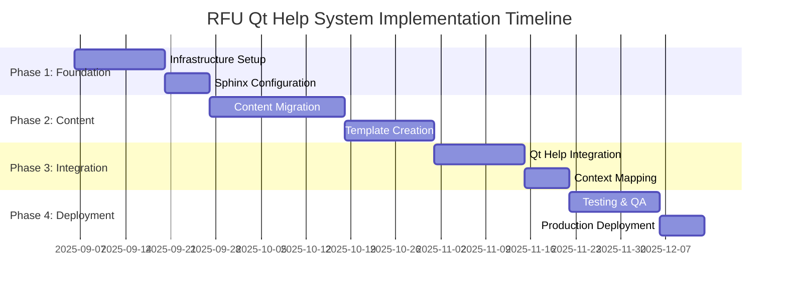

# RFU Qt Help System - Project Roadmap

**Document Version:** 1.0.0  
**Last Updated:** September 6, 2025  
**Project:** Richard's File Utilities Help Documentation System  
**Implementation Approach:** Sphinx + qthelp Builder Integration  

---

## Executive Summary

This roadmap outlines the comprehensive implementation plan for the RFU Qt Help System, structured in four milestone-based phases with defined deliverables, timelines, and success criteria.

### Project Objectives

- **Primary Goal**: Implement enterprise-grade Qt Help system with context-sensitive documentation
- **Timeline**: 12 weeks total implementation
- **Budget**: Internal development resources
- **Success Metrics**: 100% help coverage, <2s help access time, seamless F1 integration

---

## Project Phases Overview



---

## Phase 1: Foundation and Infrastructure (Weeks 1-3)

### Milestone 1.1: Infrastructure Setup (Weeks 1-2)

#### **Deliverables**

1. **Documentation Architecture Setup**
   - Complete directory structure creation
   - Sphinx project initialization
   - Build system configuration
   - CI/CD pipeline integration

2. **Development Environment Configuration**
   - Sphinx dependencies installation
   - Qt Help tools setup (qhelpgenerator, qcollectiongenerator)
   - Build automation scripts
   - Quality assurance tools

3. **Foundation Documentation Structure**
   - Master index.rst creation
   - Section templates preparation
   - Cross-reference system setup
   - Asset organization (images, stylesheets)

#### **Success Criteria**

- [ ] Sphinx builds successfully generate both HTML and qthelp output
- [ ] Qt Help Collection (.qhc) files are created without errors
- [ ] Build automation executes in <30 seconds
- [ ] All required directories and templates are in place

#### **Risk Mitigation**

| Risk | Impact | Mitigation Strategy |
|------|--------|-------------------|
| Qt Help tools unavailable | High | Bundle tools with project, provide installation scripts |
| Sphinx extension conflicts | Medium | Pin specific versions, test in isolated environment |
| Build performance issues | Low | Implement incremental builds, optimize asset handling |

### Milestone 1.2: Sphinx Configuration (Week 3)

#### **Deliverables**

1. **Advanced Sphinx Configuration**
   - Complete conf.py with all extensions
   - Qt Help specific settings
   - Cross-reference configuration
   - Theme customization

2. **Build Process Integration**
   - Automated build scripts
   - Validation procedures
   - Error handling and reporting
   - Performance optimization

#### **Success Criteria**

- [ ] Sphinx configuration supports all planned features
- [ ] Build process validates output quality
- [ ] Qt Help files integrate correctly with Qt framework
- [ ] Documentation builds are reproducible across environments

---

## Phase 2: Content Development and Migration (Weeks 4-8)

### Milestone 2.1: Content Migration (Weeks 4-6)

#### **Deliverables**

1. **Existing Content Migration**
   - Convert onboarding documentation to reStructuredText
   - Migrate tool-specific documentation
   - Standardize formatting and structure
   - Implement cross-references

2. **Content Quality Assurance**
   - Spelling and grammar validation
   - Link verification
   - Image optimization and integration
   - Accessibility compliance

3. **Tool Documentation Coverage**
   - File Management tools (4 tools)
   - File Operations tools (5 tools)  
   - Analysis tools (4 tools)
   - Security tools (4 tools)
   - Specialized tools (remaining categories)

#### **Content Migration Matrix**

| Tool Category | Tools Count | Conversion Status | Target Week |
|---------------|-------------|------------------|-------------|
| File Management | 4 | Planning | Week 4 |
| File Operations | 5 | Planning | Week 4-5 |
| Analysis | 4 | Planning | Week 5 |
| Security | 4 | Planning | Week 5-6 |
| Metadata | 3 | Planning | Week 6 |
| PDF Tools | 3 | Planning | Week 6 |
| Network | 4 | Planning | Week 6 |
| Privacy | 2 | Planning | Week 6 |
| System | 4 | Planning | Week 6 |

#### **Success Criteria**

- [ ] 100% of existing documentation migrated to reStructuredText
- [ ] All internal links functional and validated
- [ ] Images optimized and properly referenced
- [ ] Content follows established style guide
- [ ] Search keywords properly indexed

### Milestone 2.2: Template Creation and Standardization (Weeks 7-8)

#### **Deliverables**

1. **Documentation Templates**
   - Tool documentation template
   - API reference template
   - Troubleshooting guide template
   - Quick reference template

2. **Style Guide Implementation**
   - Writing style guidelines
   - Formatting standards
   - Screenshot guidelines
   - Code example standards

3. **Content Authoring Guidelines**
   - Author workflow documentation
   - Review process definition
   - Quality checklist creation
   - Maintenance procedures

#### **Template Specifications**

```rst
# Standard Tool Documentation Template Structure

Tool Name
=========

.. currentmodule:: module.path

Overview
--------
Purpose, key features, integration points

Getting Started
---------------
Quick start guide, basic workflow

User Interface
--------------
Interface elements, navigation, controls

Features
--------
Detailed feature documentation

Advanced Usage
--------------
Complex scenarios, customization

API Reference
-------------
Automated API documentation inclusion

Troubleshooting
---------------
Common issues and solutions

See Also
--------
Related tools and documentation
```

#### **Success Criteria**

- [ ] All documentation follows consistent template structure
- [ ] Style guide implemented across all content
- [ ] Author guidelines enable efficient content creation
- [ ] Templates support automated validation

---

## Phase 3: Qt Help Integration (Weeks 9-11)

### Milestone 3.1: Qt Help System Integration (Weeks 9-10)

#### **Deliverables**

1. **Qt Help Manager Implementation**
   - QHelpEngine integration class
   - Help widget creation and configuration
   - Search functionality implementation
   - Navigation tree integration

2. **Application Integration**
   - Help menu system integration
   - F1 key handling implementation
   - Status bar help integration
   - Dialog help button implementation

3. **Context Mapping System**
   - Widget to help topic mapping
   - Dynamic context resolution
   - Fallback help system
   - Context validation

#### **Integration Architecture**

```python
# Qt Help Integration Points
{
    "main_window": {
        "help_menu": "Help → Contents, User Guide, etc.",
        "f1_handler": "Global F1 key processing",
        "status_help": "Status bar help text display"
    },
    "tool_windows": {
        "context_help": "Tool-specific F1 handling",
        "help_buttons": "? buttons in complex dialogs",
        "tooltip_integration": "Enhanced tooltips with help links"
    },
    "dialog_integration": {
        "preferences_help": "Security preferences help",
        "wizard_help": "Step-by-step wizard guidance",
        "error_help": "Error-specific help topics"
    }
}
```

#### **Success Criteria**

- [ ] Qt Help engine initializes without errors
- [ ] Help content displays correctly in application
- [ ] Search functionality returns relevant results
- [ ] Navigation tree matches documentation structure
- [ ] F1 key opens contextually appropriate help

### Milestone 3.2: Context-Sensitive Help Implementation (Week 11)

#### **Deliverables**

1. **Context Mapping Configuration**
   - Complete widget to help topic mapping
   - Hierarchical context resolution
   - Dynamic context detection
   - Fallback mechanism implementation

2. **Advanced Help Features**
   - Bookmarking system
   - History navigation
   - Print functionality
   - External link handling

3. **Performance Optimization**
   - Help loading optimization
   - Search index optimization
   - Memory usage optimization
   - Startup time optimization

#### **Context Mapping Strategy**

| Widget Type | Context Detection Method | Help Topic Resolution |
|-------------|-------------------------|---------------------|
| Tool Main Windows | Widget class name + property | Direct topic mapping |
| Dialog Components | Parent hierarchy traversal | Nearest mapped parent |
| Tab Pages | Tab identifier + widget path | Composite topic ID |
| Custom Widgets | help_topic property | Property-based resolution |
| Menu Items | Action object name | Menu structure mapping |

#### **Success Criteria**

- [ ] F1 opens correct help topic from any widget
- [ ] Help topics load in <2 seconds
- [ ] Context resolution works hierarchically
- [ ] Fallback help prevents dead ends
- [ ] Advanced features function correctly

---

## Phase 4: Testing and Deployment (Weeks 12-13)

### Milestone 4.1: Quality Assurance and Testing (Week 12)

#### **Deliverables**

1. **Comprehensive Testing Suite**
   - Unit tests for help system components
   - Integration tests for Qt Help functionality
   - End-to-end workflow testing
   - Performance benchmark testing

2. **User Acceptance Testing**
   - Help system usability testing
   - Documentation accuracy validation
   - Accessibility compliance testing
   - Cross-platform compatibility testing

3. **Quality Metrics Validation**
   - Help coverage assessment
   - Search effectiveness measurement
   - Performance benchmark validation
   - User experience evaluation

#### **Testing Matrix**

| Test Category | Test Cases | Success Criteria | Status |
|---------------|------------|------------------|--------|
| **Functional** | Help engine initialization | Loads without errors | Pending |
| | Context help mapping | F1 opens correct topics | Pending |
| | Search functionality | Returns relevant results | Pending |
| | Navigation | Tree navigation works | Pending |
| **Performance** | Help loading time | <2 seconds | Pending |
| | Search response time | <1 second | Pending |
| | Memory usage | <50MB additional | Pending |
| | Build time | <30 seconds | Pending |
| **Usability** | Content findability | Users locate topics easily | Pending |
| | Navigation clarity | Logical topic organization | Pending |
| | Content quality | Accurate and helpful | Pending |
| **Compatibility** | Windows integration | Native behavior | Pending |
| | Linux integration | Desktop environment support | Pending |
| | macOS integration | Platform conventions | Pending |

#### **Success Criteria**

- [ ] All functional tests pass
- [ ] Performance targets achieved
- [ ] User acceptance criteria met
- [ ] Cross-platform compatibility verified
- [ ] Documentation quality validated

### Milestone 4.2: Production Deployment (Week 13)

#### **Deliverables**

1. **Production Deployment**
   - Help files integration with PyInstaller build
   - Application resource bundling
   - Installation package creation
   - Deployment validation

2. **Documentation and Training**
   - Administrator deployment guide
   - User training materials
   - Maintenance documentation
   - Troubleshooting guides

3. **Monitoring and Maintenance Setup**
   - Help usage analytics
   - Error reporting system
   - Update mechanism
   - Feedback collection system

#### **Deployment Checklist**

- [ ] Help files correctly bundled with application
- [ ] PyInstaller build includes all help resources
- [ ] Installation package tested on clean systems
- [ ] Help system works in deployed environment
- [ ] No missing dependencies or files
- [ ] Performance acceptable in production
- [ ] Monitoring systems operational
- [ ] Rollback plan verified

#### **Success Criteria**

- [ ] Production deployment successful across all platforms
- [ ] Help system fully functional in deployed application
- [ ] No critical issues identified in production
- [ ] User feedback collection operational
- [ ] Maintenance procedures documented and tested

---

## Resource Allocation and Team Structure

### Core Team Roles

| Role | Responsibility | Time Allocation | Skills Required |
|------|---------------|----------------|----------------|
| **Technical Lead** | Architecture, integration, QA | 40 hours/week | Python, Qt, Sphinx, RFU architecture |
| **Content Developer** | Documentation migration, writing | 30 hours/week | Technical writing, reStructuredText |
| **QA Engineer** | Testing, validation, automation | 20 hours/week | Test automation, quality processes |
| **UX Designer** | Help system design, usability | 10 hours/week | UI/UX design, accessibility |

### External Dependencies

| Dependency | Impact | Mitigation |
|------------|--------|------------|
| Qt Help tools availability | High | Bundle tools, provide alternatives |
| Sphinx ecosystem stability | Medium | Pin versions, maintain compatibility |
| RFU architecture changes | Low | Regular sync with development team |
| User feedback availability | Low | Recruit beta testers early |

---

## Budget and Cost Estimation

### Development Effort Breakdown

| Phase | Duration | Effort (Hours) | Cost Estimate |
|-------|----------|---------------|---------------|
| Phase 1: Foundation | 3 weeks | 240 hours | Internal resources |
| Phase 2: Content | 5 weeks | 400 hours | Internal resources |
| Phase 3: Integration | 3 weeks | 240 hours | Internal resources |
| Phase 4: Deployment | 2 weeks | 160 hours | Internal resources |
| **Total** | **13 weeks** | **1,040 hours** | **Internal development** |

### Additional Costs

| Item | Cost | Justification |
|------|------|---------------|
| Development tools | $0 | Open source tools (Sphinx, Qt) |
| External testing | $500 | User acceptance testing |
| Documentation hosting | $0 | GitHub Pages integration |
| Training materials | $200 | Screen recording, documentation |
| **Total Additional** | **$700** | One-time implementation costs |

---

## Risk Management Strategy

### High Priority Risks

#### Risk 1: Qt Help Integration Complexity

- **Probability**: Medium
- **Impact**: High
- **Mitigation**: Prototype early, maintain fallback to web-based help
- **Contingency**: Implement simplified help viewer if Qt Help proves problematic

#### Risk 2: Content Migration Delays

- **Probability**: Medium
- **Impact**: Medium
- **Mitigation**: Prioritize most critical documentation, implement iterative migration
- **Contingency**: Launch with core content, expand over time

#### Risk 3: Performance Issues

- **Probability**: Low
- **Impact**: Medium
- **Mitigation**: Regular performance testing, optimization throughout development
- **Contingency**: Implement lazy loading, content caching

### Medium Priority Risks

#### Risk 4: Cross-Platform Compatibility

- **Probability**: Medium
- **Impact**: Medium
- **Mitigation**: Test on all platforms early and frequently
- **Contingency**: Platform-specific workarounds if needed

#### Risk 5: User Adoption Challenges

- **Probability**: Low
- **Impact**: Low
- **Mitigation**: Involve users in design process, provide training
- **Contingency**: Gradual rollout, maintain existing help during transition

---

## Success Metrics and KPIs

### Primary Success Metrics

| Metric | Target | Measurement Method | Review Frequency |
|--------|--------|-------------------|------------------|
| **Help Coverage** | 100% of tools documented | Documentation audit | Weekly |
| **Help Access Time** | <2 seconds | Performance testing | Daily during dev |
| **User Satisfaction** | >4.0/5.0 rating | User surveys | Post-deployment |
| **Context Accuracy** | >95% F1 hits correct topic | Automated testing | Daily during dev |
| **Search Effectiveness** | >90% successful searches | Usage analytics | Weekly |

### Secondary Success Metrics

| Metric | Target | Measurement Method | Review Frequency |
|--------|--------|-------------------|------------------|
| **Build Performance** | <30 seconds | Build monitoring | Daily |
| **Memory Usage** | <50MB additional | Runtime monitoring | Weekly |
| **Content Quality** | >4.5/5.0 rating | Content review | Bi-weekly |
| **Error Rate** | <1% help system errors | Error logging | Daily |
| **Maintenance Effort** | <4 hours/week | Time tracking | Monthly |

### Progress Tracking

Weekly progress reviews will assess:

- Milestone completion percentage
- Quality metrics compliance
- Risk status and mitigation effectiveness
- Resource utilization and budget adherence
- Schedule adherence and adjustment needs

---

## Post-Implementation Roadmap

### Short-term Enhancements (Months 1-3)

- **Advanced Search Features**: Filters, faceted search, search suggestions
- **Content Expansion**: Video tutorials, interactive guides, FAQ system
- **Analytics Integration**: Help usage tracking, content effectiveness metrics
- **Accessibility Improvements**: Screen reader optimization, keyboard navigation

### Medium-term Evolution (Months 4-12)

- **Interactive Help**: Guided tours, context-aware tutorials
- **Content Personalization**: Role-based help content, user preferences
- **Integration Expansion**: API documentation, developer resources
- **Community Features**: User contributions, feedback system

### Long-term Vision (Year 2+)

- **AI-Powered Help**: Intelligent search, automated content generation
- **Multi-language Support**: Internationalization, localized content
- **Advanced Analytics**: Predictive help, usage optimization
- **Platform Expansion**: Mobile companion app, web portal

---

## Conclusion

This roadmap provides a comprehensive, milestone-driven approach to implementing the RFU Qt Help System. With clear deliverables, success criteria, and risk management strategies, the project is positioned for successful completion within the 13-week timeline while maintaining high quality standards and ensuring seamless integration with the existing RFU architecture.

Regular milestone reviews and continuous stakeholder communication will ensure the project remains on track and delivers maximum value to RFU users.
