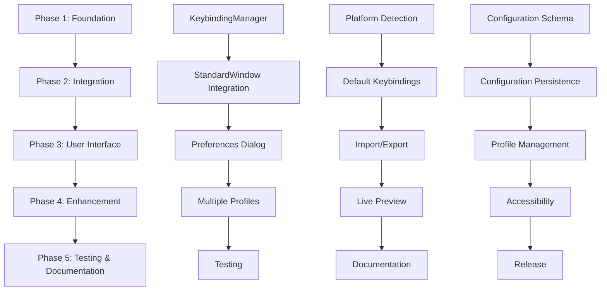

# Keybindings Implementation Plan
## Richard's File Utilities - Comprehensive Integration Roadmap

### Executive Summary

This document provides a detailed implementation plan for integrating comprehensive keybindings functionality into the Richard's File Utilities (RFU) project. The plan addresses all requirements from the keybindings implementation checklist and provides a structured approach to enhance user experience through customizable keyboard shortcuts.

### Table of Contents

1. [Current Architecture Analysis](#current-architecture-analysis)
2. [Technical Specifications](#technical-specifications)
3. [Implementation Phases](#implementation-phases)
4. [File Structure and Modifications](#file-structure-and-modifications)
5. [Integration Points](#integration-points)
6. [Testing Strategy](#testing-strategy)
7. [Risk Assessment and Mitigation](#risk-assessment-and-mitigation)
8. [Performance Impact Analysis](#performance-impact-analysis)
9. [Documentation Requirements](#documentation-requirements)
10. [Timeline and Milestones](#timeline-and-milestones)

---

## Current Architecture Analysis

### Project Structure Overview

The RFU project follows a modular architecture with the following key components:

```
src/
├── rfu/                          # Core RFU application
│   ├── gui/                      # GUI components
│   │   ├── common/               # Shared GUI components
│   │   │   ├── standard_window.py    # Base window class
│   │   │   └── base_window.py         # Alternative base class
│   │   ├── themes.py             # Centralized theming system
│   │   └── widgets/              # Reusable widgets
│   ├── core/                     # Core functionality
│   └── tools/                    # Individual utility tools
├── utilities/                    # Standalone utilities
└── config/                       # Configuration files
    └── rfu_config.json          # Main configuration
```

### Key Integration Points Identified

1. **StandardWindow Class** (`src/rfu/gui/common/standard_window.py`)
   - Base class for all main windows
   - Already includes status bar and menu infrastructure
   - Ideal integration point for keybinding system

2. **Theme System** (`src/rfu/gui/themes.py`)
   - Centralized styling and UI management
   - Can be extended to include keybinding display preferences

3. **Configuration System** (`config/rfu_config.json`)
   - Existing JSON-based configuration
   - Can be extended to store keybinding preferences

4. **Hub Architecture** (`src/rfu/hub.py`, `src/utilities/network/network_connectivity_complex/gui/hub.py`)
   - Multiple hub implementations using PyQt5
   - Consistent pattern for tool integration

---

## Technical Specifications

### Core Functionality Requirements

#### 1. Hybrid Keybinding System

**Components:**
- **QShortcut**: For global application shortcuts
- **keyPressEvent**: For context-sensitive shortcuts
- **QAction**: For menu-integrated shortcuts

**Architecture:**
```python
class KeybindingManager:
    """Central manager for all keybinding operations"""
    
    def __init__(self, parent_window):
        self.parent_window = parent_window
        self.shortcuts = {}
        self.actions = {}
        self.key_sequences = {}
        
    def register_shortcut(self, key_sequence, callback, context="global"):
        """Register a new keyboard shortcut"""
        
    def unregister_shortcut(self, key_sequence, context="global"):
        """Remove a keyboard shortcut"""
        
    def load_keybindings(self, config_path=None):
        """Load keybindings from configuration"""
        
    def save_keybindings(self, config_path=None):
        """Save current keybindings to configuration"""
```

#### 2. Configuration Management

**Keybinding Configuration Schema:**
```json
{
  "keybindings": {
    "version": "1.0",
    "platform": "windows",
    "profiles": {
      "default": {
        "global": {
          "Ctrl+N": "file.new",
          "Ctrl+O": "file.open",
          "Ctrl+S": "file.save",
          "F1": "help.show",
          "Ctrl+Q": "application.quit"
        },
        "context_specific": {
          "file_operations": {
            "Delete": "file.delete",
            "F2": "file.rename",
            "Ctrl+C": "file.copy"
          },
          "pdf_tools": {
            "Ctrl+M": "pdf.merge",
            "Ctrl+Shift+S": "pdf.split"
          }
        }
      },
      "power_user": {
        "global": {
          "Ctrl+Alt+N": "file.new_advanced",
          "Ctrl+Shift+O": "file.open_recent"
        }
      }
    },
    "display_preferences": {
      "show_in_menus": true,
      "show_in_tooltips": true,
      "show_in_status_bar": false
    }
  }
}
```

#### 3. Platform Detection and Compatibility

**Platform-Specific Handling:**
```python
class PlatformManager:
    """Handle platform-specific keybinding differences"""
    
    @staticmethod
    def get_platform():
        """Detect current platform"""
        
    @staticmethod
    def convert_keybinding(key_sequence, from_platform, to_platform):
        """Convert keybindings between platforms"""
        
    @staticmethod
    def validate_keybinding_compatibility(keybindings, target_platform):
        """Check if keybindings are compatible with target platform"""
```

### Optional Enhancements

#### 1. Multiple Keybinding Profiles

**Profile Management:**
- Default profile for standard users
- Power-user profile with advanced shortcuts
- Custom profiles for specific workflows
- Profile switching mechanism

#### 2. Conflict Detection and Resolution

**Conflict Detection System:**
```python
class ConflictDetector:
    """Detect and resolve keybinding conflicts"""
    
    def detect_conflicts(self, keybindings):
        """Identify conflicting key sequences"""
        
    def suggest_alternatives(self, conflicted_key):
        """Suggest alternative key sequences"""
        
    def resolve_conflict(self, conflict_data, resolution_strategy):
        """Apply conflict resolution"""
```

#### 3. Live Preview System

**Real-time UI Updates:**
- Dynamic menu text updates
- Tooltip modifications
- Status bar keybinding hints

#### 4. Accessibility Integration

**Accessibility Considerations:**
- Screen reader compatibility
- High contrast mode support
- Alternative input method support
- System accessibility shortcut preservation

---

## Implementation Phases

### Phase 1: Foundation (Weeks 1-2)
**Milestone: Core Infrastructure**

**Objectives:**
- Implement basic keybinding manager
- Extend configuration system
- Create platform detection utilities

**Deliverables:**
- `KeybindingManager` class
- Extended configuration schema
- Platform detection utilities
- Basic unit tests

### Phase 2: Integration (Weeks 3-4)
**Milestone: StandardWindow Integration**

**Objectives:**
- Integrate keybinding system with StandardWindow
- Implement default keybindings
- Add configuration loading/saving

**Deliverables:**
- Modified StandardWindow class
- Default keybinding definitions
- Configuration persistence
- Integration tests

### Phase 3: User Interface (Weeks 5-6)
**Milestone: Customization Interface**

**Objectives:**
- Create keybinding customization dialog
- Implement import/export functionality
- Add conflict detection

**Deliverables:**
- Keybinding preferences dialog
- Import/export utilities
- Conflict detection system
- User interface tests

### Phase 4: Enhancement (Weeks 7-8)
**Milestone: Advanced Features**

**Objectives:**
- Implement multiple profiles
- Add live preview functionality
- Enhance accessibility support

**Deliverables:**
- Profile management system
- Live preview implementation
- Accessibility enhancements
- Performance optimizations

### Phase 5: Testing and Documentation (Weeks 9-10)
**Milestone: Production Ready**

**Objectives:**
- Comprehensive testing
- Documentation completion
- Performance validation

**Deliverables:**
- Complete test suite
- User documentation
- Developer documentation
- Performance benchmarks

---

## File Structure and Modifications

### New Files to Create

```
src/rfu/core/keybindings/
├── __init__.py
├── manager.py                    # KeybindingManager class
├── platform.py                  # Platform detection and conversion
├── conflicts.py                  # Conflict detection and resolution
├── profiles.py                   # Profile management
├── defaults.py                   # Default keybinding definitions
└── validators.py                 # Keybinding validation utilities

src/rfu/gui/dialogs/
├── keybinding_preferences.py     # Keybinding customization dialog
├── keybinding_import_export.py   # Import/export dialogs
└── conflict_resolution.py        # Conflict resolution dialog

src/rfu/gui/widgets/
├── keybinding_editor.py          # Individual keybinding editor widget
├── keybinding_display.py         # Keybinding display components
└── profile_selector.py           # Profile selection widget

config/keybindings/
├── default_keybindings.json      # Default keybinding definitions
├── platform_mappings.json        # Platform-specific mappings
└── accessibility_mappings.json   # Accessibility-friendly alternatives

tests/keybindings/
├── test_manager.py               # KeybindingManager tests
├── test_platform.py             # Platform detection tests
├── test_conflicts.py            # Conflict detection tests
├── test_integration.py          # Integration tests
└── test_ui.py                   # User interface tests

docs/keybindings/
├── user_guide.md                # User documentation
├── developer_guide.md           # Developer documentation
├── api_reference.md             # API documentation
└── troubleshooting.md           # Troubleshooting guide
```

### Files to Modify

#### Core Files
1. **`src/rfu/gui/common/standard_window.py`**
   - Add keybinding manager initialization
   - Integrate shortcut registration
   - Add keybinding display methods

2. **`src/rfu/gui/themes.py`**
   - Add keybinding display styling
   - Include keybinding visibility preferences

3. **`config/rfu_config.json`**
   - Add keybinding configuration section
   - Include display preferences

#### Integration Files
4. **`src/rfu/hub.py`**
   - Register hub-specific keybindings
   - Integrate with keybinding manager

5. **`src/utilities/network/network_connectivity_complex/gui/hub.py`**
   - Add network tool keybindings
   - Integrate with global keybinding system

#### Tool-Specific Files
6. **All tool GUI files** (50+ files)
   - Register tool-specific keybindings
   - Integrate with context-sensitive shortcuts

---

## Integration Points

### 1. StandardWindow Integration

**Modification Strategy:**
```python
class StandardWindow(QMainWindow):
    def __init__(self, title="RFU Utility", is_main_window=False):
        super().__init__()
        # Existing initialization...
        
        # Add keybinding manager
        self.keybinding_manager = KeybindingManager(self)
        self._setup_default_keybindings()
        self._setup_keybinding_display()
    
    def _setup_default_keybindings(self):
        """Setup default keybindings for this window"""
        self.keybinding_manager.register_shortcut("F1", self.show_help)
        self.keybinding_manager.register_shortcut("Ctrl+Q", self.close)
        # Additional default shortcuts...
    
    def register_keybinding(self, key_sequence, callback, context="window"):
        """Public method for tools to register keybindings"""
        return self.keybinding_manager.register_shortcut(
            key_sequence, callback, context
        )
```

### 2. Menu System Integration

**Menu Enhancement:**
```python
def create_menu_action(self, text, callback, shortcut=None, icon=None):
    """Enhanced menu action creation with keybinding support"""
    action = QAction(text, self)
    action.triggered.connect(callback)
    
    if shortcut:
        # Register with keybinding manager
        self.keybinding_manager.register_action_shortcut(action, shortcut)
        
        # Update display text if enabled
        if self.keybinding_manager.show_in_menus:
            action.setText(f"{text}\t{shortcut}")
    
    return action
```

### 3. Configuration System Integration

**Extended Configuration Schema:**
```python
class ConfigManager:
    def load_keybindings(self):
        """Load keybindings from configuration"""
        config = self.load_config()
        return config.get('keybindings', {})
    
    def save_keybindings(self, keybindings):
        """Save keybindings to configuration"""
        config = self.load_config()
        config['keybindings'] = keybindings
        self.save_config(config)
    
    def migrate_keybindings(self, old_version, new_version):
        """Handle keybinding configuration migration"""
        # Migration logic for configuration updates
```

---

## Testing Strategy

### Unit Testing

**Test Categories:**
1. **KeybindingManager Tests**
   - Shortcut registration/unregistration
   - Configuration loading/saving
   - Platform compatibility

2. **Platform Detection Tests**
   - Platform identification accuracy
   - Keybinding conversion correctness
   - Edge case handling

3. **Conflict Detection Tests**
   - Conflict identification accuracy
   - Resolution suggestion quality
   - Performance under load

### Integration Testing

**Integration Test Scenarios:**
1. **StandardWindow Integration**
   - Keybinding registration during window creation
   - Shortcut activation and callback execution
   - Menu integration functionality

2. **Multi-Window Scenarios**
   - Context-specific keybinding activation
   - Global vs. local shortcut precedence
   - Window focus handling

3. **Configuration Persistence**
   - Save/load cycle integrity
   - Migration between versions
   - Error recovery

### User Interface Testing

**UI Test Coverage:**
1. **Keybinding Preferences Dialog**
   - Keybinding editing functionality
   - Conflict detection and resolution
   - Profile management

2. **Import/Export Functionality**
   - File format validation
   - Platform compatibility warnings
   - Error handling

3. **Live Preview System**
   - Real-time UI updates
   - Performance impact
   - Visual consistency

### Performance Testing

**Performance Benchmarks:**
1. **Startup Performance**
   - Keybinding loading time
   - Memory usage impact
   - Initialization overhead

2. **Runtime Performance**
   - Shortcut activation latency
   - Memory leak detection
   - CPU usage monitoring

3. **Scalability Testing**
   - Large keybinding set handling
   - Multiple profile performance
   - Concurrent window management

---

## Risk Assessment and Mitigation

### High-Risk Areas

#### 1. Platform Compatibility Issues
**Risk:** Keybindings may not work consistently across Windows, macOS, and Linux
**Mitigation:**
- Comprehensive platform testing
- Platform-specific keybinding mappings
- Fallback mechanisms for unsupported shortcuts

#### 2. Performance Impact
**Risk:** Keybinding system may slow down application startup or runtime
**Mitigation:**
- Lazy loading of keybinding configurations
- Efficient shortcut lookup algorithms
- Performance monitoring and optimization

#### 3. Conflict with System Shortcuts
**Risk:** Application shortcuts may conflict with system or accessibility shortcuts
**Mitigation:**
- System shortcut detection and avoidance
- Accessibility compliance testing
- User warning system for potential conflicts

#### 4. Configuration Corruption
**Risk:** Keybinding configuration may become corrupted or incompatible
**Mitigation:**
- Configuration validation and error recovery
- Automatic backup of working configurations
- Migration utilities for version updates

### Medium-Risk Areas

#### 1. User Interface Complexity
**Risk:** Keybinding customization interface may be too complex for average users
**Mitigation:**
- Progressive disclosure design
- Preset profiles for common use cases
- Comprehensive user documentation

#### 2. Integration Complexity
**Risk:** Integration with existing tools may be complex and error-prone
**Mitigation:**
- Phased integration approach
- Comprehensive testing at each phase
- Rollback procedures for failed integrations

### Low-Risk Areas

#### 1. Documentation Maintenance
**Risk:** Documentation may become outdated as features evolve
**Mitigation:**
- Automated documentation generation where possible
- Regular documentation review cycles
- Version-controlled documentation

---

## Performance Impact Analysis

### Memory Usage

**Estimated Impact:**
- **Keybinding Manager**: ~2-5 MB additional memory usage
- **Configuration Storage**: ~100-500 KB per profile
- **UI Components**: ~1-3 MB for preferences dialogs

**Optimization Strategies:**
- Lazy loading of unused profiles
- Efficient data structures for shortcut lookup
- Memory pooling for temporary objects

### CPU Usage

**Performance Considerations:**
- **Startup Overhead**: ~50-100ms additional startup time
- **Shortcut Processing**: <1ms per shortcut activation
- **Configuration Loading**: ~10-50ms depending on profile size

**Optimization Techniques:**
- Cached shortcut lookup tables
- Background configuration loading
- Optimized conflict detection algorithms

### Storage Requirements

**Disk Usage:**
- **Core System**: ~500 KB - 1 MB
- **Configuration Files**: ~10-50 KB per profile
- **Documentation**: ~2-5 MB

### Network Impact

**Minimal Network Usage:**
- Optional update checking for keybinding definitions
- Import/export functionality (local file operations)
- No continuous network requirements

---

## Documentation Requirements

### User Documentation

#### 1. User Guide (`docs/keybindings/user_guide.md`)
**Content:**
- Introduction to keybindings
- Default shortcut reference
- Customization instructions
- Profile management
- Import/export procedures
- Troubleshooting common issues

#### 2. Quick Reference Card (`docs/keybindings/quick_reference.pdf`)
**Content:**
- Printable shortcut reference
- Platform-specific variations
- Context-sensitive shortcuts
- Emergency shortcuts

### Developer Documentation

#### 1. Developer Guide (`docs/keybindings/developer_guide.md`)
**Content:**
- Architecture overview
- Integration instructions
- API reference
- Extension guidelines
- Testing procedures

#### 2. API Reference (`docs/keybindings/api_reference.md`)
**Content:**
- KeybindingManager API
- Platform utilities API
- Configuration schema
- Event system documentation

### Technical Documentation

#### 1. Implementation Details (`docs/keybindings/implementation.md`)
**Content:**
- Technical architecture
- Design decisions
- Performance considerations
- Security implications

#### 2. Migration Guide (`docs/keybindings/migration.md`)
**Content:**
- Version migration procedures
- Configuration update processes
- Backward compatibility notes
- Breaking change documentation

---

## Timeline and Milestones

### Detailed Implementation Schedule

#### Phase 1: Foundation (Weeks 1-2)
**Week 1:**
- Day 1-2: Create core keybinding manager structure
- Day 3-4: Implement platform detection utilities
- Day 5: Create basic configuration schema

**Week 2:**
- Day 1-2: Implement shortcut registration system
- Day 3-4: Add configuration loading/saving
- Day 5: Create initial unit tests

**Milestone 1 Deliverables:**
- ✅ KeybindingManager class with basic functionality
- ✅ Platform detection and conversion utilities
- ✅ Extended configuration schema
- ✅ Basic unit test coverage (>80%)

#### Phase 2: Integration (Weeks 3-4)
**Week 3:**
- Day 1-2: Modify StandardWindow class
- Day 3-4: Implement default keybinding definitions
- Day 5: Create integration layer

**Week 4:**
- Day 1-2: Test StandardWindow integration
- Day 3-4: Add menu system integration
- Day 5: Implement configuration persistence

**Milestone 2 Deliverables:**
- ✅ Modified StandardWindow with keybinding support
- ✅ Default keybinding set implemented
- ✅ Configuration persistence working
- ✅ Integration test coverage (>70%)

#### Phase 3: User Interface (Weeks 5-6)
**Week 5:**
- Day 1-3: Create keybinding preferences dialog
- Day 4-5: Implement keybinding editor widget

**Week 6:**
- Day 1-2: Add import/export functionality
- Day 3-4: Implement conflict detection UI
- Day 5: Create profile management interface

**Milestone 3 Deliverables:**
- ✅ Complete keybinding preferences interface
- ✅ Import/export functionality
- ✅ Conflict detection and resolution UI
- ✅ Profile management system

#### Phase 4: Enhancement (Weeks 7-8)
**Week 7:**
- Day 1-2: Implement multiple profile support
- Day 3-4: Add live preview functionality
- Day 5: Enhance accessibility support

**Week 8:**
- Day 1-2: Performance optimization
- Day 3-4: Advanced conflict resolution
- Day 5: Final feature integration

**Milestone 4 Deliverables:**
- ✅ Multiple profile system
- ✅ Live preview functionality
- ✅ Enhanced accessibility support
- ✅ Performance optimizations

#### Phase 5: Testing and Documentation (Weeks 9-10)
**Week 9:**
- Day 1-2: Comprehensive testing
- Day 3-4: Performance validation
- Day 5: Bug fixes and refinements

**Week 10:**
- Day 1-2: Complete documentation
- Day 3-4: Final testing and validation
- Day 5: Release preparation

**Final Milestone Deliverables:**
- ✅ Complete test suite (>90% coverage)
- ✅ Full user and developer documentation
- ✅ Performance benchmarks
- ✅ Production-ready implementation

### Critical Path Dependencies



### Resource Requirements

**Development Team:**
- 1 Senior Developer (Full-time, 10 weeks)
- 1 UI/UX Developer (Part-time, 4 weeks)
- 1 QA Engineer (Part-time, 3 weeks)
- 1 Technical Writer (Part-time, 2 weeks)

**Infrastructure:**
- Development environment setup
- Testing infrastructure
- Documentation platform
- Version control system

### Risk Mitigation Timeline

**Week 2:** Platform compatibility validation
**Week 4:** Performance impact assessment
**Week 6:** User interface usability testing
**Week 8:** Security and accessibility review
**Week 10:** Final risk assessment and mitigation

---

## Conclusion

This comprehensive implementation plan provides a structured approach to integrating advanced keybinding functionality into the Richard's File Utilities project. The plan addresses all requirements from the keybindings implementation checklist while maintaining compatibility with the existing codebase architecture.

Key success factors:
- Phased implementation approach minimizes risk
- Comprehensive testing ensures quality and reliability
- Detailed documentation supports adoption and maintenance
- Performance considerations maintain application responsiveness
- Accessibility compliance ensures inclusive design

The estimated 10-week timeline provides adequate time for thorough implementation, testing, and documentation while allowing for contingency planning and risk mitigation.

### Next Steps

1. **Stakeholder Review**: Present this plan to project stakeholders for approval
2. **Resource Allocation**: Secure necessary development resources
3. **Environment Setup**: Prepare development and testing environments
4. **Phase 1 Kickoff**: Begin implementation with foundation phase

This plan serves as a living document that should be updated as implementation progresses and new requirements or constraints are identified.