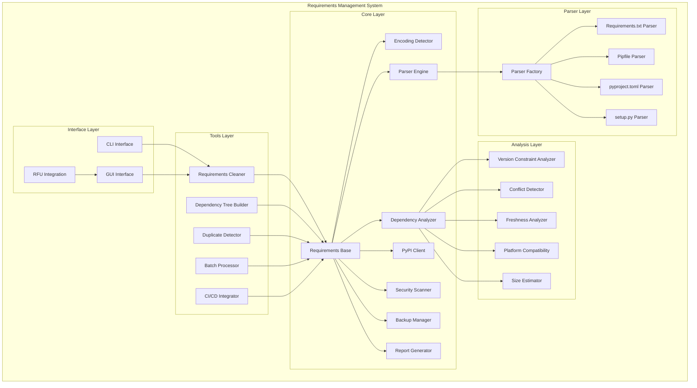
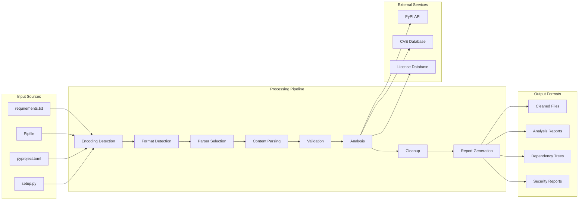
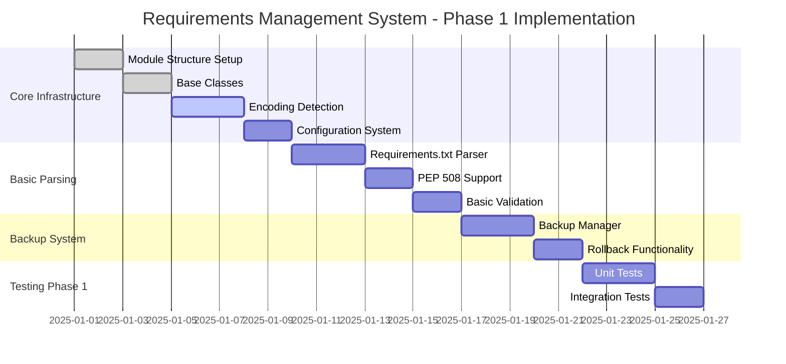

# Requirements Management System - Implementation Plan

## System Architecture Overview



## Data Flow Architecture



## Phase 1 Implementation Workflow



## Detailed Component Implementation Plan

### 1. Core Infrastructure Components

#### Requirements Base Class (`core/requirements_base.py`)
```python
# Implementation structure
class RequirementsToolBase:
    """Base class for all requirements management tools"""
    
    def __init__(self, config: Dict[str, Any]):
        self.config = config
        self.logger = self._setup_logging()
        self.backup_manager = BackupManager(config)
    
    def _setup_logging(self) -> logging.Logger:
        """Setup structured logging"""
        pass
    
    def _validate_input(self, file_path: Path) -> bool:
        """Validate input file"""
        pass
    
    def _create_backup(self, file_path: Path) -> Path:
        """Create backup before processing"""
        pass
```

#### Encoding Detector (`core/encoding_detector.py`)
```python
class EncodingDetector:
    """Advanced encoding detection and cleanup"""
    
    SUPPORTED_ENCODINGS = ['utf-8', 'ascii', 'latin-1', 'cp1252', 'utf-16']
    
    def detect_encoding(self, file_path: Path) -> str:
        """Detect file encoding with confidence scoring"""
        pass
    
    def clean_encoding_issues(self, content: str, encoding: str) -> str:
        """Clean encoding-related issues"""
        pass
    
    def normalize_line_endings(self, content: str) -> str:
        """Normalize line endings to LF"""
        pass
```

### 2. Parser Implementation Strategy

#### Parser Factory Pattern (`parsers/parser_factory.py`)
```python
class ParserFactory:
    """Factory for creating appropriate parsers"""
    
    _parsers = {
        'requirements.txt': RequirementsTxtParser,
        'Pipfile': PipfileParser,
        'pyproject.toml': PyprojectTomlParser,
        'setup.py': SetupPyParser
    }
    
    @classmethod
    def create_parser(cls, file_path: Path) -> BaseParser:
        """Create appropriate parser based on file type"""
        pass
    
    @classmethod
    def detect_format(cls, file_path: Path) -> str:
        """Detect requirements file format"""
        pass
```

#### Requirements.txt Parser (`parsers/requirements_txt_parser.py`)
```python
class RequirementsTxtParser(BaseParser):
    """PEP 508 compliant requirements.txt parser"""
    
    def parse(self, content: str) -> List[Requirement]:
        """Parse requirements.txt content"""
        pass
    
    def _parse_requirement_line(self, line: str) -> Optional[Requirement]:
        """Parse individual requirement line"""
        pass
    
    def _handle_environment_markers(self, req_str: str) -> Tuple[str, str]:
        """Handle environment markers"""
        pass
```

### 3. Analysis Engine Implementation

#### Version Constraint Analyzer (`analyzers/version_constraint_analyzer.py`)
```python
class VersionConstraintAnalyzer:
    """Analyze and validate version constraints"""
    
    OPERATORS = ['==', '>=', '<=', '>', '<', '!=', '~=', '===']
    
    def parse_constraint(self, constraint: str) -> VersionConstraint:
        """Parse version constraint string"""
        pass
    
    def validate_constraint(self, constraint: VersionConstraint) -> ValidationResult:
        """Validate constraint syntax and logic"""
        pass
    
    def optimize_constraints(self, constraints: List[VersionConstraint]) -> List[VersionConstraint]:
        """Optimize and simplify constraints"""
        pass
```

#### Conflict Detector (`analyzers/conflict_detector.py`)
```python
class ConflictDetector:
    """Detect dependency conflicts"""
    
    def detect_conflicts(self, requirements: List[Requirement]) -> List[Conflict]:
        """Detect all types of conflicts"""
        pass
    
    def _check_version_conflicts(self, req1: Requirement, req2: Requirement) -> Optional[Conflict]:
        """Check for version range conflicts"""
        pass
    
    def suggest_resolutions(self, conflicts: List[Conflict]) -> List[Resolution]:
        """Suggest conflict resolutions"""
        pass
```

### 4. PyPI Integration Implementation

#### PyPI Client (`core/pypi_client.py`)
```python
class PyPIClient:
    """PyPI integration with caching and offline support"""
    
    def __init__(self, config: Dict[str, Any]):
        self.base_url = "https://pypi.org/pypi"
        self.cache = PackageMetadataCache(config)
        self.session = self._create_session()
    
    async def get_package_info(self, package_name: str) -> PackageInfo:
        """Get package information from PyPI"""
        pass
    
    async def validate_package_version(self, package_name: str, version: str) -> bool:
        """Validate package version exists"""
        pass
    
    def _handle_rate_limiting(self, response: requests.Response) -> None:
        """Handle PyPI rate limiting"""
        pass
```

### 5. Security and Compliance Implementation

#### Security Scanner (`core/security_scanner.py`)
```python
class SecurityScanner:
    """Security vulnerability and license scanning"""
    
    def __init__(self, config: Dict[str, Any]):
        self.vuln_db = VulnerabilityDatabase(config)
        self.license_db = LicenseDatabase(config)
    
    async def scan_vulnerabilities(self, requirements: List[Requirement]) -> List[Vulnerability]:
        """Scan for security vulnerabilities"""
        pass
    
    def check_license_compatibility(self, requirements: List[Requirement]) -> LicenseReport:
        """Check license compatibility"""
        pass
    
    def _calculate_risk_score(self, vulnerability: Vulnerability) -> float:
        """Calculate risk score for vulnerability"""
        pass
```

### 6. User Interface Implementation

#### CLI Interface (`cli/main_cli.py`)
```python
class RequirementsManagerCLI:
    """Main CLI interface"""
    
    def __init__(self):
        self.parser = self._create_argument_parser()
        self.config = self._load_config()
    
    def run(self, args: List[str]) -> int:
        """Main CLI entry point"""
        pass
    
    def _create_argument_parser(self) -> argparse.ArgumentParser:
        """Create CLI argument parser"""
        pass
```

#### GUI Integration (`gui/requirements_window.py`)
```python
class RequirementsManagementWindow(BaseWindow):
    """Main requirements management GUI window"""
    
    def __init__(self, parent=None):
        super().__init__(parent)
        self.setup_ui()
        self.setup_connections()
    
    def setup_ui(self):
        """Setup user interface"""
        pass
    
    def on_analyze_clicked(self):
        """Handle analyze button click"""
        pass
```

## Implementation Priorities and Dependencies

### Critical Path Components
1. **Requirements Base Class** - Foundation for all other components
2. **Encoding Detector** - Essential for handling real-world files
3. **Requirements.txt Parser** - Most common format, highest priority
4. **Basic Validation** - Core functionality requirement
5. **Backup Manager** - Safety requirement before any modifications

### Secondary Priority Components
1. **Version Constraint Analyzer** - Advanced analysis capability
2. **PyPI Client** - External validation and enrichment
3. **Conflict Detector** - Advanced dependency analysis
4. **CLI Interface** - User interaction capability
5. **Report Generator** - Output and documentation

### Future Enhancement Components
1. **Multi-format Parsers** - Extended format support
2. **Security Scanner** - Advanced security features
3. **GUI Interface** - Visual user interface
4. **CI/CD Integration** - Automation capabilities
5. **Advanced Analytics** - Comprehensive analysis features

## Testing Strategy Implementation

### Unit Testing Structure
```
tests/
├── unit/
│   ├── test_encoding_detector.py
│   ├── test_parser_engine.py
│   ├── test_version_analyzer.py
│   ├── test_conflict_detector.py
│   └── test_pypi_client.py
├── integration/
│   ├── test_end_to_end_workflow.py
│   ├── test_cli_interface.py
│   └── test_gui_integration.py
├── performance/
│   ├── test_large_files.py
│   └── test_concurrent_processing.py
└── fixtures/
    ├── sample_requirements/
    ├── malformed_files/
    └── test_data/
```

### Test Data Requirements
- **Real-world Examples**: Requirements files from popular projects (Django, Flask, NumPy)
- **Edge Cases**: Malformed files, encoding issues, circular dependencies
- **Performance Data**: Large files with 1000+ packages
- **Security Test Cases**: Files with known vulnerabilities

## Configuration Management

### Default Configuration Structure
```yaml
# config/defaults.yaml
requirements_management:
  parsing:
    encoding_detection: true
    strict_pep508: true
    preserve_comments: true
    normalize_whitespace: true
    
  analysis:
    check_vulnerabilities: true
    check_licenses: true
    check_platform_compatibility: true
    max_dependency_depth: 10
    
  pypi:
    enable_caching: true
    cache_ttl_hours: 24
    offline_mode: false
    rate_limit_requests_per_minute: 60
    
  backup:
    auto_backup: true
    max_backups: 10
    backup_compression: true
    
  reporting:
    default_format: "html"
    include_recommendations: true
    include_statistics: true
    include_dependency_tree: true
```

## Error Handling Strategy

### Error Categories and Handling
1. **Input Validation Errors**: Clear user feedback with suggestions
2. **Network Errors**: Graceful degradation with offline mode
3. **Parsing Errors**: Detailed error location and context
4. **Analysis Errors**: Continue with partial results where possible
5. **System Errors**: Comprehensive logging and recovery mechanisms

### Logging Implementation
```python
# Structured logging example
logger.info(
    "Requirements analysis completed",
    extra={
        "file_path": str(file_path),
        "packages_analyzed": len(requirements),
        "conflicts_found": len(conflicts),
        "vulnerabilities_found": len(vulnerabilities),
        "processing_time_ms": processing_time,
        "operation_id": operation_id
    }
)
```

## Performance Optimization Strategy

### Optimization Targets
- **Memory Usage**: Maximum 100MB for typical operations
- **Processing Speed**: <5 seconds for typical requirements files
- **Cache Efficiency**: 95%+ hit rate for repeated operations
- **Concurrent Processing**: Support for parallel file processing
- **Large File Support**: Handle 1000+ package requirements efficiently

### Implementation Techniques
1. **Lazy Loading**: Load components only when needed
2. **Streaming Processing**: Process large files in chunks
3. **Intelligent Caching**: Multi-level caching with smart invalidation
4. **Parallel Processing**: Concurrent analysis of independent components
5. **Memory Management**: Efficient data structures and garbage collection

This implementation plan provides a comprehensive roadmap for building the Requirements Management System with clear priorities, dependencies, and technical specifications.