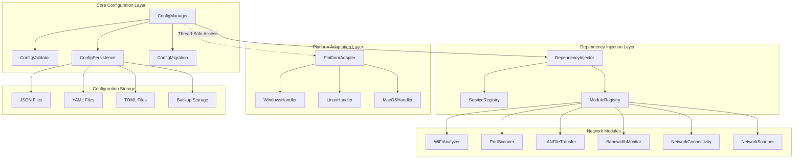
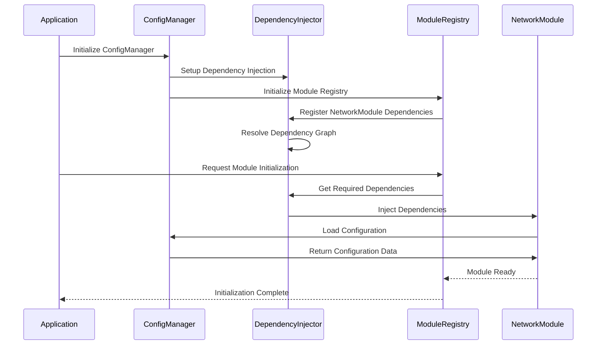
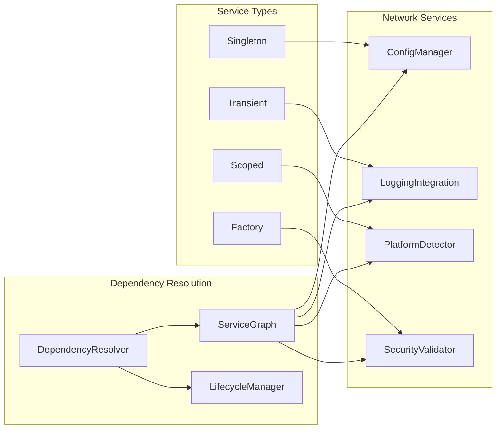
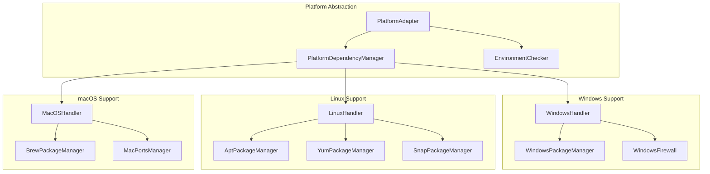
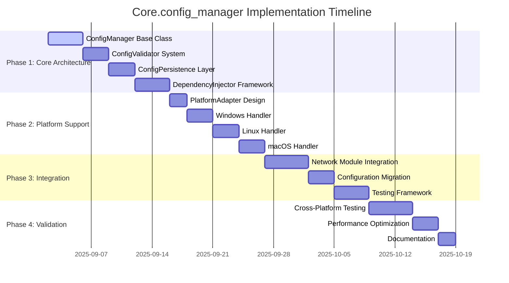

# Core.config_manager Architecture Design Specification

**Document Version:** 1.0  
**Created:** September 2, 2025  
**Architecture Type:** Enterprise Configuration Management System  
**Target Modules:** Network Connectivity Complex (2,400+ lines)

---

## Architecture Overview

The core.config_manager represents a comprehensive enterprise-grade configuration management system designed to resolve critical dependency blockers in the Richard's File Utilities network connectivity modules.

### System Architecture Diagram



### Dependency Resolution Flow



---

## Core Components Specification

### 1. ConfigManager Class

#### Interface Definition

```python
from typing import Any, Dict, List, Optional, Callable, Union
from threading import RLock
from datetime import datetime
from pathlib import Path

class ConfigManager:
    """
    Enterprise-grade configuration management system.
    
    Features:
    - Thread-safe operations with atomic updates
    - Multi-format persistence (JSON/YAML/TOML)
    - Configuration validation and migration
    - Backup and restore capabilities
    - Event-driven notifications
    """
    
    def __init__(self, 
                 config_path: Optional[Union[str, Path]] = None,
                 auto_backup: bool = True,
                 validation_enabled: bool = True):
        """
        Initialize ConfigManager with optional custom configuration path.
        
        Args:
            config_path: Custom path for configuration files
            auto_backup: Enable automatic backup creation
            validation_enabled: Enable configuration validation
        """
        self._config_path = Path(config_path) if config_path else self._get_default_path()
        self._auto_backup = auto_backup
        self._validation_enabled = validation_enabled
        
        # Core components
        self._validator = ConfigValidator() if validation_enabled else None
        self._persistence = ConfigPersistence(self._config_path)
        self._migration = ConfigMigration()
        
        # Threading support
        self._lock = RLock()
        self._cache_lock = RLock()
        
        # Configuration cache
        self._config_cache: Dict[str, Any] = {}
        self._cache_timestamps: Dict[str, datetime] = {}
        self._cache_timeout = 30  # seconds
        
        # Event system
        self._change_callbacks: Dict[str, List[Callable]] = {}
        self._global_callbacks: List[Callable] = []
        
        # Initialize
        self._load_initial_configuration()
    
    # Core Configuration Operations
    def get_setting(self, module: str, key: str = "", default: Any = None) -> Any:
        """Get configuration setting with cache support."""
        
    def set_setting(self, module: str, key: str, value: Any, 
                   validate: bool = True, notify: bool = True) -> bool:
        """Set configuration setting with validation and notifications."""
        
    def has_setting(self, module: str, key: str = "") -> bool:
        """Check if configuration setting exists."""
        
    def delete_setting(self, module: str, key: str = "") -> bool:
        """Delete configuration setting."""
        
    def get_module_config(self, module: str) -> Dict[str, Any]:
        """Get complete configuration for a module."""
        
    def update_module_config(self, module: str, config: Dict[str, Any], 
                           merge: bool = True) -> bool:
        """Update entire module configuration."""
    
    # Advanced Features
    def register_change_callback(self, module: str, callback: Callable[[str, Any, Any], None]):
        """Register callback for configuration changes."""
        
    def create_backup(self, backup_name: str = None) -> str:
        """Create configuration backup."""
        
    def restore_backup(self, backup_id: str) -> bool:
        """Restore configuration from backup."""
        
    def list_backups(self) -> List[Dict[str, Any]]:
        """List available configuration backups."""
        
    def validate_configuration(self, config: Dict = None) -> List[ValidationError]:
        """Validate configuration against defined schemas."""
        
    def migrate_configuration(self, from_version: str, to_version: str) -> bool:
        """Migrate configuration between versions."""
        
    def export_configuration(self, file_path: str, format: str = 'json') -> bool:
        """Export configuration to file."""
        
    def import_configuration(self, file_path: str, merge: bool = False) -> bool:
        """Import configuration from file."""
    
    # Cache Management
    def clear_cache(self, module: str = None):
        """Clear configuration cache."""
        
    def get_cache_stats(self) -> Dict[str, Any]:
        """Get cache performance statistics."""
```

### 2. Configuration Validation System

#### Validation Framework

```python
class ConfigValidator:
    """Advanced configuration validation with custom rules."""
    
    def __init__(self):
        self._schemas: Dict[str, Schema] = {}
        self._rules: Dict[str, List[ValidationRule]] = {}
        self._custom_validators: Dict[str, Callable] = {}
    
    def register_schema(self, module: str, schema: Schema):
        """Register validation schema for module."""
        
    def add_validation_rule(self, path: str, rule: ValidationRule):
        """Add custom validation rule."""
        
    def validate_value(self, module: str, key: str, value: Any) -> ValidationResult:
        """Validate single configuration value."""
        
    def validate_module_config(self, module: str, config: Dict) -> ValidationResult:
        """Validate complete module configuration."""

class ValidationRule:
    """Custom validation rule definition."""
    
    def __init__(self, 
                 validator: Callable[[Any], bool],
                 error_message: str,
                 severity: str = 'error'):
        self.validator = validator
        self.error_message = error_message
        self.severity = severity  # error, warning, info

class NetworkConfigValidationRules:
    """Pre-defined validation rules for network modules."""
    
    @staticmethod
    def get_network_rules() -> Dict[str, List[ValidationRule]]:
        return {
            'network_connectivity.general.default_timeout': [
                ValidationRule(
                    lambda x: isinstance(x, int) and 1000 <= x <= 60000,
                    "Timeout must be integer between 1000 and 60000 ms"
                )
            ],
            'network_connectivity.wifi_analyzer.scan_interval': [
                ValidationRule(
                    lambda x: isinstance(x, int) and x >= 5,
                    "Scan interval must be at least 5 seconds"
                )
            ],
            'network_connectivity.port_scanner.max_threads': [
                ValidationRule(
                    lambda x: isinstance(x, int) and 1 <= x <= 1000,
                    "Max threads must be between 1 and 1000"
                )
            ]
        }
```

### 3. Dependency Injection Framework

#### Advanced DI System



```python
class DependencyInjector:
    """Advanced dependency injection container."""
    
    def __init__(self):
        self._services: Dict[str, ServiceDescriptor] = {}
        self._instances: Dict[str, Any] = {}
        self._factories: Dict[str, Callable] = {}
        self._resolver = DependencyResolver()
        
    def register_singleton(self, interface: Type, implementation: Type):
        """Register singleton service."""
        
    def register_transient(self, interface: Type, implementation: Type):
        """Register transient service."""
        
    def register_scoped(self, interface: Type, implementation: Type):
        """Register scoped service."""
        
    def register_factory(self, interface: Type, factory: Callable):
        """Register factory function."""
        
    def register_instance(self, interface: Type, instance: Any):
        """Register existing instance."""
        
    def get_service(self, interface: Type) -> Any:
        """Resolve service instance."""
        
    def get_services(self, interface: Type) -> List[Any]:
        """Resolve all implementations of interface."""
        
    def build_service_graph(self) -> ServiceGraph:
        """Build dependency resolution graph."""

class NetworkDependencyConfiguration:
    """Pre-configured dependency setup for network modules."""
    
    @staticmethod
    def configure_dependencies(injector: DependencyInjector):
        # Core services
        injector.register_singleton(ConfigManager, ConfigManager)
        injector.register_singleton(DependencyInjector, injector)
        
        # Network-specific services
        injector.register_transient(NetworkLoggingManager, NetworkLoggingManager)
        injector.register_scoped(PlatformNetworkDetector, PlatformNetworkDetector)
        injector.register_singleton(SecurityValidator, SecurityValidator)
        
        # Module services
        injector.register_transient(WiFiAnalyzer, WiFiAnalyzer)
        injector.register_transient(PortScanner, PortScanner)
        injector.register_transient(LANFileTransfer, LANFileTransfer)
        injector.register_transient(BandwidthMonitor, BandwidthMonitor)
```

### 4. Cross-Platform Compatibility Layer

#### Platform Abstraction System



```python
class PlatformAdapter:
    """Cross-platform compatibility layer."""
    
    def __init__(self):
        self.platform = platform.system().lower()
        self.handlers = {
            'windows': WindowsPlatformHandler(),
            'linux': LinuxPlatformHandler(),
            'darwin': MacOSPlatformHandler()
        }
        self.current_handler = self.handlers.get(self.platform)
    
    def get_platform_handler(self) -> PlatformHandler:
        """Get platform-specific handler."""
        return self.current_handler
    
    def install_dependencies(self, dependencies: List[str]) -> InstallationResult:
        """Install platform-specific dependencies."""
        return self.current_handler.install_dependencies(dependencies)
    
    def check_prerequisites(self) -> List[PrerequisiteCheck]:
        """Check platform prerequisites."""
        return self.current_handler.check_prerequisites()
    
    def configure_environment(self) -> bool:
        """Configure platform-specific environment."""
        return self.current_handler.configure_environment()

class WindowsPlatformHandler(PlatformHandler):
    """Windows-specific platform handling."""
    
    def install_dependencies(self, deps: List[str]) -> InstallationResult:
        # Use pip, chocolatey, or winget for installation
        pass
    
    def check_prerequisites(self) -> List[PrerequisiteCheck]:
        checks = []
        
        # Check Python version
        checks.append(self._check_python_version())
        
        # Check Windows version
        checks.append(self._check_windows_version())
        
        # Check .NET Framework
        checks.append(self._check_dotnet_framework())
        
        # Check Visual C++ Redistributables
        checks.append(self._check_vcredist())
        
        return checks
    
    def configure_environment(self) -> bool:
        # Configure Windows Firewall
        # Set up Windows services
        # Configure registry settings if needed
        pass

class LinuxPlatformHandler(PlatformHandler):
    """Linux-specific platform handling."""
    
    def __init__(self):
        self.package_managers = {
            'apt': AptPackageManager(),
            'yum': YumPackageManager(),
            'dnf': DnfPackageManager(),
            'pacman': PacmanPackageManager(),
            'zypper': ZypperPackageManager()
        }
        self.detected_pm = self._detect_package_manager()
    
    def install_dependencies(self, deps: List[str]) -> InstallationResult:
        return self.detected_pm.install_packages(deps)
    
    def configure_environment(self) -> bool:
        # Configure iptables/firewalld
        # Set up systemd services
        # Configure udev rules if needed
        pass
```

---

## Configuration Schema Design

### Network Connectivity Configuration Schema

```yaml
# network_connectivity_schema.yaml
network_connectivity:
  type: object
  properties:
    general:
      type: object
      properties:
        default_timeout:
          type: integer
          minimum: 1000
          maximum: 60000
          default: 30000
          description: "Default timeout for network operations in milliseconds"
        
        max_concurrent_operations:
          type: integer
          minimum: 1
          maximum: 100
          default: 10
          description: "Maximum number of concurrent network operations"
        
        log_level:
          type: string
          enum: ["DEBUG", "INFO", "WARNING", "ERROR", "CRITICAL"]
          default: "INFO"
          description: "Logging level for network operations"
        
        enable_notifications:
          type: boolean
          default: true
          description: "Enable system notifications for network events"
        
        auto_start_services:
          type: boolean
          default: true
          description: "Automatically start network services on initialization"
    
    wifi_analyzer:
      type: object
      properties:
        scan_interval:
          type: integer
          minimum: 5
          maximum: 300
          default: 30
          description: "WiFi scan interval in seconds"
        
        signal_threshold:
          type: integer
          minimum: -100
          maximum: 0
          default: -70
          description: "Minimum signal strength threshold in dBm"
        
        security_assessment:
          type: boolean
          default: true
          description: "Enable security assessment of detected networks"
        
        oui_database_update:
          type: boolean
          default: true
          description: "Enable automatic OUI database updates"
        
        channel_analysis:
          type: object
          properties:
            enable_overlap_detection:
              type: boolean
              default: true
            include_6ghz:
              type: boolean
              default: true
            interference_threshold:
              type: number
              minimum: 0.0
              maximum: 1.0
              default: 0.3
    
    port_scanner:
      type: object
      properties:
        scan_timeout:
          type: integer
          minimum: 100
          maximum: 30000
          default: 5000
          description: "Port scan timeout in milliseconds"
        
        max_threads:
          type: integer
          minimum: 1
          maximum: 1000
          default: 100
          description: "Maximum number of scanning threads"
        
        service_detection:
          type: boolean
          default: true
          description: "Enable service detection and banner grabbing"
        
        vulnerability_assessment:
          type: boolean
          default: true
          description: "Enable vulnerability assessment"
        
        common_ports:
          type: array
          items:
            type: integer
          default: [21, 22, 23, 25, 53, 80, 110, 143, 443, 993, 995, 1433, 3389, 5432]
          description: "List of commonly scanned ports"
        
        scan_policies:
          type: object
          properties:
            stealth_mode:
              type: boolean
              default: false
            aggressive_timing:
              type: boolean
              default: false
            os_detection:
              type: boolean
              default: true
    
    bandwidth_monitor:
      type: object
      properties:
        monitoring_interval:
          type: integer
          minimum: 100
          maximum: 10000
          default: 1000
          description: "Bandwidth monitoring interval in milliseconds"
        
        alert_threshold_mbps:
          type: number
          minimum: 0.1
          default: 100.0
          description: "Alert threshold for bandwidth usage in Mbps"
        
        data_retention_days:
          type: integer
          minimum: 1
          maximum: 365
          default: 30
          description: "Number of days to retain historical data"
        
        interfaces:
          type: array
          items:
            type: string
          description: "Network interfaces to monitor"
        
        alerts:
          type: object
          properties:
            enable_email:
              type: boolean
              default: false
            enable_desktop:
              type: boolean
              default: true
            email_recipients:
              type: array
              items:
                type: string
                format: email
    
    lan_file_transfer:
      type: object
      properties:
        default_port:
          type: integer
          minimum: 1024
          maximum: 65535
          default: 8765
          description: "Default port for file transfer service"
        
        encryption_enabled:
          type: boolean
          default: true
          description: "Enable AES-256 encryption for transfers"
        
        compression_enabled:
          type: boolean
          default: true
          description: "Enable compression for transfers"
        
        max_file_size_mb:
          type: integer
          minimum: 1
          maximum: 10240
          default: 1024
          description: "Maximum file size for transfers in MB"
        
        discovery_interval:
          type: integer
          minimum: 10
          maximum: 300
          default: 30
          description: "Device discovery interval in seconds"
        
        authentication:
          type: object
          properties:
            require_auth:
              type: boolean
              default: true
            auth_timeout:
              type: integer
              default: 300
            max_attempts:
              type: integer
              default: 3
```

---

## Implementation Timeline and Milestones

### Phase 1: Core Architecture (Weeks 1-2)



### Key Milestones

- **Week 1 End:** Core ConfigManager operational
- **Week 2 End:** Dependency injection framework complete
- **Week 3 End:** All network modules integrated
- **Week 4 End:** Cross-platform compatibility achieved
- **Week 5 End:** Testing framework operational
- **Week 6 End:** Full validation and performance optimization
- **Week 7 End:** Documentation complete and deployment ready

---

## Performance Specifications

### Response Time Requirements

| Operation | Target Time | Acceptable Range |
|-----------|-------------|------------------|
| Configuration Load | <50ms | <100ms |
| Setting Retrieval | <5ms | <10ms |
| Setting Update | <10ms | <20ms |
| Module Initialization | <200ms | <500ms |
| Dependency Resolution | <100ms | <250ms |
| Cross-Platform Detection | <50ms | <100ms |

### Memory Usage Targets

| Component | Target Memory | Maximum Allowed |
|-----------|---------------|-----------------|
| ConfigManager | <20MB | <50MB |
| DependencyInjector | <10MB | <25MB |
| PlatformAdapter | <5MB | <15MB |
| Total System | <35MB | <90MB |

### Scalability Requirements

- **Concurrent Operations:** Support 100+ simultaneous configuration operations
- **Module Support:** Handle 50+ network modules
- **Configuration Size:** Support configurations up to 10MB
- **Cache Performance:** 95%+ cache hit rate for frequently accessed settings

---

This architecture design provides a robust, scalable foundation for resolving the critical test execution blockers while establishing a enterprise-grade configuration management system for the Richard's File Utilities project.
