# Cross-Platform Dependency Resolution Strategy

**Document Version:** 1.0  
**Created:** September 2, 2025  
**Strategy Type:** Automated Cross-Platform Compatibility System  
**Target Impact:** Resolve 15+ failing tests across Linux/macOS platforms

---

## Executive Summary

This strategy addresses critical cross-platform dependency failures that prevent reliable test execution across Windows, Linux, and macOS environments. The solution implements an intelligent, automated dependency detection and resolution system with platform-specific adapters and comprehensive CI/CD integration.

### Problem Analysis

**Current State:**

- 15+ critical tests failing on non-Windows platforms
- Platform-specific utilities missing on Linux/macOS environments  
- CI/CD pipeline inconsistencies affecting deployment reliability
- Manual dependency management causing environment drift

**Target State:**

- 100% cross-platform test compatibility
- Automated dependency detection and installation
- Unified CI/CD pipeline with platform consistency
- Zero-touch environment setup procedures

---

## Platform Analysis and Requirements

### Platform-Specific Dependency Matrix

```mermaid
graph TB
    subgraph "Windows Dependencies"
        W1[Python 3.8+]
        W2[PyQt5]
        W3[Visual C++ Redistributable]
        W4[Windows SDK]
        W5[WinPcap/Npcap]
        W6[PowerShell Core]
    end
    
    subgraph "Linux Dependencies"
        L1[Python 3.8+]
        L2[PyQt5 + Qt5-dev]
        L3[build-essential]
        L4[libpcap-dev]
        L5[net-tools]
        L6[iproute2]
        L7[wireless-tools]
        L8[libssl-dev]
    end
    
    subgraph "macOS Dependencies"
        M1[Python 3.8+]
        M2[PyQt5]
        M3[Xcode Command Line Tools]
        M4[libpcap]
        M5[Homebrew]
        M6[airport utility]
        M7[Security Framework]
    end
    
    subgraph "Common Python Packages"
        P1[pytest >= 7.4.0]
        P2[PyQt5 >= 5.15.9]
        P3[cryptography >= 3.4.8]
        P4[psutil >= 5.8.0]
        P5[scapy >= 2.4.5]
        P6[requests >= 2.28.0]
    end
    
    W1 --> P1
    L1 --> P1
    M1 --> P1
    
    W2 --> P2
    L2 --> P2
    M2 --> P2
```



### Dependency Failure Analysis

| Platform | Failed Tests | Root Cause | Impact Level |
|----------|-------------|------------|--------------|
| **Ubuntu 20.04/22.04** | 8 tests | Missing libpcap-dev, wireless-tools | HIGH |
| **CentOS/RHEL 8+** | 6 tests | Different package names, SELinux restrictions | HIGH |
| **macOS Big Sur+** | 7 tests | Missing airport utility, permission issues | HIGH |
| **Alpine Linux** | 4 tests | musl libc compatibility, missing packages | MEDIUM |
| **Debian 11+** | 5 tests | Python version conflicts, missing dev headers | MEDIUM |

---

## Automated Dependency Detection System

### 1. Platform Detection Framework

```python
class PlatformDependencyManager:
    """
    Intelligent cross-platform dependency detection and resolution.
    
    Features:
    - Automatic platform detection and classification
    - Package manager detection and adaptation
    - Dependency graph resolution
    - Automated installation with rollback support
    - Environment validation and testing
    """
    
    def __init__(self):
        self.platform_info = self._detect_platform()
        self.package_manager = self._detect_package_manager()
        self.python_info = self._detect_python_environment()
        self.network_capabilities = self._detect_network_capabilities()
        
        # Platform-specific handlers
        self.handlers = {
            'windows': WindowsDependencyHandler(),
            'linux': LinuxDependencyHandler(),
            'darwin': MacOSDependencyHandler()
        }
        
        self.current_handler = self.handlers.get(self.platform_info.system.lower())
    
    def detect_missing_dependencies(self) -> List[MissingDependency]:
        """Detect all missing dependencies for network testing."""
        missing = []
        
        # Check Python packages
        missing.extend(self._check_python_packages())
        
        # Check system packages
        missing.extend(self._check_system_packages())
        
        # Check network utilities
        missing.extend(self._check_network_utilities())
        
        # Check development tools
        missing.extend(self._check_development_tools())
        
        return missing
    
    def install_dependencies(self, dependencies: List[str], 
                           dry_run: bool = False) -> InstallationResult:
        """Install dependencies with platform-specific handling."""
        return self.current_handler.install_dependencies(dependencies, dry_run)
    
    def verify_installation(self) -> VerificationResult:
        """Verify all dependencies are correctly installed."""
        return self.current_handler.verify_installation()
    
    def create_environment_report(self) -> EnvironmentReport:
        """Generate comprehensive environment compatibility report."""
        return EnvironmentReport(
            platform=self.platform_info,
            dependencies=self.detect_missing_dependencies(),
            capabilities=self.network_capabilities,
            recommendations=self._generate_recommendations()
        )

class PlatformInfo:
    """Comprehensive platform information."""
    
    def __init__(self):
        self.system = platform.system()  # Windows, Linux, Darwin
        self.release = platform.release()
        self.version = platform.version()
        self.machine = platform.machine()  # x86_64, arm64, etc.
        self.processor = platform.processor()
        
        # Linux-specific
        if self.system == 'Linux':
            self.distribution = self._detect_linux_distribution()
            self.package_manager = self._detect_package_manager()
            self.init_system = self._detect_init_system()  # systemd, init, etc.
        
        # macOS-specific
        elif self.system == 'Darwin':
            self.macos_version = platform.mac_ver()[0]
            self.homebrew_available = self._check_homebrew()
            self.xcode_tools = self._check_xcode_tools()
        
        # Windows-specific
        elif self.system == 'Windows':
            self.windows_version = platform.win32_ver()
            self.powershell_version = self._check_powershell()
            self.admin_rights = self._check_admin_rights()
```

### 2. Linux Platform Handler

```python
class LinuxDependencyHandler:
    """Comprehensive Linux dependency management."""
    
    def __init__(self):
        self.distribution = self._detect_distribution()
        self.package_managers = self._detect_package_managers()
        self.primary_pm = self._select_primary_package_manager()
        
        # Distribution-specific package mappings
        self.package_maps = {
            'ubuntu': UbuntuPackageMap(),
            'debian': DebianPackageMap(),
            'centos': CentOSPackageMap(),
            'fedora': FedoraPackageMap(),
            'arch': ArchPackageMap(),
            'alpine': AlpinePackageMap()
        }
        
        self.current_map = self.package_maps.get(self.distribution.id.lower())
    
    def install_dependencies(self, dependencies: List[str], 
                           dry_run: bool = False) -> InstallationResult:
        """Install dependencies using appropriate package manager."""
        
        # Map generic dependencies to distribution-specific packages
        mapped_packages = []
        for dep in dependencies:
            mapped = self.current_map.map_dependency(dep)
            mapped_packages.extend(mapped)
        
        # Install system packages
        system_result = self._install_system_packages(mapped_packages, dry_run)
        
        # Install Python packages
        python_result = self._install_python_packages(dependencies, dry_run)
        
        # Configure services and permissions
        config_result = self._configure_environment(dry_run)
        
        return InstallationResult(
            system_packages=system_result,
            python_packages=python_result,
            configuration=config_result,
            success=all([system_result.success, python_result.success, config_result.success])
        )
    
    def _install_system_packages(self, packages: List[str], dry_run: bool) -> PackageResult:
        """Install system packages using detected package manager."""
        
        if self.primary_pm == 'apt':
            return self._install_with_apt(packages, dry_run)
        elif self.primary_pm == 'yum':
            return self._install_with_yum(packages, dry_run)
        elif self.primary_pm == 'dnf':
            return self._install_with_dnf(packages, dry_run)
        elif self.primary_pm == 'pacman':
            return self._install_with_pacman(packages, dry_run)
        elif self.primary_pm == 'apk':
            return self._install_with_apk(packages, dry_run)
        else:
            raise UnsupportedPackageManagerError(f"Package manager {self.primary_pm} not supported")
    
    def _configure_environment(self, dry_run: bool) -> ConfigurationResult:
        """Configure Linux environment for network testing."""
        
        configurations = []
        
        # Configure network permissions
        configurations.append(self._configure_network_permissions(dry_run))
        
        # Configure firewall rules
        configurations.append(self._configure_firewall(dry_run))
        
        # Configure systemd services if needed
        configurations.append(self._configure_services(dry_run))
        
        # Set up udev rules for network interfaces
        configurations.append(self._configure_udev_rules(dry_run))
        
        return ConfigurationResult(
            configurations=configurations,
            success=all(c.success for c in configurations)
        )

class UbuntuPackageMap:
    """Ubuntu/Debian-specific package mappings."""
    
    def __init__(self):
        self.dependency_map = {
            'network_tools': ['net-tools', 'iproute2', 'iputils-ping'],
            'wireless_tools': ['wireless-tools', 'wpasupplicant'],
            'packet_capture': ['libpcap-dev', 'tcpdump'],
            'python_dev': ['python3-dev', 'python3-pip'],
            'build_tools': ['build-essential', 'cmake'],
            'ssl_development': ['libssl-dev', 'libffi-dev'],
            'qt_development': ['qt5-default', 'qttools5-dev-tools'],
            'system_monitoring': ['sysstat', 'htop', 'iotop']
        }
    
    def map_dependency(self, dependency: str) -> List[str]:
        """Map generic dependency to Ubuntu-specific packages."""
        return self.dependency_map.get(dependency, [dependency])

class CentOSPackageMap:
    """CentOS/RHEL-specific package mappings."""
    
    def __init__(self):
        self.dependency_map = {
            'network_tools': ['net-tools', 'iproute', 'iputils'],
            'wireless_tools': ['wireless-tools', 'wpa_supplicant'],
            'packet_capture': ['libpcap-devel', 'tcpdump'],
            'python_dev': ['python3-devel', 'python3-pip'],
            'build_tools': ['gcc', 'gcc-c++', 'make', 'cmake'],
            'ssl_development': ['openssl-devel', 'libffi-devel'],
            'qt_development': ['qt5-qtbase-devel', 'qt5-qttools'],
            'system_monitoring': ['sysstat', 'htop', 'iotop']
        }
```

### 3. macOS Platform Handler

```python
class MacOSDependencyHandler:
    """macOS-specific dependency management."""
    
    def __init__(self):
        self.homebrew_available = self._check_homebrew()
        self.macports_available = self._check_macports()
        self.xcode_tools = self._check_xcode_tools()
        self.preferred_pm = 'homebrew' if self.homebrew_available else 'macports'
    
    def install_dependencies(self, dependencies: List[str], 
                           dry_run: bool = False) -> InstallationResult:
        """Install dependencies on macOS."""
        
        # Ensure Xcode Command Line Tools
        xcode_result = self._ensure_xcode_tools(dry_run)
        
        # Install Homebrew if not available
        if not self.homebrew_available and not dry_run:
            brew_install = self._install_homebrew()
            if brew_install.success:
                self.homebrew_available = True
                self.preferred_pm = 'homebrew'
        
        # Install system packages
        system_result = self._install_system_packages(dependencies, dry_run)
        
        # Install Python packages
        python_result = self._install_python_packages(dependencies, dry_run)
        
        # Configure permissions and services
        config_result = self._configure_macos_environment(dry_run)
        
        return InstallationResult(
            xcode_tools=xcode_result,
            system_packages=system_result,
            python_packages=python_result,
            configuration=config_result,
            success=all([xcode_result.success, system_result.success, 
                        python_result.success, config_result.success])
        )
    
    def _configure_macos_environment(self, dry_run: bool) -> ConfigurationResult:
        """Configure macOS environment for network testing."""
        
        configurations = []
        
        # Configure network permissions
        configurations.append(self._configure_network_permissions(dry_run))
        
        # Install airport utility
        configurations.append(self._install_airport_utility(dry_run))
        
        # Configure firewall rules
        configurations.append(self._configure_firewall(dry_run))
        
        # Set up keychain access for network operations
        configurations.append(self._configure_keychain_access(dry_run))
        
        return ConfigurationResult(
            configurations=configurations,
            success=all(c.success for c in configurations)
        )
    
    def _install_airport_utility(self, dry_run: bool) -> ConfigurationStep:
        """Install and configure airport utility for WiFi operations."""
        
        if dry_run:
            return ConfigurationStep(
                name="install_airport_utility",
                description="Install airport utility for WiFi scanning",
                success=True,
                dry_run=True
            )
        
        try:
            # Check if already available
            airport_path = "/System/Library/PrivateFrameworks/Apple80211.framework/Versions/Current/Resources/airport"
            
            if not os.path.exists(airport_path):
                # Install via Homebrew
                subprocess.run(['brew', 'install', 'airport'], check=True)
            
            # Create symlink for easy access
            symlink_path = "/usr/local/bin/airport"
            if not os.path.exists(symlink_path):
                os.symlink(airport_path, symlink_path)
            
            return ConfigurationStep(
                name="install_airport_utility",
                description="Airport utility installed successfully",
                success=True
            )
            
        except Exception as e:
            return ConfigurationStep(
                name="install_airport_utility",
                description=f"Failed to install airport utility: {e}",
                success=False,
                error=str(e)
            )

class MacOSPackageMap:
    """macOS-specific package mappings."""
    
    def __init__(self):
        self.homebrew_packages = {
            'network_tools': ['iproute2mac', 'netcat'],
            'wireless_tools': ['airport'],
            'packet_capture': ['libpcap', 'tcpdump'],
            'python_dev': ['python@3.9', 'python@3.10', 'python@3.11'],
            'build_tools': ['cmake', 'pkg-config'],
            'ssl_development': ['openssl', 'libffi'],
            'qt_development': ['qt@5', 'pyqt@5'],
            'system_monitoring': ['htop', 'iotop']
        }
        
        self.macports_packages = {
            'network_tools': ['iproute2', 'netcat'],
            'wireless_tools': ['airport'],
            'packet_capture': ['libpcap', 'tcpdump'],
            'python_dev': ['python39', 'python310', 'python311'],
            'build_tools': ['cmake', 'pkgconfig'],
            'ssl_development': ['openssl', 'libffi'],
            'qt_development': ['qt5', 'py-pyqt5'],
            'system_monitoring': ['htop']
        }
```

---

## CI/CD Pipeline Integration

### Automated Cross-Platform Testing Pipeline

```yaml
# .github/workflows/cross-platform-network-testing.yml
name: Cross-Platform Network Testing

on:
  push:
    branches: [ main, develop ]
  pull_request:
    branches: [ main ]
  schedule:
    - cron: '0 2 * * *'  # Daily at 2 AM

env:
  PYTHON_VERSION_MATRIX: "3.8,3.9,3.10,3.11"
  NETWORK_TEST_TIMEOUT: 600
  COVERAGE_THRESHOLD: 85

jobs:
  platform-matrix:
    name: Generate Platform Matrix
    runs-on: ubuntu-latest
    outputs:
      matrix: ${{ steps.set-matrix.outputs.matrix }}
    steps:
      - name: Set Platform Matrix
        id: set-matrix
        run: |
          echo "matrix={\"include\":[
            {\"os\":\"windows-latest\",\"platform\":\"windows\",\"shell\":\"pwsh\"},
            {\"os\":\"ubuntu-20.04\",\"platform\":\"linux\",\"shell\":\"bash\"},
            {\"os\":\"ubuntu-22.04\",\"platform\":\"linux\",\"shell\":\"bash\"},
            {\"os\":\"macos-11\",\"platform\":\"darwin\",\"shell\":\"bash\"},
            {\"os\":\"macos-12\",\"platform\":\"darwin\",\"shell\":\"bash\"}
          ]}" >> $GITHUB_OUTPUT

  dependency-analysis:
    name: Dependency Analysis
    runs-on: ${{ matrix.os }}
    needs: platform-matrix
    strategy:
      fail-fast: false
      matrix: ${{ fromJson(needs.platform-matrix.outputs.matrix) }}
    
    steps:
      - name: Checkout Code
        uses: actions/checkout@v4
      
      - name: Setup Python
        uses: actions/setup-python@v4
        with:
          python-version: '3.10'
      
      - name: Install Dependency Manager
        shell: ${{ matrix.shell }}
        run: |
          python -m pip install --upgrade pip
          pip install -r scripts/requirements-dependency-manager.txt
      
      - name: Analyze Platform Dependencies
        shell: ${{ matrix.shell }}
        run: |
          python scripts/analyze_platform_dependencies.py \
            --platform ${{ matrix.platform }} \
            --output-format json \
            --output-file dependency-analysis-${{ matrix.platform }}.json
      
      - name: Upload Dependency Analysis
        uses: actions/upload-artifact@v3
        with:
          name: dependency-analysis-${{ matrix.platform }}
          path: dependency-analysis-${{ matrix.platform }}.json

  environment-setup:
    name: Environment Setup and Validation
    runs-on: ${{ matrix.os }}
    needs: [platform-matrix, dependency-analysis]
    strategy:
      fail-fast: false
      matrix: ${{ fromJson(needs.platform-matrix.outputs.matrix) }}
    
    steps:
      - name: Checkout Code
        uses: actions/checkout@v4
      
      - name: Download Dependency Analysis
        uses: actions/download-artifact@v3
        with:
          name: dependency-analysis-${{ matrix.platform }}
      
      - name: Setup Python
        uses: actions/setup-python@v4
        with:
          python-version: '3.10'
      
      - name: Setup Platform Dependencies
        shell: ${{ matrix.shell }}
        run: |
          python scripts/setup_platform_dependencies.py \
            --platform ${{ matrix.platform }} \
            --analysis-file dependency-analysis-${{ matrix.platform }}.json \
            --auto-install \
            --validate
      
      - name: Validate Environment
        shell: ${{ matrix.shell }}
        run: |
          python scripts/validate_test_environment.py \
            --platform ${{ matrix.platform }} \
            --comprehensive \
            --output-format junit \
            --output-file environment-validation-${{ matrix.platform }}.xml
      
      - name: Upload Environment Validation
        uses: actions/upload-artifact@v3
        with:
          name: environment-validation-${{ matrix.platform }}
          path: environment-validation-${{ matrix.platform }}.xml

  network-module-testing:
    name: Network Module Testing
    runs-on: ${{ matrix.os }}
    needs: [platform-matrix, environment-setup]
    strategy:
      fail-fast: false
      matrix: 
        include: ${{ fromJson(needs.platform-matrix.outputs.matrix) }}
        python-version: [3.8, 3.9, 3.10, 3.11]
    
    steps:
      - name: Checkout Code
        uses: actions/checkout@v4
      
      - name: Setup Python ${{ matrix.python-version }}
        uses: actions/setup-python@v4
        with:
          python-version: ${{ matrix.python-version }}
      
      - name: Install Dependencies
        shell: ${{ matrix.shell }}
        run: |
          python -m pip install --upgrade pip
          pip install -r requirements-test.txt
          python scripts/setup_platform_dependencies.py --platform ${{ matrix.platform }}
      
      - name: Run Network Complex Module Tests
        shell: ${{ matrix.shell }}
        run: |
          pytest tests/unit/test_network_complex_real_*.py \
            --platform=${{ matrix.platform }} \
            --python-version=${{ matrix.python-version }} \
            --coverage \
            --coverage-min=${{ env.COVERAGE_THRESHOLD }} \
            --junit-xml=test-results-${{ matrix.platform }}-py${{ matrix.python-version }}.xml \
            --cov-report=xml:coverage-${{ matrix.platform }}-py${{ matrix.python-version }}.xml \
            --timeout=${{ env.NETWORK_TEST_TIMEOUT }}
      
      - name: Upload Test Results
        uses: actions/upload-artifact@v3
        if: always()
        with:
          name: test-results-${{ matrix.platform }}-py${{ matrix.python-version }}
          path: |
            test-results-${{ matrix.platform }}-py${{ matrix.python-version }}.xml
            coverage-${{ matrix.platform }}-py${{ matrix.python-version }}.xml

  coverage-aggregation:
    name: Coverage Aggregation and Reporting
    runs-on: ubuntu-latest
    needs: network-module-testing
    if: always()
    
    steps:
      - name: Checkout Code
        uses: actions/checkout@v4
      
      - name: Download All Artifacts
        uses: actions/download-artifact@v3
      
      - name: Setup Python
        uses: actions/setup-python@v4
        with:
          python-version: '3.10'
      
      - name: Install Coverage Tools
        run: |
          pip install coverage[toml] coverage-badge
      
      - name: Aggregate Coverage Reports
        run: |
          python scripts/aggregate_coverage_reports.py \
            --input-dir . \
            --output-file aggregated-coverage.xml \
            --platform-breakdown \
            --python-version-breakdown
      
      - name: Generate Coverage Badge
        run: |
          coverage-badge -o coverage-badge.svg
      
      - name: Upload Aggregated Coverage
        uses: actions/upload-artifact@v3
        with:
          name: aggregated-coverage-report
          path: |
            aggregated-coverage.xml
            coverage-badge.svg

  deployment-validation:
    name: Deployment Environment Validation
    runs-on: ${{ matrix.os }}
    needs: [platform-matrix, coverage-aggregation]
    strategy:
      matrix: ${{ fromJson(needs.platform-matrix.outputs.matrix) }}
    
    steps:
      - name: Checkout Code
        uses: actions/checkout@v4
      
      - name: Setup Deployment Environment
        shell: ${{ matrix.shell }}
        run: |
          python scripts/setup_deployment_environment.py \
            --platform ${{ matrix.platform }} \
            --environment production \
            --validate-only
      
      - name: Run Deployment Smoke Tests
        shell: ${{ matrix.shell }}
        run: |
          python scripts/run_deployment_smoke_tests.py \
            --platform ${{ matrix.platform }} \
            --quick-mode
```

---

## Environment Setup Automation

### Comprehensive Setup Script

```python
#!/usr/bin/env python3
"""
Comprehensive cross-platform environment setup for network testing.
Automatically detects platform, installs dependencies, and validates environment.
"""

import argparse
import logging
import sys
from pathlib import Path
from typing import List, Dict, Any

class CrossPlatformEnvironmentSetup:
    """Automated cross-platform environment setup."""
    
    def __init__(self, args):
        self.args = args
        self.platform_manager = PlatformDependencyManager()
        self.logger = self._setup_logging()
        
    def run_full_setup(self) -> bool:
        """Run complete environment setup process."""
        
        try:
            # 1. Platform detection and analysis
            self.logger.info("Detecting platform and analyzing environment...")
            platform_info = self.platform_manager.detect_platform()
            self.logger.info(f"Detected platform: {platform_info}")
            
            # 2. Dependency analysis
            self.logger.info("Analyzing dependencies...")
            missing_deps = self.platform_manager.detect_missing_dependencies()
            self.logger.info(f"Found {len(missing_deps)} missing dependencies")
            
            if self.args.dry_run:
                self._report_dry_run_results(platform_info, missing_deps)
                return True
            
            # 3. Install dependencies
            if missing_deps:
                self.logger.info("Installing missing dependencies...")
                install_result = self.platform_manager.install_dependencies(missing_deps)
                
                if not install_result.success:
                    self.logger.error(f"Dependency installation failed: {install_result.error}")
                    return False
                
                self.logger.info("Dependencies installed successfully")
            
            # 4. Environment validation
            self.logger.info("Validating environment...")
            validation_result = self.platform_manager.verify_installation()
            
            if not validation_result.success:
                self.logger.error(f"Environment validation failed: {validation_result.error}")
                return False
            
            # 5. Generate environment report
            if self.args.generate_report:
                self.logger.info("Generating environment report...")
                report = self.platform_manager.create_environment_report()
                self._save_environment_report(report)
            
            self.logger.info("Environment setup completed successfully!")
            return True
            
        except Exception as e:
            self.logger.error(f"Setup failed with error: {e}")
            return False
    
    def _save_environment_report(self, report: EnvironmentReport):
        """Save environment report to file."""
        
        report_file = Path(self.args.output_dir) / f"environment_report_{report.platform.system.lower()}.json"
        report_file.parent.mkdir(parents=True, exist_ok=True)
        
        with open(report_file, 'w') as f:
            f.write(report.to_json())
        
        self.logger.info(f"Environment report saved to: {report_file}")

def main():
    parser = argparse.ArgumentParser(description="Cross-platform environment setup")
    parser.add_argument('--dry-run', action='store_true', 
                       help='Perform dry run without making changes')
    parser.add_argument('--generate-report', action='store_true',
                       help='Generate detailed environment report')
    parser.add_argument('--output-dir', default='./reports',
                       help='Output directory for reports')
    parser.add_argument('--log-level', choices=['DEBUG', 'INFO', 'WARNING', 'ERROR'],
                       default='INFO', help='Logging level')
    parser.add_argument('--validate-only', action='store_true',
                       help='Only validate existing environment')
    
    args = parser.parse_args()
    
    setup = CrossPlatformEnvironmentSetup(args)
    
    if args.validate_only:
        success = setup.validate_environment_only()
    else:
        success = setup.run_full_setup()
    
    sys.exit(0 if success else 1)

if __name__ == '__main__':
    main()
```

---

## Success Metrics and Validation

### Cross-Platform Testing Metrics

| Metric | Current State | Target State | Success Criteria |
|--------|---------------|--------------|-------------------|
| **Test Pass Rate - Windows** | 100% | 100% | ✅ Maintained |
| **Test Pass Rate - Ubuntu** | 47% (8/17 fail) | 100% | 15+ tests fixed |
| **Test Pass Rate - macOS** | 59% (7/17 fail) | 100% | 7+ tests fixed |
| **Environment Setup Time** | Manual (30+ min) | <5 minutes | Automated |
| **Dependency Conflicts** | 12 reported | 0 | Zero conflicts |
| **CI/CD Pipeline Reliability** | 73% success rate | 95%+ | Stable builds |

### Automated Validation Framework

```python
class CrossPlatformValidationSuite:
    """Comprehensive cross-platform validation testing."""
    
    def __init__(self):
        self.platform_manager = PlatformDependencyManager()
        self.test_runner = NetworkTestRunner()
        self.validator = EnvironmentValidator()
    
    def run_comprehensive_validation(self) -> ValidationReport:
        """Run complete cross-platform validation suite."""
        
        results = ValidationReport()
        
        # 1. Platform compatibility validation
        results.platform_tests = self._validate_platform_compatibility()
        
        # 2. Dependency resolution validation
        results.dependency_tests = self._validate_dependency_resolution()
        
        # 3. Network module functionality validation
        results.network_tests = self._validate_network_modules()
        
        # 4. Performance validation
        results.performance_tests = self._validate_performance()
        
        # 5. Security validation
        results.security_tests = self._validate_security()
        
        return results
    
    def _validate_network_modules(self) -> List[TestResult]:
        """Validate all network modules across platforms."""
        
        test_results = []
        modules = ['wifi_analyzer', 'port_scanner', 'lan_file_transfer', 'bandwidth_monitor']
        
        for module in modules:
            result = self.test_runner.test_
